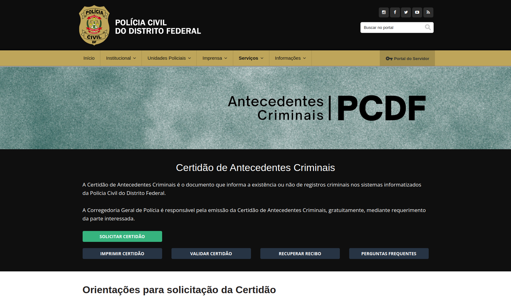
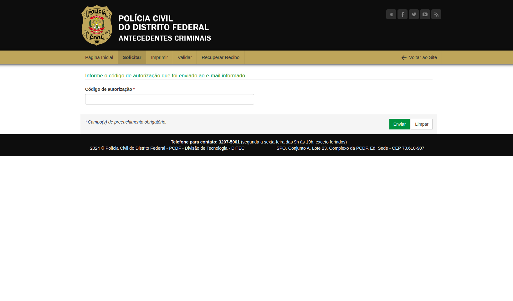
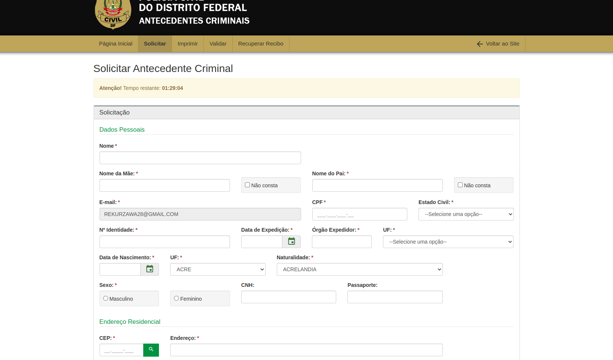
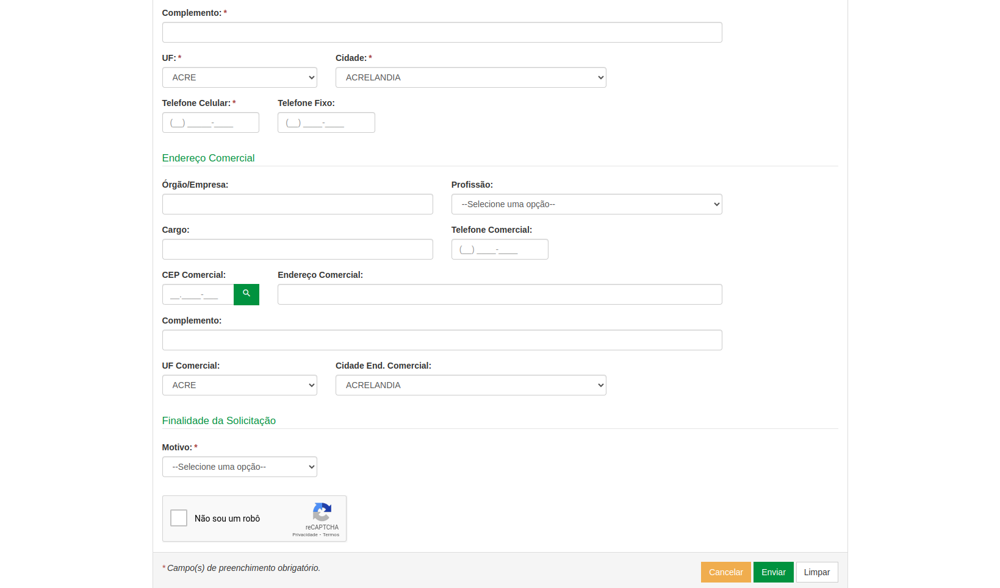
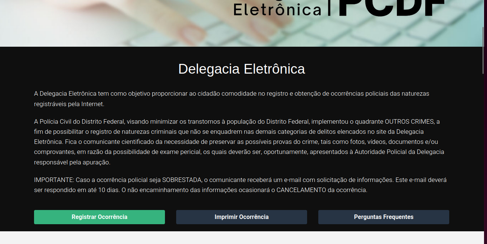
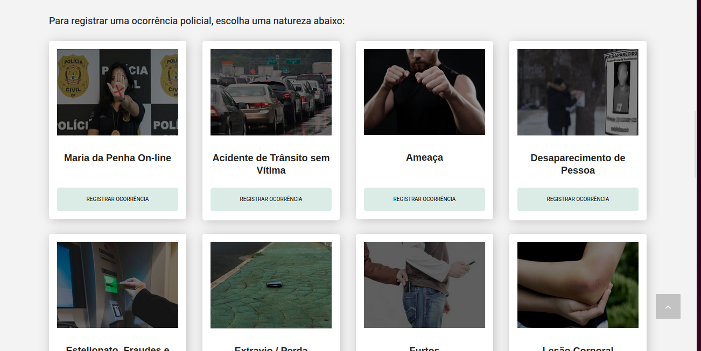
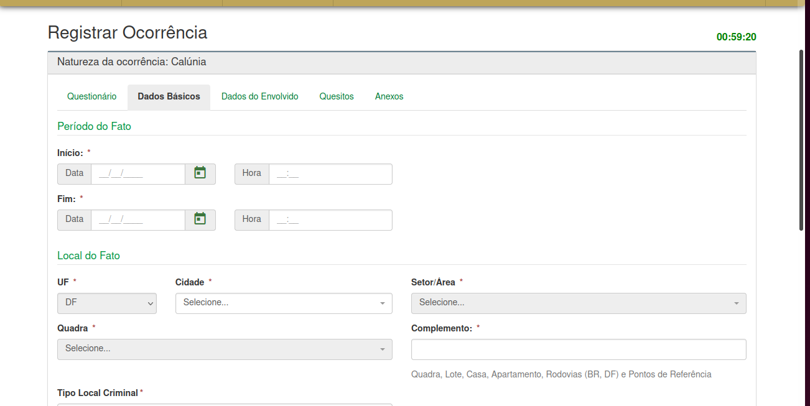

# GOMS (Goals, Operators, Methods, And Selection Rules)

## Introdução 
O GOMS é um método para descrever uma tarefa e o conhecimento do usuário sobre
como realizá-la em termos de objetivos (goals), operadores (operators), métodos (methods)
e regras de seleção (selection rules).

 * Os objetivos representam o que o usuário quer realizar utilizando o software
 * Operadores: são as ações cognitivas ou físicas que o sistema permite que o usuário execute, como inserir dados via teclado
 * Os métodos são sequências bem conhecidas de subobjetivos e operadores que permitem atingir um objetivo maior.
 * Regras de exeção: Referem-se a tomada de decisão por parte do usuário diante da possibilidade de possuir mais de um
 método para utilizar

## Funcionalidades Avaliadas pela GOMS
     Tabela que monstra quais funcionalidades foram avaliadas pela HTA
 Funcionalidade    |    Integrante Responsável             |  
|:------:|:-------------------------------:|
|Pesquisar Procurados|Lara|  
| Solicitar Antecedentes Criminais | Renata |
| Validar Antecedentes Criminais | João   |
| 197- Denúncia Online   | Giovana          |
| Solicitar Carteira de Identidade| Raissa
| Registrar Ocorrência | Rayene |
|Retrato Falado Online|Renata|

### Pesquisar Procurados 
#### Introdução 
No site do PCDF escolhemos algumas funcionalidades, entre elas a de visualização, pesquisa e denúncia de _Procurados_ do Distrito Federal. A integrante  [Lara Giuliana](https://github.com/gravelylara) ficou responsável por essa funcionalidade. 
* Goal 1: Listar todos os procurados pela PCDF
    * Method 1: Inserir dados- deixar os espaços sem preencher e nao opção "nome" selecionar "todos"
    * Method 2: Selecionar a região "DF"

* Goal 2: Procurar um nome específico 
    * Method 1: Ir até o endereço da PCDF (ou real ou eletrônico) e informar os seguintes dados
        * Operation 1: Informar nome a ser buscado
        * Operation 2: Informar crime cometido (opcional)
        * Operation 3: Informar região de atuação (opcional)
        * Operation 4: Informar gênero (opcional)
        * Operation 5: submeter dados

* Goal 3: Denunciar pessoa procurada
    * Method 1: Ir até o endereço da PCDF (ou real ou eletrônico) e informar os seguintes dados
        * Operation 1: Informar local do ocorrido (opcional)
        * Operation 2: Informar UF, cidade e bairro (opcional)
        * Operation 3: Informar tipo de crime (opcional)
        * Operation 4: Informar histórico: todo o relato da sua denúncia 
        * Operation 5: Selecionar se o indivíduo é menor de idade (opcional)
        * Operation 6: Anexar algum arquivo (como boletim de ocorrência, vídeos, filmagens) (opcional)
        * Operation 7: Comprovar identidade respondendo captcha no meio eletrônico ou informando documento numa delegacia
        * Operation 8: Submeter dados

### Solicitar Antecedentes Criminais 
Nessa tarefa o usuário pretende solicitar os seus antecedentes criminais pelo site do PCDF, foi analisada pela integrante [Renata Quadros](https://github.com/Renatinha28). Primeiro na página inicial como mostra na Figura 4, em seguida pede-se o código de verificação como mostra na Figura 5 e o preenchimento do formulário como mostra na figura 6.

 Figura 2 - Página inicial de Antecedentes criminais. Fonte: Site PCDF  
 

 Figura 3 - Código de verificação de Solicitação de Antecedentes. Fonte: Site PCDF  
 

 Figura 4 - Formulário 1. Fonte: Site PCDF  
 

 Figura 5 - Formulário 2. Fonte: Site PCDF  
 

* GOAL 0: Descobrir se a pessoa possui antecedentes criminais.
  * GOAL 1: Solicitar os antecedentes criminais.
    * METHOD 1.A: Acessar o sistema de solicitação de antecedentes criminais da PCDF.

    (SEL. RULE: O usuário possui acesso ao sistema e sabe como navegar nele.)

    * METHOD 1.B: Entrar em contato com a Polícia Civil do Distrito Federal por telefone ou e-mail para obter instruções sobre como solicitar os antecedentes criminais.

    (SEL.RULE: O usuário não está familiarizado com o sistema online ou não possui acesso a ele.)

  * GOAL 2: Preencher corretamente os dados necessários para a solicitação de antecedentes criminais.
    * METHOD 2.A: Inserir os dados pessoais da pessoa para quem os antecedentes criminais estão sendo solicitados.

    (SEL. RULE: O usuário possui os dados pessoais da pessoa.)

      * OP. 2.A.1: Digitar o nome completo da pessoa.
      * OP. 2.A.2: Inserir o nome completo dos pais da pessoa (se aplicável).
      * OP. 2.A.3: Preencher o CPF (Cadastro de Pessoa Física) da pessoa.
      * OP. 2.A.4: Fornecer o RG (Registro Geral) da pessoa.
      * OP. 2.A.5: Indicar a data de nascimento da pessoa.
      * OP. 2.A.6: Especificar a naturalidade (cidade e estado de nascimento) da pessoa.
      * OP. 2.A.7: Selecionar o sexo da pessoa.
      * OP. 2.A.8: Informar o estado civil da pessoa.
      * OP. 2.A.9: Se aplicável, inserir o número da CNH (Carteira Nacional de Habilitação) da pessoa.
      * OP. 2.A.10: Se aplicável, fornecer o número do passaporte da pessoa.
      * OP. 2.A.11: Inserir o endereço residencial completo da pessoa.
      * OP. 2.A.12: Se aplicável, incluir o endereço comercial completo da pessoa.
      * OP. 2.A.13: Indicar o CEP (Código de Endereçamento Postal) tanto do endereço residencial quanto do endereço comercial.

    * METHOD 2.B: Revisar os dados fornecidos para garantir que estejam corretos e completos.

    (SEL. RULE: O usuário deseja evitar erros na solicitação.)

      * OP. 2.B.1: Verificar se todos os campos foram preenchidos corretamente.
      * OP. 2.B.2: Revisar se não há erros de digitação nos dados fornecidos.
      * OP. 2.B.3: Confirmar se os dados estão atualizados e correspondem à pessoa correta.
      * OP. 2.B.4: Corrigir qualquer informação incorreta ou incompleta identificada durante a revisão.
  * GOAL 3: Confirmar o envio da solicitação.
    * METHOD 3.A: Enviar a solicitação através do sistema online e aguardar a confirmação.

    (SEL. RULE: O usuário tem acesso à internet e confia na eficácia do sistema.)

    * METHOD 3.B: Entrar em contato com a PCDF para confirmar o recebimento da solicitação.

    (SEL. RULE: O usuário prefere confirmar pessoalmente.)

  * GOAL 4: Receber um código de acompanhamento da solicitação.
    * METHOD 4.A: Aguardar o recebimento do código de acompanhamento através do e-mail fornecido na solicitação.

    (SEL. RULE: O usuário confia na eficácia do sistema de envio de e-mails.)

    * METHOD 4.B: Entrar em contato com a PCDF para solicitar o código de acompanhamento, caso não seja recebido dentro do prazo esperado.

    (SEL.RULE: O usuário prefere confirmar pessoalmente.)

###  Validar Antecedentes Criminais 

Nessa tarefa o usuário pretende validar uma certidão de antecedentes criminais. Realizado por [João Pedro](https://github.com/JoaoODragonborn)

* GOAL 0:  Validar certidão de antecedentes criminais
    * GOAL 1: Preencher os dados da certidão
        * OP 1.1: Preencher o número da certidão
        * OP 1.2: Preencher o ano de solicitação da certidão
        * OP 1.3: Preencher o ano de nascimento na certidão
    * GOAL 2: Provar que o usuário não é um robô
        * OP 2.1: Marcar o checkbox ao lado da frase "Eu não sou um robô"
        * OP 2.2: Realizar tarefa aleatória que o CAPTCHA oferecer, caso ofereça
    * GOAL 3: Pesquisar certidão
        * OP 3.1: Clicar em "Pesquisar"

### 197- Denúncia Online
Nessa tarefa o usuário pretende fazer uma denúncia no site da PCDF, foi analisada pela integrante  [Giovana Barbosa](https://github.com/gio221), como monstrado na figura 1. Ultilizando a CMN-GOMS

* GOAL 0: Fazer uma denuncia Online
    * GOAL 1: Entrar na parte de Denúncia Online
        * OP 1.1: Guiar o mouse para a aba de denuncia online
        * 0P 1.2: Pressionar o botão
    * GOAL 2: Selecionar a opção denuncia por meios de comunicação
        * OP 2.1: Guiar o mouse para a opção 'Denuncia de meios de comunicação'
        * OP 2.2: Pressionar o botão
        * OP 2.3: fazer a denuncia 
    * GOAL 3: Selecionar denucia Online
        * OP 3.1: Colocar as informações
        * OP 3.2: Clicar no botão denunciar 

### Agendamento de Carteira de Identidade 

Essa atividade tem como objetivo os usuários ao acessar a funcionalidade de marcação de carteira de identidade é agendar um horário para emissão ou renovação do documento de identidade. Feita por [Raissa Andrade](https://github.com/RaissaAndradeS).

* GOAL 0: Solicitar Carteira de Identidade.
    * OP 1: Acessar o sita da PCDF
        * OP 1.1: Abrir o navegador 
        * OP 1.2: DIgitar "https://www.pcdf.df.gov.br" na barra de endereços
        * OP 1.3: Apertar Enter
        * OP 1.4: Procurar "Serviços"

* GOAL 1: Agendamento
    * OP 2: Escolher serviço e Unidade de Atendimento
        * OP 2.1: Selecionar primeira ou segunda via
        * OP 2.2: Selecionar Unidade de atendimento
        * OP 2.3: Escolher data
        * OP 2.4: Escolher horário
    * OP : Confirmações de dados

* GOAL 2: Preencher o Formulário de Solicitação 
    * OP 3: Ler instruções da página
    * OP: Preencher os campos obrigatórios
        * OP 3.1: Nome Completo
        * OP 3.2: Data de Nascimento
        * OP 3.3: Endereço
        * OP 3.4: Número de telefone
    * OP: Revisar os dados inseridos

* GOAL 3: Resumo e Confirmação do agendamento
    * OP 4: Ler dados da página
        * OP 4.1: Abrir e-mail
        * OP 4.2: Copiar código de autorização
        * OP 4.3: Colar na página da PCDF
        * OP 4.4: Finalizar 

### Registro de Ocorrência

#### Modelo Goals, Operators, Methods, and Selection rules (GOMS)

[Rayene Almeida](https://github.com/rayenealmeida) aplicará o método GOMS no modelo CMN para analisar detalhadamente as ações cognitivas e motoras dos usuários ao realizar o registro de ocorrências no site da PCDF. A integrante identificará os objetivos que os usuários buscam alcançar ao usar essa funcionalidade, os operadores cognitivos e motores necessários para realizar as tarefas, os métodos sequenciais utilizados para atingir esses objetivos e as regras de seleção que orientam o comportamento do usuário diante de diferentes opções disponíveis na interface.

Meta: Registrar uma ocorrência no site da PCDF

#### Passos GOMS:

* GOAL 0: Registrar uma Ocorrência
    * GOAL 1: Acessar a seção de "Registro de Ocorrência" no site da PCDF
        * OP 1.1: Guiar o mouse para a seção "Delegacia Eletrônica"
        * OP 1.2: Pressionar o botão para acessar a seção
    * GOAL 2: Ler as instruções e requisitos fornecidos
        * OP 2.1: Ler as instruções na página de registro de ocorrência
        * OP 2.2: Selecionar a natureza da ocorrência
    * GOAL 3: Preencher o formulário de registro
        * OP 3.1: Identificar os campos obrigatórios no formulário de registro
            * Cognitivos:
                * Identificar os campos obrigatórios
        * OP 3.2: Decidir quais informações são relevantes e devem ser fornecidas
            * Cognitivos:
                * Decidir quais informações são necessárias para a ocorrência
        * OP 3.3: Mover o cursor para clicar nos campos de entrada do formulário
            * Motoras:
                * Mover o cursor para os campos de entrada
        * OP 3.4: Digitar as informações necessárias nos campos do formulário
            * Motoras:
                * Digitar as informações necessárias
    * GOAL 4: Revisar e enviar o formulário de registro
        * OP 4.1: Revisar as informações inseridas para garantir que estejam corretas e completas
            * Cognitivos:
                * Revisar as informações inseridas
        * OP 4.2: Clicar no botão "Enviar" para submeter a ocorrência
            * Motoras:
                * Mover o cursor para clicar no botão de envio

 Figura 6 - Página inicial do Registro de Ocorrência. Fonte: Site PCDF  
 

 Figura 7 - Seleção de Natureza para a Ocorrência. Fonte: Site PCDF  
 

 Figura 8 - Formulário de Ocorrência 3. Fonte: Site PCDF  
 

## Retrato Falado Online: Descreva e Identifique
Nessa tarefa o usuário pretende fazer um retrato falado de forma online pelo site do PCDF, foi analisada pela integrante [Renata Quadros](https://github.com/Renatinha28). 

* GOAL 0: Fazer um Retrato Falado - Online
    * METHOD 0.A: Navegar até o site da Polícia Civil do Distrito Federal (PCDF).

* GOAL 1: Selecionar a opção de Retrato Falado Online:
    * METHOD 1.A: Escolher "Retrato Falado Online" dentre as opções disponíveis.
        * OP. 1.A.1: Procurar por opções de denúncia específicas, como "Retrato Falado Online".
        * OP. 1.A.2: Clicar na opção encontrada para selecioná-la.
    
    (SEL. RULE: O usuário procura a opção que corresponde à sua necessidade específica.)

* GOAL 2: Preencher o formulário de Retrato Falado Online:
    * METHOD 2.A: Fornecer os dados pessoais solicitados (nome, e-mail, CPF).
        * OP. 2.A.1: Digitar nome completo da pessoa. 
        * OP. 2.A.2: Digitar o CPF.
        * OP. 2.A.3: Digitar o e-mail.  
    * METHOD 2.B: Selecionar o tipo de denúncia (ex: Assalto/Roubo).
    * METHOD 2.C: Descrever detalhadamente o incidente e as características do suspeito.
        * OP. 2.C.1: Descrever detalhadamente o incidente. 
        * OP. 2.C.2: Descrever detalhadamente as características do suspeito.
    * METHOD 2.D: Criar o retrato falado do suspeito.
        * OP. 2.D.1: Apertar o botão de criar avatar. 
        * OP. 2.D.2: Selecionar um avatar criado. 
    * METHOD 2.E: Avaliar o avatar selecionado
        * OP. 2.E.1: Descrever a fidelidade do avatar de acordo com a lembrança do suspeito. 
    
    (SEL. RULE: O usuário segue o fluxo natural do formulário, preenchendo campos conforme necessário.)

* GOAL 3: Enviar a denúncia:
    * METHOD 3.A: Clicar no botão de envio após revisão completa dos dados fornecidos.

* GOAL 4: Receber confirmação da denúncia:
    * METHOD 4.A: Verificar a mensagem informativa e aguardar a confirmação por e-mail da recepção da denúncia.
    * METHOD 4.B: Aguardar atualizações dentro do prazo estipulado.

## Bibliografia
> BARBOSA, S.D.J.; SILVA, B.S. Interação Humano-Computador. Editora Campus-Elsevier, 2010.

## Referências bibliograficas

> Polícia Civil do Distrito Federal. Polícia Civil do Distrito Federal. Disponível em: [https://www.pcdf.df.gov.br/](https://www.pcdf.df.gov.br/). Acesso em: 14 abr 2024.

## Histórico de Versões

| Versão |          Descrição              |     Autor(es)      |      Data      |   Revisor(es)     |    Data de revisão    |  
|:------:|:-------------------------------:|:--------------:|:--------------:|:-------------:|:---------------------:|
|  1.0   | Criação do documento de hta                  |  [Giovana Barbosa](https://github.com/gio221)      |   18/04   |   [Renata Quadros](https://github.com/Renatinha28)      |     18/04        |
|  1.1   | Registro de Ocorrência                    |   [Rayene Almeida](https://github.com/rayenealmeida)      |   18/04   |           [Giovana Barbosa ](https://github.com/gio221), [Renata Quadros](https://github.com/Renatinha28) |19/04 |
|  1.2   | 197               |   [Giovana Barbosa](https://github.com/gio221)        |   18/04   |   [Renata Quadros](https://github.com/Renatinha28)    |  19/04              |
| 1.3 | Solicitar antecedentes criminais | [Renata Quadros](https://github.com/Renatinha28) | 19/04 |  [Giovana Barbosa ](https://github.com/gio221)|19/04 |
|1.4| Solicitar Carteira de Identidade| [Raissa Andrade](https://github.com/RaissaAndradeS)| 19/04|  [Renata Quadros](https://github.com/Renatinha28),[Giovana Barbosa ](https://github.com/gio221)|19/04 |
| 1.5 | Cenário visualizar procurados | [Lara Giuliana](https://github.com/gravelylara) | 19/04 | [Giovana Barbosa ](https://github.com/gio221), [Renata Quadros](https://github.com/Renatinha28) |19/04 |
| 1.6 | Atualização de figuras | [Rayene Almeida](https://github.com/rayenealmeida) | 09/05 | [Renata Quadros](https://github.com/Renatinha28) | 09/05 |
| 1.7 | Retrato falado online | [Renata Quadros](https://github.com/Renatinha28) | 09/05 |[Giovana Barbosa](https://github.com/gio221)   |10/05 |
| 1.8 | Correções da Carteira de Identidade | [Raissa Andrade](https://github.com/RaissaAndradeS) | 11/05 |   [Renata Quadros](https://github.com/Renatinha28), [Giovana Barbosa](https://github.com/gio221)   |10/05 |
|  1.9   | Correção de link               |   [Giovana Barbosa](https://github.com/gio221)        |   15/05   |   [Renata Quadros](https://github.com/Renatinha28), [Rayene Almeida](https://github.com/rayenealmeida)   |  15/05              |
|  2.0   | Correção Procurados    |  [Lara Giuliana](https://github.com/gravelylara)   | 01/06  |   [Giovana Barbosa](https://github.com/gio221)  | 01/06    |
| 2.1 | Correção GOMS retrato falado | [Renata Quadros](https://github.com/Renatinha28) | 27/06 |  [Giovana Barbosa](https://github.com/gio221)|07/07