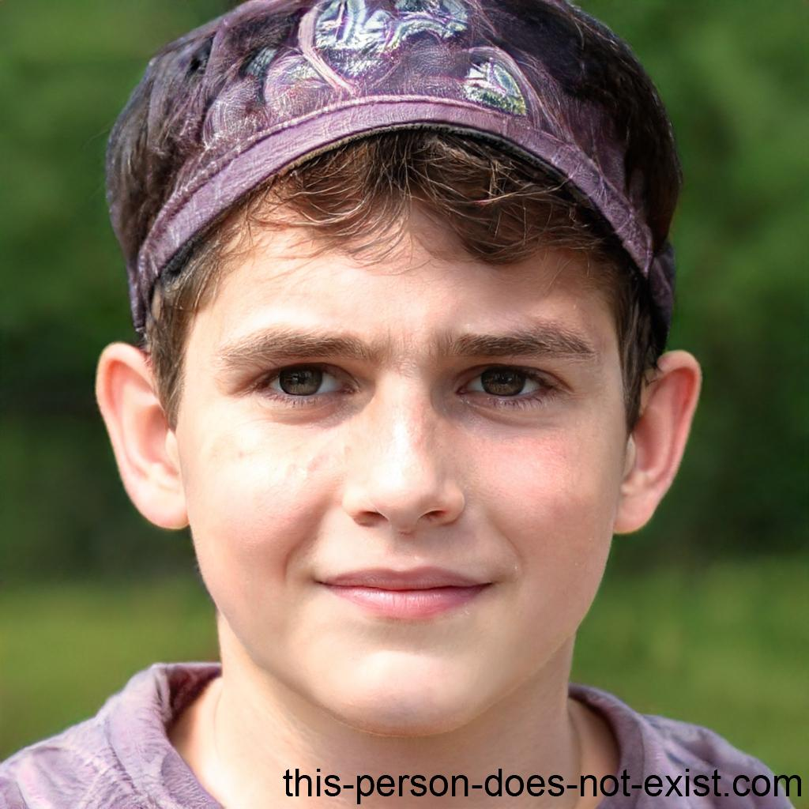
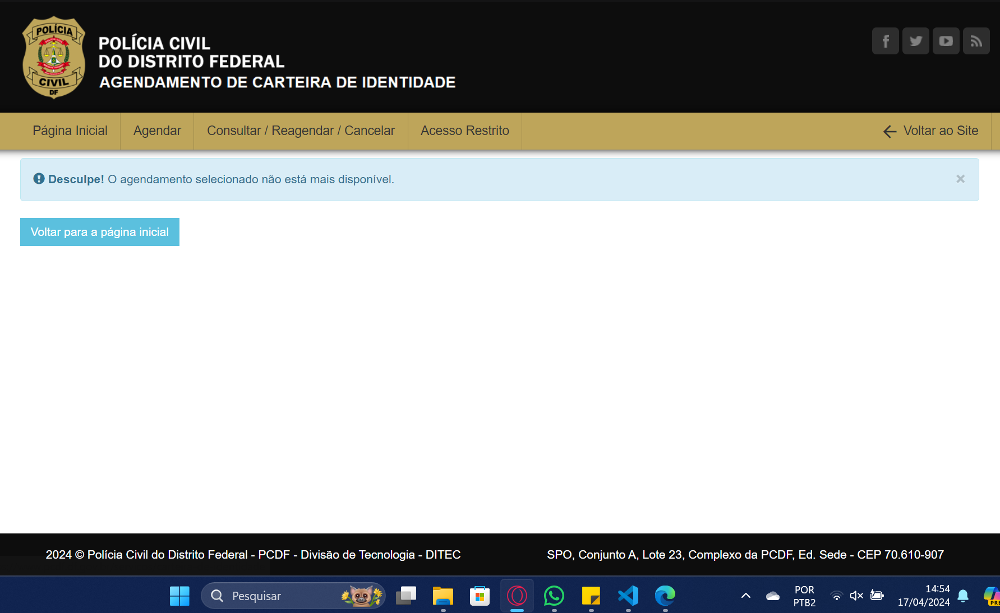
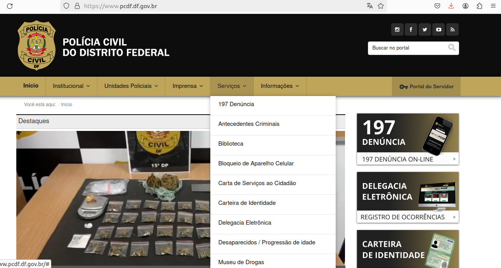

## Introdução 
Os cenários são uma narrativa, textual ou pictórica, concreta, rica em detalhes contextuais, de uma situação de uso da aplicação, envolvendo usuários, processos e dados reais ou potenciais (Rosson e Carrol, 2002).

## Metodologia
A metodologia ultilizada é que cada funcionalidade vai ser colocada em um cenário com base no Capítulo 6 do livro de Barbosa e Silva.

## Elementos Característicos de um Cenário
    Tabela que descreve o Cenário
|     Caracteristicas       |     Descrição      |    
| :----------------------------------------------------------: | :-------------------------------: | 
Ambiente ou Contexto| Detalhes da situação que motivam ou explicam os objetivos, ações e reações dos atores do cenário;|
Atores|Pessoas interagindo com o computador ou outros elementos do ambiente; características pessoais relevantes ao cenário;|
Objetivos| Efeitos na situação que motivam as ações realizadas pelos atores;|
|Planejamento|atividade mental dirigida para transformar um objetivo em um comportamento ou conjunto de ações;|
|Ações| Comportamento observável;|
|Eventos|Ações externas ou reações produzidas pelo computador ou outras características do ambiente;|
|Avaliação |Atividade mental dirigida para interpretar a situação.|

    
 Tabela 1: Elementos Característicos de um Cenário . Fonte: 
        <a href="https://github.com/gio221">Giovana</a>
    
 

## Cenários Realizados

    Tabela que monstra quais funcionalidades foram feitas os cenários
 Funcionalidade    |    Integrante Responsável             | 
|:------:|:-------------------------------:|
|Pesquisar Procurados|Lara|  
| Solicitar Antecedentes Criminais | Renata |
| Validar Antecedentes Criminais | Joao |
| 197- Denúncia Online   | Giovana          |
| Solicitar Carteira de Identidade| Raissa
| Registrar Ocorrência | Rayene |
|Retrato Falado Online|Renata|

    
 Tabela 2: Responsável de cada cenário . Fonte: 
        <a href="https://github.com/gio221">Giovana</a>
    
 

# Pesquisar procurados 
**Cenário: Visualização da Página de Procurados pela Polícia Civil Regional**
Criado por  [Lara Giuliana](https://github.com/gravelylara)

Contexto:
Um cidadão comum está navegando na internet em sua casa, utilizando seu laptop pessoal para pesquisar informações locais. Ele tem interesse em saber mais sobre os procurados pela Polícia Civil em sua região para estar ciente de possíveis ameaças ou situações de segurança.

Objetivo:
O cidadão deseja acessar a página de procurados pela Polícia Civil em sua região para verificar se reconhece algum dos indivíduos procurados ou para estar ciente de qualquer informação relevante para a comunidade.

Tarefa:
1. O cidadão abre o navegador da web em seu laptop e digita o endereço da página oficial da Polícia Civil de sua região.
2. Ele navega pelo site até encontrar a seção específica dedicada aos procurados pela polícia.
3. Ao acessar a página de procurados, ele visualiza uma lista de fotos e descrições dos indivíduos procurados, juntamente com informações sobre os crimes pelos quais são procurados.
4. O cidadão examina as fotos e descrições com atenção, buscando qualquer indivíduo que possa parecer familiar ou representar uma ameaça para a comunidade.
5. Ele verifica se há detalhes adicionais, como recompensas por informações que levem à captura dos procurados ou números de telefone para contato em caso de avistamento.
6. Após revisar as informações disponíveis, o cidadão decide se deseja relatar qualquer avistamento ou informação relevante à polícia.

Condições:
- O cidadão tem conhecimento básico de navegação na internet e sabe como acessar sites governamentais.
- O site da Polícia Civil está funcionando normalmente, sem interrupções no acesso às informações dos procurados.
- O cidadão está motivado por preocupações com a segurança pública e tem interesse em contribuir para a manutenção da ordem na comunidade.

Este cenário descreve como um cidadão comum pode utilizar a página de procurados pela Polícia Civil em sua região para se manter informado sobre potenciais ameaças ou indivíduos procurados pela lei.

# Solicitar Antecedentes Criminais
O cenário criado por [Renata Quadros](https://github.com/Renatinha28) é baseado na persona Carlos e em uma pessoa fictícia Júlia.  

    

Figura 1: Carlos

Fonte: gerado através do site this-person-does-not-exist.com

Autores: Carlos José de Oliveira(advogado), Júlia Ribeiro (réu)

Carlos José de Oliveira, mostrado na figura 1, é um advogado que acabou de se formar na Universidade de Brasília, ele estava procurando serviço até que achou, agora ele precisa consultar os antecedentes criminais de sua cliente, Júlia Ribeiro, uma moça que mora em Brasília-DF e está sendo processada injustamente. Ele precisa comprovar que Júlia possui uma ficha criminal limpa para fortalecer sua defesa. Para isso, Carlos decide solicitar os antecedentes criminais de Júlia através do site da Polícia Civil do Distrito Federal. Ele prefere fazer essa solicitação junto com Júlia para garantir que os dados fornecidos estejam corretos.
Após Júlia fornecer seu email pessoal e inserir o código de verificação, ela fornece todos os seus dados pessoais, incluindo nome completo, nome dos pais, CPF, RG, estado civil, data de nascimento, naturalidade, sexo, CNH, passaporte, endereço residencial e endereço comercial com CEP, além do motivo da solicitação.
Carlos finaliza o preenchimento das informações e envia o pedido. Ele recebe uma mensagem do site informando que os dados serão analisados em até 3 dias úteis. Ele então informa a Júlia que entrará em contato após esse período para fornecer o resultado da solicitação.
Dessa forma, Carlos espera obter os antecedentes criminais de Júlia para fortalecer sua defesa no processo judicial em que ela está envolvida.

# Validar certidão de antecedentes criminais 

Cenário criado por [João Pedro](https://github.com/JoaoODragonborn) baseado em um personagem fictício chamado Pedro.

    

Figura 2: Pedro

Fonte: gerado através do site this-person-does-not-exist.com

Pedro é dono de uma uma empresa de segurança privada e eventualmente precisa contratar novos profissionais para cumprir com as demandas dos seus clientes. Pela natureza da sua empresa e os serviços prestados por ela, Pedro precisa que seus empregados sejam confiáveis e não representem perigo aos seus clientes. Assim, ao contratar novos funcionários, Pedro sempre exige que os candidatos apresentem sua certidão de antecedentes criminais. Para averiguar a veracidade das tais certidões, Pedro vai até o site da polícia civil para validar a certidão. Verificada a veracidade da certidão, Pedro tira suas devidas conclusões sobre o candidato e decide se deve contratá-lo ou não.

# 197- Denúncia Online

Esse cenário foi criado por [Giovana Barbosa ](https://github.com/gio221) é baseado em uma persona que definimos como usuária do site PCDF, que deseja bloquear um celular roubado

    

Figura 3: Persona Ana

Fonte: gerado através do site this-person-does-not-exist.com

Ana monstrada na figura 3, é dona de casa, ela mora em Ceilândia com três filhos e seu marido, a dois meses atrás ela percebeu uma movimentação no lote ao lado, alguns vizinhos novos estavam se mudando para lá. Ana foi simpática com eles e os conheceu, eram um casal com dois cachorros maiores.
Depois de mais ou menos um mês e meio que os novos vizinhos mudaram ela começou a escutar barulhos estranhos de cachorros chorando, no começo ela achou que eles estavam brincando ou algo similar.
Mas os dias foram passando e esses barulhos foram se tornando constantes, depois de um tempo Ana começou a se preocupar e prestar mais atenção nos vizinhos novos. A casa de Ana era um sobrado então ela conseguia ver o quintal dos vizinhos.
Um dia Ana estava cuidando da casa e quando olhou para o lote vizinho ela viu os dois cachorros dos vizinhos bem desidratados, amarrados e com focinheira, Ana ficou bastante assustada, e como ela já tinha usado o site da PCDF para solicitar sua carteira de identidade, ela abriu o site, e viu que tinha como fazer denúncia online por lá, e quando ela entrou ela achou a aba para Denúncia de Maus Tratos Animais, como montrado na figura 2.

    

Figura 4 : Informações sobre a Denúncia do 197 Online

Fonte: site PCDF

Então Ana fez a denúncia anônima,com os passos monstrado na figura 4, e depois de mais ou menos um dia, a policia foi até os vizinhos e regataram os animais e levaram para abrigos.

    

Figura 5 : Informações sobre a Denúncia de Maus Tratos Animais

Fonte: site PCDF

# Solicitar carteira de identidade 

O cenário criado por [Raissa Andrade](https://github.com/RaissaAndradeS) é baseado em uma pessoa fictícia tentando marcar para revonar sua carteira de identidade.  

 Figura 6 : Adriano
 

 Fonte:gerado através do site this-person-does-not-exist.com

Adriano Valverde como monstrado na figura 6, tem 17 anos, terminou o ensino médio, encontra - se estudando para concurso. Adriano é menor de idade, ainda não tem a CNH. Ele tirou o Registro Geral (RG) ainda quando era criança e não sabia que seu RG tem validade, de 0 a 12 anos, tem a validade de 5 anos. De 12 a 60 anos incompletos, tem validade de 10 anos e acima de 60 anos tem validade indeterminada. 
Adriano irá prestar concurso, precisa manter a carteira de identidade atualizada e para conseguir emitir um novo RG, adriano precisa acessar o site da Polícia Civil do Distrito Federal, na aba de "Serviços" acessará carteira de identidade que vai leva - lo para outra página e nessa página, ele conseguira agendar um horário para emitir seu novo documento.  Mas adriano não consegue concluir seu agendamento pelo site da PCDF, ao tentar marcar agendamento, mesmo mostrando um horário disponível, ao final ha uma mensagem mostrando ao contrario. Mas Adriano precisa muito desse documento, então ele deu refresh na pagina e quando foi escolher a opção de lugar, já não havia mais o gama como montrado na figura 7, e ele conseguiu mas apenas na unidade de samambaia.

 Figura 7: Print do agendamneto

Fonte: site da PCDF
 

# Registrar Ocorrência 

Esse cenário foi Criado [Rayene Almeida](https://github.com/rayenealmeida) é baseado em uma pessoa fictícia tentando fazer o registro de uma ocorrência.  

 Figura 8 : Rafael Mendes
 

 Fonte:gerado através do site this-person-does-not-exist.com

Rafael Mendes, um jovem engenheiro civil que morava em Brazlândia, estava a caminho de uma reunião com um cliente em uma obra em andamento na região central de Brasília. Enquanto dirigia seu carro pela avenida movimentada, ele foi surpreendido por um motorista que avançou o sinal vermelho e colidiu violentamente com o seu veículo. O impacto foi forte, deixando ambos os carros bastante danificados. Rafael, apesar de assustado, não sofreu ferimentos graves, mas estava bastante abalado com a situação. Antes que pudesse reagir, o outro motorista, percebendo o estrago causado, acelerou e fugiu do local do acidente. 
Com a adrenalina ainda correndo, Rafael imediatamente ligou para a emergência e solicitou ajuda no local do acidente. Assim que chegou em casa, Rafael acessou o site da Polícia Civil do Distrito Federal ele procurou no menu do site "Registro de Ocorrência" e não encontrou, ele foi acessando os serviços um por um sendo "197 Denúncia", "Antecedentes Criminais", "Biblioteca", "Bloqueio de Aparelho Celular", "Carta de Serviços ao Cidadão", "Carteira de Identidade" até que finalmente achou ao entrar na "Delegacia Eletrônica".
Ao ser encaminhado para a página Delegacia Eletrônica, ele rolou a pagina e encotrou um botão "Registrar Ocorrência", ao clicar foi levado ao campo abaixo que tinha as naturezas da ocorrência.
Ele ficou confuso pois tinha uma opção de acidente de trÂnsito mas era acidente de trânsito sem vítima. Ao clicar na opção foi encaminhado para uma página que dizia "Por meio deste canal será possível o registro de ocorrências de acidente de trânsito sem vítima e aqueles em que o condutor do veículo causador do acidente se evade do local para fugir a sua responsabilidade", sendo assim essa era mesmo a opção certa. Em seguida ele rolou a página e foi lendo até encontrar a opção de concordar que leu e proceguir com o registro. Ao clicar foi encaminhado para outra página que perguntava " Este acidente de trânsito que você deseja registrar aconteceu no Distrito Federal?"  Então ele marcou que sim. Em seguida apareceu outra pergunta " Após o acidente houve contato verbal ou pessoal entre os condutores?" e a resposata era não. 
A próxima pergunta que apareceu foi "O veículo estava estacionado no momento em que a avaria foi provocada?" e a resposta também era não e a proxima pergunta foi "O motorista causador deste acidente sem vítima evadiu-se do local, sem se identificar ou deixar meios para ser contactado, com o objetivo de fugir de eventual responsabilidade?" que foi o que ocorreu então ele marcou sim. Ao clicar em continuar ele preencheu seus dados cuidadosamente, escreveu os detalhes do ocorrido incluindo a descrição do acidente e os danos aos veículos, preencheu os Quesitos e enviou fotos de como ficou o carro no "Anexos". Após revisar minuciosamente todas as informações fornecidas, Rafael enviou o formulário de registro de ocorrência e aguardou ansiosamente pela confirmação da submissão.Ele esperava que o registro ajudasse na investigação do acidente e na determinação das responsabilidades, garantindo assim uma resolução justa do incidente.

 Figura 9 : Menu de Serviços PCDF
 

 Fonte: Site PCDF

## Retrato Falado Online: Descreva e Identifique
Este é o cenário de uma nova funcionalidade sugerida pela integrante [Renata Quadros](https://github.com/Renatinha28). O cenário é baseado em uma pessoa fictícia que tenta fazer um retrato falado online após ser assaltada.

    

Figura 10: Persona Ana Maria

Fonte: gerado através do site this-person-does-not-exist.com

Ana Maria Lacerda mostrada na figura 10, uma dona de casa de 45 anos, casada e também praticante de mountain bike, decidiu aproveitar uma manhã de domingo para pedalar em uma trilha próxima à sua casa. No entanto, o que era para ser um momento de lazer acabou se tornando uma experiência assustadora quando ela foi vítima de um assalto durante o percurso. Após o incidente, Ana decidiu agir e acessou o site da PCDF com o intuito de denunciar o ocorrido. Navegando pelo site, ela encontrou a seção de "Serviços" e optou por "Denúncia Online". Foi nesse momento que ela se deparou com a opção de relatar um retrato falado online, o que a surpreendeu, mas também a deixou esperançosa de contribuir para a resolução do caso.
Após ler uma breve explicação sobre a importância de fornecer informações pessoais para que a PCDF pudesse dar um retorno, especialmente considerando que a criação de um avatar poderia requerer ajustes, Ana preencheu seus dados, incluindo nome, sobrenome, idade e endereço de e-mail.
Selecionando "Assalto/Roubo" como o tipo de denúncia, Ana descreveu o incidente que vivenciou durante sua pedalada, detalhando o momento em que foi abordada pelo assaltante e os pertences que foram roubados. Com base em suas observações, ela descreveu o suspeito como um homem jovem, de estatura média, vestindo roupas escuras e usando um capuz para cobrir o rosto.
Em seguida, Ana apertou o botão de criação de avatar e selecionou a opção que correspondiam à descrição fornecida e salvou sua escolha. Ao visualizar o avatar criado ao lado de uma caixa de texto, Ana decidiu fazer algumas observações sobre detalhes específicos, como a forma da boca e a posição das orelhas, para garantir a precisão do retrato. Após revisar todas as informações fornecidas, Ana enviou a denúncia, incluindo o avatar criado e suas informações pessoais. Em resposta, ela recebeu uma mensagem de confirmação, indicando que sua denúncia foi recebida e que a Polícia Civil do Distrito Federal (PCDF) entraria em contato por e-mail dentro de até três dias úteis para fornecer uma atualização sobre o caso. A mensagem também mencionou a possibilidade de retorno sobre a presença de um suspeito semelhante no banco de dados, caso seja encontrado, com o retrato atualizado para sua confirmação, se necessário. Além disso, Ana foi informada de que receberia um link para solicitar uma reunião presencial, caso desejasse.

## Bibliografia 
> BARBOSA, S.D.J.; SILVA, B.S. Interação Humano-Computador. Editora Campus-Elsevier, 2010.

## Histórico de Versões
      Tabela que descreve o Histórico de Versões

|     Versão       |     Descrição      |      Autor(es)      | Data           |  Revisor(es)          |Data de revisão|
| :----------------------------------------------------------: | :-------------------------------: | :-------------------------------------------------: | :-------------------------------: |  :-------------------------------: | :-------------------------------: |
| 1.0 |  Criação de Cenário  | [Giovana Barbosa ](https://github.com/gio221) | 18/04 | [Renata Quadros](https://github.com/Renatinha28), [Raissa Andrade](https://github.com/RaissaAndradeS)| 18/08 |
| 1.1 | Cenário da carteira inserido | [Raissa Andrade](https://github.com/RaissaAndradeS) | 18/04 |[Renata Quadros](https://github.com/Renatinha28), [Giovana Barbosa ](https://github.com/gio221) | 18/04|
| 1.2 | Cenário do bloqueio de celular| [Giovana Barbosa ](https://github.com/gio221) | 18/04 | [Renata Quadros](https://github.com/Renatinha28) | 19/04 |
| 1.3 | Cenário solicitar antecedentes criminais | [Renata Quadros](https://github.com/Renatinha28) | 19/04 |[Giovana Barbosa ](https://github.com/gio221) |19/04 |
| 1.4 | Cenário visualizar procurados | [Lara Giuliana](https://github.com/gravelylara) | 19/04 | [Renata Quadros](https://github.com/Renatinha28), [Giovana Barbosa ](https://github.com/gio221)|19/04 |
| 1.5 | Cenário registro de ocorrencia | [Rayene Almeida](https://github.com/rayenealmeida) | 19/04 | [Renata Quadros](https://github.com/Renatinha28), [Raissa Andrade](https://github.com/RaissaAndradeS) | 20/04 |
| 1.6 | Atualização de figuras e índice | [Rayene Almeida](https://github.com/rayenealmeida) | 09/05 |  [Renata Quadros](https://github.com/Renatinha28) | 09/05 |
| 1.7 | Cenário funcionalidade sugerida | [Renata Quadros](https://github.com/Renatinha28) | 09/05 |   [Giovana Barbosa ](https://github.com/gio221) | 10/05 |
| 1.8 |  Bibliografia  | [Giovana Barbosa ](https://github.com/gio221) | 15/05 | [Renata Quadros](https://github.com/Renatinha28), [Rayene Almeida](https://github.com/rayenealmeida) | 15/05 |
| 1.9 | Correção cenários Solicitar Antecedentes e Retrato falado | [Renata Quadros](https://github.com/Renatinha28) | 27/06 | [Giovana Barbosa ](https://github.com/gio221) | 07/07 

