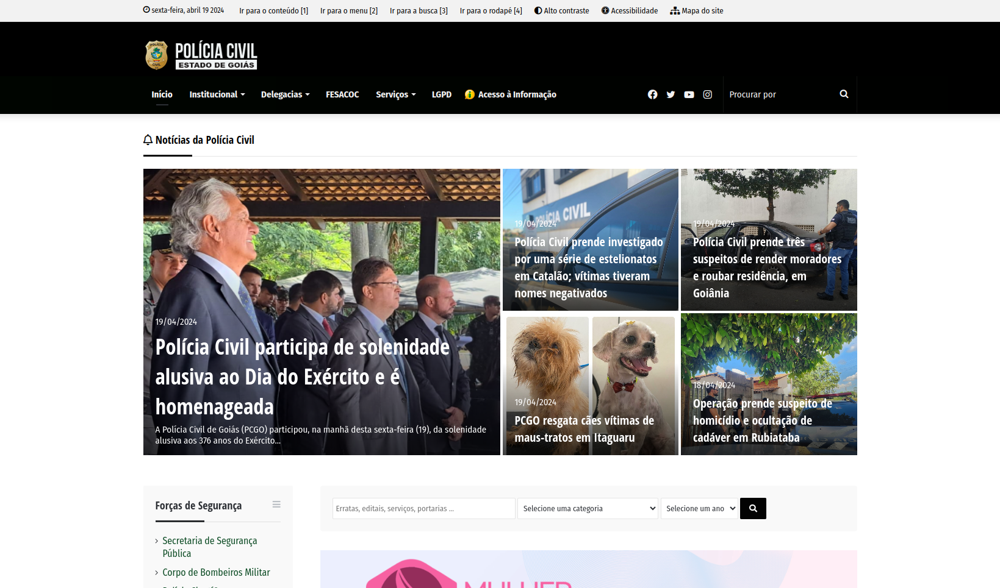
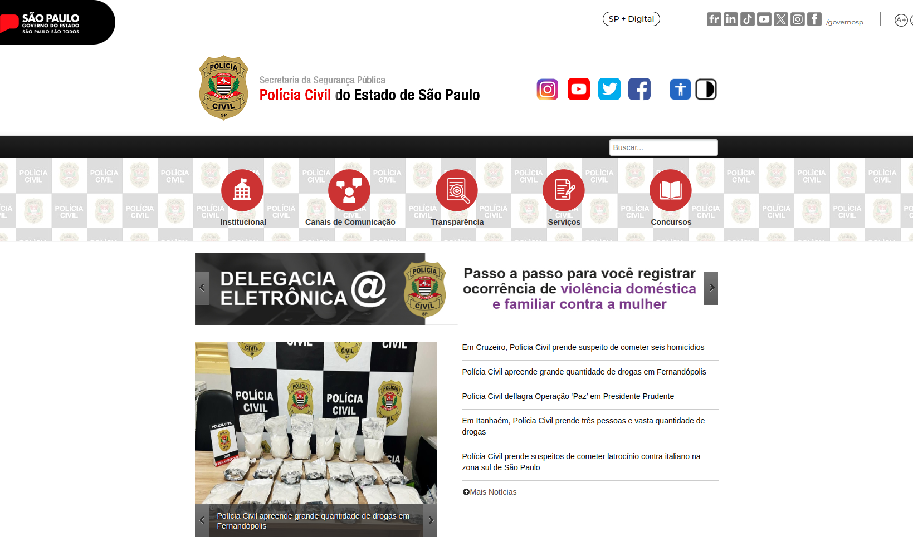

# Introdução
A Anáise Competitiva foi realizada pela integrante Renata, é feita utilizando outros sites semelhantes ao do PCDF, paara que possamos encontra melorias que possam ser ultilizadas, entre outras coisas.

## Objetivo
Esse artefato tem como objetivo documentar a analise competitiva feita pela integrante Renata

## Metodologia
A metodologia ultilizada foi a de comparação de um site com outro

# Análise Competitiva
A análise competitiva  foi realizada pela integrante [Renata Quadros](https://github.com/Renatinha28), comparando o site do [PCDF](#analise_competitiva-pcdf), mostrado na figura 1, com os sites da [Polícia Civil do Goiás](#analise_competitiva-pcg) e de [São Paulo](#analise_competitiva-pcsp) mostrados na figura 2 e 3, respectivamente.

Critérios de Avaliação:

Aparência e Usabilidade: O site é visualmente atraente e profissional? A navegação é intuitiva e fácil de usar? Os elementos de design (cores, fontes, ícones) são consistentes e contribuem para uma experiência positiva do usuário?

Conteúdo e Informações: O site fornece informações claras e abrangentes sobre os serviços oferecidos pela Polícia Civil? As informações sobre procedimentos, documentos necessários e requisitos são facilmente acessíveis e compreensíveis? O site inclui recursos educacionais sobre prevenção de crimes, direitos legais, entre outros?

Funcionalidades e Recursos: O site oferece funcionalidades úteis, como pesquisa de ocorrências, emissão de boletins de ocorrência online, solicitação de documentos, entre outros? As ferramentas de busca e filtros funcionam efetivamente para ajudar os usuários a encontrar as informações desejadas? Existem recursos adicionais, como mapas interativos de delegacias, estatísticas criminais, informações sobre programas de segurança, disponíveis no site?

Acessibilidade e Responsividade: O site é acessível para pessoas com deficiência, conforme as diretrizes de acessibilidade da web? O site é responsivo e se adapta bem a diferentes dispositivos (desktops, tablets, smartphones)?

Segurança e Privacidade: O site adota medidas adequadas de segurança para proteger as informações dos usuários? As políticas de privacidade e uso de dados são transparentes e respeitam as leis de proteção de dados?

Feedback e Interatividade: O site oferece formas eficazes para os usuários fornecerem feedback ou relatarem problemas? Existem canais de comunicação direta com a Polícia Civil, como chat ao vivo ou formulários de contato?

Desempenho e Velocidade: O site carrega rapidamente e responde de forma ágil às interações dos usuários? Existem problemas de desempenho, como tempo de carregamento lento ou páginas quebradas? 

## Análise Competitiva - Polícia Civil do Distrito Federal

 Figura 1 - Página inicial da Polícia Civil do Distrito Federal.   Fonte: Site PCDF  
 

Aparência e Usabilidade: O site apresenta uma aparência profissional e atrativa, com uma navegação intuitiva e de fácil utilização. Os elementos de design são consistentes, contribuindo para uma experiência positiva do usuário.

Conteúdo e Informações: As informações sobre os serviços oferecidos pela Polícia Civil são claras e abrangentes, abordando procedimentos, documentos necessários e requisitos de forma acessível e compreensível. No entanto, não são fornecidos recursos educacionais sobre prevenção de crimes ou direitos legais.

Funcionalidades e Recursos: O site oferece diversas funcionalidades úteis, como pesquisa de ocorrências e emissão de boletins de ocorrência online. As ferramentas de busca e filtros são eficazes, facilitando a localização de informações. Embora não haja recursos adicionais como mapas interativos de delegacias, os endereços e contatos são fornecidos.

Acessibilidade e Responsividade: Apesar de não oferecer recursos de acessibilidade para pessoas com deficiência auditiva ou visual, o site é responsivo e se adapta bem a diferentes dispositivos.

Segurança e Privacidade: O site demonstra adotar medidas adequadas de segurança para proteger as informações dos usuários, com políticas transparentes e em conformidade com as leis de proteção de dados.

Feedback e Interatividade: Os usuários têm à disposição formas eficazes para fornecer feedback ou relatar problemas, incluindo ouvidorias e canais de comunicação direta com a Polícia Civil, como agendamento de reuniões e contatos por e-mail/telefone.

Desempenho e Velocidade: O desempenho do site é considerado bom, carregando rapidamente e respondendo de forma ágil às interações dos usuários.

O site da Polícia Civil do Distrito Federal oferece uma experiência satisfatória aos usuários, com uma interface amigável e informações completas sobre os serviços disponíveis. Embora careça de recursos educacionais adicionais e de acessibilidade para pessoas com deficiência, demonstra preocupação com a segurança dos dados dos usuários e oferece canais eficazes de interatividade e feedback.

* [Link para o site da Polícia Civíl do Distrito Federal](https://www.pcdf.df.gov.br/)

## Análise Competitiva - Polícia Civil do Goiás 

 Figura 2 - Página inicial da Polícia Civil do Goiás.   Fonte: Site PCG  
 

Aparência e Usabilidade: O site é visualmente profissional, mas a sua atratividade é limitada. A navegação é intuitiva e de fácil acesso, embora as cores não sejam muito favoráveis. Os elementos de design são consistentes com a identidade visual da Polícia Civil.

Conteúdo e Informações: O site fornece informações sobre os serviços oferecidos pela Polícia Civil, mas parece não abordar todos os serviços de forma detalhada. A falta de detalhes sobre os documentos necessários para cada funcionalidade pode ser uma lacuna. Embora contenha notícias e artigos, não oferece recursos educacionais relacionados à prevenção de crimes ou direitos legais.

Funcionalidades e Recursos: As funcionalidades são limitadas e a maioria requer acesso à rede da SSP ou da Polícia Civil, o que pode ser confuso para usuários externos. A formatação da funcionalidade "SEI" é confusa. Os endereços das delegacias são fornecidos apenas textualmente, sem recursos interativos.

Acessibilidade e Responsividade: O site não oferece acessibilidade auditiva e pode confundir os usuários devido às funcionalidades inacessíveis. No entanto, é responsivo e se adapta bem a diferentes dispositivos.

Segurança e Privacidade: O site parece adotar medidas adequadas de segurança para proteger as informações dos usuários.

Feedback e Interatividade: O site oferece a possibilidade de enviar elogios à Polícia Civil, além de fornecer perguntas frequentes, ouvidoria e contatos diretos por e-mail ou telefone.

Desempenho e Velocidade: O site não apresenta problemas de carregamento.

Embora o site da Polícia Civil de Goiás seja visualmente profissional e ofereça uma navegação intuitiva, há algumas áreas de melhoria significativas, especialmente em termos de conteúdo detalhado sobre os serviços oferecidos, acessibilidade e disponibilidade de recursos interativos para os usuários. A falta de clareza sobre quais funcionalidades estão disponíveis para o público em geral pode causar confusão e frustração. 

* [Link para o site da Polícia Civíl do Goiás](https://www.policiacivil.go.gov.br/)
  

## Análise Competitiva - Polícia Civil de São Paulo

 Figura 3 - Página inicial da Polícia Civil de São Paulo.   Fonte: Site PCSP  
 

Aparência e Usabilidade: O site apresenta uma estética profissional e agradável, facilitando a navegação de forma intuitiva e amigável. Os elementos de design são consistentes, o que contribui para uma experiência positiva do usuário.

Conteúdo e Informações: O site oferece informações claras e abrangentes sobre os serviços da Polícia Civil. Os procedimentos, documentos necessários e requisitos são facilmente encontrados e compreensíveis. Embora não haja recursos educacionais sobre prevenção de crimes, o site inclui outros conteúdos essenciais, como comunicação social, história da Polícia Civil de São Paulo, fatos históricos e informações sobre concursos.

Funcionalidades e Recursos: O site disponibiliza diversas funcionalidades úteis, como obtenção de atestado de antecedentes, consulta de IMEI e lista dos mais procurados. As ferramentas de busca e filtros ajudam os usuários a encontrar as informações desejadas com eficiência. Embora existam recursos adicionais, como a ausência de endereços, eles ainda são bastante úteis.

Acessibilidade e Responsividade: O site demonstra preocupação com a acessibilidade, oferecendo recursos como acessibilidade em Libras e sendo responsivo em diferentes dispositivos.

Segurança e Privacidade: São adotadas medidas de segurança adequadas para proteger as informações dos usuários, com políticas transparentes e em conformidade com as leis de proteção de dados.

Feedback e Interatividade: O site inclui um canal de ouvidoria e aceita feedback dos usuários, promovendo a interatividade e a melhoria contínua.

Desempenho e Velocidade: O site apresenta um bom desempenho, carregando rapidamente e respondendo de forma ágil às interações dos usuários.

O site da Polícia Civil de São Paulo oferece uma experiência de usuário satisfatória, com uma estética profissional e uma navegação intuitiva. Ele fornece informações abrangentes sobre os serviços oferecidos, embora careça de recursos educacionais sobre prevenção de crimes. As funcionalidades disponíveis são úteis, mas alguns recursos adicionais, como endereços de delegacias, poderiam ser incluídos para melhorar a experiência do usuário. O site demonstra preocupação com a acessibilidade e a segurança dos dados dos usuários, e oferece canais de feedback e interatividade para promover a melhoria contínua. Em termos de desempenho, o site carrega rapidamente e responde de forma ágil às interações dos usuários.

* [Link para o site da Polícia Civíl de São Paulo](https://www.policiacivil.sp.gov.br/portal/faces/pages_home?_afrLoop=528302443754324&_afrWindowMode=0&_afrWindowId=lckdpggp4_1#!%40%40%3F_afrWindowId%3Dlckdpggp4_1%26_afrLoop%3D528302443754324%26_afrWindowMode%3D0%26_adf.ctrl-state%3D8o7b732wo_4)

Com base na análise competitiva dos sites da Polícia Civil do Distrito Federal, de Goiás e de São Paulo, algumas melhorias podem ser sugeridas para o site da PCDF:

1. **Conteúdo Educativo:** Introduzir recursos educacionais sobre prevenção de crimes e direitos legais para oferecer informações adicionais aos usuários e contribuir para a conscientização pública.

2. **Acessibilidade:** Implementar recursos de acessibilidade para pessoas com deficiência auditiva ou visual, como legendas em vídeos e compatibilidade com leitores de tela, garantindo que o site seja acessível para todos os usuários.

3. **Recursos Adicionais:** Expandir os recursos adicionais, como mapas interativos de delegacias e estatísticas criminais, para fornecer aos usuários uma experiência mais completa e informativa.

4. **Interatividade:** Considerar a implementação de um chat ao vivo para uma comunicação mais direta e instantânea com os usuários, além de facilitar o fornecimento de feedback e relato de problemas.

Ao incorporar essas melhorias, o site da Polícia Civil do Distrito Federal pode oferecer uma experiência ainda mais completa e satisfatória aos seus usuários, promovendo a acessibilidade e interatividade, além de fornecer informações valiosas e serviços úteis de forma eficaz.

## Bibliografia 
> BARBOSA, Simone; SILVA, Bruno. Interação Humano Computador. 1. ed. Rio de Janeiro: Elsevier, 2010.

> Polícia Civil do Estado de Goiás. Polícia Civil do Estado de Goiás. Disponível em: [https://www.policiacivil.go.gov.br/](https://www.policiacivil.go.gov.br/). Acesso em: 14 abr 2024. 

> Polícia Civil do Estado de São Paulo. Polícia Civil do Estado de São Paulo. Disponível em: [https://www.policiacivil.sp.gov.brportalfacespages_home_afrLoop=531526891964927_afrWindowMode=0_afrWindowId=8o7b732wo_1#!%40%40%3F_afrWindowId%3D8o7b732wo_1%26_afrLoop%3D531526891964927%26_afrWindowMode%3D0%26_adf.ctrl-state%3Dei3mx6lcl_4](https://www.policiacivil.sp.gov.br/portal/faces/pages_home?_afrLoop=531526891964927&_afrWindowMode=0&_afrWindowId=8o7b732wo_1#!%40%40%3F_afrWindowId%3D8o7b732wo_1%26_afrLoop%3D531526891964927%26_afrWindowMode%3D0%26_adf.ctrl-state%3Dei3mx6lcl_4). Acesso em: 14 abr 2024.

> Polícia Civil do Distrito Federal. Polícia Civil do Distrito Federal. Disponível em: [https://www.pcdf.df.gov.br/](https://www.pcdf.df.gov.br/). Acesso em: 14 abr 2024.

## **Histórico de Versões**
      Tabela que descreve o Histórico de Versões
| Versão |          Descrição              |     Autor(es)      |      Data      |   Revisor(es)     |    Data de revisão    |  
|:------:|:-------------------------------:|:--------------:|:--------------:|:-------------:|:---------------------:|
| 1.0 | Análise competitiva | [Renata Quadros](https://github.com/Renatinha28) |14/04|[Giovana Barbosa ](https://github.com/gio221), [Rayene Almeida](https://github.com/rayenealmeida)  |14/04 |
|  1.1  | Adicionando objetivo e metodologia                  |     [Giovana Barbosa ](https://github.com/gio221) |07/07| [Renata Quadros](https://github.com/Renatinha28)           |     07/07          |
