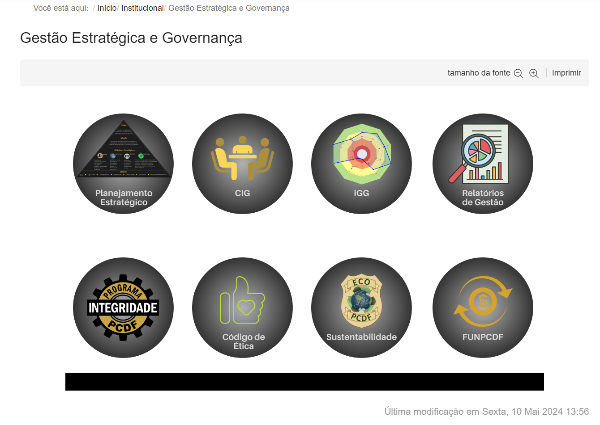
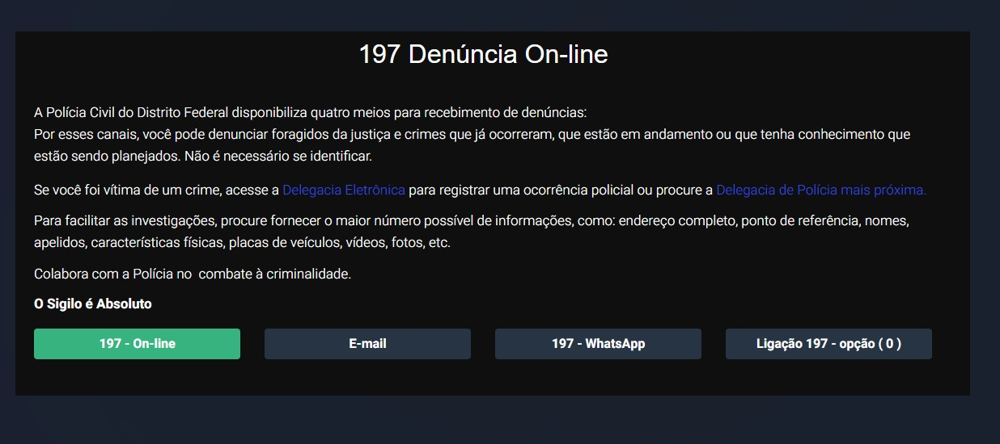
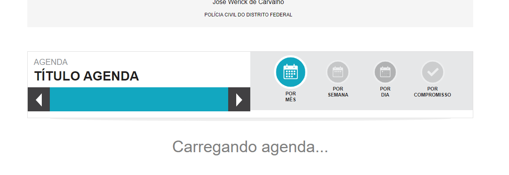
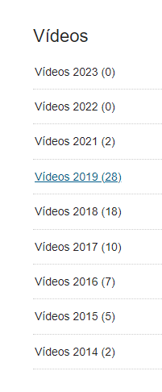

## Introdução 

As metas de usabilidade são objetivos específicos estabelecidos no design e na avaliação de sistemas interativos, com o propósito de melhorar a experiência do usuário e a eficácia das interações. Essas metas tendem garantir que o sistema seja intuitivo, eficiente e agradável de se usar, que seja acessível, com fácil navegação, clareza na apresentação de informações e eficiência na realização de tarefas.

## Metodologia 

Metas de usabilidade é o processo estruturado utilizado para estabelecer, implementar e avaliar objetivos específicos relacionados à experiência do usuário em sistemas interativos. Envolve a definição clara de metas, a escolha de métodos apropriados para coletar dados e medir o desempenho em relação a essas metas, bem como a análise dos resultados para informar ajustes no design e na funcionalidade do sistema. Essa abordagem preza garantir que os produtos e serviços digitais sejam desenvolvidos com base nas necessidades dos usuários, resultando em interfaces mais eficazes, intuitivas e satisfatórias.

## 1. Eficácia e Eficiência
A eficácia refere-se à habilidade dos usuários de interagir com o sistema de forma a alcançar seus objetivos de maneira precisa e conforme o esperado. Eficiêcia geralmente envolve aspectos como tempo necessário, esforço humano e materias utilizados 

### No sistema
O site se mostra eficaz em alguns aspectos, como em sua proposta de dispor informações no endereço eletrônico. Por outro lado, mostra-se ineficiente pois os serviços ofertados não necessariamente funcionam como deveria. Por exemplo, as informações sobre a obtenção da primeira segunda via da carteira de identidade estão bem dispostas, mas o agendamento para tal procedimento pode falhar em determinados momentos.

## 2. Facilidade de aprendizado
Facilidade de aprendizagem diz respeito à quantidade de tempo e esforço necessários para que os usuários adquiram habilidades e competências suficientes para utilizar o sistema com eficácia e desempenho adequados.

### No sistema
No geral, o site demonstra ser de fácil aprendizagem quando você está buscando um serviço. O site possui muitas informações, mas na parte institucional, possuem algumas funcionalidades que não são intuitivas, por falta de padronização, um exemplo é a parte de "Gestão Estratégica e Governança", as outras informações do site geralmente são texto mas nessa parte são figuras que posssuem um link,  algumas sendo clicavéis e outras não possui link ou qualquer outra informação.

    
 Figura 1: Gestão Estratégica. Fonte: 
        <a href="https://www.pcdf.df.gov.br">PCDF</a>
    
 

## 3. Facilidade de recordação 
A facilidade de recordação refere-se ao esforço cognitivo que um usuário precisa fazer para lembrar como interagir com a interface de um sistema interativo, após ter aprendido previamente essa interação.

### No sistema
Na facilidade de recordação em relação aos serviços oferecidos é bastante intuitivo, facilitando a interação do usuários com o site. Em cada serviço ofertado há um texto explicando o que deve ser feito e como deve ser feito. O exemplo a seguir é da 197 Denúncia On-line. 

    
 Figura 2: Denuncia Online. Fonte: 
        <a href="https://www.pcdf.df.gov.br">PCDF</a>
    
 

## 4. Satisfação do usuário 
A satisfação do usuário representa o aspecto da usabilidade que reflete a avaliação subjetiva dos sentimentos e emoções do usuário resultantes do uso do sistema.

### No sistema 
O site oferece alguns erros de carregamento, dificuldades técnicas para acessar ou utilizar os serviços online. Alguns informações desatualizadas como a agenda do delegado e videos. A agenda do delegado pelo meu último acesso na data: 11/05/2024, não carrega as informações necessárias. E a sessão de vídeos que não são postados desde 2022.

    
 Figura 3: Agenda do Delegado. Fonte: 
        <a href="https://www.pcdf.df.gov.br">PCDF</a>
    
 

    
 Figura 4: Vídeos . Fonte: 
        <a href="https://www.pcdf.df.gov.br">PCDF</a>
    
 

## 5. Segurança
A segurança no uso de um sistema envolve garantir a proteção dos usuários contra condições adversas ou perigosas. Existem duas abordagens para alcançar essa segurança: prevenir problemas antes que ocorram e ajudar os usuários a se recuperarem de situações indesejadas ocorram. Para prevenir problemas, é importante minimizar a probabilidade de apertar acidentalmente teclas, botões ou comandos indesejados.

### No sistema 
Na questão de segurança, as informações poderiam ser melhor disposta, novamente com uma certa padronização.

## Conclusão 

As metas a serem alcançadas incluem a eficiência de navegação, a localização rápida de informações e serviços, bem como um tempo de resposta rápido do site. A acessibilidade é importante, garantir funcionalidade em todos os principais navegadores e dispositivos. É essencial manter clareza e consistência, com um design visual e estrutural uniforme e linguagem clara e concisa. A facilidade de uso deve ser priorizada, oferecendo funcionalidades interativas intuitivas, instruções claras e feedback apropriado. A segurança e privacidade são fundamentais, exigindo proteção robusta de dados pessoais e transparência nas políticas de dados. O suporte e ajuda devem ser acessíveis, facilitando a obtenção de suporte e fornecimento de feedback. Por fim, o engajamento e atualização envolvem a manutenção de conteúdo atualizado regularmente e a integração com mídias sociais e outros canais de comunicação.

As propostas de solução há várias áreas para melhorar a eficiência de navegação, clareza, consistência, facilidade de uso, segurança, privacidade, suporte, ajuda, engajamento e atualização. Melhorar o tempo de carregamento e a adoção de design responsivo garantindo a funcionalidade em dispositivos móveis e diferentes tamanhos de tela. A consistência visual e textual será assegurada através de um guia de estilo e do uso de ferramentas de teste de legibilidade. Para a facilidade de uso, a criação de protótipos e testes de usabilidade serão realizados, implementação de feedback em tempo real nas interações do usuário. O suporte será aprimorado com a criação de um centro de ajuda online, incluindo FAQs, tutoriais em vídeo e um formulário de feedback acessível em todas as páginas. O engajamento e atualização serão promovidos por meio de um blog atualizado com notícias e informações relevantes e pela facilitação do compartilhamento de conteúdo e engajamento direto com os usuários em redes sociais.

As perguntas para verificação das metas há diversos aspectos do site da PCDF para garantir uma experiência positiva e eficiente para os usuários. Em termos de eficiência de navegação, olha se os usuários conseguem encontrar a informação desejada em menos de três cliques e se o tempo de carregamento das páginas é inferior a três segundos. A clareza e consistência são avaliadas pela consistência do design visual e estrutural em todas as páginas e pela facilidade de leitura e compreensão do conteúdo para um público geral. A facilidade de uso é medida pela capacidade dos usuários de completarem tarefas comuns sem assistência e pela clareza e utilidade do feedback fornecido durante as interações. Em relação ao suporte e ajuda, serão avaliados se os usuários conseguem encontrar facilmente recursos de suporte e fornecer feedback de forma simples. O engajamento e atualização são garantidos ao verificar se o conteúdo do site é atualizado regularmente e se o site facilita o compartilhamento de informações e a interação com os usuários através de redes sociais. A implementação e monitoramento contínuo dessas soluções e perguntas de verificação ajudarão a garantir que o site da PCDF atenda ss metas de usabilidade.

## Bibliografia
> BARBOSA, S.D.J.; SILVA, B.S. Interação Humano-Computador. Editora Campus-Elsevier, 2010. 
> PCDF. Disponível em: [PCDF](https://www.pcdf.df.gov.br). Acesso em 11 de maio de 2024.  

## **Histórico de Versões**

|     Versão       |     Descrição      |      Autor(es)      | Data           |  Revisor(es)          |Data de revisão|
| :----------------------------------------------------------: | :-------------------------------: | :-------------------------------------------------: | :-------------------------------: |  :-------------------------------: | :-------------------------------: |
| 1.0 | Criação de Metas de Usabilidade | [Raissa Andrade](https://github.com/RaissaAndradeS) | 11/05 |  [Giovana Barbosa](https://github.com/gio221), [Renata Quadros](https://github.com/Renatinha28), [Rayene Almeida](https://github.com/rayenealmeida)   |11/05 |
| 1.1 | Correção de Metas de Usabilidade e inserção da conclusão | [Raissa Andrade](https://github.com/RaissaAndradeS) | 10/05 | [Rayene Almeida](https://github.com/rayenealmeida), [Renata Quadros](https://github.com/Renatinha28) | 20/05 |
| 1.2 | Correções de figuras e índice| [Rayene Almeida](https://github.com/RaissaAndradeS) | 20/05 | [Giovana Barbosa ](https://github.com/gio221)   , [Renata Quadros](https://github.com/Renatinha28)   |   20/05  |