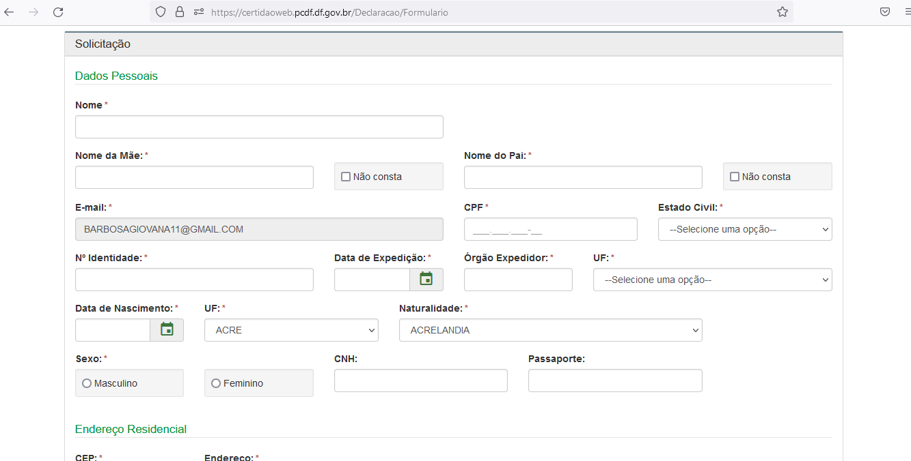
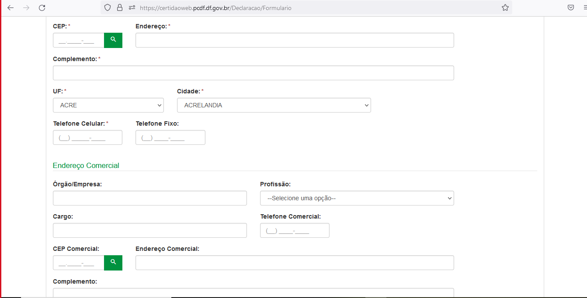
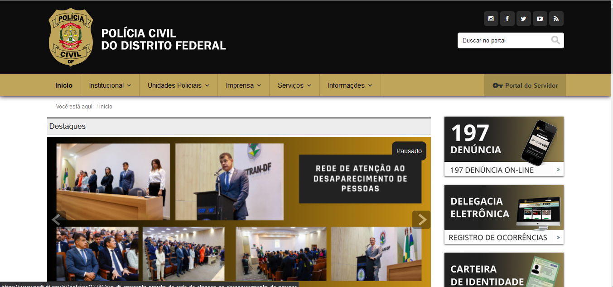

## Introdução 
O autor Norman (1988) ressalta a importância de projetar sistemas com um modelo conceitual claro, que os usuários possam entender facilmente. Esse modelo deve ajudar a entender como as ações e informações do sistema se relacionam com o conhecimento do mundo. Ele enfatiza que o design deve facilitar a determinação das ações possíveis em cada momento, tornar as coisas visíveis, permitir a avaliação do estado atual do sistema e seguir mapeamentos naturais entre intenções, ações e resultados.

As diretrizes comuns em Interação Humano-Computador (IHC) incluem corresponder às expectativas dos usuários, simplificar as tarefas, equilibrar controle e liberdade do usuário, manter consistência e padronização, promover eficiência, antecipar necessidades do usuário, garantir visibilidade e reconhecimento, fornecer conteúdo relevante e expressão adequada, e projetar para erros. Essas diretrizes são essenciais para o design de interação e interface eficazes.

## Obejtivo
Esse artefato tem como objetivo verificar os principios gerais e se o site da PCDF, viola alguns deles e se viola sugerir uma sugestão de melhoria

## Metodologia 
Para realizarmos os principios gerais, foi realizado uma análise individual de violações que o site poderia ter em relação ao principio

# Correspondência com as Expectativas dos Usuários

### Motivação
Segundo Nielsen (1994), o projetista deve seguir as convenções do mundo real, fazendo com que a informação apareça em uma ordem natural e lógica. Assim, é importante entender as sequências de ações que são familiares aos usuários e, caso a solução se desvie do que lhes é familiar, deve ao menos refletir uma organização lógica que lhes sejam plausível. Ao final de cada tarefa, o sistema deve retornar um feedback informativo para que o usuário fique aliviado e possa estar liberado para fazer outras tarefas.

Para corresponder às expectativas dos usuários, é essencial projetar sistemas que sigam mapeamentos naturais entre variáveis mentais e físicas, permitindo que os usuários entendam facilmente os relacionamentos entre intenções, ações possíveis e resultados.

### Violação
A violação que vemos no site da PCDF, e que o agendamento de Reuniões ela fica em informações, violando a Correspondência com as Expectativas dos Usuários, pois essa informção deveria ficar na aba de serviços. Como mostra na figura 1

 Figura 1 - Violação da Correspondência com as Expectativas dos Usuários Fonte: Site PCDF  
 

### Sugestão de melhoria

Podemos realizar algumas melhorias para atender a Correspondência dos usuários como:

- Fazer pesquisas com os usuários, para saber suas dificuldades e seus acertos, promovendo um site melhor e mais confiável
- Verificar o layout do site para que possa ser repensado as informações

# Simplicidade nas Estruturas das Tarefas

### Motivação
Norman (1988) recomenda simplificar a estrutura das tarefas, reduzindo a quantidade de planejamento e resolução deproblemas que elas requerem. Assim é importante reestruturar tarefas desnecessariamente complexas.

### Violação
No site da PCDF, na aba de Solicitar Antecedentes Criminais, pede várias informações antes que possa concluir a solicitação, como monstra nas figuras 2 e 3

 Figura 2 - Simplicidade nas Estruturas das Tarefas Fonte: Site PCDF  
 

 Figura 3 - Simplicidade nas Estruturas das Tarefas Fonte: Site PCDF  
 

### Sugestão de Melhoria 

Para que o usuário consiga realizar a solicitação de antecedentes criminais, não seja requisitado que ele coloque um email, e sim que ela já possa solicitar a verificação e se assim o usuário desejar ele colocar um contato, para que possa receber o documento

# Equilíbrio entre Controle e Liberdade do Usuário

### Motivação
Diversos autores como Norman(1988), Nielsen(1993), Tognazzini(2003), Shneiderman(1998) e cooper(1999) destacam a importância de manter o usuário no controle. Tognazzini afirma que assim o usuário aprende mais rápido e ganha um sentimento de maestria. Porém há de se buscar um equilíbrio, pois muitas opções e caminhos podem deixar os usuários perdidos, sem saber qual caminho seguir. Tal controle e liberdade não se aplica apenas para a realização de tarefas, mas para cancelar um tarefa em progresso ou retornar a um ponto anterior, afinal usuários podem se sentir tentados a explorar o sistema e devem ter segurança das suas ações e caso perceba que estão seguindo um caminho potêncialmente perigoso, tenha a oportunidade de evitar tal perigo.

O site da PCDF permite que o suário tem uma organização de layout muito boa, ou  seja, o sistema peca, por deixar o usuário da plataforma totalmente no controle, o que pode gerar confusão e indecisão.Temos um exemplo disso na figura 4 que conseguimos ver que o usuário tem várias opções no site.

 Figura 4 - Equilíbrio entre Controle e Liberdade do Usuário Fonte: Site PCDF  
 

### Sugestão de Melhoria
É interessante que o usuário tenha uma facilidade em manuzear o layout do site, mas também é necessário que o sistema não deixe o usuário livre e totalmente sem controle, por isso seria interessante deixar algumas informações mais acessiveis, para que não haja indecisão por parte do usuário

# Consistência e Padronização

### Motivação
Para facilitar o aprendizado e uso de um sistema, Norman (1988) recomenda assegurar a consistência da
interface com o modelo conceitual embutido no sistema.anto Norman (1988) como Tognazzini (2014) acreditam que a consistência mais importante é com as
expectativas dos usuários, como visto na seção anterior. Segundo eles, mesmo quando essa correspondência
não é possível, ou seja, quando precisamos definir mapeamentos arbitrários, devemos padronizar.

O site da PCDF tem uma padronização muito boa, como monstra na figura 5

 Figura 5 - Consistência e Padronização Fonte: Site PCDF 
 

# Promovendo a Eficiência do Usuário

### Motivação
Tognazzini (2014) recomenda considerar sempre a eficiência do usuário em primeiro lugar, e não a do
computador. As pessoas são mais custosas do que máquinas, e uma economia de tempo e esforço do usuário
costumam trazer mais benefícios do que economias semelhantes de processamento ou armazenamento.
Para isso, Tognazzini sugere manter o usuário ocupado. Toda vez que o usuário precisa esperar o sistema
responder antes que possa continuar seu trabalho, há perda de produtividade e desperdício de dinheiro

### Violação
No site da PCDF, vosê não cosnegue fazer um login, então se você inicia uma atividade e por algum motivo não consegue finalizar o site não salva seu progresso, como monstra na figura 6

 Figura 6 - Promovendo a Eficiência do Usuário Fonte: Site PCDF  
 

### Sugestão de Melhoria
O usuário não tem certeza que vai conseguir realizar toda a tarefa, por isso uma opção de login seria bem vinda

# Antecipação

### Motivação
Diante do desafio de desenvolver aplicações que transcendam a mera resposta às necessidades imediatas dos usuários, somos convocados a abraçar o princípio da antecipação. Em vez de esperar passivamente por comandos, devemos aspirar a prever as necessidades e desejos dos usuários, fornecendo-lhes as informações e ferramentas necessárias antes mesmo que eles as solicitem.

Cooper(1999) e Tognazzini(2003) nos guiam nessa jornada, lembrando-nos de que o verdadeiro valor de uma aplicação reside em sua capacidade de tomar a iniciativa, oferecendo não apenas respostas diretas, mas também informações adicionais pertinentes. Imagine um software que, ao ser questionado sobre um restaurante, não apenas fornece seu número de telefone, mas também seus horários de funcionamento. Este é o nível de antecipação que devemos almejar.

Não basta apenas antecipar as necessidades; é crucial também oferecer configurações padrão cuidadosamente pensadas. Os valores padrão devem ser escolhidos com sabedoria, sendo facilmente ajustáveis pelos usuários conforme a situação exige. Lembre-se, as pessoas tendem a aceitar os valores padrão como corretos, então cada escolha deve ser feita com atenção e consideração.

Portanto, diante de cada linha de código, cada configuração de interface, devemos nos perguntar: estamos verdadeiramente antecipando as necessidades dos nossos usuários? Estamos facilitando suas interações de forma proativa? Sejamos arquitetos da antecipação, construindo não apenas software, mas sim experiências que superam expectativas e proporcionam um serviço excepcional.

### Violação
Como explicado acima, o site da PCDF não possui um login logo que se acessa a plataforma, ou seja, não possui um sistema de memorização, sendo assim, o site não guarda informações de acessos recentes do usuário, o que faz com que a plataforma não antecipe as ações do usuário, ou seja, toda tarefa deve ser feita do zero, caso o usuário deixe a aplicação. Na figura 7 monstramos o layout do site, monstrando que o site não oferece o sistema de login.

 Figura 7 - Antecipação Fonte: Site PCDF  
 

## Sugestão de melhoria
Para resolver a violação de antecipação e melhorar a experiência do usuário, sugerimos a implementação de um sistema de login com memorização de informações de acesso recentes. Ao entrar na plataforma, os usuários seriam direcionados a uma página de login, onde poderiam inserir suas credenciais e optar por "Lembrar-me". Isso permitiria que suas preferências e histórico de ações fossem salvos de forma segura, utilizando cookies e local storage, além de um banco de dados para armazenar interações e preferências. Com isso, o site poderia antecipar as necessidades dos usuários, proporcionando uma experiência mais fluida e eficiente. 

Essa abordagem não só melhoraria a eficiência do site, como também criaria uma experiência de usuário mais satisfatória e personalizada, alinhada com os princípios de IHC de antecipação e proatividade.

# Visibilidade e Reconhecimento

### Motivação
Às vezes, na jornada do desenvolvimento e design de interfaces, é fácil perder de vista o que realmente importa: os usuários. É por isso que nos encontramos diante do imperativo de tornar visíveis não apenas as funcionalidades de nossas aplicações, mas também suas intenções e estados.

Norman nos lembra da importância de abreviar os momentos de incerteza e tornar claro para os usuários o que podem fazer e como fazer. Nossa interface deve ser uma extensão intuitiva de suas intenções, oferecendo ações que façam sentido e omitindo aquelas que não são pertinentes em determinado contexto. E após cada ação, devemos fornecer feedback imediato e consistente, alinhado com o modelo mental do usuário.

Nielsen(1993), Shneiderman(1998) e Tognazzini(2003) reforçam essa ideia, destacando a necessidade de atualização constante e visibilidade dos elementos da interface. Os usuários não devem ser deixados no escuro, lutando para entender o que está acontecendo no sistema. Cada interação deve ser acompanhada por feedback apropriado, seja sutil ou substancial, dependendo da sua frequência e impacto.

Além disso, Tognazzini(2003) nos oferece um guia prático para lidar com diferentes cenários de resposta do sistema, desde ações rápidas até operações demoradas. É nossa responsabilidade manter os usuários informados e engajados, mesmo quando o tempo de espera se estende.

Portanto, ao projetar nossas interfaces, devemos colocar os usuários em primeiro lugar. Eles não devem ser deixados para decifrar labirintos de interações passadas ou estados ocultos do sistema. Em vez disso, devemos fornecer sinalizações claras, guiar suas interações e mantê-los sempre informados sobre onde estão e para onde estão indo. Essa é a chave para criar experiências de usuário verdadeiramente envolventes e satisfatórias.

### Violação
No site da PCDF quando entramos na parte de solicitar antecedentes criminais, logo pede um email, logo o usuário não fica sabendo o que terá que ser feito na próxima página, como monstrado na figura 8

 Figura 8 - Visibilidade e Reconhecimento Fonte: Site PCDF  
 

## Sugestão de melhoria
Para a melhoria da Visibilidade e reconhecimento recomendamos:
* Mensagem de Introdução:

Descrição: Adicionar uma mensagem de introdução na página inicial da seção de solicitação de antecedentes criminais que explique brevemente o processo.

Conteúdo: "Para solicitar seus antecedentes criminais, você precisará fornecer um e-mail válido. Um código de verificação será enviado para este e-mail para que possamos confirmar sua identidade e continuar o processo."

Benefícios: Fornece uma visão geral clara do processo, reduzindo a incerteza sobre os passos seguintes.

# Conteúdo Relevante e Expressão Adequada

### Motivação
Em cada linha de código, em cada pixel da interface, reside a oportunidade de criar uma experiência verdadeiramente humana. Reeves e Nass(1996) nos lembram que as pessoas tratam a tecnologia como tratariam outro ser humano, buscando uma interação polida e significativa. E é nosso dever como designers de interfaces humanas (IHC) garantir que cada interação siga as máximas de qualidade, quantidade, relação e modo, estabelecendo assim uma conversa cooperativa e eficaz.

A busca pela simplicidade é uma constante entre os profissionais de IHC, seguindo o princípio de que "menos é mais". Nielsen(1993) nos ensina que a clareza e relevância são fundamentais, evitando a sobrecarga de informação e garantindo uma interação respeitosa e generosa. Tognazzini(2003) complementa essas ideias com recomendações práticas sobre redação e apresentação de texto, enfatizando a importância da legibilidade e acessibilidade.

Mas o design de interfaces vai além do texto e da tipografia. Mullet e Sano(1995) nos lembram que a identidade visual de um sistema é definida por uma combinação de elementos, desde o layout até a escolha de cores e formas. Cada detalhe deve ser cuidadosamente considerado, buscando a elegância, simplicidade e organização que tornam a experiência do usuário verdadeiramente envolvente.

Portanto, ao projetar interfaces humanas, lembremo-nos sempre do propósito maior por trás de cada linha de código e cada elemento visual: facilitar e enriquecer a interação entre humanos e tecnologia. Que nossos designs expressem não apenas funcionalidade, mas também empatia e compreensão, criando experiências que respeitem e valorizem cada usuário que interage com eles.

### Violação
O site da PCDF apresenta ao usuários expressões formais e de fácil intendimento ao usuário, como monstra na figura 9

 Figura 9 - Conteúdo Relevante e Expressão Adequada Fonte: Site PCDF  
 

# Projeto para Erros

### Motivação
Projetar para o erro não é apenas uma precaução, é uma demonstração de cuidado e empatia em relação aos usuários. Norman nos lembra que devemos assumir que erros acontecerão e, portanto, devemos estar preparados para ajudar os usuários a se recuperarem deles.

Um sistema verdadeiramente explorável é aquele que facilita a reversão de operações e torna difícil realizar ações irreversíveis. Cooper nos adverte sobre o perigo de colocar controles críticos próximos a controles de uso infrequente, mostrando como um simples erro de posicionamento pode ter consequências graves.

Nielsen(1993) e Shneiderman(1998) nos incentivam a adotar uma abordagem proativa: evitar erros sempre que possível e, quando ocorrem, oferecer mecanismos simples e inteligíveis para tratá-los. As mensagens de erro devem ser claras, precisas e construtivas, ajudando os usuários a entender o problema e sugerindo soluções.

Além disso, não devemos esquecer da importância de apoiar os usuários em suas dúvidas durante a interação. Uma ajuda e documentação de alta qualidade são essenciais, fornecendo informações facilmente encontradas e focadas na tarefa do usuário, sem serem excessivamente extensas.

Portanto, ao projetarmos sistemas e interfaces, lembremo-nos sempre do nosso compromisso com os usuários. Vamos projetar não apenas para a perfeição, mas também para a recuperação e aprendizado através dos erros. Pois é na superação dos desafios que encontramos oportunidades de crescimento e aprimoramento.

### Violação
Quando vamos solicitar a Carteira de Identidade, o usuário não tem certeza se o agendamento foi feito corretamente, como monstra na figura 10

 Figura 10 - Projeto para Erros Fonte: Site PCDF  
 

## Sugestão de melhoria
Para melhorar a experiência do usuário ao solicitar a Carteira de Identidade e assegurar que ele tenha certeza de que o agendamento foi feito corretamente, sugerimos as seguintes melhorias:

* Mensagem de Confirmação Imediata:
Após o usuário completar o agendamento, deve ser exibida uma mensagem de confirmação imediata na tela. Esta mensagem deve ser clara e destacada, indicando que o agendamento foi realizado com sucesso, e incluir informações detalhadas sobre o agendamento, como data, hora, local e número de confirmação. Isso proporcionará segurança imediata ao usuário, reduzindo a incerteza sobre a conclusão do processo.

* Página de Revisão de Agendamentos:
Implementar uma página onde os usuários possam revisar, cancelar ou reagendar seus compromissos. Esta página deve listar os agendamentos futuros com detalhes e status, além de botões para cancelar ou reagendar compromissos. Isso oferecerá ao usuário controle e flexibilidade, aumentando a confiança e a satisfação com o sistema.

## Principios Gerais escolhidos para o projeto:
Com base em todas as diretrizes avaliadas e nas funcionalidades escolhidas por cada integrante, os principios gerais escolhidos para o projeto são:

      1- Correspondência com as Expectativas dos Usuários
      2- Simplicidade nas Estruturas das Tarefas
      3- Equilíbrio entre Controle e Liberdade do Usuário
      4- Promovendo a Eficiência do Usuário
      5- Antecipação
      6- Visibilidade e Reconhecimento
      7- Projeto para Erros

## Bibliografia 
> BARBOSA, Simone; SILVA, Bruno. Interação Humano Computador. 1. ed. Rio de Janeiro: Elsevier, 2010.
>
> Polícia Civil do Distrito Federal. Polícia Civil do Distrito Federal. Disponível em: [https://www.pcdf.df.gov.br/](https://www.pcdf.df.gov.br/). Acesso em: 14 abr 2024.

## **Histórico de Versões**
      Tabela que descreve o Histórico de Versões
| Versão |          Descrição              |     Autor(es)      |      Data      |   Revisor(es)     |    Data de revisão    |  
|:------:|:-------------------------------:|:--------------:|:--------------:|:-------------:|:---------------------:|
| 1.0 | Criação do documento | [Giovana Barbosa ](https://github.com/gio221)  | 09/05 |  [Renata Quadros](https://github.com/Renatinha28) | 10/05 |
| 1.1 | Diretrizes adicionadas |  [Renata Quadros](https://github.com/Renatinha28) | 10/05 |[Giovana Barbosa](https://github.com/gio221)  |10/05 |  
| 1.2 | Diretrizes adicionadas | [Giovana Barbosa](https://github.com/gio221)  | 10/05 |  [Renata Quadros](https://github.com/Renatinha28) | 10/05 |
| 1.3 | Sugestão de melhoria | [Renata Quadros](https://github.com/Renatinha28) | 16/05 | [Giovana Barbosa](https://github.com/gio221)  | 17/05 |
| 1.4 | Sugestão de melhoria | [Giovana Barbosa](https://github.com/gio221)  | 16/05 |  [Renata Quadros](https://github.com/Renatinha28), [Rayene Almeida](https://github.com/rayenealmeida) | 17/05 |