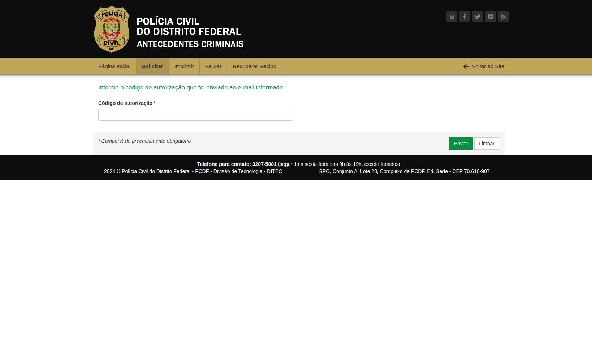
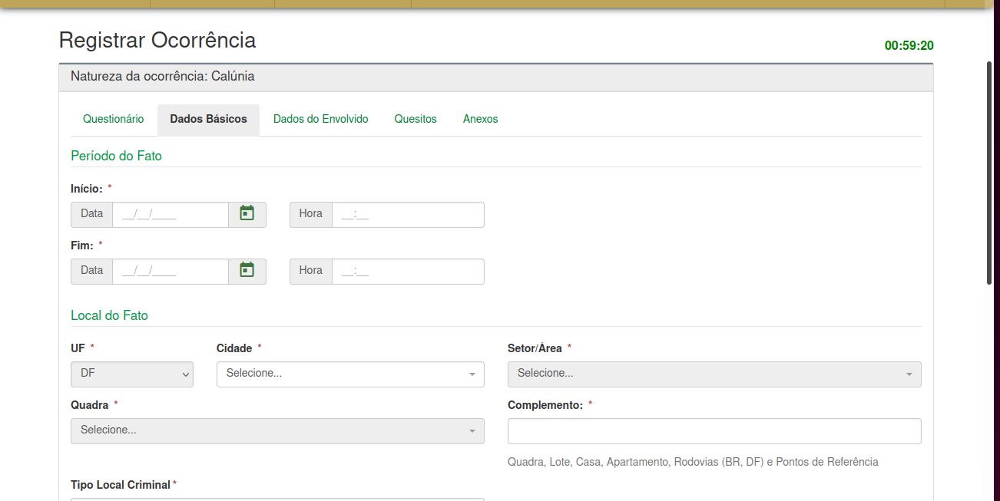

## Introdução
Esse artefato tem como objetivo documentar os resultados que o grupo 4 de interação humano computador, obteve durante a avaliação das analise de tarefas, nesse artefato vai ser abordado todos os resultados obtidos nessa avaliação

## Objetivo
Esse artefato tem objetivo relatar os resultados da analise de tarefas

## Metodologia
A avaliação do projeto foi conduzida através de entrevistas, storyboards e análise GOMS, permitindo uma compreensão das necessidades dos usuários. Utilizou-se acompanhamento presencial, observação direta, gravação das interações, questionários e análise de feedback para obter uma visão completa dos resultados.

## Participantes
Foi entrevistado 6 pessoas que aceitaram os termos de consentimento com 5 entrevistadores no total, pois um entrevistador entrevistou duas pessoas e duas funcionalidades diferentes, essas entrevista foram feitas presenciais. 

## Aspéctos Éticos
Será feita a leitura dos do termo de consentimento e também será fornecido para o entrevistado ler, se ele preferir, no início da entrevista. Aspéctos Éticos disponível em: [Aspectos Éticos](../../../analise_requisitos1/aspectos_éticos.md).

## Funcionalidades a serem tratadas
| Funcionalidade|      Responsáveis      |   
|:------:|:-------------------------------:|
|Pesquisar Procurados |  Lara         | 
| Solicitar Antecedentes|  Renata         |   
| 197- Denúncia Online |  Giovana         | 
| Solicitar carteira de identidade |  Raissa         | 
| Registra Ocorrência|  Rayene         |
|Retrato Falado Online|Renata|

 
  
Fonte: <a href="https://github.com/gio221">Giovana Barbosa</a>

 
# Analise de Tarefas(GOMS)
## Pesquisar procurados
No site do PCDF escolhemos algumas funcionalidades, entre elas a de visualização, pesquisa e denúncia de _Procurados_ do Distrito Federal. A integrante  [Lara Giuliana](https://github.com/gravelylara) ficou responsável por essa funcionalidade. 
* Goal 1: Listar todos os procurados pela PCDF
    * Method 1: Inserir dados- deixar os espaços sem preencher e nao opção "nome" selecionar "todos"
    * Method 2: Selecionar a região "DF"

* Goal 2: Procurar um nome específico 
    * Method 1: Ir até o endereço da PCDF (ou real ou eletrônico) e informar os seguintes dados
        * Operation 1: Informar nome a ser buscado
        * Operation 2: Informar crime cometido (opcional)
        * Operation 3: Informar região de atuação (opcional)
        * Operation 4: Informar gênero (opcional)
        * Operation 5: submeter dados

* Goal 3: Denunciar pessoa procurada
    * Method 1: Ir até o endereço da PCDF (ou real ou eletrônico) e informar os seguintes dados
        * Operation 1: Informar local do ocorrido (opcional)
        * Operation 2: Informar UF, cidade e bairro (opcional)
        * Operation 3: Informar tipo de crime (opcional)
        * Operation 4: Informar histórico: todo o relato da sua denúncia 
        * Operation 5: Selecionar se o indivíduo é menor de idade (opcional)
        * Operation 6: Anexar algum arquivo (como boletim de ocorrência, vídeos, filmagens) (opcional)
        * Operation 7: Comprovar identidade respondendo captcha no meio eletrônico ou informando documento numa delegacia
        * Operation 8: Submeter dados

### Questionário
|Pergunta|Resposta|
|--------|--------|
- 1-Qual é seu nome? | Clarismenia
- 2-Qual seu grau de experiência com tecnologias? | Médio
- 3-Você já utilizou o site da PCDF?  | não
- 4-Você acha essa funcionalidade importante? | sim
- 5-Se a 4 for sim, por que você utilizaria essa funcionalidade?| se eu tiver preocupada com algo na minha região
- 6-O diagrama de tarefas corresponde de maneira precisa às suas expectativas sobre como o processo deve ser conduzido?  |  sim
- 7-Tem alguma parte que ficou confusa? | não
- 8-Se você pudesse mudar? O que mudaria no processo de tarefas?| nada
- 9-De acordo com o diagrama, você o considera demorado de realizar as ações?|não
- 10-Sugestões de melhorias?|não tenho sugestões

### Sugestão de Melhoria
O usuário intrevistado não tem sugestões de melhoria

### Gravação 

  <iframe width="560" height="315" src="https://www.youtube.com/embed/KwaRsg9lFoI" frameborder="0" allowfullscreen></iframe>
   
Video da Entrevista

### Analise de Dados 

## Solicitar Antecedentes Criminais 
Nessa tarefa o usuário tem como objetivo solicitar os seus antecedentes criminais pelo site do PCDF, foi analisada pela integrante [Renata Quadros](https://github.com/Renatinha28) por meio da entrevista feita com 1 participante, Luísa. Primeiro na página inicial como mostra na Figura 1, em seguida pede-se o código de verificação como mostra na Figura 2 e o preenchimento do formulário como mostra na figura 3.

 Figura 1 - Página inicial de Antecedentes criminais. Fonte: Site PCDF  
 

 Figura 2 - Código de verificação de Solicitação de Antecedentes. Fonte: Site PCDF  
 

 Figura 3 - Formulário 1. Fonte: Site PCDF  
 

 Figura 4 - Formulário 2. Fonte: Site PCDF  
 

* GOAL 0: Descobrir se a pessoa possui antecedentes criminais.
  * GOAL 1: Solicitar os antecedentes criminais.
    * METHOD 1.A: Acessar o sistema de solicitação de antecedentes criminais da PCDF.

    (SEL. RULE: O usuário possui acesso ao sistema e sabe como navegar nele.)

    * METHOD 1.B: Entrar em contato com a Polícia Civil do Distrito Federal por telefone ou e-mail para obter instruções sobre como solicitar os antecedentes criminais.

    (SEL.RULE: O usuário não está familiarizado com o sistema online ou não possui acesso a ele.)

  * GOAL 2: Preencher corretamente os dados necessários para a solicitação de antecedentes criminais.
    * METHOD 2.A: Inserir os dados pessoais da pessoa para quem os antecedentes criminais estão sendo solicitados.

    (SEL. RULE: O usuário possui os dados pessoais da pessoa.)

      * OP. 2.A.1: Digitar o nome completo da pessoa.
      * OP. 2.A.2: Inserir o nome completo dos pais da pessoa (se aplicável).
      * OP. 2.A.3: Preencher o CPF (Cadastro de Pessoa Física) da pessoa.
      * OP. 2.A.4: Fornecer o RG (Registro Geral) da pessoa.
      * OP. 2.A.5: Indicar a data de nascimento da pessoa.
      * OP. 2.A.6: Especificar a naturalidade (cidade e estado de nascimento) da pessoa.
      * OP. 2.A.7: Selecionar o sexo da pessoa.
      * OP. 2.A.8: Informar o estado civil da pessoa.
      * OP. 2.A.9: Se aplicável, inserir o número da CNH (Carteira Nacional de Habilitação) da pessoa.
      * OP. 2.A.10: Se aplicável, fornecer o número do passaporte da pessoa.
      * OP. 2.A.11: Inserir o endereço residencial completo da pessoa.
      * OP. 2.A.12: Se aplicável, incluir o endereço comercial completo da pessoa.
      * OP. 2.A.13: Indicar o CEP (Código de Endereçamento Postal) tanto do endereço residencial quanto do endereço comercial.

    * METHOD 2.B: Revisar os dados fornecidos para garantir que estejam corretos e completos.

    (SEL. RULE: O usuário deseja evitar erros na solicitação.)

      * OP. 2.B.1: Verificar se todos os campos foram preenchidos corretamente.
      * OP. 2.B.2: Revisar se não há erros de digitação nos dados fornecidos.
      * OP. 2.B.3: Confirmar se os dados estão atualizados e correspondem à pessoa correta.
      * OP. 2.B.4: Corrigir qualquer informação incorreta ou incompleta identificada durante a revisão.
  * GOAL 3: Confirmar o envio da solicitação.
    * METHOD 3.A: Enviar a solicitação através do sistema online e aguardar a confirmação.

    (SEL. RULE: O usuário tem acesso à internet e confia na eficácia do sistema.)

    * METHOD 3.B: Entrar em contato com a PCDF para confirmar o recebimento da solicitação.

    (SEL. RULE: O usuário prefere confirmar pessoalmente.)

  * GOAL 4: Receber um código de acompanhamento da solicitação.
    * METHOD 4.A: Aguardar o recebimento do código de acompanhamento através do e-mail fornecido na solicitação.

    (SEL. RULE: O usuário confia na eficácia do sistema de envio de e-mails.)

    * METHOD 4.B: Entrar em contato com a PCDF para solicitar o código de acompanhamento, caso não seja recebido dentro do prazo esperado.

    (SEL.RULE: O usuário prefere confirmar pessoalmente.)

### Questionário
|Pergunta|Resposta|
|--------|--------|
- 1-Qual é seu nome? | Luisa Miranda
- 2-Qual seu grau de experiência com tecnologias? | Médio
- 3-Você já utilizou o site da PCDF?  | não
- 4-Você acha essa funcionalidade importante? | sim
- 5-Se a 4 for sim, por que você utilizaria essa funcionalidade?| Importante para saber os dados das pessoas, para ter o antecedente
- 6-O diagrama de tarefas corresponde de maneira precisa às suas expectativas sobre como o processo deve ser conduzido?  |  sim
- 7-Tem alguma parte que ficou confusa? | não, está bem completo
- 8-Se você pudesse mudar? O que mudaria no processo de tarefas?| nada
- 9-De acordo com o diagrama, você o considera demorado de realizar as ações?|não
- 10-Sugestões de melhorias?|não tenho sugestões

### Sugestão de Melhoria
O usuário intrevistado não tem sugestões de melhoria.

### Reprojeto
Coomo não houve nenhum problema encontrado, não há necessidade de reprojeto.

### Gravação

<iframe width="560" height="315" src="https://www.youtube.com/embed/OGm32woEJZA" title="YouTube video player" frameborder="0" allow="accelerometer; autoplay; clipboard-write; encrypted-media; gyroscope; picture-in-picture; web-share" referrerpolicy="strict-origin-when-cross-origin" allowfullscreen></iframe>

<a href="https://youtu.be/OGm32woEJZA" target="blanket">Vídeo da Gravação</a>

### Análise de Dados
De acordo com a entrevista, a analise de tarefas GOMS corresponde as expectativas do usuário.

## 197- Denúncia Online

Nessa tarefa o usuário pretende fazer uma denúncia no site da PCDF, foi analisada pela integrante  [Giovana Barbosa](https://github.com/gio221), como monstrado na figura 1. Ultilizando a CMN-GOMS

* GOAL 0: Fazer uma denuncia Online
    * GOAL 1: Entrar na parte de Denúncia Online
        * OP 1.1: Guiar o mouse para a aba de denuncia online
        * 0P 1.2: Pressionar o botão
    * GOAL 2: Selecionar a opção denuncia por meios de comunicação
        * OP 2.1: Guiar o mouse para a opção 'Denuncia de meios de comunicação'
        * OP 2.2: Pressionar o botão
        * OP 2.3: fazer a denuncia 
    * GOAL 3: Selecionar denucia Online
        * OP 3.1: Colocar as informações
        * OP 3.2: Clicar no botão denunciar 

### Questionário
|Pergunta|Resposta|
|--------|--------|
- 1-Qual é seu nome? | Débora
- 2-Qual seu grau de experiência com tecnologias? | Médio
- 3-Você já utilizou o site da PCDF?  | sim
- 4-Você acha essa funcionalidade importante? | sim
- 5-Se a 4 for sim, por que você utilizaria essa funcionalidade?| Para denunciar algum crime
- 6-O diagrama de tarefas corresponde de maneira precisa às suas expectativas sobre como o processo deve ser conduzido?  |  sim
- 7-Tem alguma parte que ficou confusa? | não
- 8-Se você pudesse mudar? O que mudaria no processo de tarefas?| nada
- 9-De acordo com o diagrama, você o considera demorado de realizar as ações?|não
- 10-Sugestões de melhorias?|detalhar mais

### Sugestão de Melhoria
O usuário intrevistado sugere mais detalhamento

## Reprojeto
Como houve uma sugestão de melhoria, será feito um reprojeto

### Gravação

<iframe width="560" height="315" src="https://www.youtube.com/embed/T1LI6OhgQMg" title="YouTube video player" frameborder="0" allow="accelerometer; autoplay; clipboard-write; encrypted-media; gyroscope; picture-in-picture; web-share" referrerpolicy="strict-origin-when-cross-origin" allowfullscreen></iframe>

<a href="https://youtu.be/T1LI6OhgQMg" target="blanket">Vídeo da Gravação</a>

## Interpretação de dados
Com base na entrevista a analise de tarefas GOMS, o usuário conseguiu realizar as atividades corretamente, porém ele sugeriu que tivesse mais detalhamento

## Solicitar Carteira de Identidade
Essa atividade tem como objetivo os usuários ao acessar a funcionalidade de marcação de carteira de identidade é agendar um horário para emissão ou renovação do documento de identidade. Feita por [Raissa Andrade](https://github.com/RaissaAndradeS).

* GOAL 0: Solicitar Carteira de Identidade.
    * OP 1: Acessar o sita da PCDF
        * OP 1.1: Abrir o navegador 
        * OP 1.2: DIgitar "https://www.pcdf.df.gov.br" na barra de endereços
        * OP 1.3: Apertar Enter
        * OP 1.4: Procurar "Serviços"

* GOAL 1: Agendamento
    * OP 2: Escolher serviço e Unidade de Atendimento
        * OP 2.1: Selecionar primeira ou segunda via
        * OP 2.2: Selecionar Unidade de atendimento
        * OP 2.3: Escolher data
        * OP 2.4: Escolher horário
    * OP : Confirmações de dados

* GOAL 2: Preencher o Formulário de Solicitação 
    * OP 3: Ler instruções da página
    * OP: Preencher os campos obrigatórios
        * OP 3.1: Nome Completo
        * OP 3.2: Data de Nascimento
        * OP 3.3: Endereço
        * OP 3.4: Número de telefone
    * OP: Revisar os dados inseridos

* GOAL 3: Resumo e Confirmação do agendamento
    * OP 4: Ler dados da página
        * OP 4.1: Abrir e-mail
        * OP 4.2: Copiar código de autorização
        * OP 4.3: Colar na página da PCDF
        * OP 4.4: Finalizar 

Fonte:[Raissa Andrade](https://github.com/RaissaAndradeS), 2024  

### Questionário
    Tabela que descreve o questionário
|Pergunta|Resposta|
|--------|--------|
- 1-Qual é seu nome? | Júlio
- 2-Qual seu grau de experiência com tecnologias? |Alto
- 3-Você já utilizou o site da PCDF?  | Não
- 4-Você acha essa funcionalidade importante? | Sim
- 5-Se a 4 for sim, por que você utilizaria essa funcionalidade?| Para solicitar a carteira de identidade
- 6-O diagrama de tarefas corresponde de maneira precisa às suas expectativas sobre como o processo deve ser conduzido?  |  Sim
- 7-Tem alguma parte que ficou confusa? | Não
- 8-Se você pudesse mudar? O que mudaria no processo de tarefas?| Nada
- 9-De acordo com o diagrama, você o considera demorado de realizar as ações?|Não
- 10-Sugestões de melhorias?|Não

### Sugestão de Melhoria
O usuário entrevistado não tem sugestões de melhoria.

### Gravação
    Video referente a gravação da entevista

  <iframe width="560" height="315" src="https://www.youtube.com/embed/hKgmDzaR6K4" frameborder="0" allowfullscreen></iframe>
  
Video da Entrevista

Fonte: [Raissa Andrade](https://github.com/RaissaAndradeS), 2024 

## Interpretação de dados
Em relação a entrevista a analise de tarefas GOMS, o usuário conseguiu realizar todas as tarefas solicitadas, compreendeu com facilidade.

## Registro de Ocorrência

#### Modelo Goals, Operators, Methods, and Selection rules (GOMS)

[Rayene Almeida](https://github.com/rayenealmeida) aplicará o método GOMS no modelo CMN para analisar detalhadamente as ações cognitivas e motoras dos usuários ao realizar o registro de ocorrências no site da PCDF. A integrante identificará os objetivos que os usuários buscam alcançar ao usar essa funcionalidade, os operadores cognitivos e motores necessários para realizar as tarefas, os métodos sequenciais utilizados para atingir esses objetivos e as regras de seleção que orientam o comportamento do usuário diante de diferentes opções disponíveis na interface.

Meta: Registrar uma ocorrência no site da PCDF

#### Passos GOMS:

* GOAL 0: Registrar uma Ocorrência
    * GOAL 1: Acessar a seção de "Registro de Ocorrência" no site da PCDF
        * OP 1.1: Guiar o mouse para a seção "Delegacia Eletrônica"
        * OP 1.2: Pressionar o botão para acessar a seção
    * GOAL 2: Ler as instruções e requisitos fornecidos
        * OP 2.1: Ler as instruções na página de registro de ocorrência
        * OP 2.2: Selecionar a natureza da ocorrência
    * GOAL 3: Preencher o formulário de registro
        * OP 3.1: Identificar os campos obrigatórios no formulário de registro
            * Cognitivos:
                * Identificar os campos obrigatórios
        * OP 3.2: Decidir quais informações são relevantes e devem ser fornecidas
            * Cognitivos:
                * Decidir quais informações são necessárias para a ocorrência
        * OP 3.3: Mover o cursor para clicar nos campos de entrada do formulário
            * Motoras:
                * Mover o cursor para os campos de entrada
        * OP 3.4: Digitar as informações necessárias nos campos do formulário
            * Motoras:
                * Digitar as informações necessárias
    * GOAL 4: Revisar e enviar o formulário de registro
        * OP 4.1: Revisar as informações inseridas para garantir que estejam corretas e completas
            * Cognitivos:
                * Revisar as informações inseridas
        * OP 4.2: Clicar no botão "Enviar" para submeter a ocorrência
            * Motoras:
                * Mover o cursor para clicar no botão de envio

 Figura 5 - Página inicial do Registro de Ocorrência. Fonte: Site PCDF  
 

 Figura 6 - Seleção de Natureza para a Ocorrência. Fonte: Site PCDF  
 

 Figura 7 - Formulário de Ocorrência 3. Fonte: Site PCDF  
 

### Questionário
|Pergunta|Resposta|
|--------|--------|
- 1-Qual é seu nome? | Victor Moreira Almeida
- 2-Qual seu grau de experiência com tecnologias? |Alto
- 3-Você já utilizou o site da PCDF?  | não
- 4-Você acha essa funcionalidade importante? | sim
- 5-Se a 4 for sim, por que você utilizaria essa funcionalidade?| Para registra uma ocorrência
- 6-O diagrama de tarefas corresponde de maneira precisa às suas expectativas sobre como o processo deve ser conduzido?  |  sim
- 7-Tem alguma parte que ficou confusa? | não
- 8-Se você pudesse mudar? O que mudaria no processo de tarefas?| nada
- 9-De acordo com o diagrama, você o considera demorado de realizar as ações?|não
- 10-Sugestões de melhorias?|não

### Sugestão de Melhoria
O usuário intrevistado não tem sugestões de melhoria

### Gravação

  <iframe width="560" height="315" src="https://www.youtube.com/embed/p-WfgB0TgAE" frameborder="0" allowfullscreen></iframe>
  
Video da Entrevista

## Retrato Falado Online: Descreva e Identifique
Nessa tarefa o usuário tem como objetivo fazer um retrato falado de forma online pelo site do PCDF, foi analisada pela integrante [Renata Quadros](https://github.com/Renatinha28) por meio da entrevista com 1 participante, Heder. 

* GOAL 0: Acessar a funcionalidade de Denúncia Online:
    * METHOD 0.A: Navegar até o site da Polícia Civil do Distrito Federal (PCDF).
    
    (SEL. RULE: O usuário sabe que pode fazer denúncias online.)

* GOAL 1: Selecionar a opção de Retrato Falado Online:
    * METHOD 1.A: Identificar e clicar na seção "Denúncia Online".
        * OP. 1.A.1: Escanear visualmente a página inicial em busca da seção "Denúncia Online".
        * OP. 1.A.2: Clicar na seção identificada como "Denúncia Online".
    * METHOD 1.B: Escolher "Retrato Falado Online" dentre as opções disponíveis.
        * OP. 1.B.1: Procurar por opções de denúncia específicas, como "Retrato Falado Online".
        * OP. 1.B.2: Clicar na opção encontrada para selecioná-la.
    
    (SEL. RULE: O usuário procura a opção que corresponde à sua necessidade específica.)

* GOAL 2: Preencher o formulário de Retrato Falado Online:
    * METHOD 2.A: Fornecer os dados pessoais solicitados (nome, e-mail, CPF).
        * OP. 2.A.1: Digitar nome completo da pessoa. 
        * OP. 2.A.2: Digitar o CPF.
        * OP. 2.A.3: Digitar o e-mail.  
    * METHOD 2.B: Selecionar o tipo de denúncia (ex: Assalto/Roubo).
    * METHOD 2.C: Descrever detalhadamente o incidente e as características do suspeito.
        * OP. 2.C.1: Descrever detalhadamente o incidente. 
        * OP. 2.C.2: Descrever detalhadamente as características do suspeito.
    * METHOD 2.D: Criar o retrato falado do suspeito.
        * OP. 2.D.1: Apertar o botão de criar avatar. 
        * OP. 2.D.2: Selecionar um avatar criado. 
    * METHOD 2.E: Avaliar o avatar selecionado
        * OP. 2.E.1: Descrever a fidelidade do avatar de acordo com a lembrança do suspeito. 
    
    (SEL. RULE: O usuário segue o fluxo natural do formulário, preenchendo campos conforme necessário.)

* GOAL 3: Enviar a denúncia:
    * METHOD 3.A: Clicar no botão de envio após revisão completa dos dados fornecidos.

* GOAL 4: Receber confirmação da denúncia:
    * METHOD 4.A: Verificar a mensagem informativa e aguardar a confirmação por e-mail da recepção da denúncia.
    * METHOD 4.B: Aguardar atualizações dentro do prazo estipulado.

### Questionário
|Pergunta|Resposta|
|--------|--------|
- 1-Qual é seu nome? | Heder Cardoso
- 2-Qual seu grau de experiência com tecnologias? |Alto
- 3-Você já utilizou o site da PCDF?  | não
- 4-Você acha essa funcionalidade importante? | sim
- 5-Se a 4 for sim, por que você utilizaria essa funcionalidade?| Para descrever os fugitivos
- 6-O diagrama de tarefas corresponde de maneira precisa às suas expectativas sobre como o processo deve ser conduzido?  |  sim
- 7-Tem alguma parte que ficou confusa? | não
- 8-Se você pudesse mudar? O que mudaria no processo de tarefas?| nada
- 9-De acordo com o diagrama, você o considera demorado de realizar as ações?|não
- 10-Sugestões de melhorias?|não

### Sugestão de Melhoria
O usuário intrevistado não tem sugestões de melhoria

### Reprojeto
Coomo não houve nenhum problema encontrado, não há necessidade de reprojeto.

### Gravação

<iframe width="560" height="315" src="https://www.youtube.com/embed/VHNANJqYZ9w" title="YouTube video player" frameborder="0" allow="accelerometer; autoplay; clipboard-write; encrypted-media; gyroscope; picture-in-picture; web-share" referrerpolicy="strict-origin-when-cross-origin" allowfullscreen></iframe>

<a href="https://youtu.be/VHNANJqYZ9w" target="blanket">Vídeo da Gravação</a>

### Análise de Dados
De acordo com a entrevista, a analise de tarefas GOMS corresponde as expectativas do usuário.

## Perguntas Finais
|Perguntas|Respostas|
|---------|---------|
|Os diagramas representam de forma precisa as tarefas esperadas para as funcionalidades do site?|Sim
| As entrevistas fornecem informações que possibilitam melhorias nas tarefas identificadas pelo artefato de Análise de Tarefas?|Sim

## Bibliografia
> BARBOSA, S.D.J.; SILVA, B.S. Interação Humano-Computador. Editora Campus-Elsevier, 2010.

## Referências bibliograficas

> Polícia Civil do Distrito Federal. Polícia Civil do Distrito Federal. Disponível em: [https://www.pcdf.df.gov.br/](https://www.pcdf.df.gov.br/). Acesso em: 14 abr 2024.

## Histórico de Versões

| Versão |          Descrição              |     Autor(es)      |      Data      |   Revisor(es)     |    Data de revisão    |  
|:------:|:-------------------------------:|:--------------:|:--------------:|:-------------:|:---------------------:|
|  1.0   | Criação do documento               |  [Giovana Barbosa](https://github.com/gio221)      | 29/05  |     [Renata Quadros](https://github.com/Renatinha28), [Rayene Almeida](https://github.com/rayenealmeida) | 01/06 |
|1.1| Correções, adicão de fontes e chamadas de tabelas| [Raissa Andrade](https://github.com/RaissaAndradeS)| 08/07|[Giovana Barbosa](https://github.com/gio221)    |08/07