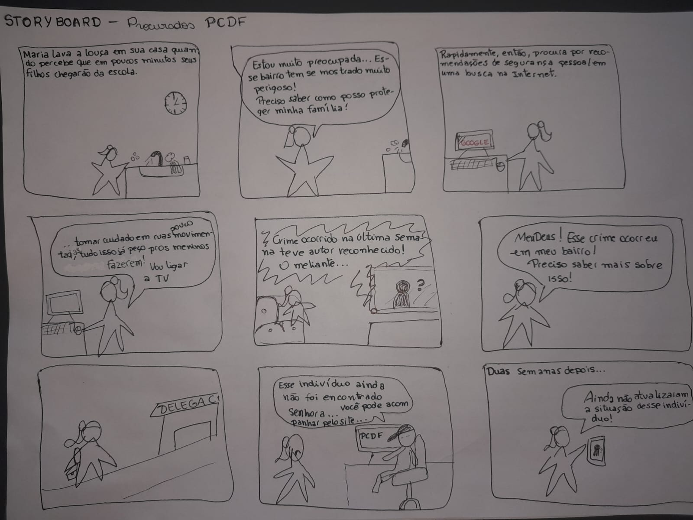
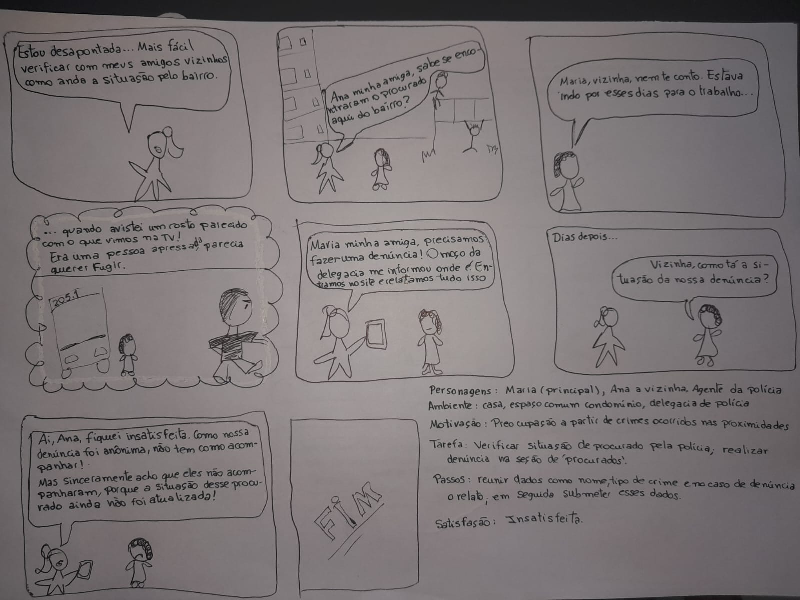
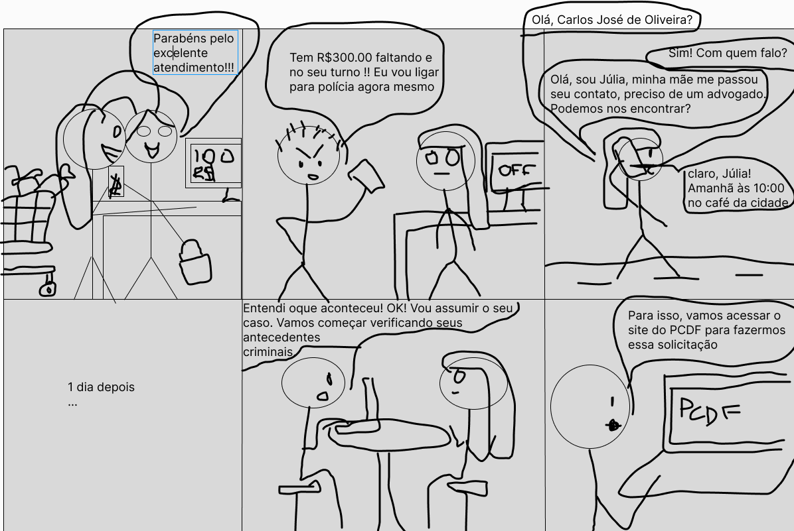
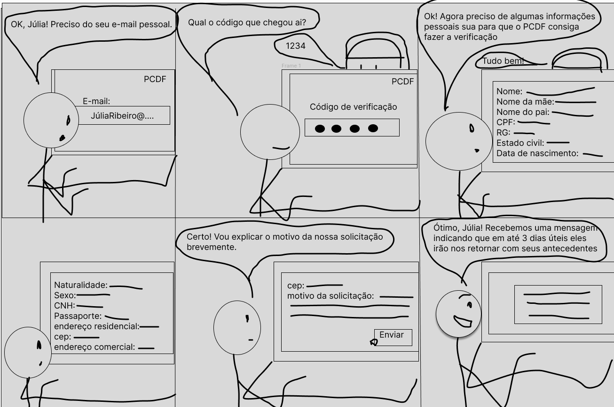
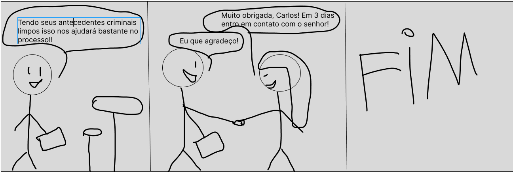
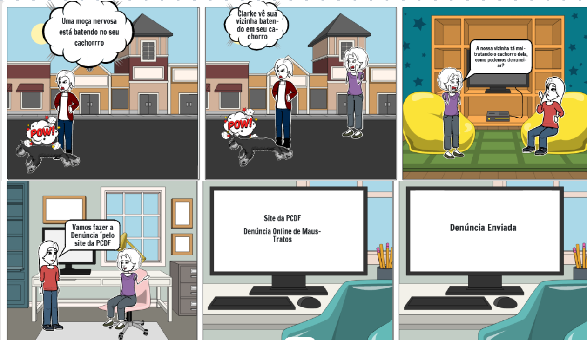
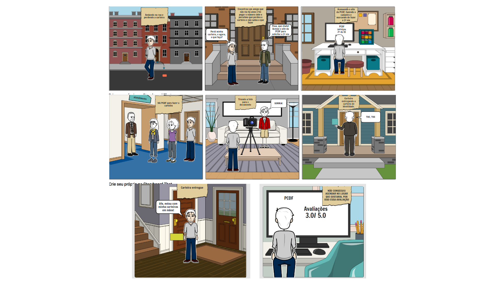
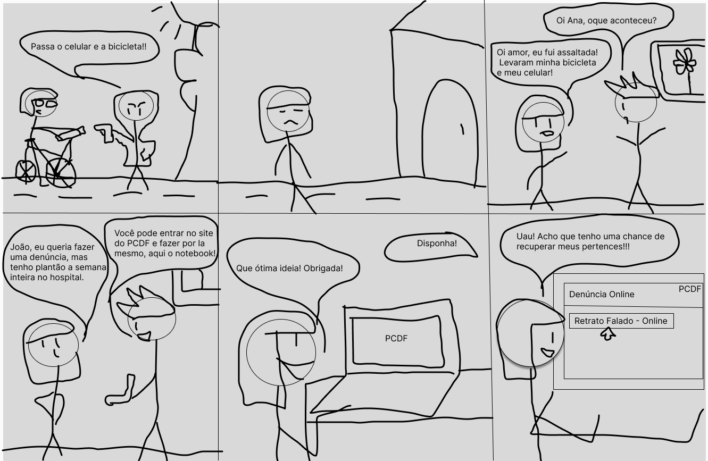
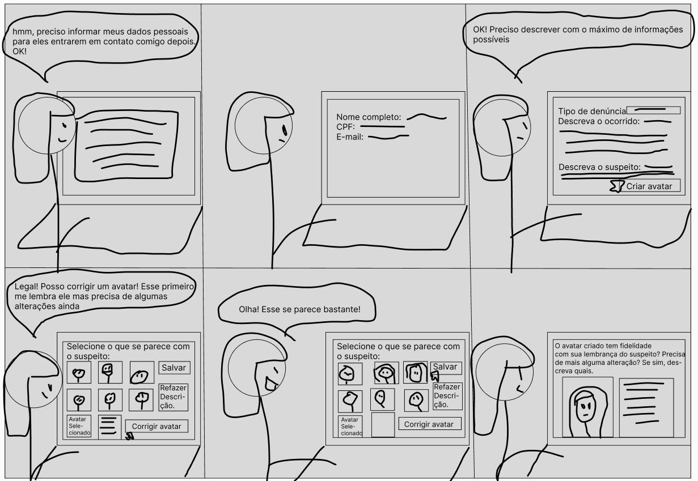
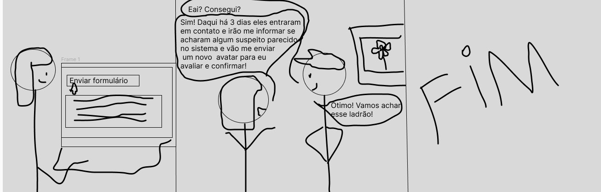

## Introdução
O relato desempenha um papel importante em Interação Humano Computador pois oferece insights sobre o processo do design, implementação e uso interativo das funcionalidades. Elepossui a função de fornecer a compreensão das entrevistas do storyboard.

## Foco do artefato
O foco do artefato é centrado em relatar os dados e resultados obtidos por meio das entrevistas realizadas com os usuários. Essas informações são essenciais para entender não apenas a eficácia do storyboard em comunicar a narrativa visual, mas também para identificar áreas de melhoruas que podem significar futuras interações com o projeto.

## Metodologia
A avaliação foi realizada por meio de entrevistas, utilizando storyboards e a análise GOMS para avaliar a funcionalidade. Isso permitiu identificar as necessidades dos usuários através de acompanhamento presencial. A coleta de dados incluiu observação direta, gravação das interações para análise posterior, aplicação de questionários e análise de feedback, proporcionando uma visão abrangente dos resultados.

## Participantes
Foi entrevistado 6 pessoas que aceitaram os termos de consentimento com 5 participantes entrevistadores no total com locais das entrevistas presenciais. Neste Documento apresentasse as entrevistas de todas as funcionalidades.

 Funcionalidade    |    Integrante Responsável             |  
|:------:|:-------------------------------:|
|Pesquisar Procurados|Lara|  
| Solicitar Antecedentes Criminais | Renata |
| 197- Denúncia Online   | Giovana          |
| Solicitar Carteira de Identidade| Raissa
| Registrar Ocorrência | Rayene |
|Retrato Falado Online|Renata|

## Aspéctos Éticos
Foi passado para o entrevitado de cada entrevista o termo de consentimento e todos os que estão na gravação aceitaram os termos. Termo de consentimento disponível em: [Aspectos Éticos](analise_requisitos1/aspectos_éticos.md).

## Relato dos storyboads
### Pesquisar procurados
As figuras 1 e 2 são referentes ao storyboard feito pela integrante [Lara Giuliana](https://github.com/gravelylara).

    
 Figura 1: Stroryboard de Pesquisar procurados. 
    

    
Fonte: 
        <a href="https://github.com/gravelylara">Lara</a>
    
 

    
 Figura 2: Stroryboard de Pesquisar procurados. 
    

    
Fonte: 
        <a href="https://github.com/gravelylara">Lara</a>
    
 

#### Gravação

  <iframe width="560" height="315" src="https://www.youtube.com/embed/KwaRsg9lFoI" frameborder="0" allowfullscreen></iframe>

#### Questionário

| Pergunta                                                                                      | Resposta                  |
|-----------------------------------------------------------------------------------------------|---------------------------|
| 1. Qual é seu nome?                                                                           | Clara Ismênia             |
| 2. Qual sua idade?                                                                            | 24 anos                   |
| 3. Qual sua ocupação?                                                                         | Estudante de graduação    |
| 4. Os usuários representados no storyboard são semelhantes aos usuários reais do sistema?     | Sim                       |
| 5. O cenário descrito no storyboard parece realista e relevante para os usuários do sistema?  | Sim                       |
| 6. Os estímulos apresentados no storyboard parecem adequados para incentivar os usuários a realizar ações? | Sim                       |
| 7. O storyboard parece ser apropriado para o público-alvo do produto?                         | Sim                       |
| 8. O storyboard demonstra claramente como o produto resolve os problemas ou necessidades dos usuários? | Sim                       |
| 9. Os usuários conseguiram alcançar seus objetivos ao interagir com o storyboard?             | Sim                       |
| 10. As informações fornecidas no storyboard são fáceis de entender para os usuários?          | Sim                       |
| 11. Os usuários enfrentaram alguma dificuldade durante a interação com o storyboard?          | Não                       |
| 12. O storyboard fornece todas as informações necessárias para os usuários completarem suas tarefas? | Sim                       |
| 13. O storyboard destaca os principais benefícios e vantagens do produto para os usuários?    | Sim                       |
| 14. As ações realizadas no Storyboard seguem uma ordem sequencial, fluida e lógica?           | Sim                       |
| 15. Você tem alguma sugestão ou feedback para melhorar o storyboard?                          | Não                       |

### Solicitar Antecedentes Criminais

As figuras 3, 4 e 5 são o storyboard feito pela integrante [Renata Quadros](https://github.com/Renatinha28), no qual o usuário, Carlos José de Oliveira, precisa consultar os antecedentes de sua cliente Júlia Ribeiro, a qual foi processada injustamente. O objetivo da tarefa é solicitar os antecedentes criminais do usuário e a avaliação foi feita com 1 participante, Luísa.

    
 Figura 3: Stroryboard de Solicitar antecedentes. 
    

    
Fonte: 
        <a href="https://github.com/Renatinha28">Renata</a>
    
 

    
 Figura 4: Stroryboard de Solicitar antecedentes. 
    

    
Fonte: 
        <a href="https://github.com/Renatinha28">Renata</a>
    
 

    
 Figura 5: Stroryboard de Solicitar antecedentes. 
    

    
Fonte: 
        <a href="https://github.com/Renatinha28">Renata</a>
    
 

### Gravação

<iframe width="560" height="315" src="https://www.youtube.com/embed/OGm32woEJZA" title="YouTube video player" frameborder="0" allow="accelerometer; autoplay; clipboard-write; encrypted-media; gyroscope; picture-in-picture; web-share" referrerpolicy="strict-origin-when-cross-origin" allowfullscreen></iframe>

<a href="https://youtu.be/OGm32woEJZA" target="blanket">Vídeo da Gravação</a>

#### Questionário

| Pergunta                                                                                      | Resposta                                             |
|-----------------------------------------------------------------------------------------------|------------------------------------------------------|
| 1. Qual seu nome completo?                                                                    | Luísa Miranda                                        |
| 2. Qual sua idade?                                                                            | 21 anos                                              |
| 3. Qual sua ocupação?                                                                         | Estudante                                            |
| 4. Os usuários representados no storyboard são semelhantes aos usuários reais do sistema?     | Sim                                                  |
| 5. O cenário descrito no storyboard parece realista e relevante para os usuários do sistema?  | Sim                                                  |
| 6. Os estímulos apresentados no storyboard parecem adequados para incentivar os usuários a realizar ações? | Sim                                                  |
| 7. O storyboard parece ser apropriado para o público-alvo do produto?                         | Sim                                                  |
| 8. O storyboard demonstra claramente como o produto resolve os problemas ou necessidades dos usuários? | Sim                                                  |
| 9. Os usuários conseguiram alcançar seus objetivos ao interagir com o storyboard?             | Sim                                                  |
| 10. As informações fornecidas no storyboard são fáceis de entender para os usuários?          | Sim                                                  |
| 11. Os usuários enfrentaram alguma dificuldade durante a interação com o storyboard?          | Não                                                  |
| 12. O storyboard fornece todas as informações necessárias para os usuários completarem suas tarefas? | Sim                                                  |
| 13. O storyboard destaca os principais benefícios e vantagens do produto para os usuários?    | Sim                                                  |
| 14. As ações realizadas no Storyboard seguem uma ordem sequencial, fluida e lógica?           | Sim                                                  |
| 15. Você tem alguma sugestão ou feedback para melhorar o storyboard?                          | Questão mais realista do motivo de buscar os antecedentes criminais |

#### Reprojeto
Coomo não houve nenhum problema encontrado, não há necessidade de reprojeto.

#### Análise de Dados
De acordo com a entrevista, o storyboard corresponde as expectativas do usuário.

### 197- Denúncia Online
A Figura 7 é um storyboard que relata o uso do site da PCDF para fazer denúncia online feito pela integrante [Giovana](https://github.com/gio221).

   

    
 Figura 6: Storyboard de Retrato Falado
    

     
Fonte: 
        <a href="https://github.com/gio221">Giovana</a>
    
 

#### Gravação

<iframe width="560" height="315" src="https://www.youtube.com/embed/T1LI6OhgQMg" title="YouTube video player" frameborder="0" allow="accelerometer; autoplay; clipboard-write; encrypted-media; gyroscope; picture-in-picture; web-share" referrerpolicy="strict-origin-when-cross-origin" allowfullscreen></iframe>

<a href="https://youtu.be/T1LI6OhgQMg" target="blanket">Vídeo da Gravação</a>

### **Perguntas e Respostas**

1. Qual seu nome? **Resposta:** Débora

2. As representações do storyboard refletem adequadamente as tarefas e o contexto de uso do sistema? **Resposta:** Sim

3. As sequências de interação mostradas no storyboard são claras e correnspondem ao fluxo do trabalho real dos usuários? **Resposta:** Sim

4. O storyboard é visualmente atraente e está alinhado com os objetivos gerais do projeto? **Resposta:** Sim

5. O storyboard representa fielmente o ambiente e as condições reais onde o sistema será utilizado? **Resposta:** Sim

6. Existem partes do storyboard que precisam de modificações para melhorar sua clareza ou fidelidade, se sim quais seriam essa modificações? **Resposta:** Sim, No quinto quadrante detalhar o site de forma visual

### Sugestão de melhoria
A sugestão de melhoria que o usuário sugeriu é que no  quinto quadrante detalhar o site de forma visual

### Reprojeto
Como é só uma sugestão visual do usuário não foi necessário reprojeto

### Analise de Dados
Com base na entrevista concluimos que com base no cenário o usuário consegue realizar a funcionalidade

### Solicitar carteira de identidade

Esse storyboard descreve a ação de um pessoa que perdeu a carteira de identidade e realiza o processo de solicitar a carteira de identidade.

    Tabela 8, storyboard que descreve como solicitar Carteira

    
 Figura 7: Storyboard de Solicitar Carteira de Identidade. 
    

    
Fonte: 
        <a href="https://github.com/RaissaAndradeS">Raissa</a>
    
 

### Gravação

  <iframe width="560" height="315" src="https://www.youtube.com/embed/hKgmDzaR6K4" frameborder="0" allowfullscreen></iframe>

### Questionário
    Tabela que descreve as perguntas realizadas
| Pergunta                                                                                      | Resposta                   |
|-----------------------------------------------------------------------------------------------|----------------------------|
| 1. Qual seu nome?                                                                             | Júlio                      |
| 2. Os usuários representados no storyboard são semelhantes aos usuários reais do sistema?     | Não sei responder          |
| 3. O cenário descrito no storyboard parece realista e relevante para os usuários do sistema?  | Sim                        |
| 4. Os estímulos apresentados no storyboard parecem adequados para incentivar os usuários a realizar ações? | Não                        |
| 5. O storyboard parece ser apropriado para o público-alvo do produto?                         | Não sei responder          |
| 6. O storyboard demonstra claramente como o produto resolve os problemas ou necessidades dos usuários? | Sim                        |
| 7. Os usuários conseguiram alcançar seus objetivos ao interagir com o storyboard?             | Sim                        |
| 8. As informações fornecidas no storyboard são fáceis de entender para os usuários?           | Sim                        |
| 9. Os usuários enfrentaram alguma dificuldade durante a interação com o storyboard?           | Não                        |
| 10. O storyboard fornece todas as informações necessárias para os usuários completarem suas tarefas? | Não sei responder          |
| 11. O storyboard destaca os principais benefícios e vantagens do produto para os usuários?    | Sim                        |
| 12. As ações realizadas no Storyboard seguem uma ordem sequencial, fluida e lógica?           | Sim                        |
| 13. Você tem alguma sugestão ou feedback para melhorar o storyboard?                          | Não                        |

Fonte: [Raissa Andrade](https://github.com/RaissaAndradeS), 2024

### Sugestão de melhoria
Não houve nenhuma sugestão de melhoria.

### Reprojeto
Não há necessidade de um reprojeto pois não tem sugestão de melhoria.

### Analise de Dados

O usuário consegue compreender os storyboard com facilidade e autonomia, sem necessidade de mudar algo.

### Registro de Ocorrência
A Figura 9 é um Storyboard de uma pessoa que sofreu um acidente de carroe o infrator fugio do local, então ele teve que registrar uma ocorrêcnia.   

    
 Figura 8: Storyboard de Registro de Ocorrência. 
    

    
Fonte: 
        <a href="https://github.com/rayenealmeida">Rayene</a>
    
 

#### Gravação

  <iframe width="560" height="315" src="https://www.youtube.com/embed/p-WfgB0TgAE" frameborder="0" allowfullscreen></iframe>

#### Questionário

| Pergunta                                                                                      | Resposta                   |
|-----------------------------------------------------------------------------------------------|----------------------------|
| 1. Qual seu nome completo?                                                                    | Victor Moreira Almeida     |
| 2. Qual sua idade?                                                                            | 20 anos                    |
| 3. Qual sua ocupação?                                                                         | Estudante                  |
| 4. Os usuários representados no storyboard são semelhantes aos usuários reais do sistema?     | Sim                        |
| 5. O cenário descrito no storyboard parece realista e relevante para os usuários do sistema?  | Sim                        |
| 6. Os estímulos apresentados no storyboard parecem adequados para incentivar os usuários a realizar ações? | Sim                        |
| 7. O storyboard parece ser apropriado para o público-alvo do produto?                         | Sim                        |
| 8. O storyboard demonstra claramente como o produto resolve os problemas ou necessidades dos usuários? | Sim                        |
| 9. Os usuários conseguiram alcançar seus objetivos ao interagir com o storyboard?             | Sim                        |
| 10. As informações fornecidas no storyboard são fáceis de entender para os usuários?          | Sim                        |
| 11. Os usuários enfrentaram alguma dificuldade durante a interação com o storyboard?          | Não                        |
| 12. O storyboard fornece todas as informações necessárias para os usuários completarem suas tarefas? | Sim                        |
| 13. O storyboard destaca os principais benefícios e vantagens do produto para os usuários?    | Sim                        |
| 14. As ações realizadas no Storyboard seguem uma ordem sequencial, fluida e lógica?           | Sim                        |
| 15. Você tem alguma sugestão ou feedback para melhorar o storyboard?                          | Sim, na finalização        |

### Retrato Falado Online
As figuras 9, 10 e 11 são o storyboard feito pela integrante [Renata Quadros](https://github.com/Renatinha28), no qual o usuário, Ana, cria um retrato falado após a sugestão de João. O objetivo da tarefa é criar um retrato falado de forma virtual e a avaliação foi feita com 1 participante, Heder.

    
 Figura 9: Storyboard de Retrato Falado. 
    

    
Fonte: 
        <a href="https://github.com/Renatinha28">Renata</a>
    
 

    
 Figura 10: Storyboard de Retrato Falado. 
    

    
Fonte: 
        <a href="https://github.com/Renatinha28">Renata</a>
    
 

    
 Figura 11: Storyboard de Retrato Falado. 
    

    
Fonte: 
        <a href="https://github.com/Renatinha28">Renata</a>
    
 

#### Gravação

<iframe width="560" height="315" src="https://www.youtube.com/embed/VHNANJqYZ9w" title="YouTube video player" frameborder="0" allow="accelerometer; autoplay; clipboard-write; encrypted-media; gyroscope; picture-in-picture; web-share" referrerpolicy="strict-origin-when-cross-origin" allowfullscreen></iframe>

<a href="https://youtu.be/VHNANJqYZ9w" target="blanket">Vídeo da Gravação</a>

#### Questionário

| Pergunta                                                                                      | Resposta                                   |
|-----------------------------------------------------------------------------------------------|--------------------------------------------|
| 1. Qual seu nome completo?                                                                    | Heder Cardoso da Silva Barros              |
| 2. Qual sua idade?                                                                            | 22 anos                                    |
| 3. Qual sua ocupação?                                                                         | Estudante                                  |
| 4. Os usuários representados no storyboard são semelhantes aos usuários reais do sistema?     | Sim                                        |
| 5. O cenário descrito no storyboard parece realista e relevante para os usuários do sistema?  | Sim                                        |
| 6. Os estímulos apresentados no storyboard parecem adequados para incentivar os usuários a realizar ações? | Sim                                        |
| 7. O storyboard parece ser apropriado para o público-alvo do produto?                         | Sim                                        |
| 8. O storyboard demonstra claramente como o produto resolve os problemas ou necessidades dos usuários? | Sim                                        |
| 9. Os usuários conseguiram alcançar seus objetivos ao interagir com o storyboard?             | Sim                                        |
| 10. As informações fornecidas no storyboard são fáceis de entender para os usuários?          | Sim                                        |
| 11. Os usuários enfrentaram alguma dificuldade durante a interação com o storyboard?          | Não                                        |
| 12. O storyboard fornece todas as informações necessárias para os usuários completarem suas tarefas? | Sim                                        |
| 13. O storyboard destaca os principais benefícios e vantagens do produto para os usuários?    | Sim                                        |
| 14. As ações realizadas no Storyboard seguem uma ordem sequencial, fluida e lógica?           | Sim                                        |
| 15. Você tem alguma sugestão ou feedback para melhorar o storyboard?                          | Não                                        |

#### Reprojeto
Coomo não houve nenhum problema encontrado, não há necessidade de reprojeto.

#### Análise de Dados
De acordo com a entrevista, o storyboard corresponde as expectativas do usuário.

## Sugestões de Melhorias
| Funcionalidade                      | Sugestão de Melhoria                                                      | Responsável             |
|-------------------------------------|--------------------------------------------------------------------------|--------------------------|
| Pesquisar procurados                | Não há sugestões de melhoria.                                             | Lara                     |
| Solicitar Antecedentes Criminais    | Elaborar uma questão mais realista do motivo de buscar os antecedentes criminais | Renata           |
| 197 - Denúncia Online               | No quinto quadrante detalhar o site de forma visual                    | Giovana                  |
| Solicitar carteira de identidade    | Não há sugestão de melhoria.                                              | Raissa                   |
| Registro de Ocorrência              | Melhorar detalhando mais a finalização do registro de ocorrência       | Rayene                   |
| Retrato Falado Online               | Não há sugestão de melhoria.                                              | Renata                   |

## Perguntas a serem respondidas com a avaliação.

| Pergunta                                                                                      | Resposta                                                                                                                                                                                                                                    |
|-----------------------------------------------------------------------------------------------|---------------------------------------------------------------------------------------------------------------------------------------------------------------------------------------------------------------------------------------------|
| 1. As representações visuais no storyboard refletem adequadamente as tarefas e o contexto de uso do sistema? | Sim, estão adequados apesar das sugestões de melhorias                                                                                                                                                                                       |
| 2. As sequências de interação mostradas no storyboard são claras e correspondem ao fluxo de trabalho real dos usuários? | Sim, seguem o fluxo correto apesar de poder melhorar algumas etapas no detalhamento                                                                                                                                                         |
| 3. O storyboard é visualmente atraente e está alinhado com os objetivos gerais do projeto?     | Sim                                                                                                                                                                                                                                         |
| 4. O storyboard representa fielmente o ambiente e as condições reais onde o sistema será utilizado? | Sim                                                                                                                                                                                                                                         |
| 5. Existem partes do storyboard que precisam de modificações para melhorar sua clareza ou fidelidade? Se sim, quais seriam essas modificações? | Sim, em solicitar antecedentes criminais elaborar uma questão mais realista do motivo de buscar os antecedentes criminais, em 197 - denuncia on-line detalhar no quinto quadrante o site de forma visual e no registro de ocorrência melhorar detalhando mais a finalização do registro de ocorrência. |

## Bibliografia
> BARBOSA, S.D.J.; SILVA, B.S. Interação Humano-Computador. Editora Campus-Elsevier, 2010.
> Planejamento do relato dos resultados da avaliação 

## **Histórico de Versões**

|     Versão       |     Descrição      |      Autor(es)      | Data           |  Revisor(es)          |Data de revisão|
| :----------------------------------------------------------: | :-------------------------------: | :-------------------------------------------------: | :-------------------------------: |  :-------------------------------: | :-------------------------------: |
| 1.0 | Criação do Relato | [Rayene Almeida](https://github.com/rayenealmeida) | 18/05 |   [Giovana](https://github.com/gio221),  [Renata Quadros](https://github.com/Renatinha28)   | 01/06 | 
| 1.1 | Atualização da página | [Lara Giuliana](https://github.com/gravelylara) | 01/06 |   [Giovana](https://github.com/gio221), [Rayene Almeida](https://github.com/rayenealmeida),  [Renata Quadros](https://github.com/Renatinha28)  | 01/06 | 
| 1.2 | Ultimos relatos | [Rayene Almeida](https://github.com/rayenealmeida) | 02/06 |  [Giovana](https://github.com/gio221),  [Renata Quadros](https://github.com/Renatinha28)  | 06/06 | 
| 1.3 | Correção |  [Renata Quadros](https://github.com/Renatinha28) | 07/07 |  [Giovana](https://github.com/gio221)  | 07/07 | 
|1.4|Correção de Carteira de Identidade|[Raissa Andrade](https://github.com/RaissaAndradeS)| 08/07|[Giovana Barbosa](https://github.com/gio221)    |08/07
