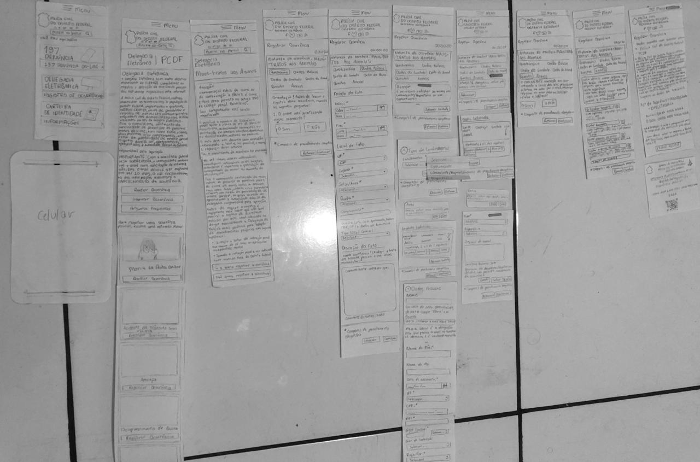
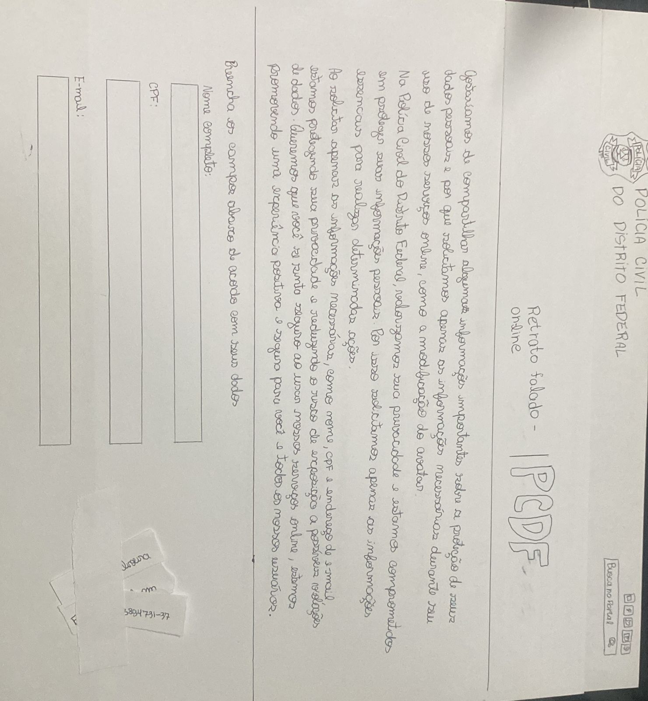
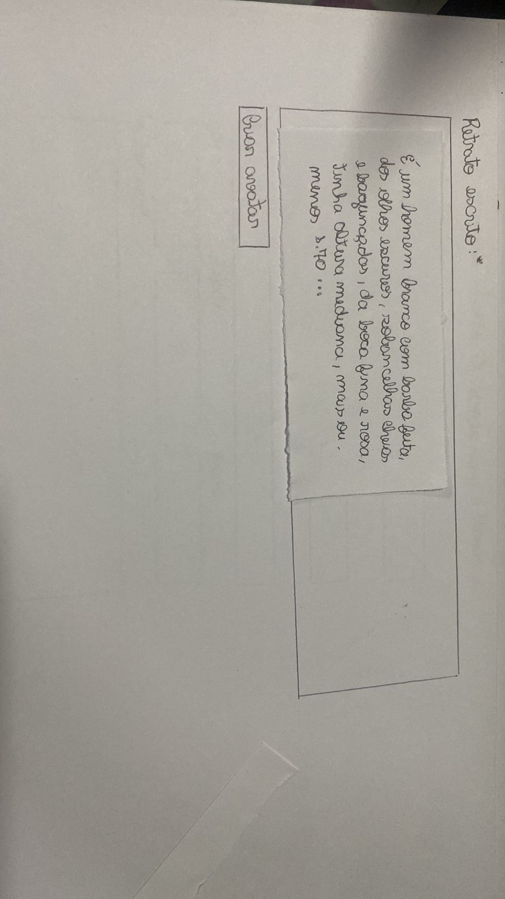
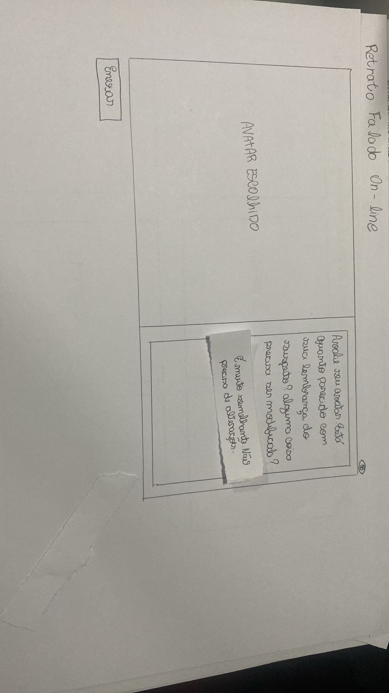

## Introdução
O método de prototipagem em papel oferece uma maneira eficiente de avaliar a usabilidade de um design de Interação Humano-Computador (IHC) por meio de simulações de uso com potenciais usuários. Esta abordagem é rápida e econômica, permitindo identificar problemas de usabilidade antes de investir na construção de uma solução executável. É especialmente útil para avaliar soluções parciais e de baixa a média fidelidade, possibilitando ajustes antes de finalizar todos os detalhes da interface.

A Avaliação de Interação Humano-Computador (IHC) desempenha um papel fundamental no desenvolvimento de sistemas interativos, visando garantir a qualidade da interação entre usuários e interfaces digitais. Neste contexto, os prototipo de papel surge como uma ferramenta valiosa para representar visualmente os cenários de interação, facilitando a compreensão dos fluxos de atividades e a identificação de possíveis melhorias. Este documento apresenta os prototipos de papel que retratam as tarefas do site do PCDF.

## Objetivo
O objetivo deste documento é registrar os prototipos de papel feitos por cada integrante do grupo 04.

## Metodologia
A metodologia adotada consiste na elaboração de prototipos de papel feitos pelos integrantes do grupo, com base nos principios gerais  previamente definidos. Cada integrante ficará responsável por desenvolver um prototipo de papel que represente uma funcionalidade realizada por um usuário no contexto do sistema do PCDF.

## Funcionalidades Tratadas nos prototipos de papel

    Tabela que monstra quais funcionalidades vão ter prototipo de papel
 Funcionalidade    |    Integrante Responsável             |  
|:------:|:-------------------------------:|
|Pesquisar Procurados|Lara|  
| Solicitar Antecedentes Criminais | Renata |
| 197- Denúncia Online   | Giovana          |
| Solicitar Carteira de Identidade| Raissa
| Registrar Ocorrência | Rayene |
|Retrato Falado Online|Renata|

## Tarefa 1: Pesquisar procurados 

    
 Figura 1
         
  
Fonte: <a href="https://github.com/gravelylara">Lara</a>

    
 

    
 Figura 2 
         
  
Fonte: <a href="https://github.com/gravelylara">Lara</a>

    
 

## Tarefa 2: Solicitar Antecedentes Criminais
No protótipo em papel de solicitar antecedentes criminais o entrevistado deve selecionar o “serviço” e escolher a opção de “Antecedentes criminais”. Sendo assim, deve informar o e-mail e inserir o código de verificação. Após isso, o formulário é aberto e são inseridas as informações pessoais e aparece uma mensagem de confirmação após o envio do formulário com um código de acompanhamento, como monstrado na figura 3 a 11. O teste piloto é encontrado logo abaixo. 

<iframe width="560" height="315" src="https://www.youtube.com/embed/1yyfp6XTy6k " title="YouTube video player" frameborder="0" allow="accelerometer; autoplay; clipboard-write; encrypted-media; gyroscope; picture-in-picture; web-share" referrerpolicy="strict-origin-when-cross-origin" allowfullscreen></iframe>

<a href="https://youtu.be/1yyfp6XTy6k " target="blanket">Vídeo do teste piloto - Solicitar Antecedentes - Renata </a>

    
 Figura 3: Inicio do site da PCDF.
        
  
Fonte:  <a href="https://github.com/Renatinha28">Renata</a>

    
 

    
 Figura 4: Aba serviços.
         
  
Fonte:  <a href="https://github.com/Renatinha28">Renata</a>

    
 

    
 Figura 7: e-mail.
         
  
Fonte:  <a href="https://github.com/Renatinha28">Renata</a>

    
 

    
 Figura 6: código de confirmação.
         
  
Fonte:  <a href="https://github.com/Renatinha28">Renata</a>

    
 

    
 Figura 8: orientação.
         
  
Fonte:  <a href="https://github.com/Renatinha28">Renata</a>

    
 

    
 Figura 9: formulário.
         
  
Fonte:  <a href="https://github.com/Renatinha28">Renata</a>

    
 

    
 Figura 10: formulário preenchido.
        
  
Fonte:  <a href="https://github.com/Renatinha28">Renata</a>

    
 

    
 Figura 11: confirmação do envio.
         
  
Fonte:  <a href="https://github.com/Renatinha28">Renata</a>

    
 

## Tarefa 3: Denúncia Online
Para solicitar uma denúncia Online no site da PCDF, deve ir na aba serviços clicar em "197-Denúncia Online", que vai ser levado para uma nova aba onde deve escolher o tipo de denúncia, depois você deve preencher o formulário como explicado nas imagens 3 a 7.

    
 Figura 12: Inicio do site da PCDF.
        
  
Fonte: <a href="https://github.com/gio221">Giovana Barbosa</a>

    
 

    
 Figura 13: Aba de serviços. 
         
  
Fonte: <a href="https://github.com/gio221">Giovana Barbosa</a>

    
 

    
 Figura 14: Aba de denuncia online. 
         
  
Fonte: <a href="https://github.com/gio221">Giovana Barbosa</a>

    
 

    
 Figura 15: Aba de formularios. 
         
  
Fonte: <a href="https://github.com/gio221">Giovana Barbosa</a>

    
 

    
 Figura 16: Aba de formularios. 
         
  
Fonte: <a href="https://github.com/gio221">Giovana Barbosa</a>

    
 

## Tarefa 4: Solicitar carteira de identidade 
    Print que descreve passos para solicitar carteira 

     Página Inicial - 1
 

Fonte: [Raissa Andrade](https://github.com/RaissaAndradeS), 2024

    Página 2 - Opções
 

Fonte: [Raissa Andrade](https://github.com/RaissaAndradeS), 2024

    Página 3 - Passos
 

Fonte: [Raissa Andrade](https://github.com/RaissaAndradeS), 2024

    Página 4 - Escolhas
 

Fonte: [Raissa Andrade](https://github.com/RaissaAndradeS), 2024

    Página 5 - Informações
 

Fonte: [Raissa Andrade](https://github.com/RaissaAndradeS), 2024

    Página 6 - Dados

 

Fonte: [Raissa Andrade](https://github.com/RaissaAndradeS), 2024

    Página 7 - Confirmação

Fonte: [Raissa Andrade](https://github.com/RaissaAndradeS), 2024

## Tarefa 5: Registrar Ocorrência 

Neste protótipo de registro de ocorrência online, onde o site é acessado pelo celular,  o usuário começa na tela inicial e encontra o serviço, após isso é redirtecionado para diferentes telas de termo de consentimento, natureza dos crimes e uma para cada formulario de dados tanto de envolvidos como de acontecimento até a fase final em que recebe um comprovante do registro realizado que possui um código e um QRcode.

    
 Figura 24: Telas Registro de Ocorrência.Fonte:
        <a href="https://github.com/rayenealmeida">Rayene Almeida</a>
    
 

## Tarefa 6: Fazer um retrato falado de forma online
Nesse protótipo de Retrato falado on-line, o entrevistado deve ir em “serviços” e selecionar a opção de “Retrato falado on-line”. Feito isto, irá aparecer uma mensagem explicando o porquê são pedidas algumas informações pessoas e o entrevistado deve inserir seus dados pessoais como nome, cpf e e-mail, além das informações da denúncia e descrição do suspeito. Com isso, o usuário deve escolher um avatar, ajusta-lo como necessário e salvar as alterações. Logo, deve abrir uma página com o avatar selecionado com um texto para o usuário descrevê-lo de acordo com sua lembrança. Após o envio, uma mensagem de confirmação com as informações necessárias aparecerá. O protótipo desta tarefa está na figura 25 a 37. O teste piloto é mostrado logo abaixo.

<iframe width="560" height="315" src="https://www.youtube.com/embed/mEKgVAO0Vqg" title="YouTube video player" frameborder="0" allow="accelerometer; autoplay; clipboard-write; encrypted-media; gyroscope; picture-in-picture; web-share" referrerpolicy="strict-origin-when-cross-origin" allowfullscreen></iframe>

<a href="https://www.youtube.com/watch?v=mEKgVAO0Vqg" target="blanket">Vídeo do teste piloto - Retrato Falado - Renata </a>

    
 Figura 25: Aba inicial do PCDF. 
           
  
Fonte:  <a href="https://github.com/Renatinha28">Renata</a>

    
 

    
 Figura 26: Aba de "serviços". 
             
  
Fonte:  <a href="https://github.com/Renatinha28">Renata</a>

    
 

    
 Figura 27: Aba do Retrato Falado on-line - informações pessoais. 
          
  
Fonte:  <a href="https://github.com/Renatinha28">Renata</a>

    
 

    
 Figura 28: Aba do Retrato Falado on-line preenchido - informações pessoais. 
          
  
Fonte:  <a href="https://github.com/Renatinha28">Renata</a>

    
 

    
 Figura 29: Aba do Retrato Falado on-line - informações da denúncia. 
           
  
Fonte:  <a href="https://github.com/Renatinha28">Renata</a>

    
 

    
 Figura 30: Aba do Retrato Falado on-line preenchido - informações da denúncia.
           
  
Fonte:  <a href="https://github.com/Renatinha28">Renata</a>

    
 

    
 Figura 31: Aba do Retrato Falado on-line - informações do suspeito.
           
  
Fonte:  <a href="https://github.com/Renatinha28">Renata</a>

    
 

    
 Figura 32: Aba do Retrato Falado on-line preenchido - informações do suspeito.
          
  
Fonte:  <a href="https://github.com/Renatinha28">Renata</a>

    
 

    
 Figura 33: Aba do Retrato Falado on-line - seleção do retrato falado.
           
  
Fonte:  <a href="https://github.com/Renatinha28">Renata</a>

    
 

    
 Figura 34: Aba do Retrato Falado on-line - alteração no retrato selecionado.
          
  
Fonte:  <a href="https://github.com/Renatinha28">Renata</a>

    
 

    
 Figura 35:  Aba do Retrato Falado on-line - seleção do retrato falado.
           
  
Fonte:  <a href="https://github.com/Renatinha28">Renata</a>

    
 

    
 Figura 36: Aba do Retrato Falado on-line preenchido - seleção do retrato falado.
           
  
Fonte:  <a href="https://github.com/Renatinha28">Renata</a>

    
 

    
 Figura 37: Aba do Retrato Falado On-line - confirmação. 
            
  
Fonte:  <a href="https://github.com/Renatinha28">Renata</a>

    
 

## Bibliografia
> BARBOSA, Simone; SILVA, Bruno. Interação Humano Computador. 1. ed. Rio de Janeiro: Elsevier, 2010.

## Histórico de Versões
      Tabela que descreve o Histórico de Versões

|     Versão       |     Descrição      |      Autor(es)      | Data           |  Revisor(es)          |Data de revisão|
| :----------------------------------------------------------: | :-------------------------------: | :-------------------------------------------------: | :-------------------------------: |  :-------------------------------: | :-------------------------------: |
| 1.0 | Criação do documento |[ Giovana Barbosa ](https://github.com/gio221) | 09/06 | [Raissa Andrade](https://github.com/RaissaAndradeS)| 16/06| 
|1.1|Correções de chamadas e fontes de imagens|[Raissa Andrade](https://github.com/RaissaAndradeS)| 08/07|[Giovana Barbosa](https://github.com/gio221)    |08/07