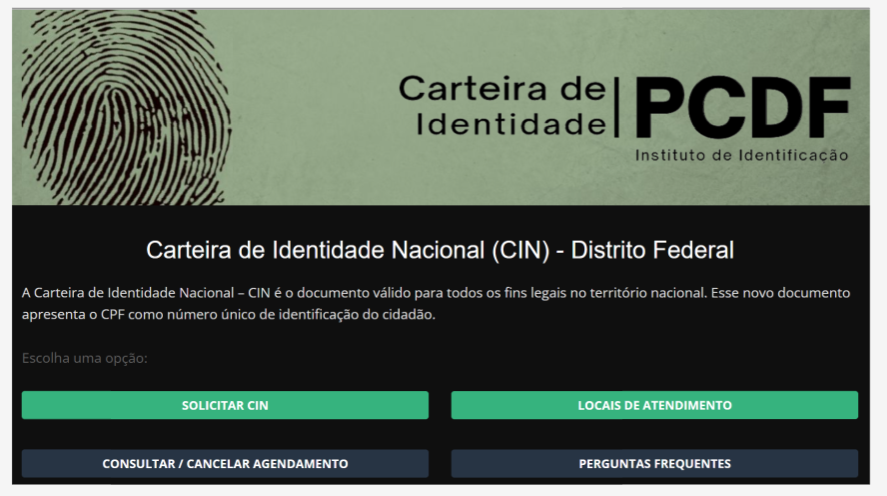
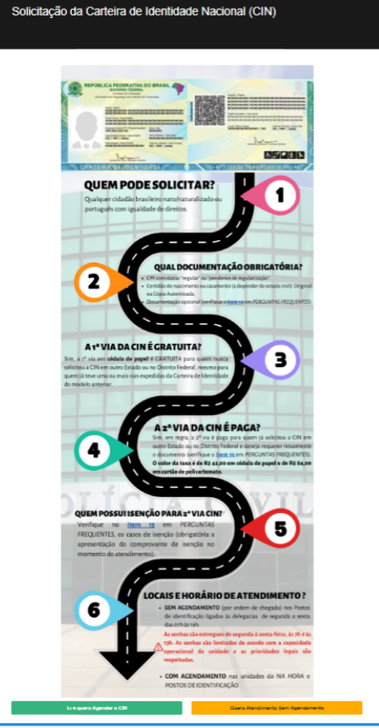
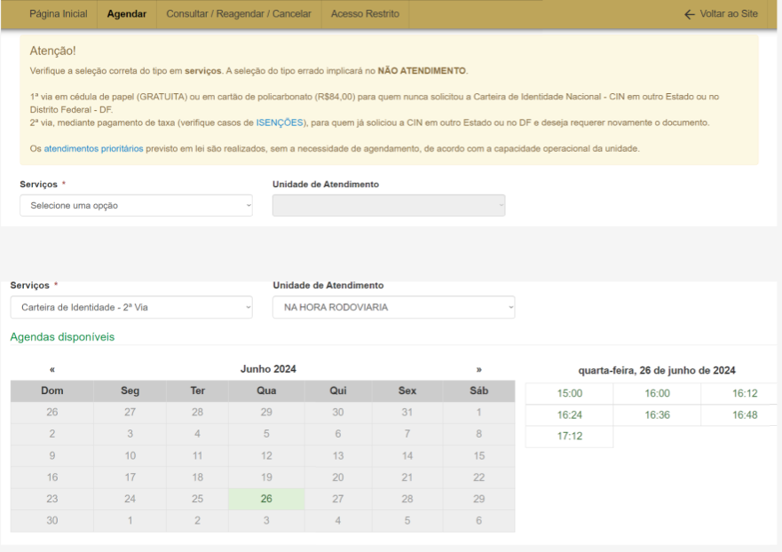
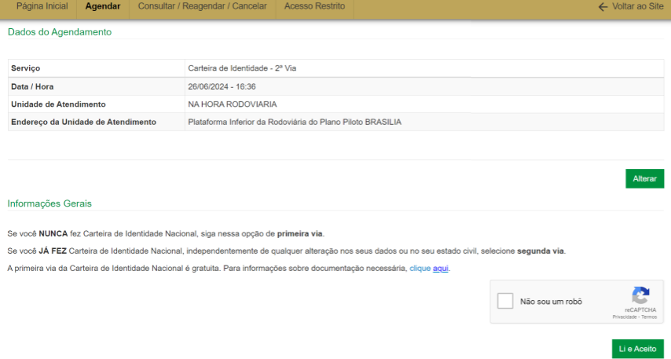
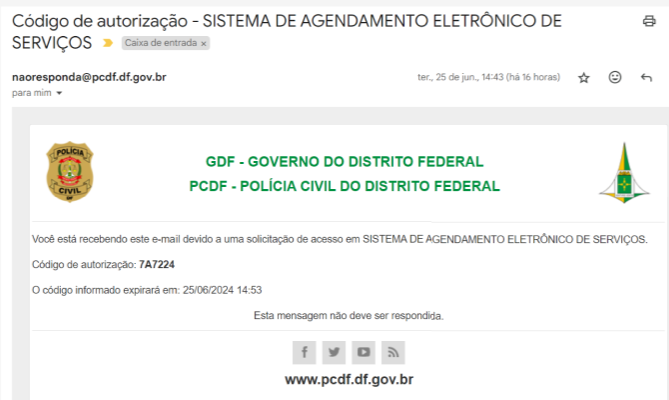
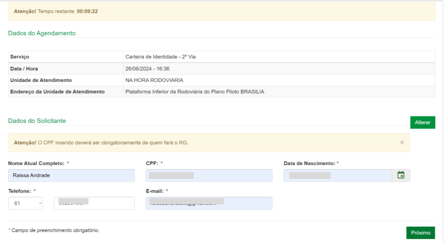

## Introdução
O protótipo de alta fidelidade serve para simular de forma bastante realista a experiência do usuário antes do desenvolvimento final. Esse artefato tem como objetivo mostrar o desenvolvimento do protótipo de alta fidelidade da página de carteira de identidade da PCDF. 

## Objetivo 
O objeitvo desse documento é mostrar o protótipo de alta fidelidade de solicitar carteira de identidade.

## Metodologia
Depois da representação do protótipo de baixa fidelidade, com base nele, fizemos o protótipo de alta fidelidade, seguindo também o livro de Barbosa. 

## Protótipo de Alta Fidelidade de Solicitar Carteira de Identidade 

Fonte: [Raissa Andrade](https://github.com/RaissaAndradeS)

Fonte: [Raissa Andrade](https://github.com/RaissaAndradeS)

Fonte: [Raissa Andrade](https://github.com/RaissaAndradeS)

Fonte: [Raissa Andrade](https://github.com/RaissaAndradeS)

Fonte: [Raissa Andrade](https://github.com/RaissaAndradeS)

Fonte: [Raissa Andrade](https://github.com/RaissaAndradeS)

Fonte: [Raissa Andrade](https://github.com/RaissaAndradeS)

Fonte: [Raissa Andrade](https://github.com/RaissaAndradeS)

## Referências Bibliográficas 

> BARBOSA, S.D.J.; SILVA, B.S. Interação Humano-Computador. Editora Campus-Elsevier, 2010.

## Histórico de Versões 

        Tabela 6 que descreve o Histórico de Versões
|     Versão       |     Descrição      |      Autor(es)      | Data           |  Revisor(es)          |Data de revisão|
| :----------------------------------------------------------: | :-------------------------------: | :-------------------------------------------------: | :-------------------------------: |  :-------------------------------: | :-------------------------------: |
| 1.0 | Protótipo de alta fidelidade  | [Raissa Andrade](https://github.com/RaissaAndradeS)   |  01/07 |[ Rayene Almeida ](https://github.com/rayenealmeida) | 01/07|