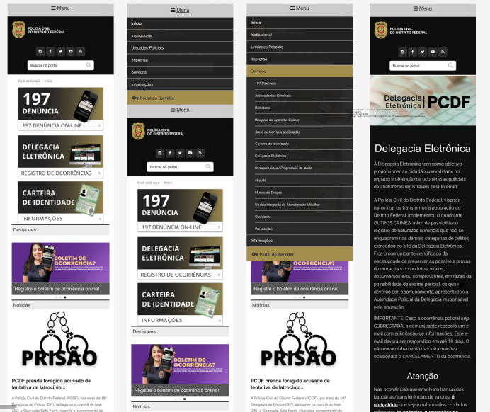
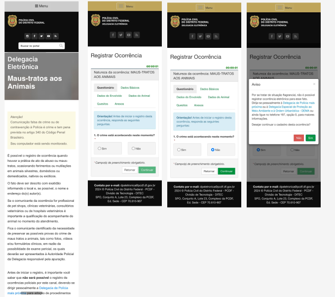
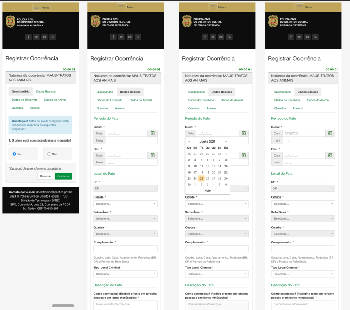
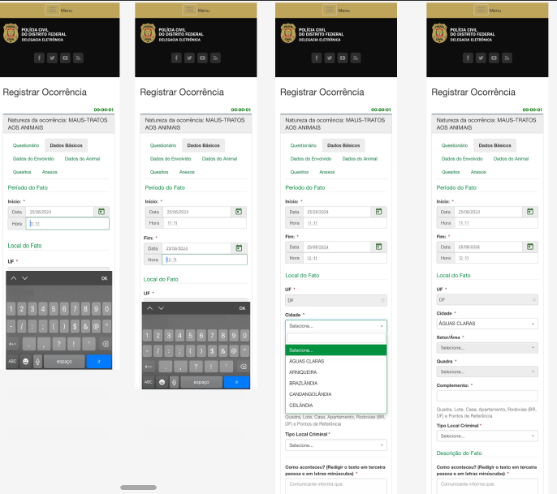
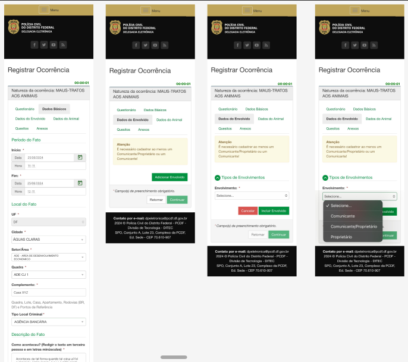
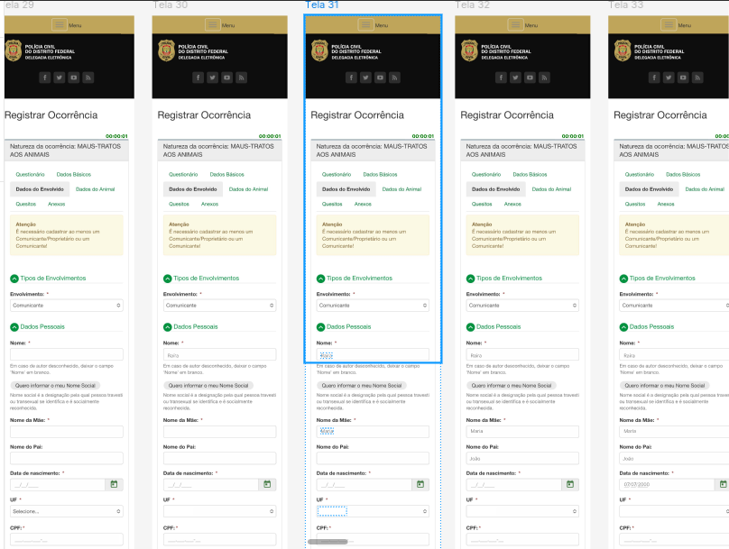
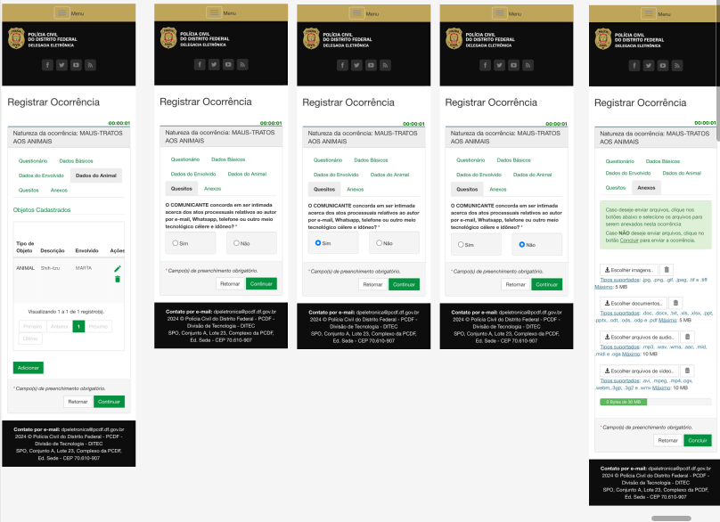

## Introdução
No presente documento é visível o desenvolvimento do protótipo de alta fidelidade para o projeto do site da PCDF. O protótipo da funcionalidade do registro de ocorrência assim como o presente documento etá sob a responsabilidade da integrante [ Rayene Almeida ](https://github.com/rayenealmeida). Ele se refere ao fluxo da funcionalidade do site da PCDF em que possui representações mais próximas do site do que o protótipo de papel.

## Objetivo
O objetivo deste documento é apresentar o protótipo de alta fidelidade da funcionalidade de Registrar ocorrência e analisar.

## Metodologia
O protótipo de alta fidelidade foi desenvolvido com base no protótipo de baixa fidelidade, que seguiu os princípios do Guia de Estilo conforme sugerido por Simone Barbosa. Esse protótipo foi criado para atender às necessidades dos usuários identificadas no relatório de avaliação do protótipo de baixa fidelidade.

Utilizando a ferramenta Figma, ideal para o desenvolvimento e prototipação de telas, foram elaborados 6 prototipos de alta fidelidade, de acordo com as funcionalidades do site 

## Prototipo de Alta Fidelidade de Registrar Ocorrência
Logo abaixo encontra-se o prototipo do figma e as imagens 1 a 8 está representando figuras do protótipo.

### Prototipo no Figma

<figure markdown>
  <iframe style="border: 1px solid rgba(0, 0, 0, 0.1);" width="800" height="450" src="https://www.figma.com/embed?embed_host=share&url=https%3A%2F%2Fwww.figma.com%2Fproto%2FVqQmpV62girqgINmRSnLz9%2FProt%25C3%25B3tipo-de-Alta-Fidelidade%3Fnode-id%3D8-256%26starting-point-node-id%3D8%253A187%26scaling%3Dscale-down%26content-scaling%3Dfixed%26t%3DXGpFPfO9pwgQc7G7-1" allowfullscreen></iframe>
  <figcaption markdown style="text-align: center">

    Fonte: Rayene Almeida, 2024.
  </figcaption>
</figure>

[Veja o protótipo no Figma](https://www.figma.com/proto/VqQmpV62girqgINmRSnLz9/Prot%C3%B3tipo-de-Alta-Fidelidade?node-id=8-187&t=n7j89NBd65QYUVdG-1&scaling=min-zoom&content-scaling=fixed&page-id=0%3A1&starting-point-node-id=8%3A187)

    
 Figura 1: Primeiras Telas.
        
  
Fonte: <a href="https://github.com/rayenealmeida">Rayene Almeida</a>

    
 

    
 Figura 2: Telas Protótipo Registrar Ocorrência.
        
  
Fonte: <a href="https://github.com/rayenealmeida">Rayene Almeida</a>

    
 

    
 Figura 3: Telas Protótipo Registrar Ocorrência.
        
  
Fonte: <a href="https://github.com/rayenealmeida">Rayene Almeida</a>

    
 

    
 Figura 4: Telas Protótipo Registrar Ocorrência.
        
  
Fonte: <a href="https://github.com/rayenealmeida">Rayene Almeida</a>

    
 

    
 Figura 5: Telas Protótipo Registrar Ocorrência.
        
  
Fonte: <a href="https://github.com/rayenealmeida">Rayene Almeida</a>

    
 

    
 Figura 6: Telas Protótipo Registrar Ocorrência.
        
  
Fonte: <a href="https://github.com/rayenealmeida">Rayene Almeida</a>

    
 

    
 Figura 7: Telas Protótipo Registrar Ocorrência.
        
  
Fonte: <a href="https://github.com/rayenealmeida">Rayene Almeida</a>

    
 

    
 Figura 8: Telas Protótipo Registrar Ocorrência.
        
  
Fonte: <a href="https://github.com/rayenealmeida">Rayene Almeida</a>

    
 

## Bibliografia
> BARBOSA, Simone; SILVA, Bruno. Interação Humano Computador. 1. ed. Rio de Janeiro: Elsevier, 2010.

## Histórico de Versões
      Tabela que descreve o Histórico de Versões

|     Versão       |     Descrição      |      Autor(es)      | Data           |  Revisor(es)          |Data de revisão|
| :----------------------------------------------------------: | :-------------------------------: | :-------------------------------------------------: | :-------------------------------: |  :-------------------------------: | :-------------------------------: |
| 1.0 | Criação do documento |[ Rayene Almeida ](https://github.com/rayenealmeida) | 01/07|[Giovana Barbosa](https://github.com/gio221)    |08/07|