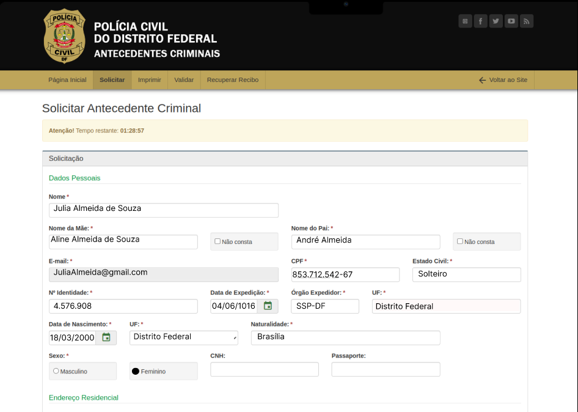
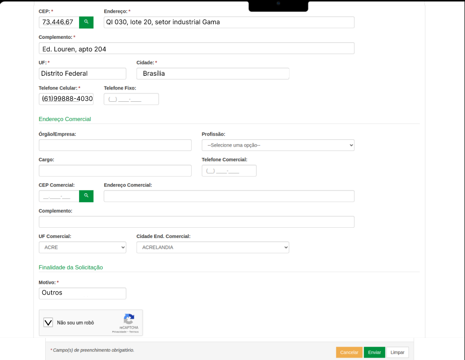
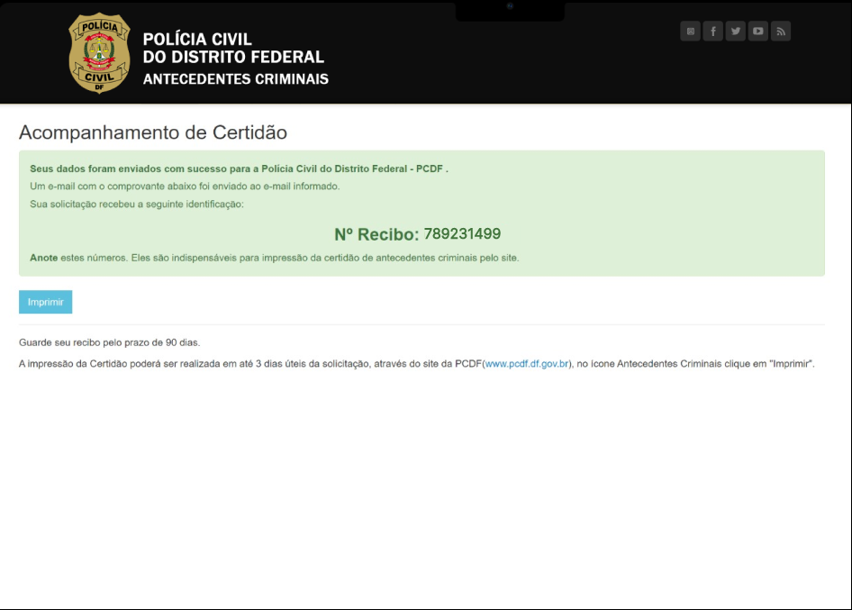

## Introdução
A  elaboração de um protótipo de alta fidelidade é uma etapa crucial no processo de design de interfaces, proporcionando uma representação detalhada e interativa do produto final. Este documento apresenta o protótipo de alta fidelidade desenvolvido para o pjojeto de IHC do semestre de 2024.1, utilizando a plataforma Figma. O objetivo principal deste protótipo é validar a usabilidade, funcionalidade e o design visual antes da implementação final, garantindo que todas as partes interessadas possam visualizar e interagir com uma versão quase real do produto.

## Objetivo
O objetivo deste documento é relatar o protótipo de alta fidelidade da tarefa Solicitar Antecedentes feito pela integrante [Renata Quadros](https://github.com/Renatinha28).

## Meotodologia
Utilizamos exclusivamente o Figma para criar um protótipo de alta fidelidade. Começamos com a definição de requisitos, desenvolvemos wireframes de baixa fidelidade, aplicamos o design visual detalhado, construímos um protótipo interativo no Figma, realizamos testes de usabilidade e finalizamos com rum teste piloto antes da implementação final.

## Protótipo de Alta Fidelidade: Solicitar Antecedentes Criminais
O protótipo é mostrado da figura 1 até 8.

    
 Figura 1: página inicial da PCDF.
         
  
Fonte:  <a href="https://github.com/Renatinha28">Renata</a>

    
 

    
 Figura 2: página inicial de solicitar antecedentes.
         
  
Fonte:  <a href="https://github.com/Renatinha28">Renata</a>

    
 

    
 Figura 3: e-mail.
         
  
Fonte:  <a href="https://github.com/Renatinha28">Renata</a>

    
 

    
 Figura 4: confirmação com código.
         
  
Fonte:  <a href="https://github.com/Renatinha28">Renata</a>

    
 

    
 Figura 5: formulário.
         
  
Fonte:  <a href="https://github.com/Renatinha28">Renata</a>

    
 

    
 Figura 6: formulário.
         
  
Fonte:  <a href="https://github.com/Renatinha28">Renata</a>

    
 

    
 Figura 7: confirmação do envio.
         
  
Fonte:  <a href="https://github.com/Renatinha28">Renata</a>

    
 

    
 Figura 8: feedback.
         
  
Fonte:  <a href="https://github.com/Renatinha28">Renata</a>

    
 

## Bibliografia
> BARBOSA, Simone; SILVA, Bruno. Interação Humano Computador. 1. ed. Rio de Janeiro: Elsevier, 2010.

> https://www.figma.com/files/team/1370083063980690022/recents-and-sharing/recently-viewed?fuid=1370082251525688876

## Histórico de Versões
      Tabela que descreve o Histórico de Versões

|     Versão       |     Descrição      |      Autor(es)      | Data           |  Revisor(es)          |Data de revisão|
| :----------------------------------------------------------: | :-------------------------------: | :-------------------------------------------------: | :-------------------------------: |  :-------------------------------: | :-------------------------------: |
| 1.0 |  Protótipo de alta fidelidade |[Renata Quadros](https://github.com/Renatinha28) | 01/07 | [ Rayene Almeida ](https://github.com/rayenealmeida) | 01/07|