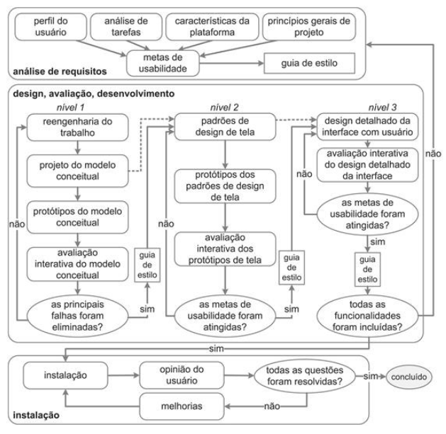

## Introdução
O ciclo de vida em Interação Humano-Computador (IHC) refere-se ao conjunto de fases ou etapas pelas quais um projeto de design de interface passa, desde a concepção até a implementação e avaliação. Essas fases são destinadas a garantir que a interface seja desenvolvida de maneira eficiente e atenda às necessidades e expectativas dos usuários. Durante a disciplina, foram estudados o Ciclo de Vida Simples, o Ciclo de Vida em Estrela, a Engenharia de Usabilidade de Nielsen e a Engenharia de Usabilidade de Mayhew, que foram devidamente documentados no artefato Processo de Design.

## Objetivo
O objetivo deste documeto é relatar o ciclo de vida utilizado no projeito e a justificativa pela escolha. O artefato foi feito pela integrante [Renata Quadros](https://github.com/Renatinha28).

## Metodologia
A metodologia utilizada é mostrada na figura 1, o ciclo de vida de Mayhew, explicado logo a seguir.

 Figura 1: Ciclo de Engenharia de Usabilidade de Mayhew
 

## Ciclo de Vida de Mayhew
Neste projeto, escolhemos utilizar o Ciclo de Vida de Mayhew. Deborah Mayhew (1999) propôs um ciclo de vida para a engenharia de usabilidade, que é um processo de design holístico para criar soluções interativas de alta qualidade. O ciclo de vida é composto por três fases: análise de requisitos, design/avaliação/desenvolvimento e instalação, detalhadas a seguir.

- Análise de Requisitos
Na fase de análise de requisitos, as metas de usabilidade são definidas com base no perfil dos usuários, análise de tarefas, plataforma de execução e princípios de design de IHC. Essas metas são frequentemente documentadas em "Análise de Requisitos I e II" para orientar o processo.

- Design, Avaliação e Desenvolvimento
A fase de design, avaliação e desenvolvimento concentra-se em criar uma solução de IHC que atenda às metas de usabilidade. Isso envolve três níveis de detalhes: reengenharia das tarefas, prototipagem de baixa e média fidelidade, estabelecimento de padrões de design e design detalhado da interface. Durante o desenvolvimento, a interface é avaliada com a participação dos usuários. Essa parte é descrita em "Design, Avaliação e Desenvolvimento"

- Instalação
Na fase de instalação, feedback dos usuários após o uso é coletado para melhorar o sistema em versões futuras ou considerar o desenvolvimento de novos sistemas interativos. Esse ciclo de vida visa garantir que a usabilidade seja uma prioridade ao longo de todo o processo de desenvolvimento de um sistema interativo.

## Motivo de Escolha
Optamos pelo Ciclo de Mayhew como nosso Ciclo de Vida por diversas razões fundamentais:

- Abordagem Abrangente: Esse ciclo aborda todas as fases de um projeto de IHC, garantindo que a usabilidade e a experiência do usuário sejam consideradas em todos os estágios do processo.

- Iteratividade e Flexibilidade: O Ciclo de Mayhew é conhecido por ser iterativo e flexível, permitindo ajustes com base em novos insights ao longo do caminho.

- Detalhamento Adequado: Fornece uma quantidade adequada de detalhes em cada etapa do processo, auxiliando na compreensão e na implementação das melhores práticas de design de IHC.

## Conclusão
O Ciclo de Vida de Mayhew foi escolhido por sua abordagem detalhada, iterativa e flexível, adequada para uma equipe com pouca experiência em IHC. Ao longo de todo o ciclo de vida, a interação entre as fases do projeto é enfatizada, permitindo uma abordagem colaborativa e iterativa, garantindo que o design evolua de acordo com as necessidades dos usuários e que o software final seja usável e eficiente.

## Bibliografia
> Barbosa, S. D. J.; Silva, B. S. da; Silveira, M. S.; Gasparini, I.; Darin, T.; Barbosa, G. D. J (2021) 

## Histórico de Versões

|     Versão       |     Descrição      |      Autor(es)      | Data           |  Revisor(es)          |Data de revisão|
| :----------------------------------------------------------: | :-------------------------------: | :-------------------------------------------------: | :-------------------------------: |  :-------------------------------: | :-------------------------------: |
| 1.0 | Ciclo de Vida | [Renata Quadros](https://github.com/Renatinha28)   | 04/07 |   [Giovana Barbosa](https://github.com/gio221)  | 05/07|