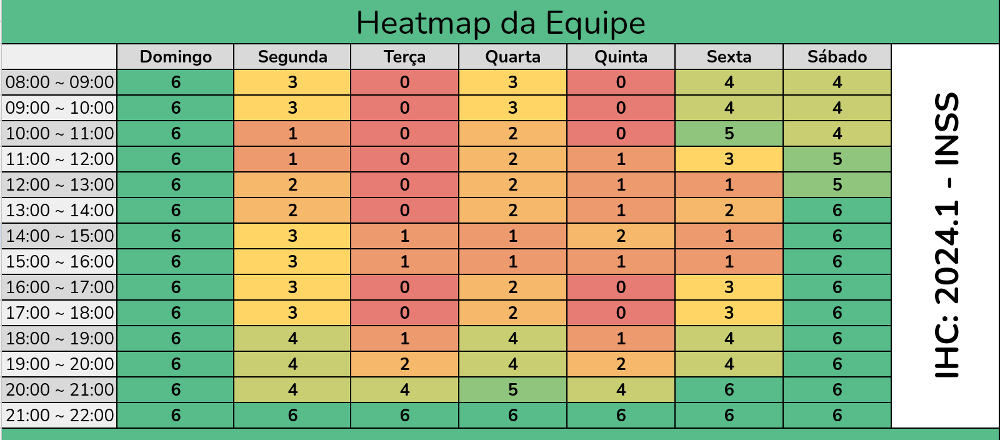

# **HeatMap**

## Introdução
O Heatmap de Disponibilidade do Time é uma ferramenta visual que nos permite entender a disponibilidade dos membros da equipe para participar de reuniões ou outras atividades em grupo. Ele é preenchido com informações de disponibilidade fornecidas por cada membro da equipe, mostrando claramente os horários em que cada pessoa está disponível. Ao analisar o heatmap, podemos identificar padrões de disponibilidade ao longo do tempo. Isso nos ajuda a agendar reuniões em horários que sejam convenientes para a maioria dos membros da equipe, minimizando conflitos e garantindo a participação de todos.

## Objetivo
Esse artefato tem como objetivo documentar o heatmap 

## Metodologia
A metodologia foi a de coleta de dados, cada integrante completou com os horarios ocupados e livres e conseguimos montar um em que podemos basear nossos horarios de reuniões

## Heatmap do Time
      Tabela 1- Tabela do Heatmap

 Figura 1 - Heatmap do Grupo 4. Fonte: Autores 
 

## Resultados da Análise de Disponibilidade
Considerando as diversas agendas e compromissos dos membros da equipe, optamos por realizar nossas reuniões principais de planejamento e revisão de forma virtual, proporcionando flexibilidade e acessibilidade a todos os envolvidos. Essas reuniões serão realizadas às:
- **Quartas-feiras**: 20:00 às 21:00,
- **Sextas-feiras**: 10:00 às 12:00,
- **Sábados**: 14:00 às 15:00.

## Organização das Reuniões e método

O método escolhido para gerenciar nosso projeto é o Scrum. O Scrum é uma estrutura de desenvolvimento ágil amplamente utilizada na gestão de projetos de software e em outras áreas onde a agilidade e a colaboração são fundamentais. Será baseado nela as reuniões de planejamento e revisão e os dailys.

- **Reuniões de Planejamento (Planning)**: Quartas-feiras, das 20:00 às 21:00.
- **Reuniões de Revisão (Review)**: Sábados, das 14:00 às 15:00.
- **Dailys Assíncronas**: Atualizações diárias de forma assíncrona, permitindo flexibilidade aos membros da equipe.

## Bibliografia
[Google planilhas ](https://docs.google.com/spreadsheets/d/1-f5IZgH8TP62LMIYTtS3V4iItvkGhwRnNfNDbIRDzP8/edit#gid=96807035)  Acesso em: 06 de Abril de 2024.

## **Histórico de Versões**
 
      Tabela que descreve o Histórico de Versões
| Versão |          Descrição              |     Autor(es)      |      Data      |   Revisor(es)     |    Data de revisão    |  
|:------:|:-------------------------------:|:--------------:|:--------------:|:-------------:|:---------------------:|
|  1.0   | Versão Inicial                    |   [Rayene Almeida](https://github.com/rayenealmeida)      |   06/04   |       [Giovana Barbosa ](https://github.com/gio221), [Renata Quadros](https://github.com/Renatinha28)        |     06/04                 |
|  1.1   | Correção pós entrega                   |   [Rayene Almeida ](https://github.com/rayenealmeida)      |   09/04   |    [Giovana Barbosa ](https://github.com/gio221) , [Renata Quadros](https://github.com/Renatinha28)           |      13/04           |
|  1.2  | Adicionando objetivo e metodologia                  |     [Giovana Barbosa ](https://github.com/gio221) |07/07| [Renata Quadros](https://github.com/Renatinha28)           |     07/07          |
|  1.3  | Chamando tabelas no texto                 |     [Giovana Barbosa ](https://github.com/gio221) |08/07| [Renata Quadros](https://github.com/Renatinha28)           |     08/07          |