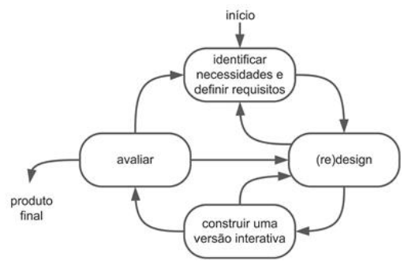
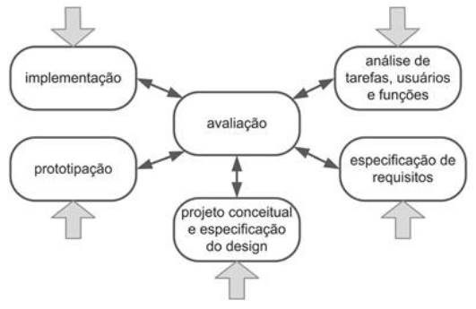
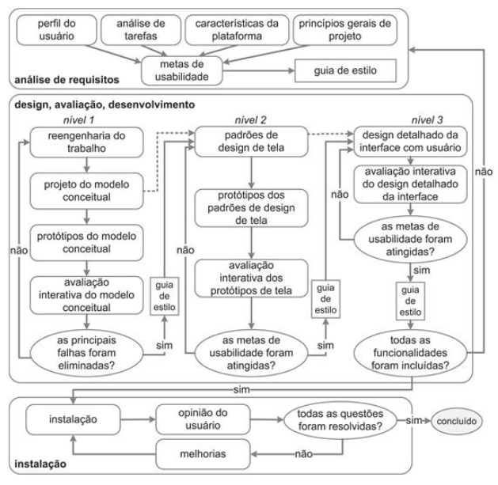

## Introdução
A atividade de design, segundo Lawson(2006) e Lowgren e Stolterman(2007) consiste em três atividades, que envolvem análise da situação atual, síntese de uma intervenção e a avaliação da nova situação. Sendo assim, cada uma dessas atividades podem se organizar de diferentes maneiras, no que chamamos processos de design.

Em "Interação humano-computador", capítulo quatro, são apresentados alguns desses processos. Os autores citam o Ciclo De Vida Em Estrela, Engenharia De Usabilidade De Nielsen, Engenharia De Usabilidade De Mayhew, Design Contextual, Design Baseado Em Cenários e o Design Dirigido Por Objetivos.
Esses processos definem como as etapas se organizam, e qual o produto a ser entregue ao fim de cada etapa (artefatos).
Alguns dos processos a serem escolhidos pela equipe foram:

## Objetivo
Esse artefato tem como objetivo documentar o processo de design escolhido pelo grupo

## metodologia
A metodologia ultilizada foi a de coleta de dados, a integrante Lara recolheu quais processos de design poderia ser ultilizado, e o grupo escolheu um no final

## Processo de Design Simples

O processo de design simples é uma abordagem para criar soluções de design de forma eficiente e direta, concentrando-se nos princípios fundamentais do design e na resolução de problemas de maneira clara e concisa. Por ser um processo simples, qualque pessoas mesmo sem muita experiência pode utilizá-lo. Entretanto, também por ser simples e não muito detalhado, indivíduos não muito experientes poderão encontrar dificuldades nos artefatos a serem produzidos. Na figura 1 temos o diagrama do Ciclo de Vida Simples.

 Figura 1: Ciclo de Vida Simples 
 

# Ciclo de Vida em Estrela

O modelo de Ciclo de Vida Estrela foi proposto em 1989 por Hartson e Hix e é composto por seis atividades: análise de tarefas, especificação de requisitos, projeto conceitual e formal, prototipação, implementação e avaliação. Este modelo privilegia a liberdade no começo do processo de design, pois permite que o processo de design tenha início em qualquer uma dessas etapas, o que pode ser ruim para indivíduos pouco experientes, por não serem muito detehadas as tarefas. "A atividade de avaliação aparece no modelo como central, e é de fato desdobrada na avaliação dos resultados de cada uma das demais atividades"(Barbosa e Silva, 2010). Na figura 2 temos um diagrama de como funciona o Ciclo de Vida em Estrela.

 Figura 2: Ciclo de Vida em Estrela
 

# Engenharia de Usabilidade de Nielsen

Nielsen (1993) propõe um conjunto de atividades (dez, no total) que devem ocorrer durante todo o ciclo de vida do produto como um processo de design, e defende que muitas das etapas ocerrerão no início de cada projeto, antes que a interface em si seja concretizada. São elas:
1. Conheça seu usuário
2. Realize uma análise competitiva
3. Defina as metas de usabilidade
4. Faça designs paralelos
5. Adote o design participativo
6. Faça o design coordenado da interface como um todo
7. Aplique diretrizes e análise heurística
8. Faça protótipos
9. Realize testes empíricos
10. Pratique design iterativo

# Engenharia de Usabilidade de Mayhew

Este modelo, proposto por Deborah Mayhwew, orienta indíviduos com um conjunto de tarefas num fluxo de controle com três fases principais: análise de
requisitos, design/avaliação/desenvolvimento e instalação. Nesse processo as atividades são bem detalhadas e possuem perguntas (passos de validação) no fluxo de controle geral, importantes para validação de cada um dos artefatos. O que é bom para indivíduos menos experientes. Na figura 3 temos um exemplo da engenharia de usabilidade de Mayhew.

 Figura 3: Ciclo de Engenharia de Usabilidade de Mayhew
 

# Processo de design definido para o projeto

Pelo detalhamento do processo de design de Mayhew, a equipe optou por utilizá-lo. Já que é um processo detalhado suficientemente bem para guiar indivíduos sem muita experiência.

## Bibliografia
> BARBOSA, S.D.J.; SILVA, B.S. Interação Humano-Computador. Editora Campus-Elsevier, 2010.

> Lawson B. How Designers Think: The Design Process Demystified 4a edição. Oxford, UK: Architectural Press; 2006.

> Löwgren J, Stolterman E. Thoughtful Interaction Design: A Design Perspective on Information Technology. Cambridge, MA: The MIT Press; 2004;.

## Histórico de Versões
      Tabela que descreve o Histórico de Versões
| Versão |          Descrição              |     Autor(es)      |      Data      |   Revisor(es)     |    Data de revisão    |  
|:------:|:-------------------------------:|:--------------:|:--------------:|:-------------:|:---------------------:|
|  1.0   | Criação do documento de processos de design                   |   [Lara Giuliana](https://github.com/gravelylara)     |   07/04   |      [João Pedro](https://github.com/...) , [Renata Quadros](https://github.com/Renatinha28),  [Giovana Barbosa ](https://github.com/gio221)  |     08/04                 |
|  1.1   | Revisão e adição de legendas                 |   [João Pedro](https://github.com/...)     |   08/04   | [Renata Quadros](https://github.com/Renatinha28), [Lara Giuliana](https://github.com/gravelylara) , [Giovana Barbosa ](https://github.com/gio221)       |       08/04               |
|  1.2   | Correção pós entrega                   |   [Rayene Almeida ](https://github.com/rayenealmeida)      |   09/04   |     [Renata Quadros](https://github.com/Renatinha28), [Giovana Barbosa ](https://github.com/gio221)         |        12/04              |
|  1.3  | Adicionando objetivo e metodologia                  |     [Giovana Barbosa ](https://github.com/gio221) |07/07| [Renata Quadros](https://github.com/Renatinha28)           |     07/07          |
