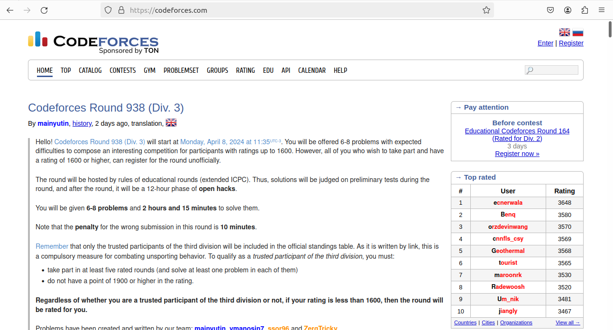
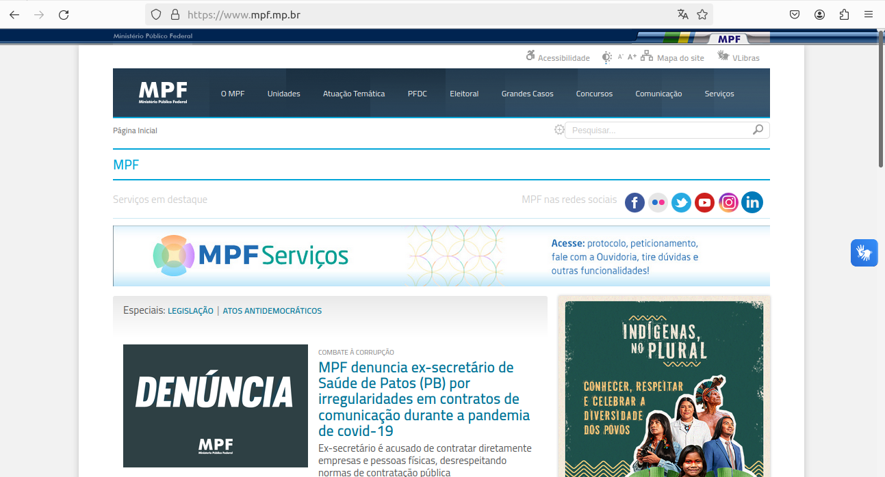
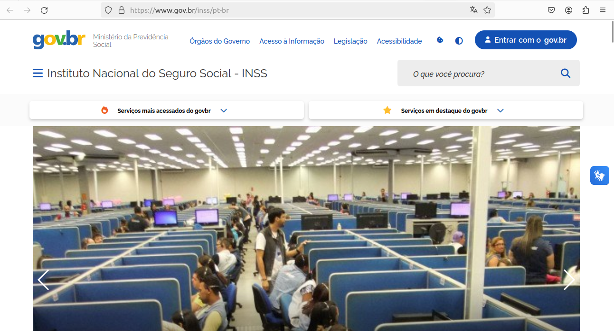
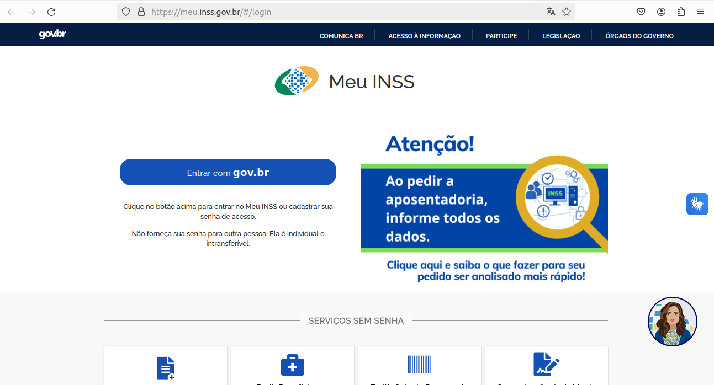
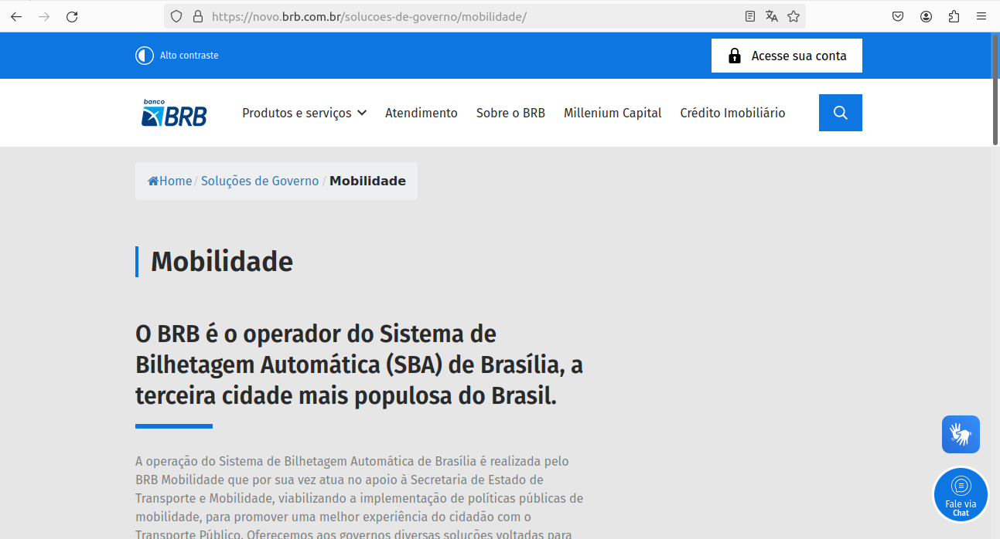

## Introdução

Baseado nas heurísticas de Nielsen, cada membro da equipe se dedicou ao planejamento e avaliação de sites candidatos para o projeto em questão. Todas as avaliações foram conduzidas com base nas atividades do framework DECIDE. Na Tabela 1 abaixo, estão apresentados os sites selecionados por cada integrante:

A tabela 1 descreve o integrante que fez a avaliação, o site que avaliou e o link para o site.

    Tabela 1: sites avaliados
| Integrante                                         | Site Avaliado      | Link                                           |
| --------------------------------------------------- | ------------------ | ---------------------------------------------- |
| [Giovana Silva](https://github.com/gio221)         | [IFB](#ifb)        | [IFB](https://www.ifb.edu.br/)                |
| [João Pedro](https://github.com/JoaoODragonborn)    | [Codeforces](#codeforces) | [Codeforces](https://codeforces.com/)    |
| [Lara Giuliana](https://github.com/gravelylara)     | [MPF](#mpf)        | [MPF](https://www.mpf.mp.br/)                  |
| [Raissa Andrade](https://github.com/RaissaAndradeS)| [FioCruz](#fiocruz)| [FioCruz](https://portal.fiocruz.br/)         |
| [Rayene Almeida](https://github.com/rayenealmeida) | [INSS](#inss)       | [INSS](https://www.gov.br/inss/pt-br)         |
| [Renata Quadros](https://github.com/Renatinha28)   | [BRB mobilidade](#brb-mobilidade) | [BRB mobilidade](https://mobilidade.brb.com.br/passelivre/pages/index.xhtml)|

## Objetivo
O objetivo deste documento é relatar a avaliação dos sites feitos para a escolha do site para o projeto.

## Metodologia
A metodologia utilizada foi a avaliação heurística. A avaliação heurística é uma metodologia de avaliação de usabilidade na qual especialistas examinam interfaces de usuário em busca de problemas de design com base em um conjunto de heurísticas ou princípios de usabilidade estabelecidos. Cada especialista revisa a interface de forma independente, identificando problemas que podem afetar a experiência do usuário. Esses problemas são então priorizados e recomendadas são feitas para melhorias.

## IFB
A integrante responsável por avaliar o IFB foi a Giovana Barbosa. A avaliação tinha como objetivo identificar e corrigir problemas no cadastro de alunos, no pedido de bolsas de estágio sendo assim o metodo escolhido foi a avaliação heurística. Foram avaliados 3 meios de interação: cadastro do aluno, pedido de bolsa, solicitação de vaga de estágio.Na avaliação foram encontradas as seguintes violações com seus respectivos graus de severidade:

Navegação inconsistente:

* Diretriz Violada: Consistência e Padrões de Navegação.

* Local: Página de extensão 

* Gravidade: 2 (problema pequeno).

* Justificativa: O cadastro de estágio está na parte de extensão sendo que existe a parte de estágio

* [Link para a avaliação detalhada](https://docs.google.com/document/d/11ywPIEQH0T2iClUOtNcfPpGdV2-qlVOVdnTiBAK5_yo/edit?usp=sharing)

    
 Figura 1: Imagem do site do IFB . Fonte: 
        <a href="https://www.ifb.edu.br/">Instituto Federal de Brasília</a>
    
 

## Codeforces 
O responsável por avaliar o site foi o João Pedro Ferreira Alves. O Coderforces é uma plataforma de competições de programação. Competições são hospedadas na plataforma regularmente e as habilidades dos participantes são medidas pela sua classificação. Foram avaliados o cadastro de usuário e o processo de identificar e enviar soluções de exercícios. O site demonstrou bastante facilidade de interação com o usuário, levando em conta que o perfil de usuário padrão da plataforma é uma pessoa que utiliza diariamente diversos sites e por consequência tem alto nível de experiência em navegação web. Não foram encontradas violações de diretrizes.

    
 Figura 2: Imagem do site do Codeforces . Fonte: 
        <a href="https://codeforces.com/">Codeforces</a>
    
 

## MPF
A responsável por avaliar o site do MPF foi a Lara. A avaliação teve a finalidade de encontrar possíveis problemas na interação com as funcionalidades que o site apresenta. Os meios de interação avaliados foram: as páginas de serviços do MPF. Na avaliação heurística foram encontradas inconsistências nos links de acesso aos serviços ao cidadão, que redireciona a páginas sem nenhuma padronização, algumas levando a pdfs informativos que prejudicam a navegabilidade.

* Local: Consultar andamento de processos e documentos existentes no MPF, Perguntas Frequentes e Biblioteca

* Diretriz violada: Visibilidade do Status do sistema

* Justificativa: O link leva a uma página de consultas do próprio MPF, mas sem muita informação sobre o que está acontecendo e sem aviso prévio. Isso é um problema pois não permite uma boa navegabilidade para usuários novos do sistema. 

* Local: Atendimento Virtual e Salas de atendimento ao cidadão

* Diretriz violada: Consistência e padronização e Reconhecimento em vez de recordação

* Justificativa: As duas páginas informam endereços para atendimento em cada estado e no DF. Embora sejam parecidas as funcionalidas não têm uma padronização aparente,  que exige a recordação do usuário do sistema   

* [Avaliação](https://docs.google.com/document/d/1qsJH92wkwEBTrX16UKzrhqDvbZn2_u8RHJwyc4yEb1Y/edit)

De acordo com a escala de severidade de Nielsen, ambos os problemas serão avaliados como grandes, pois “prejudica fatores de usabilidade tidos como importantes
para o projeto”.

    
 Figura 3: Imagem do site do MPF . Fonte: 
        <a href="https://www.mpf.mp.br/">MPF</a>
    
 

## FioCruz
Integrante responsável por avaliar o site da FioCruz foi a Raissa Andrade.  A avaliação consiste em indentificar possiveis erros dos usuários motivados pelo uso da plataforma. Pelo método de avaliação heurística foram encontrados algumas inconsistências. Falta de instruções para uso da plataforma,  interação prejudicada e falta de organização nas informações presentes no site. Na avaliação foi identificado:
 
* Rupturas de comunicação;

* Botões sem funcionalidade;

* Má disposição das informações;

* Local: Página do Participante 

* Severidade: Grau 3 (problema grande) 

* Justificativa: A má disposição das informações podem causar perdas de prazos das inscrições dos participantes do programa.

* [Link para a avaliação detalhada](https://unbbr-my.sharepoint.com/:w:/g/personal/221035077_aluno_unb_br/EeCza7jpg0REhleUbRb_JyQBfUHfac3MwTlBtm_ZKW216g?e=rweccl)     

    
 Figura 4: Imagem do site Fiocruz . Fonte: 
        <a href="https://portal.fiocruz.br/">Fiocruz</a>
    
 

## INSS 

A integrante responsável por avaliar o site do INSS foi a Rayene. A avaliação tinha como objetivo identificar quais áreas possuem dificuldades enfrentadas pelos usuários no site do INSS, com foco em melhorar a experiência do usuário. O método de avaliação utilizado para avaliar o site do INSS foi a análise heurística. Os meios de interação avaliados foram: acesso a informações sobre benefícios previdenciários, consultas sobre benefícios, solicitação de serviços online oferecidos pelo INSS, como aposentadorias e pensões e agendamento de atendimentos presenciais. Na avaliação foram encontradas as seguintes violações com seus respectivos graus de severidade:  

* [Link para a avaliação detalhada](https://unbbr-my.sharepoint.com/:w:/g/personal/221022720_aluno_unb_br/EU-NhWTYeJpKge2yfrmly_8Ba2BZ3y_QRqfK5v9K5DeyKg?e=oDcv6a)  

Lentidão no carregamento das páginas: 

* Diretriz Violada: Desempenho 

* Local: Páginas do site em geral. 

*  Gravidade: 2 (problema pequeno). 

*  Justificativa: A lentidão no carregamento das páginas pode causar frustração e impaciência nos usuários, especialmente aqueles que buscam informações urgentes ou precisam realizar transações rapidamente. Isso pode resultar em uma experiência negativa do usuário, levando à diminuição da satisfação e possivelmente ao abandono do site em busca de alternativas mais eficientes. 

Dificuldade em Encontrar Informações Específicas sobre Benefícios e Serviços: 

*  Diretriz Violada: Navegabilidade. 

*  Local: Seções e páginas relacionadas aos benefícios previdenciários, como aposentadoria, pensão por morte e auxílio-doença. 

*  Gravidade: 3 (problema médio). 

*  Justificativa: A dificuldade em localizar informações específicas sobre benefícios e serviços pode causar confusão e desorientação nos usuários, dificultando o acesso aos recursos necessários. Isso pode levar a uma experiência frustrante e prolongada no site, além de aumentar a probabilidade de erros nas solicitações de benefícios, prejudicando assim a eficácia do serviço prestado pelo INSS. 

Falta de Disponibilidade de Horários para Agendamentos Online: 

*  Diretriz Violada: Acessibilidade 

* Local: Seção de agendamentos de atendimento ou similar. 

*  Gravidade: 3 (problema médio) 

*  Justificativa: A falta de disponibilidade de horários para agendamentos online limita a conveniência e a acessibilidade do serviço para os usuários. Isso pode resultar em dificuldades para os usuários agendarem atendimentos presenciais, especialmente aqueles com horários restritos devido a compromissos de trabalho ou outras responsabilidades. A falta de opções de agendamento pode gerar insatisfação nos usuários e até mesmo impedir o acesso ao serviço do INSS quando necessário. 

Problemas Técnicos ao Preencher Formulários Online: 

*  Diretriz Violada: Confiabilidade 

*  Local: Durante o preenchimento de formulários online, que podem ser encontrados em várias seções do site, como solicitação de benefícios. 

*  Gravidade: 3 (problema médio) 

*  Justificativa: Problemas técnicos ao preencher formulários online representam uma falha na confiabilidade do sistema, pois podem resultar em perda de dados ou erros durante o processo de preenchimento. Isso pode causar frustração nos usuários e comprometer a credibilidade do site do INSS como uma plataforma confiável para realizar transações e solicitações importantes relacionadas a benefícios previdenciários.
  

    
 Figura 5: Imagem do site INSS . Fonte: 
        <a href="https://www.gov.br/inss/pt-br">INSS</a>
    
 

    
 Figura 6: Imagem do site Meu INSS 1. Fonte: 
        <a href="https://meu.inss.gov.br">Meu INSS</a>
    
 

* [Link para a avaliação detalhada](https://unbbr-my.sharepoint.com/:w:/g/personal/221022720_aluno_unb_br/EU-NhWTYeJpKge2yfrmly_8Ba2BZ3y_QRqfK5v9K5DeyKg?e=oDcv6a)  

## BRB mobilidade
A integrante responsável por avaliar o BRB mobilidade visando nos passes livres de Brasília - DF foi a Renata Quadros. A avaliação tinha como objetivo identificar e corrigir problemas na interação e na interface do sistema, sendo assim, o metodo escolhido foi a avaliação heurística. Foram avaliados 4 meios de interação: cadastro no passe livre estudantil, solicitação de segunda via, consulta do histórico e cadastro de cartão sênior. Na avaliação foram encontradas as seguintes violações com seus respectivos graus de severidade:

Navegação inconsistente:

* Diretriz Violada: Consistência e Padrões de Navegação.

* Local: Botão "Início".

* Gravidade: 2 (problema pequeno).

* Justificativa: O botão "Início" não funciona de forma consistente, o que pode causar confusão aos usuários.

Problema de acessibilidade para idosos:

* Diretriz Violada: Acessibilidade.

* Local: Página do cartão sênior.

* Gravidade: 4 (problema catastrófico).

* Justificativa: A opção de "escutar" não fornece instruções claras sobre onde executar cada ação, o que pode ser especialmente difícil para usuários idosos que podem não ser alfabetizados.

* [Link para a avaliação detalhada](https://unbbr-my.sharepoint.com/:w:/g/personal/211063013_aluno_unb_br/EQOdnl0h7UFAn5nB8uInoLIBsb5lDhGhtDy3TIE-AELiGw?e=3KB1D5)

    
 Figura 7: Imagem do site BRB Mobilidade . Fonte: 
        <a href="https://novo.brb.com.br/solucoes-de-governo/mobilidade">BRB Mobilidade</a>
    
 

## Bibliografia
> Instituto Federal de Brasília (IFB). IFB - Instituto Federal de Brasília. Disponível em: [https://www.ifb.edu.br/](https://www.ifb.edu.br/). Acesso em: 07 abr 2024.

> Codeforces. Codeforces - Competitive Programming Community. Disponível em: [https://codeforces.com/](https://codeforces.com/). Acesso em: 07 abr 2024

> Fundação Oswaldo Cruz (Fiocruz). Portal Fiocruz. Disponível em: [https://portal.fiocruz.br/](https://portal.fiocruz.br/). Acesso em: 07 abr 2024.

> Brasil. Instituto Nacional do Seguro Social (INSS). Disponível em: [https://www.gov.br/inss](https://www.gov.br/inss/pt-br). Acesso em: 07 abr 2024.

> BRB. Passelivre - Mobilidade BRB. Disponível em: [https://mobilidade.brb.com.br/](https://mobilidade.brb.com.br/passelivre/pages/index.xhtml). Acesso em: 07 abr 2024.

> BARBOSA, Simone; SILVA, Bruno. Interação Humano Computador. 1. ed. Rio de Janeiro: Elsevier, 2010.

## Histórico de versão
      Tabela que descreve o Histórico de Versões
| Versão |          Descrição              |     Autor(es)      |      Data      |   Revisor(es)     |    Data de revisão    |  
|:------:|:-------------------------------:|:--------------:|:--------------:|:-------------:|:---------------------:|
|  1.0   |  Criação do documento                  |   [Renata Quadros ](https://github.com/Renatinha28)    |   07/04   |       [Giovana Barbosa ](https://github.com/gio221), [Rayene Almeida ](https://github.com/rayenealmeida)        |     07/04                 |
|  1.1   | Correção pós entrega                   |   [Rayene Almeida ](https://github.com/rayenealmeida)      |   09/04   |   [Renata Quadros](https://github.com/Renatinha28), [Giovana Silva](https://github.com/gio221)           |            17/04          |
