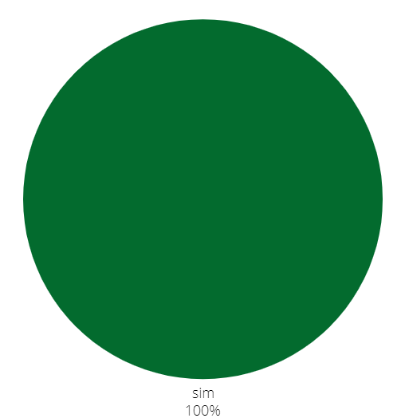

## Introdução
Após finalizar o planejamento da avaliação, agora iremos verificar os protótipos de alta fidelidade. Cada integrante ficou responsável por avaliar ao menos um protótipo criado por outro membro do grupo (um integrante não pode avaliar o protótipo de sua própria autoria). A verificação é uma etapa essencial para garantir que estamos entregando uma avaliação de qualidade, seguindo os princípios de IHC (Interação Humano-Computador).

## Objetivo
Esse artefato tem como obejtivo documentar a verificação dos protótipos de alta fidelidade feitos pelo grupo 04 de Interação Humano Computador(IHC), semestre 2024.1. O grupo tem como objetivo avaliar o site da Polícia Civíl do Distrito Federal.

## Metodologia
A metodologia utilizada é a de inspeção. Verificamos tudo de acordo com os checklist planejados.

## Funcionalidades tratadas no protótipo de alta fidelidade
A tabela 1 descreve os integrantes responsáveis que fizeram o protótipo, o artefato de cada um com um link levando para a verificação do artefado no docuemnto e o integrante que fez a verificação.

        Tabela 1: verificação e seus resoponsáveis

| Integrante responsável que fez o protótipo | Funcionalidade | Integrante responsável pela verificação |
| :------------------------------------------------------: | ------------------------------------------- | -------------------------- |
| [Giovana Silva](https://github.com/gio221) | [Denuncia Online](#denuncia) |   [Renata Quadros](https://github.com/Renatinha28)  |                       
| [Raissa Andrade](https://github.com/RaissaAndradeS) | [Carteira de identidade](#carteira)  | [Renata Quadros](https://github.com/Renatinha28) |
| [Rayene Almeida](https://github.com/rayenealmeida) | [Registra Ocorrência](#registrar) | [Giovana Silva](https://github.com/gio221) |  
| [Renata Quadros](https://github.com/Renatinha28) |  [Solicitar Antecedentes](#solicitar)| [Rayene Almeida](https://github.com/rayenealmeida) |
| [Renata Quadros](https://github.com/Renatinha28) |  [Retrato Falado](#retrato) |  [Raissa Andrade](https://github.com/RaissaAndradeS) |

  Fonte - [Renata Quadros](https://github.com/Renatinha28). 

## 1 - Solicitar Antecedentes Criminais 
### Checklist protótipo de alta fidelidade
Este protótipo foi feito pela integrante [Renata Quadros](https://github.com/Renatinha28) e verificado pela integrante [Rayene Almeida](https://github.com/rayenealmeida), A tabela 2 descreve o checklist respondido.

    Tabela 2: checklist prototipo 

| ID | Descrição | Avaliação | Referência | Print |
| :----: | --------- | ---------- | ----------- | ------- |
| 1 | Os agrupamentos e características dos elementos de interface estão claramente definidos? | Sim | "7.4.2 Representações Da Interface Com Usuário" | [Página 270.1](../../../assets/verificacao/verificação%20nosso%20grupo/etapa2/Pagina270.1.png) |
| 2 | Os elementos de interface interativos (widgets) estão posicionados de maneira adequada? |Sim  | "7.4.2 Representações Da Interface Com Usuário" | [Página 270.2](../../../assets/verificacao/verificação%20nosso%20grupo/etapa2/Pagina270.2.png) |
| 3 | As decisões sobre tamanhos, posições, cores, fontes e outros detalhes visuais dos elementos de interface foram incorporadas? | Sim | "7.4.2 Representações Da Interface Com Usuário" | [Página 271.1](../../../assets/verificacao/verificação%20nosso%20grupo/etapa2/Pagina271.1.png) |
| 4 | A representação de alta fidelidade inclui todos os detalhes gráficos necessários? |  Sim | "7.4.2 Representações Da Interface Com Usuário" | [Página 271.2](../../../assets/verificacao/verificação%20nosso%20grupo/etapa2/Pagina271.2.png) | 
| 5 | O vocabulário utilizado na interface é consistente e familiar ao usuário? | Sim | "7.4.2 Representações Da Interface Com Usuário" | [Página 272.1](../../../assets/verificacao/verificação%20nosso%20grupo/etapa2/Pagina272.1.png) | 

  
 
Fonte: <a href="https://github.com/rayenealmeida">Rayene Almeida</a>, 2024

### Gravação
A gravação da verificação é encontrada logo abaixo.

    <iframe width="560" height="315" src="https://www.youtube.com/embed/hxlbWchMR1g" title="YouTube video player" frameborder="0" allow="accelerometer; autoplay; clipboard-write; encrypted-media; gyroscope; picture-in-picture; web-share" referrerpolicy="strict-origin-when-cross-origin" allowfullscreen></iframe>

    <a href="https://www.youtube.com/embed/hxlbWchMR1g" target="_blank">Vídeo da verificação: protótipo de alta fidelidade - Renata </a>

### Problemas encontrados
Não foram encontrados problemas.

### Soluções
Como não foi encontrado problemas, não há necessidade de sugestão de melhoria.

### Conclusão

A figura 1 mostra como ficou as respostas obtidas

 Figura 1 - Respostas da verificação do Protótipo de Alta Fidelidade feito pela Renata.

 
  
Fonte: <a href="https://github.com/rayenealmeida">Rayene Almeida</a>

        

Como mostrado na figura 1 o Protótipo de Alta Fidelidade da funcionalidade Solicitar Antecedentes Criminais foi muito bem feito, 100% de acertos.

### Cronograma do reprojeto
A tabela 3 descreve o cronograma do reprojeto.

    Tabela 3: cronograma do reprojeto

| Data da correção | Descrição | Responsável(eis) | Status |
| :----------------------: | -------------------- | ---------------- | --------------- |
|07/07| não houve problemas encontrados | [Renata Quadros](https://github.com/Renatinha28) | Feito |

## 2 - 197- Denúncia Online 
### Checklist protótipo de alta fidelidade
Esta protótipo foi feito pela integrante [Giovana Silva](https://github.com/gio221) e verificado pela integrante  [Renata Quadros](https://github.com/Renatinha28), A tabela 4 descreve o checklist respondido.

    Tabela 4: checklist prototipo 

| ID | Descrição | Avaliação | Referência | Print |
| :----: | --------- | ---------- | ----------- | ------- |
| 1 | Os agrupamentos e características dos elementos de interface estão claramente definidos? | Sim | "7.4.2 Representações Da Interface Com Usuário" | [Página 270.1](../../../assets/verificacao/verificação%20nosso%20grupo/etapa2/Pagina270.1.png) |
| 2 | Os elementos de interface interativos (widgets) estão posicionados de maneira adequada? |Sim  | "7.4.2 Representações Da Interface Com Usuário" | [Página 270.2](../../../assets/verificacao/verificação%20nosso%20grupo/etapa2/Pagina270.2.png) |
| 3 | As decisões sobre tamanhos, posições, cores, fontes e outros detalhes visuais dos elementos de interface foram incorporadas? | Sim | "7.4.2 Representações Da Interface Com Usuário" | [Página 271.1](../../../assets/verificacao/verificação%20nosso%20grupo/etapa2/Pagina271.1.png) |
| 4 | A representação de alta fidelidade inclui todos os detalhes gráficos necessários? |  Sim | "7.4.2 Representações Da Interface Com Usuário" | [Página 271.2](../../../assets/verificacao/verificação%20nosso%20grupo/etapa2/Pagina271.2.png) | 
| 5 | O vocabulário utilizado na interface é consistente e familiar ao usuário? | Sim | "7.4.2 Representações Da Interface Com Usuário" | [Página 272.1](../../../assets/verificacao/verificação%20nosso%20grupo/etapa2/Pagina272.1.png) | 

  
 
Fonte: <a href="https://github.com/Renatinha28">Renata Quadros</a>, 2024

### Gravação
A gravação da verificação é encontrada logo abaixo.

    <iframe width="560" height="315" src="https://www.youtube.com/embed/FVFBCvk-i40" title="YouTube video player" frameborder="0" allow="accelerometer; autoplay; clipboard-write; encrypted-media; gyroscope; picture-in-picture; web-share" referrerpolicy="strict-origin-when-cross-origin" allowfullscreen></iframe>

    <a href="https://www.youtube.com/watch?v=FVFBCvk-i40" target="_blank">Vídeo da verificação: protótipo de alta fidelidade - Giovana </a>

### Problemas encontrados
Não foram encontrados problemas.

### Soluções
Como não foi encontrado problemas, não há necessidade de sugestão de melhoria.

### Conclusão
O gráfico referente a essa análise.

 Figura 1 - Respostas da verificação do Protótipo de Alta Fidelidade feito pela Renata.

 
  
Fonte: <a href="https://github.com/rayenealmeida">Rayene Almeida</a>

        

### Cronograma do reprojeto
A tabela 5 descreve o cronograma do reprojeto.

    Tabela 5: cronograma do reprojeto

| Data da correção | Descrição | Responsável(eis) | Status |
| :----------------------: | -------------------- | ---------------- | --------------- |
|07/07| não houve problemas encontrados | [Giovana Silva](https://github.com/gio221) | Feito |

## 3 - Solicitar Carteira de Identidade 
### Checklist protótipo de alta fidelidade
Esta protótipo foi feito pela integrante [Raissa Andrade](https://github.com/RaissaAndradeS) e verificado pela integrante  [Renata Quadros](https://github.com/Renatinha28), A tabela 6 descreve o checklist respondido.

    Tabela 6: checklist prototipo 

| ID | Descrição | Avaliação | Referência | Print |
| :----: | --------- | ---------- | ----------- | ------- |
| 1 | Os agrupamentos e características dos elementos de interface estão claramente definidos? | Sim | "7.4.2 Representações Da Interface Com Usuário" | [Página 270.1](../../../assets/verificacao/verificação%20nosso%20grupo/etapa2/Pagina270.1.png) |
| 2 | Os elementos de interface interativos (widgets) estão posicionados de maneira adequada? |Sim  | "7.4.2 Representações Da Interface Com Usuário" | [Página 270.2](../../../assets/verificacao/verificação%20nosso%20grupo/etapa2/Pagina270.2.png) |
| 3 | As decisões sobre tamanhos, posições, cores, fontes e outros detalhes visuais dos elementos de interface foram incorporadas? | Incompleto | "7.4.2 Representações Da Interface Com Usuário" | [Página 271.1](../../../assets/verificacao/verificação%20nosso%20grupo/etapa2/Pagina271.1.png) |
| 4 | A representação de alta fidelidade inclui todos os detalhes gráficos necessários? |  Sim | "7.4.2 Representações Da Interface Com Usuário" | [Página 271.2](../../../assets/verificacao/verificação%20nosso%20grupo/etapa2/Pagina271.2.png) | 
| 5 | O vocabulário utilizado na interface é consistente e familiar ao usuário? | Sim | "7.4.2 Representações Da Interface Com Usuário" | [Página 272.1](../../../assets/verificacao/verificação%20nosso%20grupo/etapa2/Pagina272.1.png) | 

  
 
Fonte: <a href="https://github.com/Renatinha28">Renata Quadros</a>, 2024

### Gravação
A gravação da verificação é encontrada logo abaixo.

    <iframe width="560" height="315" src="https://www.youtube.com/embed/A2_7BQ9ADN0" title="YouTube video player" frameborder="0" allow="accelerometer; autoplay; clipboard-write; encrypted-media; gyroscope; picture-in-picture; web-share" referrerpolicy="strict-origin-when-cross-origin" allowfullscreen></iframe>

    <a href="https://www.youtube.com/watch?v=A2_7BQ9ADN0" target="_blank">Vídeo da verificação: protótipo de alta fidelidade - Raissa </a>

### Problemas encontrados
- ID 3: A decisão sobre tamanhos e cores devem ser revisados.

### Soluções
- ID 3: Revisar as decisões sobre tamanhos e cores.

### Conclusão
O gráfico referente a essa análise.

 Figura 1 - Respostas da verificação do Protótipo de Alta Fidelidade feito pela Renata.

 
  
Fonte: <a href="https://github.com/rayenealmeida">Rayene Almeida</a>

        

### Cronograma do reprojeto
A tabela 7 descreve o cronograma do reprojeto.

    Tabela 7: cronograma do reprojeto

| Data da correção | Descrição | Responsável(eis) | Status |
| :----------------------: | -------------------- | ---------------- | --------------- |
|07/07| revisar as decisões sobre tamanhos e cores | [Raissa Andrade](https://github.com/RaissaAndradeS) |  Feito |

## 4 - Registrar Ocorrência 

### Checklist protótipo de alta fidelidade
Esta protótipo foi feito pela integrante  [Giovana Silva](https://github.com/gio221), A tabela 6 descreve o checklist respondido.

    Tabela 7: checklist prototipo 

| ID | Descrição | Avaliação | Referência | Print |
| :----: | --------- | ---------- | ----------- | ------- |
| 1 | Os agrupamentos e características dos elementos de interface estão claramente definidos? | Sim | "7.4.2 Representações Da Interface Com Usuário" | [Página 270.1](../../../assets/verificacao/verificação%20nosso%20grupo/etapa2/Pagina270.1.png) |
| 2 | Os elementos de interface interativos (widgets) estão posicionados de maneira adequada? |Sim  | "7.4.2 Representações Da Interface Com Usuário" | [Página 270.2](../../../assets/verificacao/verificação%20nosso%20grupo/etapa2/Pagina270.2.png) |
| 3 | As decisões sobre tamanhos, posições, cores, fontes e outros detalhes visuais dos elementos de interface foram incorporadas? | Sim | "7.4.2 Representações Da Interface Com Usuário" | [Página 271.1](../../../assets/verificacao/verificação%20nosso%20grupo/etapa2/Pagina271.1.png) |
| 4 | A representação de alta fidelidade inclui todos os detalhes gráficos necessários? |  Sim | "7.4.2 Representações Da Interface Com Usuário" | [Página 271.2](../../../assets/verificacao/verificação%20nosso%20grupo/etapa2/Pagina271.2.png) | 
| 5 | O vocabulário utilizado na interface é consistente e familiar ao usuário? | Sim | "7.4.2 Representações Da Interface Com Usuário" | [Página 272.1](../../../assets/verificacao/verificação%20nosso%20grupo/etapa2/Pagina272.1.png) | 

  
 
Fonte: <a href="https://github.com/gio221">Giovana Silva</a>, 2024

### Gravação
A gravação da verificação é encontrada logo abaixo.

    <iframe width="560" height="315" src="https://www.youtube.com/embed/AFdpEutK-Uw" title="YouTube video player" frameborder="0" allow="accelerometer; autoplay; clipboard-write; encrypted-media; gyroscope; picture-in-picture; web-share" referrerpolicy="strict-origin-when-cross-origin" allowfullscreen></iframe>

    <a href="https://www.youtube.com/watch?v=AFdpEutK-Uw" target="_blank">Vídeo da verificação: protótipo de alta fidelidade - Rayene </a>

### Problemas encontrados
Não existe problemas encontrados

### Soluções
Não existe soluções

### Conclusão
O gráfico referente a essa análise.

 Figura 1 - Respostas da verificação do Protótipo de Alta Fidelidade feito pela Renata.

 
  
Fonte: <a href="https://github.com/gio221">Giovana Silva</a>

        

### Cronograma do reprojeto
Não há necesidade de reprojeto 

## 6- Retrato Falado Online 

### Checklist do Protótipo de Alta Fidelidade 

A tabela abaixo foi montada pela [Renata Quadros](https://github.com/Renatinha28) e avaliada por [Raissa Andrade](https://github.com/RaissaAndradeS) e [Giovana Silva](https://github.com/gio221), essa avaliação foi sobre o Retrato Falado.

    Tabela 6: checklist protótipo de Alta Fidelidade 

| ID | Descrição | Avaliação | Referência | Print |
| :----: | --------- | ---------- | ----------- | ------- |
| 1 | Os agrupamentos e características dos elementos de interface estão claramente definidos? | Sim | "7.4.2 Representações Da Interface Com Usuário" | [Página 270.1](../../../assets/verificacao/verificação%20nosso%20grupo/etapa2/Pagina270.1.png) |
| 2 | Os elementos de interface interativos (widgets) estão posicionados de maneira adequada? |Sim  | "7.4.2 Representações Da Interface Com Usuário" | [Página 270.2](../../../assets/verificacao/verificação%20nosso%20grupo/etapa2/Pagina270.2.png) |
| 3 | As decisões sobre tamanhos, posições, cores, fontes e outros detalhes visuais dos elementos de interface foram incorporadas? | Sim | "7.4.2 Representações Da Interface Com Usuário" | [Página 271.1](../../../assets/verificacao/verificação%20nosso%20grupo/etapa2/Pagina271.1.png) |
| 4 | A representação de alta fidelidade inclui todos os detalhes gráficos necessários? |  Sim | "7.4.2 Representações Da Interface Com Usuário" | [Página 271.2](../../../assets/verificacao/verificação%20nosso%20grupo/etapa2/Pagina271.2.png) | 
| 5 | O vocabulário utilizado na interface é consistente e familiar ao usuário? | Sim | "7.4.2 Representações Da Interface Com Usuário" | [Página 272.1](../../../assets/verificacao/verificação%20nosso%20grupo/etapa2/Pagina272.1.png) | 

Fonte: [Raissa Andrade](https://github.com/RaissaAndradeS), 2024

### Gravação 

Essa é a gravação sobre a análise do Protótipo de Alta Fidelidade do Retrato Falado. 

<iframe width="560" height="315" src="https://www.youtube.com/embed/2b8aQm5Krv4" frameborder="0" allow="accelerometer; autoplay; clipboard-write; encrypted-media; gyroscope; picture-in-picture" allowfullscreen></iframe>

Fonte: [Raissa Andrade](https://github.com/RaissaAndradeS), 2024

### Problemas Encontrados 
Não houve problemas encontrados.
### Soluções 
Não há soluções para esse caso.
### Conclusão 
Abaixo há um gráfico sobre a análise feita do Retrato falado, logo, não há necessidade de um reprojeto.

Fonte: [Raissa Andrade](https://github.com/RaissaAndradeS), 2024

## Bibliografia
> BARBOSA, S.D.J.; SILVA, B.S. Interação Humano-Computador. Editora Campus-Elsevier, 2010.

> https://interacao-humano-computador.github.io/2024.1-PCDF/
## Histórico de Versões
      Tabela que descreve o Histórico de Versões

|     Versão       |     Descrição      |      Autor(es)      | Data           |  Revisor(es)          |Data de revisão|
| :----------------------------------------------------------: | :-------------------------------: | :-------------------------------------------------: | :-------------------------------: |  :-------------------------------: | :-------------------------------: |
| 1.0 | Verificando denúncia online e carteira de identidade |  [Renata Quadros](https://github.com/Renatinha28)  | 06/07 |  [Rayene Almeida](https://github.com/rayenealmeida)  | 06/07 |
| 1.1 | Verificando Solicitar Antecedente Criminais |  [Rayene Almeida](https://github.com/rayenealmeida)  |  06/07|[Giovana Silva](https://github.com/gio221)|07/07|
| 1.2 | Verificando Registrar Ocorrência |  [Giovana Silva](https://github.com/gio221)|07/07|[Giovana Barbosa](https://github.com/gio221)    |08/07

