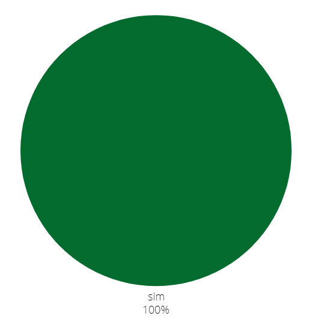

## Introdução

Após finalizar o planejamento da avaliação, agora iremos verificar os relatos dos protótipos de alta fidelidade. Cada integrante ficou responsável por avaliar ao menos um relato criado por outro membro do grupo (um integrante não pode avaliar o protótipo de sua própria autoria). A verificação é uma etapa essencial para garantir que estamos entregando uma avaliação de qualidade, seguindo os princípios de IHC (Interação Humano-Computador).

## Objetivo

Esse artefato tem como obejtivo documentar a verificação dos relatos dos protótipos de alta fidelidade feitos pelo grupo 04 de Interação Humano Computador(IHC), semestre 2024.1. O grupo tem como objetivo avaliar o site da Polícia Civíl do Distrito Federal.

## Metodologia
A metodologia utilizada é a de inspeção. Verificamos tudo de acordo com os checklist planejados.

## Funcionalidades tratadas no protótipo de alta fidelidade
A tabela 1 descreve os integrantes responsáveis que fizeram o relato do protótipo, o artefato de cada um com um link levando para a verificação do artefado no docuemnto e o integrante que fez a verificação.

        Tabela 1: verificação e seus resoponsáveis

| Integrante responsável que fez o relato do protótipo | Funcionalidade | Integrante responsável pela verificação |
| :------------------------------------------------------: | ------------------------------------------- | -------------------------- |
| [Giovana Silva](https://github.com/gio221) | [Denuncia Online](#denuncia) |   [Renata Quadros](https://github.com/Renatinha28)  |                       
| [Raissa Andrade](https://github.com/RaissaAndradeS) | [Carteira de identidade](#carteira)  | [Renata Quadros](https://github.com/Renatinha28) |
| [Rayene Almeida](https://github.com/rayenealmeida) | [Registra Ocorrência](#registrar) | [Giovana Silva](https://github.com/gio221) |  
| [Renata Quadros](https://github.com/Renatinha28) |  [Solicitar Antecedentes](#solicitar)| [Rayene Almeida](https://github.com/rayenealmeida) |
| [Renata Quadros](https://github.com/Renatinha28) |  [Retrato Falado](#retrato) |  [Raissa Andrade](https://github.com/RaissaAndradeS) |

  Fonte - [Renata Quadros](https://github.com/Renatinha28). 

## 1 - Solicitar Antecedentes Criminais 

### Checklist relato do protótipo de alta fidelidade
Este relato foi feito pela integrante [Renata Quadros](https://github.com/Renatinha28) e verificado pela integrante  [Rayene Almeida](https://github.com/rayenealmeida), A tabela 2 descreve o checklist respondido.

    Tabela 2: checklist relato 

| ID | Descrição | Avaliação | Referência | Print |
| :----: | --------- | ---------- | ----------- | ------- |
|1|Está descrito o obejtivo da avaliação?| Sim |pagina 318|[print](../../../assets/verificacao/verificação%20nosso%20grupo/etapa%205/planejavalia2.png)|
|2|Está descrito os métodos empregados na avaliação?|Sim|pagina 318|[print](../../../assets/verificacao/verificação%20nosso%20grupo/etapa%205/planejavalia2.png)|
|3|Foi apresentado o número de participantes?|Sim|pagina 318|[print](../../../assets/verificacao/verificação%20nosso%20grupo/etapa%205/planejavalia2.png)|
|4|Foi apresentado o cronograma das entrevista?|Sim|pagina 318|[print](../../../assets/verificacao/verificação%20nosso%20grupo/etapa%205/planejavalia2.png)|
|5| Foi apresentado os aspectos éticos?|Não|pagina 318|[print](../../../assets/verificacao/verificação%20nosso%20grupo/etapa%205/planejavalia2.png)|
|6| é mostrado as tarefas propostas?|Sim|pagina 318|[print](../../../assets/verificacao/verificação%20nosso%20grupo/etapa%205/planejavalia2.png)|
|7| Foi apresentado o roteiro de perguntas?|Sim|pagina 318|[print](../../../assets/verificacao/verificação%20nosso%20grupo/etapa%205/planejavalia2.png)|
|8| é apresentado como será a interpretação de dados|Sim|pagina 318|[print](../../../assets/verificacao/verificação%20nosso%20grupo/etapa%205/planejavalia2.png)|
|9| é apresentado com será o reprojeto?|Sim há necessidade|pagina 318|[print](../../../assets/verificacao/verificação%20nosso%20grupo/etapa%205/planejavalia2.png)|

  
 
Fonte: <a href="https://github.com/rayenealmeida">Rayene Almeida</a>, 2024

### Gravação
A gravação da verificação é encontrada logo abaixo.

    <iframe width="560" height="315" src="https://www.youtube.com/embed/NeiAhJZ3_GI" title="YouTube video player" frameborder="0" allow="accelerometer; autoplay; clipboard-write; encrypted-media; gyroscope; picture-in-picture; web-share" referrerpolicy="strict-origin-when-cross-origin" allowfullscreen></iframe>

    <a href="https://www.youtube.com/embed/NeiAhJZ3_GI" target="_blank">Vídeo da verificação: relato protótipo de alta fidelidade - Renata </a>

### Problemas encontrados
- ID 5: Não foi apresentado os aspectos éticos,

### Soluções
- ID 5: Adicionar os aspectos éticos.

### Conclusão
A figura 1 mostra como ficou as respostas obtidas

 Figura 1 - Respostas da verificação do Relato do Protótipo de Alta Fidelidade feito pela Renata.

 
  
Fonte: <a href="https://github.com/rayenealmeida">Rayene Almeida</a>

        

Como mostrado na figura 1 o Relato do Protótipo de Alta Fidelidade da funcionalidade Solicitar Antecedentes Criminais foi muito bem feito, com 88,9% de acertos.

### Cronograma do reprojeto
A tabela 3 descreve o cronograma do reprojeto.

    Tabela 3: cronograma do reprojeto

| Data da correção | Descrição | Responsável(eis) | Status |
| :----------------------: | -------------------- | ---------------- | --------------- |
|07/07|  Adicionar os aspectos éticos | [Renata Quadros](https://github.com/Renatinha28) | Feito |

## 2 - 197- Denúncia Online 
### Checklist relato do protótipo de alta fidelidade
Esta relato foi feito pela integrante [Giovana Silva](https://github.com/gio221) e verificado pela integrante  [Renata Quadros](https://github.com/Renatinha28), A tabela 4 descreve o checklist respondido.

    Tabela 4: checklist relato 

| ID | Descrição | Avaliação | Referência | Print |
| :----: | --------- | ---------- | ----------- | ------- |
|1|Está descrito o obejtivo da avaliação?| Sim |pagina 318|[print](../../../assets/verificacao/verificação%20nosso%20grupo/etapa%205/planejavalia2.png)|
|2|Está descrito os métodos empregados na avaliação?|Sim|pagina 318|[print](../../../assets/verificacao/verificação%20nosso%20grupo/etapa%205/planejavalia2.png)|
|3|Foi apresentado o número de participantes?|Sim|pagina 318|[print](../../../assets/verificacao/verificação%20nosso%20grupo/etapa%205/planejavalia2.png)|
|4|Foi apresentado o cronograma das entrevista?|Sim|pagina 318|[print](../../../assets/verificacao/verificação%20nosso%20grupo/etapa%205/planejavalia2.png)|
|5| Foi apresentado os aspectos éticos?|Não|pagina 318|[print](../../../assets/verificacao/verificação%20nosso%20grupo/etapa%205/planejavalia2.png)|
|6| é mostrado as tarefas propostas?|Sim|pagina 318|[print](../../../assets/verificacao/verificação%20nosso%20grupo/etapa%205/planejavalia2.png)|
|7| Foi apresentado o roteiro de perguntas?|Sim|pagina 318|[print](../../../assets/verificacao/verificação%20nosso%20grupo/etapa%205/planejavalia2.png)|
|8| é apresentado como será a interpretação de dados|Sim|pagina 318|[print](../../../assets/verificacao/verificação%20nosso%20grupo/etapa%205/planejavalia2.png)|
|9| é apresentado com será o reprojeto?|Não há necessidade|pagina 318|[print](../../../assets/verificacao/verificação%20nosso%20grupo/etapa%205/planejavalia2.png)|

  
 
Fonte: <a href="https://github.com/Renatinha28">Renata Quadros</a>, 2024

### Gravação
A gravação da verificação é encontrada logo abaixo.

    <iframe width="560" height="315" src="https://www.youtube.com/embed/bqnS3276JVg" title="YouTube video player" frameborder="0" allow="accelerometer; autoplay; clipboard-write; encrypted-media; gyroscope; picture-in-picture; web-share" referrerpolicy="strict-origin-when-cross-origin" allowfullscreen></iframe>

    <a href="https://www.youtube.com/watch?v=bqnS3276JVg" target="_blank">Vídeo da verificação: relato protótipo de alta fidelidade - Giovana </a>

### Problemas encontrados
- ID 5: Não foi apresentado os aspectos éticos,

### Soluções
- ID 5: Adicionar os aspectos éticos.

### Conclusão
O gráfico referente a essa análise.

 Figura 1 - Respostas da verificação do Relato do Protótipo de Alta Fidelidade feito pela Renata.

 
  
Fonte: <a href="https://github.com/gio221">Giovana Silva</a>

        

### Cronograma do reprojeto
A tabela 5 descreve o cronograma do reprojeto.

    Tabela 5: cronograma do reprojeto

| Data da correção | Descrição | Responsável(eis) | Status |
| :----------------------: | -------------------- | ---------------- | --------------- |
|07/07|  Adicionar os aspectos éticos | [Giovana Silva](https://github.com/gio221) | feito|

## 3 - Solicitar Carteira de Identidade 
### Checklist relato do protótipo de alta fidelidade
Esta relato foi feito pela integrante [Raissa Andrade](https://github.com/RaissaAndradeS) e verificado pela integrante  [Renata Quadros](https://github.com/Renatinha28), A tabela 6 descreve o checklist respondido.

    Tabela 6: checklist relato 

| ID | Descrição | Avaliação | Referência | Print |
| :----: | --------- | ---------- | ----------- | ------- |
|1|Está descrito o obejtivo da avaliação?| Sim |pagina 318|[print](../../../assets/verificacao/verificação%20nosso%20grupo/etapa%205/planejavalia2.png)|
|2|Está descrito os métodos empregados na avaliação?|Sim|pagina 318|[print](../../../assets/verificacao/verificação%20nosso%20grupo/etapa%205/planejavalia2.png)|
|3|Foi apresentado o número de participantes?|Sim|pagina 318|[print](../../../assets/verificacao/verificação%20nosso%20grupo/etapa%205/planejavalia2.png)|
|4|Foi apresentado o cronograma das entrevista?|Sim|pagina 318|[print](../../../assets/verificacao/verificação%20nosso%20grupo/etapa%205/planejavalia2.png)|
|5| Foi apresentado os aspectos éticos?|Não|pagina 318|[print](../../../assets/verificacao/verificação%20nosso%20grupo/etapa%205/planejavalia2.png)|
|6| é mostrado as tarefas propostas?|Sim|pagina 318|[print](../../../assets/verificacao/verificação%20nosso%20grupo/etapa%205/planejavalia2.png)|
|7| Foi apresentado o roteiro de perguntas?|Sim|pagina 318|[print](../../../assets/verificacao/verificação%20nosso%20grupo/etapa%205/planejavalia2.png)|
|8| é apresentado como será a interpretação de dados|Sim|pagina 318|[print](../../../assets/verificacao/verificação%20nosso%20grupo/etapa%205/planejavalia2.png)|
|9| é apresentado com será o reprojeto?|Sim|pagina 318|[print](../../../assets/verificacao/verificação%20nosso%20grupo/etapa%205/planejavalia2.png)|

  
 
Fonte: <a href="https://github.com/Renatinha28">Renata Quadros</a>, 2024

### Gravação
A gravação da verificação é encontrada logo abaixo.

    <iframe width="560" height="315" src="https://www.youtube.com/embed/amQKc4X-B0Q" title="YouTube video player" frameborder="0" allow="accelerometer; autoplay; clipboard-write; encrypted-media; gyroscope; picture-in-picture; web-share" referrerpolicy="strict-origin-when-cross-origin" allowfullscreen></iframe>

    <a href="https://www.youtube.com/watch?v=amQKc4X-B0Q" target="_blank">Vídeo da verificação: relato do protótipo de alta fidelidade - Raissa </a>

### Problemas encontrados
- ID 5: Não foi apresentado os aspectos éticos,

### Soluções
- ID 5: Adicionar os aspectos éticos.

### Conclusão
O gráfico referente a essa análise.

 Figura 1 - Respostas da verificação do Relato do Protótipo de Alta Fidelidade feito pela Renata.

 
  
Fonte: <a href="https://github.com/gio221">Giovana Silva</a>

        

### Cronograma do reprojeto
A tabela 7 descreve o cronograma do reprojeto.

    Tabela 7: cronograma do reprojeto

| Data da correção | Descrição | Responsável(eis) | Status |
| :----------------------: | -------------------- | ---------------- | --------------- |
|23/06| Adicionar os aspectos éticos | [Raissa Andrade](https://github.com/RaissaAndradeS) | Corrigido.|

## 4 - Registrar Ocorrência 

### Checklist do Protótipo de Alta Fidelidade 

Esse relato foi elaborado pela  [Giovana Barbosa](https://github.com/gio221) , a tabela a seguir descreve o checklist.

    Tabela 6: checklist relato 

| ID | Descrição | Avaliação | Referência | Print |
| :----: | --------- | ---------- | ----------- | ------- |
|1|Está descrito o obejtivo da avaliação?| Sim |pagina 318|[print](../../../assets/verificacao/verificação%20nosso%20grupo/etapa%205/planejavalia2.png)|
|2|Está descrito os métodos empregados na avaliação?|Sim|pagina 318|[print](../../../assets/verificacao/verificação%20nosso%20grupo/etapa%205/planejavalia2.png)|
|3|Foi apresentado o número de participantes?|Sim|pagina 318|[print](../../../assets/verificacao/verificação%20nosso%20grupo/etapa%205/planejavalia2.png)|
|4|Foi apresentado o cronograma das entrevista?|Sim|pagina 318|[print](../../../assets/verificacao/verificação%20nosso%20grupo/etapa%205/planejavalia2.png)|
|5| Foi apresentado os aspectos éticos?|Não|pagina 318|[print](../../../assets/verificacao/verificação%20nosso%20grupo/etapa%205/planejavalia2.png)|
|6| É mostrado as tarefas propostas?|Sim|pagina 318|[print](../../../assets/verificacao/verificação%20nosso%20grupo/etapa%205/planejavalia2.png)|
|7| Foi apresentado o roteiro de perguntas?|Sim|pagina 318|[print](../../../assets/verificacao/verificação%20nosso%20grupo/etapa%205/planejavalia2.png)|
|8| É apresentado como será a interpretação de dados|Sim|pagina 318|[print](../../../assets/verificacao/verificação%20nosso%20grupo/etapa%205/planejavalia2.png)|
|9| É apresentado com será o reprojeto?|Não há necessidade|pagina 318|[print](../../../assets/verificacao/verificação%20nosso%20grupo/etapa%205/planejavalia2.png)| 

Fonte: [Giovana Barbosa](https://github.com/gio221)

### Gravação 

Gravação feita por [Giovana Silva](https://github.com/gio221) sobre a Registrar Ocorrência.

<iframe width="560" height="315" src="https://www.youtube.com/embed/WcwHTbJ-Ps0" frameborder="0" allow="accelerometer; autoplay; clipboard-write; encrypted-media; gyroscope; picture-in-picture" allowfullscreen></iframe>

Fonte: [Giovana Silva](https://github.com/gio221)

### Problemas encontrados 
Faltou o aspecto ético

### Soluções 
Colocar o aspecto ético

### Conclusão 

 Figura 1 - Respostas da verificação do Relato do Protótipo de Alta Fidelidade feito pela Renata.

 
  
Fonte: <a href="https://github.com/gio221">Giovana Silva</a>

        

### Cronograma do reprojeto
A tabela 3 descreve o cronograma do reprojeto.

    Tabela 3: cronograma do reprojeto

| Data da correção | Descrição | Responsável(eis) | Status |
| :----------------------: | -------------------- | ---------------- | --------------- |
|07/07|  Adicionar os aspectos éticos | [Rayene Almeida](https://github.com/rayenealmeida) | |

## 6- Retrato Falado Online 

### Checklist do Protótipo de Alta Fidelidade 

Esse relato foi elaborado pela  [Renata Quadros](https://github.com/Renatinha28) e verificado por [Raissa Andrade](https://github.com/RaissaAndradeS) e [Giovana Silva](https://github.com/gio221), a tabela a seguir descreve o checklist.

    Tabela 6: checklist relato 

| ID | Descrição | Avaliação | Referência | Print |
| :----: | --------- | ---------- | ----------- | ------- |
|1|Está descrito o obejtivo da avaliação?| Sim |pagina 318|[print](../../../assets/verificacao/verificação%20nosso%20grupo/etapa%205/planejavalia2.png)|
|2|Está descrito os métodos empregados na avaliação?|Sim|pagina 318|[print](../../../assets/verificacao/verificação%20nosso%20grupo/etapa%205/planejavalia2.png)|
|3|Foi apresentado o número de participantes?|Sim|pagina 318|[print](../../../assets/verificacao/verificação%20nosso%20grupo/etapa%205/planejavalia2.png)|
|4|Foi apresentado o cronograma das entrevista?|Sim|pagina 318|[print](../../../assets/verificacao/verificação%20nosso%20grupo/etapa%205/planejavalia2.png)|
|5| Foi apresentado os aspectos éticos?|Não|pagina 318|[print](../../../assets/verificacao/verificação%20nosso%20grupo/etapa%205/planejavalia2.png)|
|6| É mostrado as tarefas propostas?|Sim|pagina 318|[print](../../../assets/verificacao/verificação%20nosso%20grupo/etapa%205/planejavalia2.png)|
|7| Foi apresentado o roteiro de perguntas?|Sim|pagina 318|[print](../../../assets/verificacao/verificação%20nosso%20grupo/etapa%205/planejavalia2.png)|
|8| É apresentado como será a interpretação de dados|Sim|pagina 318|[print](../../../assets/verificacao/verificação%20nosso%20grupo/etapa%205/planejavalia2.png)|
|9| É apresentado com será o reprojeto?|Não há necessidade|pagina 318|[print](../../../assets/verificacao/verificação%20nosso%20grupo/etapa%205/planejavalia2.png)| 

Fonte: [Raissa Andrade](https://github.com/RaissaAndradeS), 2024

### Gravação 

Gravação feita por [Raissa Andrade](https://github.com/RaissaAndradeS) e [Giovana Silva](https://github.com/gio221) sobre o Retrato Falado.

<iframe width="560" height="315" src="https://www.youtube.com/embed/nYTGqEVDfKg" frameborder="0" allow="accelerometer; autoplay; clipboard-write; encrypted-media; gyroscope; picture-in-picture" allowfullscreen></iframe>

Fonte: [Raissa Andrade](https://github.com/RaissaAndradeS), 2024

### Problemas encontrados 
Nenhum problema foi encontrado durante a gravação.

### Soluções 
Não precisa pois não foi encontrado nenhum problema.

### Conclusão 
Com base nas respostas obtidas, o gráfico apresenta a análise feita e assim não há necessidade de um reprojeto.

Fonte: [Raissa Andrade](https://github.com/RaissaAndradeS), 2024

## Bibliografia
> BARBOSA, S.D.J.; SILVA, B.S. Interação Humano-Computador. Editora Campus-Elsevier, 2010.

> https://interacao-humano-computador.github.io/2024.1-PCDF/
## Histórico de Versões
      Tabela que descreve o Histórico de Versões

|     Versão       |     Descrição      |      Autor(es)      | Data           |  Revisor(es)          |Data de revisão|
| :----------------------------------------------------------: | :-------------------------------: | :-------------------------------------------------: | :-------------------------------: |  :-------------------------------: | :-------------------------------: |
| 1.0 | Verificando denúncia online e carteira de identidade |  [Renata Quadros](https://github.com/Renatinha28)  | 06/07  |   [Rayene Almeida](https://github.com/rayenealmeida) | 06/07 |
| 1.1 | Verificando Solicitar Antecedente Criminais |  [Rayene Almeida](https://github.com/rayenealmeida)  |  07/07|[Giovana Silva](https://github.com/gio221)|07/07|
| 1.2 | Verificando Registrar Ocorrência |  [Giovana Silva](https://github.com/gio221)|07/07| [Renata Quadros](https://github.com/Renatinha28)  | 07/07|
|07/07|Verificando Retrato falado e corrigindo a Carteira de Identidade| [Raissa Andrade](https://github.com/RaissaAndradeS)| 07/07|[Giovana Silva](https://github.com/gio221)|07/07|
