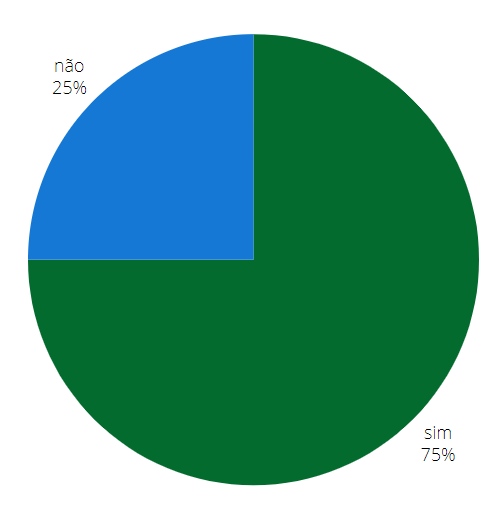

## Introdução
Após o planejamento da avaliação feito, agora iremos verificar a Análise de Tarefas GOMS.

## Objetivo
Esse artefato tem como obejtivo avaliar os GOMS feitos pelo grupo 04 de Interação Humano Computador(IHC) do semestre 2024.1.

## Metodologia
A metodologia ultilizada é a de inspeção, respondendo os checklists. Cada integrate ficará responsável por avaliar o GOMS de outro membro do grupo.

## Funcionalidades Tratadas no GOMS
A tabela 1 descreve os integrantes responsáveis que fizeram o GOMS, o artefato de cada um com um link levando para a verificação do artefado no docuemnto e o integrante que fez a verificação.

    Tabela 1: verificação e seus resoponsáveis
| Integrante responsável que fez o GOMS | Funcionalidade | Integrante responsável pela verificação |
| :------------------------------------------------------: | ------------------------------------------- | -------------------------- |
| [Giovana Silva](https://github.com/gio221) | [Denuncia Online](#denuncia) |     [Raissa Andrade](https://github.com/RaissaAndradeS) |             
| [Lara Giuliana](https://github.com/gravelylara) | [Pesquisar Procurados](#pesquisar)  | [Renata Quadros](https://github.com/Renatinha28) |            
| [Raissa Andrade](https://github.com/RaissaAndradeS) | [Carteira de identidade](#carteira)  | [Renata Quadros](https://github.com/Renatinha28) |
| [Rayene Almeida](https://github.com/rayenealmeida) | [Registra Ocorrência](#registrar) | [Giovana Silva](https://github.com/gio221) |   
| [Renata Quadros](https://github.com/Renatinha28) |  [Solicitar Antecedentes](#solicitar)| [Rayene Almeida](https://github.com/rayenealmeida) |
| [Renata Quadros](https://github.com/Renatinha28) |  [Retrato Falado](#retrato) |  [Lara Giuliana](https://github.com/gravelylara) |

  Fonte - [Renata Quadros](https://github.com/Renatinha28). 

## 1-Pesquisar Procurados 
### Checklist GOMS 
A tabela 2 descreve a verificação da GOMS da Lara.

      Tabela 2: verificação GOMS - Lara.
| ID | Descrição | Avaliação | Referência | Print |
| :----: | --------- | ---------- | ----------- | ------- |
| 1 | Os objetivos do usuário foram claramente definidos no diagrama? | Sim| "6.4.2 GOMS (Goals, Operators, Methods, And Selection Rules)" | [Página 216.1](../../../assets/verificacao/verificação%20nosso%20grupo/etapa2/Pagina216.1.png) |
| 2 | Os operadores incluídos no diagrama são bem definidos, internos ou externos? |Incompleto | "6.4.2 GOMS (Goals, Operators, Methods, And Selection Rules)" | [Página 216.2](../../../assets/verificacao/verificação%20nosso%20grupo/etapa2/Pagina216.2.png) |
| 3 | Os métodos para atingir os objetivos foram sequenciados corretamente? |Incompleto | "6.4.2 GOMS (Goals, Operators, Methods, And Selection Rules)" | [Página 217.1](../../../assets/verificacao/verificação%20nosso%20grupo/etapa2/Pagina217.1.png) |
| 4 | Foi utilizado um nível de detalhe apropriado no diagrama, atendendo aos objetivos da análise? | Não| "6.4.2 GOMS (Goals, Operators, Methods, And Selection Rules)" | [Página 220.1](../../../assets/verificacao/verificação%20nosso%20grupo/etapa2/Pagina220.1.png) |

  Fonte - [Renata Quadros](https://github.com/Renatinha28). 

### Gravação
A verificação foi feita pela integrante [Renata Quadros](https://github.com/Renatinha28) e a gravação está logo abaixo.

    <iframe width="560" height="315" src="https://www.youtube.com/embed/IFkWNAiqVxU" title="YouTube video player" frameborder="0" allow="accelerometer; autoplay; clipboard-write; encrypted-media; gyroscope; picture-in-picture; web-share" referrerpolicy="strict-origin-when-cross-origin" allowfullscreen></iframe>

    <a href="https://www.youtube.com/watch?v=IFkWNAiqVxU" target="_blank">Vídeo da verificação: GOMS - Lara </a>

### Problemas encontrados
- ID 2: Os operadores incluídos no diagrama não são bem definidos.
- ID 3: Os métodos para atingir os objetivos foram sequenciados corretamente, mas está confuso.
- ID 4: Foi utilizado um nível de detalhe apropriado no diagrama, mas está confuso,

### Soluções
- ID 2: Definir os operadores incluídos no diagrama.
- ID 3: Organizar os métodos para atingir os objetivos .
- ID 4: Organizar o nível de detalhe apropriado no diagrama.

### Conclusão
O GOMS precisa de melhorias, como mostra a figura 1.

 Figura 5 - conclusão verificação do cenário: Raissa.

  
Fonte: <a href="https://github.com/Renatinha28">Renata Quadros</a>
 
    

### Cronograma do reprojeto
A tabela 3 descreve o artefato a ser corrigido, o integrante responsável pela correção, o que corrigir e a data da correção.

      Tabela 11: cronograma do reprojeto
| Data da correção | Descrição | Responsável(eis) | Status |
| :----------------------: | -------------------- | ---------------- | --------------- |
|21/06| Definir os operadores incluídos no diagrama, organizar os métodos para atingir os objetivos e o nível de detalhe apropriado no diagrama. | [Lara Giuliana](https://github.com/gravelylara) | |

## 2- Solicitar Antecedentes Criminais 
### Checklist GOMS

| ID | Descrição | Avaliação | Referência | Print |
| :----: | --------- | ---------- | ----------- | ------- |
| 1 | Os objetivos do usuário foram claramente definidos no diagrama? |Sim | "6.4.2 GOMS (Goals, Operators, Methods, And Selection Rules)" | [Página 216.1](../../../assets/verificacao/verificação%20nosso%20grupo/etapa2/Pagina216.1.png) |
| 2 | Os operadores incluídos no diagrama são bem definidos, internos ou externos? | Sim| "6.4.2 GOMS (Goals, Operators, Methods, And Selection Rules)" | [Página 216.2](../../../assets/verificacao/verificação%20nosso%20grupo/etapa2/Pagina216.2.png) |
| 3 | Os métodos para atingir os objetivos foram sequenciados corretamente? |Sim | "6.4.2 GOMS (Goals, Operators, Methods, And Selection Rules)" | [Página 217.1](../../../assets/verificacao/verificação%20nosso%20grupo/etapa2/Pagina217.1.png) |
| 4 | Foi utilizado um nível de detalhe apropriado no diagrama, atendendo aos objetivos da análise? | Sim | "6.4.2 GOMS (Goals, Operators, Methods, And Selection Rules)" | [Página 220.1](../../../assets/verificacao/verificação%20nosso%20grupo/etapa2/Pagina220.1.png) |

### Gravação

    <iframe width="560" height="315" src="https://www.youtube.com/embed/g9D9KdG4Cfo
    " title="YouTube video player" frameborder="0" allow="accelerometer; autoplay; clipboard-write; encrypted-media; gyroscope; picture-in-picture; web-share" referrerpolicy="strict-origin-when-cross-origin" allowfullscreen></iframe>

    <a href="https://www.youtube.com/embed/g9D9KdG4Cfo" target="_blank">Vídeo da verificação: GOMS - Renata </a>

### Problemas encontrados
- Não foi encontrado problemas

### Soluções
- Não possui soluções pois não foi encontrado problemas

### Conclusão

A Figura 2 mostra como ficou as respostas obtidas 

 Figura 2 - Respostas da verificação 
 

 

### Cronograma do reprojeto

| Data da Correção | Descrição | Responsável(eis) | Status |
|:----------------:|:----------|:-----------------|:-------|
| 23/06            | Não precisa de reprojeto | Renata          |    Concluído     |

## 3- 197- Denúncia Online 
### Checklist GOMS

| ID | Descrição | Avaliação | Referência | Print |
| :----: | --------- | ---------- | ----------- | ------- |
| 1 | Os objetivos do usuário foram claramente definidos no diagrama? | Sim | "6.4.2 GOMS (Goals, Operators, Methods, And Selection Rules)" | [Página 216.1](../../../assets/verificacao/verificação%20nosso%20grupo/etapa2/Pagina216.1.png) |
| 2 | Os operadores incluídos no diagrama são bem definidos, internos ou externos? | Sim | "6.4.2 GOMS (Goals, Operators, Methods, And Selection Rules)" | [Página 216.2](../../../assets/verificacao/verificação%20nosso%20grupo/etapa2/Pagina216.2.png) |
| 3 | Os métodos para atingir os objetivos foram sequenciados corretamente? | Sim | "6.4.2 GOMS (Goals, Operators, Methods, And Selection Rules)" | [Página 217.1](../../../assets/verificacao/verificação%20nosso%20grupo/etapa2/Pagina217.1.png) |
| 4 | Foi utilizado um nível de detalhe apropriado no diagrama, atendendo aos objetivos da análise? | Não, poderia ter mais detalhes| "6.4.2 GOMS (Goals, Operators, Methods, And Selection Rules)" | [Página 220.1](../../../assets/verificacao/verificação%20nosso%20grupo/etapa2/Pagina220.1.png) |

 
 fonte: [Raissa Andrade](https://github.com/RaissaAndradeS) 

### Gravação

<iframe width="560" height="315" src="https://www.youtube.com/embed/26zcZmY9b60" frameborder="0" allow="accelerometer; autoplay; clipboard-write; encrypted-media; gyroscope; picture-in-picture" allowfullscreen></iframe>

 fonte: [Raissa Andrade](https://github.com/RaissaAndradeS) 

### Problemas encontrados

- ID 4: Falta detalhes da análise. 

### Soluções

Colocar o ID 4.

### Conclusão

 fonte: [Raissa Andrade](https://github.com/RaissaAndradeS) 

### Cronograma do reprojeto

| Data da correção | Descrição | Responsável(eis) | Status |
| :----------------------: | -------------------- | ---------------- | --------------- |
|23/06| Acrescentar detalhes da análise  | [Giovana Silva](https://github.com/gio221) |feito|

 fonte: [Raissa Andrade](https://github.com/RaissaAndradeS) 

## 4- Solicitar Carteira de Identidade 
### Checklist GOMS
A tabela 10 descreve a verificação da GOMS da Raissa.

      Tabela 10: verificação da GOMS - Raissa
| ID | Descrição | Avaliação | Referência | Print |
| :----: | --------- | ---------- | ----------- | ------- |
| 1 | Os objetivos do usuário foram claramente definidos no diagrama? |Sim | "6.4.2 GOMS (Goals, Operators, Methods, And Selection Rules)" | [Página 216.1](../../../assets/verificacao/verificação%20nosso%20grupo/etapa2/Pagina216.1.png) |
| 2 | Os operadores incluídos no diagrama são bem definidos, internos ou externos? | Sim| "6.4.2 GOMS (Goals, Operators, Methods, And Selection Rules)" | [Página 216.2](../../../assets/verificacao/verificação%20nosso%20grupo/etapa2/Pagina216.2.png) |
| 3 | Os métodos para atingir os objetivos foram sequenciados corretamente? |Sim | "6.4.2 GOMS (Goals, Operators, Methods, And Selection Rules)" | [Página 217.1](../../../assets/verificacao/verificação%20nosso%20grupo/etapa2/Pagina217.1.png) |
| 4 | Foi utilizado um nível de detalhe apropriado no diagrama, atendendo aos objetivos da análise? |Sim| "6.4.2 GOMS (Goals, Operators, Methods, And Selection Rules)" | [Página 220.1](../../../assets/verificacao/verificação%20nosso%20grupo/etapa2/Pagina220.1.png) |

### Gravação
A verificação foi feita pela integrante [Renata Quadros](https://github.com/Renatinha28) e a gravação está logo abaixo.

    <iframe width="560" height="315" src="https://www.youtube.com/embed/5xLq7YS3_m0" title="YouTube video player" frameborder="0" allow="accelerometer; autoplay; clipboard-write; encrypted-media; gyroscope; picture-in-picture; web-share" referrerpolicy="strict-origin-when-cross-origin" allowfullscreen></iframe>

    <a href="https://www.youtube.com/watch?v=5xLq7YS3_m0" target="_blank">Vídeo da verificação: GOMS - Raissa </a>

### Problemas encontrados
Não foi encontrado nenhum problema de acordo com o checklist.

### Soluções
Como não foi encontrado problemas, não tem sugestão de melhoria.

### Conclusão
O GOMS está ótimo, como mostra a figura 5.

 Figura 5 - conclusão verificação 

  
Fonte: <a href="https://github.com/Renatinha28">Renata Quadros</a>
 
    

### Cronograma do reprojeto
Como não há problemas encontrados, não há necessidade de um reprojeto.

## 5- Registrar Ocorrência 
### Checklist GOMS

| ID | Descrição | Avaliação | Referência | Print |
| :----: | --------- | ---------- | ----------- | ------- |
| 1 | Os objetivos do usuário foram claramente definidos no diagrama? | Sim| "6.4.2 GOMS (Goals, Operators, Methods, And Selection Rules)" | [Página 216.1](../../../assets/verificacao/verificação%20nosso%20grupo/etapa2/Pagina216.1.png) |
| 2 | Os operadores incluídos no diagrama são bem definidos, internos ou externos? |Sim | "6.4.2 GOMS (Goals, Operators, Methods, And Selection Rules)" | [Página 216.2](../../../assets/verificacao/verificação%20nosso%20grupo/etapa2/Pagina216.2.png) |
| 3 | Os métodos para atingir os objetivos foram sequenciados corretamente? |Sim | "6.4.2 GOMS (Goals, Operators, Methods, And Selection Rules)" | [Página 217.1](../../../assets/verificacao/verificação%20nosso%20grupo/etapa2/Pagina217.1.png) |
| 4 | Foi utilizado um nível de detalhe apropriado no diagrama, atendendo aos objetivos da análise? |Sim | "6.4.2 GOMS (Goals, Operators, Methods, And Selection Rules)" | [Página 220.1](../../../assets/verificacao/verificação%20nosso%20grupo/etapa2/Pagina220.1.png) |

### Gravação
A verificação do checklist foi feita pela integrante [Giovana Barbosa](https://github.com/gio221), como mostra no video

    <iframe width="560" height="315" src="https://www.youtube.com/embed/8uWe7EIY4SY" title="YouTube video player" frameborder="0" allow="accelerometer; autoplay; clipboard-write; encrypted-media; gyroscope; picture-in-picture; web-share" referrerpolicy="strict-origin-when-cross-origin" allowfullscreen></iframe>

    <a href="https://www.youtube.com/watch?v=8uWe7EIY4SY" target="_blank">Vídeo da verificação: GOMS - Raissa </a>

### Problemas encontrados
Não foi encontrado nenhum problema de acordo com o checklist.

### Soluções
Como não foi encontrado problemas, não tem sugestão de melhoria.

### Conclusão
O GOMS está ótimo, como mostra a figura 5.

 Figura 1 - Respostas da verificação 

 
  
Fonte: <a href="https://github.com/gio221">Giovana Barbosa</a>

        

### Cronograma do reprojeto
Como não há problemas encontrados, não há necessidade de um reprojeto.

## 6- Retrato Falado Online 
### Checklist GOMS

| ID | Descrição | Avaliação | Referência | Print |
| :----: | --------- | ---------- | ----------- | ------- |
| 1 | Os objetivos do usuário foram claramente definidos no diagrama? | Incompleto | "6.4.2 GOMS (Goals, Operators, Methods, And Selection Rules)" | [Página 216.1](../../../assets/verificacao/verificação%20nosso%20grupo/etapa2/Pagina216.1.png) |
| 2 | Os operadores incluídos no diagrama são bem definidos, internos ou externos? | Sim | "6.4.2 GOMS (Goals, Operators, Methods, And Selection Rules)" | [Página 216.2](../../../assets/verificacao/verificação%20nosso%20grupo/etapa2/Pagina216.2.png) |
| 3 | Os métodos para atingir os objetivos foram sequenciados corretamente? | Sim | "6.4.2 GOMS (Goals, Operators, Methods, And Selection Rules)" | [Página 217.1](../../../assets/verificacao/verificação%20nosso%20grupo/etapa2/Pagina217.1.png) |
| 4 | Foi utilizado um nível de detalhe apropriado no diagrama, atendendo aos objetivos da análise? | Sim | "6.4.2 GOMS (Goals, Operators, Methods, And Selection Rules)" | [Página 220.1](../../../assets/verificacao/verificação%20nosso%20grupo/etapa2/Pagina220.1.png) |

  Fonte - [Renata Quadros](https://github.com/Renatinha28). 

### Gravação
A verificação foi feita pela integrante [Lara Giuliana](https://github.com/gravelylara) e a gravação está logo abaixo.

<iframe width="560" height="315" src="https://www.youtube.com/embed/KMTiPq_kv_c" title="YouTube video player" frameborder="0" allow="accelerometer; autoplay; clipboard-write; encrypted-media; gyroscope; picture-in-picture; web-share" referrerpolicy="strict-origin-when-cross-origin" allowfullscreen></iframe>

<a href="https://youtu.be/KMTiPq_kv_c" target="blanket">Vídeo da Verificação</a>

### Problemas encontrados
- ID 1: O objetivo inicial da GOMS não está bem definido

### Soluções
- ID 1: Definir melhor objetivo inicial do usuário, como por exemplo "obter um retrato falado para realizar denúncia"

### Conclusão
O GOMS precisa de melhorias, como mostra a figura 1.

 Figura 6 - conclusão verificação do cenário: Renata.

  
Fonte: <a href="https://github.com/gravelylara">Lara Giuliana</a>
 
    

### Cronograma do reprojeto
A tabela 3 descreve o artefato a ser corrigido, o integrante responsável pela correção, o que corrigir e a data da correção.

      Tabela 11: cronograma do reprojeto
| Data da correção | Descrição | Responsável(eis) | Status |
| :----------------------: | -------------------- | ---------------- | --------------- |
|23/06| Definir objetivo incluídos no diagrama| [Renata Quadros](https://github.com/Renatinha28) |feito |

## Bibliografia
> BARBOSA, S.D.J.; SILVA, B.S. Interação Humano-Computador. Editora Campus-Elsevier, 2010.

> https://interacao-humano-computador.github.io/2024.1-PCDF/

## Histórico de Versões
      Tabela que descreve o Histórico de Versões

|     Versão       |     Descrição      |      Autor(es)      | Data           |  Revisor(es)          |Data de revisão|
| :----------------------------------------------------------: | :-------------------------------: | :-------------------------------------------------: | :-------------------------------: |  :-------------------------------: | :-------------------------------: |
| 1.0 | Verificando Registrar ocorrência |  [Giovana Barbosa](https://github.com/gio221) | 17/06 | [Renata Quadros](https://github.com/Renatinha28), [Rayene Almeida](https://github.com/rayenealmeida)  | 19/06 |
| 1.1 | Verificando Registrar ocorrência |  [Giovana Barbosa](https://github.com/gio221) | 17/06 | [Renata Quadros](https://github.com/Renatinha28),  [Rayene Almeida](https://github.com/rayenealmeida)  | 19/06 |
| 1.2 | Verificação pesquisar procurados e solicitar carteira de identidade | [Renata Quadros](https://github.com/Renatinha28) | 19/06 | [Giovana Barbosa](https://github.com/gio221) | 22/06 
| 1.3 | Verificação pesquisar procurados e solicitar carteira de identidade | [Renata Quadros](https://github.com/Renatinha28) | 19/06 | [Giovana Barbosa](https://github.com/gio221), [Rayene Almeida](https://github.com/rayenealmeida) | 22/06 
| 1.4 | Verificação de Denúncia Online |  [Raissa Andrade](https://github.com/RaissaAndradeS)  | 23/06 |  [Rayene Almeida](https://github.com/rayenealmeida) | 23/06 |
| 1.5| Verificação Antecedentes Criminais| [Rayene Almeida](https://github.com/rayenealmeida) | 23/06 |  [Giovana Barbosa](https://github.com/gio221)    |08/07
| 1.6 | Verificação de Denúncia Online |  [Raissa Andrade](https://github.com/RaissaAndradeS)  | 23/06 |  [Giovana Barbosa](https://github.com/gio221),  [Rayene Almeida](https://github.com/rayenealmeida) | 24/06
