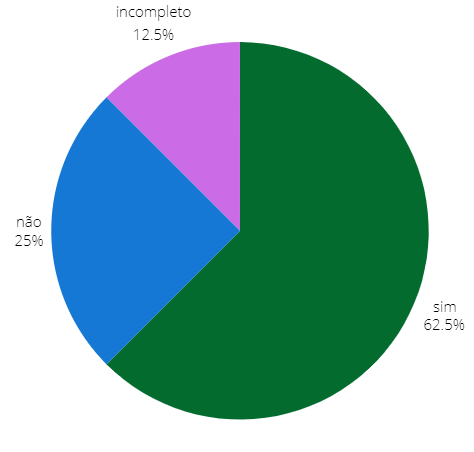

## Introdução
Após realizamos o planejamento da verificação, agora vamos, de fato, verificar os artefatos desta etapa.

## Objetivo
Esse artefato tem como obejtivo avaliar as Análises de Tarefas feitas pelo grupo 04 de Interação Humano Computador(IHC) do semestre 2024.1.

## Metodologia
A metodologia ultilizada é a de inspeção, vamos responder os checklists previamente elaborados. Cada integrante irá verificar ao menos uma análise de tarefas feita por outro membro do grupo.

## Funcionalidades Tratadas na Análise de Tarefas
A tabela 1 descreve os integrantes responsáveis que fizeram o análise, o artefato de cada um com um link levando para a verificação do artefado no docuemnto e o integrante que fez a verificação.

    Tabela 1: verificação e seus resoponsáveis
| Integrante responsável que fez o storyboard | Funcionalidade | Integrante responsável pela verificação |
| :------------------------------------------------------: | ------------------------------------------- | -------------------------- |
| [Giovana Silva](https://github.com/gio221) | [Denuncia Online](#denuncia) |     [Raissa Andrade](https://github.com/RaissaAndradeS) |             
| [Lara Giuliana](https://github.com/gravelylara) | [Pesquisar Procurados](#pesquisar)  | [Renata Quadros](https://github.com/Renatinha28) |            
| [Raissa Andrade](https://github.com/RaissaAndradeS) | [Carteira de identidade](#carteira)  | [Renata Quadros](https://github.com/Renatinha28) |
| [Rayene Almeida](https://github.com/rayenealmeida) | [Registra Ocorrência](#registrar) | [Giovana Silva](https://github.com/gio221) |   
| [Renata Quadros](https://github.com/Renatinha28) |  [Solicitar Antecedentes](#solicitar)| [Rayene Almeida](https://github.com/rayenealmeida) |
| [Renata Quadros](https://github.com/Renatinha28) |  [Retrato Falado](#retrato) |  [Lara Giuliana](https://github.com/gravelylara) |

  Fonte - [Renata Quadros](https://github.com/Renatinha28). 

## 1-Pesquisar Procurados 
### Checklist Relato da Análise de Tarefas.
A tabela 2 descreve o checklist do relato da análise de tarefas da Lara.

      Tabela 2: verificação do Relato da Análise de Tarefas - Lara
| ID | Descrição | Avaliação | Referência | Print |
| :----: | --------- | ---------- | ----------- | ------- |
|1|Possui uma descrição dos objetivos?| Sim, mas apenas no início do documento. |página 279|[Print](../../../assets/verificacao/verificação%20nosso%20grupo/etapa%205/print-relato%20dos%20resultados.png)|
|2|Possui uma descrição do método de avaliação empregado?| Sim. |página 279|[Print](../../../assets/verificacao/verificação%20nosso%20grupo/etapa%205/print-relato%20dos%20resultados.png)|
|3|Possui uma explicação do número e o perfil de usuários e avaliadores que participaram da avaliação?| Sim, no início do documento. |página 279|[Print](../../../assets/verificacao/verificação%20nosso%20grupo/etapa%205/print-relato%20dos%20resultados.png)|
|4|Possui um sumário dos dados coletados, incluindo tabelas e gráficos?| Incompleto, não tem gráficos. |página 279|[Print](../../../assets/verificacao/verificação%20nosso%20grupo/etapa%205/print-relato%20dos%20resultados.png)|
|5|Possui um relato da interpretação e análise dos dados?| Não. |página 279|[Print](../../../assets/verificacao/verificação%20nosso%20grupo/etapa%205/print-relato%20dos%20resultados.png)|
|6|Possui uma lista dos problemas encontrados?| Não consta, pois não teve problemas encontrados. |página 279|[Print](../../../assets/verificacao/verificação%20nosso%20grupo/etapa%205/print-relato%20dos%20resultados.png)|
|7| A coleta de dados ocorreu conforme o planejamento realizado e o método de avaliação selecionado?| Sim. |página 277|[Print](../../../assets/verificacao/verificação%20nosso%20grupo/etapa%205/print-relato%20dos%20resultados2.png)|
|8|Foi explicado ao entrevistado os objetivos do estudo e o procedimento da avaliação| Sim, no termo de consentimento |página 277|[Print](../../../assets/verificacao/verificação%20nosso%20grupo/etapa%205/print-relato%20dos%20resultados3.png)|

### Gravação
A verificação foi feita pela integrante [Renata Quadros](https://github.com/Renatinha28) e a gravação está logo abaixo.

    <iframe width="560" height="315" src="https://www.youtube.com/embed/qFXd-_BuwWY" title="YouTube video player" frameborder="0" allow="accelerometer; autoplay; clipboard-write; encrypted-media; gyroscope; picture-in-picture; web-share" referrerpolicy="strict-origin-when-cross-origin" allowfullscreen></iframe>

    <a href="https://www.youtube.com/watch?v=qFXd-_BuwWY" target="_blank">Vídeo da verificação: Relado da Análise de Tarefas - Lara </a>

### Problemas encontrados
- ID 4: Não contém gráficos.
- ID 5: Não contém um relato da interpretação dos dados.

### Soluções
- ID 4: Adicionar gráficos.
- - ID 5: Adicionar um relato da interpretação dos dados. 

### Conclusão
Como mostra a figura 1, o relato está muito bom, só precisa de algumas melhorias.

 Figura 1 - Respostas da verificação

 
  
Fonte: <a href="https://github.com/gio221">Giovana Barbosa</a>

        

### Cronograma do reprojeto
A tabela 3 descreve o artefato a ser corrigido, o integrante responsável pela correção, o que corrigir e a data da correção.

      Tabela 3: cronograma do reprojeto
| Data da correção | Descrição | Responsável(eis) | Status |
| :----------------------: | -------------------- | ---------------- | --------------- |
|21/06| Adicionar gráficos| [Lara Giuliana](https://github.com/gravelylara) | |

  Fonte - [Renata Quadros](https://github.com/Renatinha28). 

## 2- Solicitar Antecedentes Criminais 
### Checklist Relato da Análise de Tarefas.

| ID | Descrição | Avaliação | Referência | Print |
| :----: | --------- | ---------- | ----------- | ------- |
|1|Possui uma descrição dos objetivos?|Não|página 279|[Print](../../../assets/verificacao/verificação%20nosso%20grupo/etapa%205/print-relato%20dos%20resultados.png)|
|2|Possui uma descrição do método de avaliação empregado?|Sim|página 279|[Print](../../../assets/verificacao/verificação%20nosso%20grupo/etapa%205/print-relato%20dos%20resultados.png)|
|3|Possui uma explicação do número e o perfil de usuários e avaliadores que participaram da avaliação?|Não|página 279|[Print](../../../assets/verificacao/verificação%20nosso%20grupo/etapa%205/print-relato%20dos%20resultados.png)|
|4|Possui um sumário dos dados coletados, incluindo tabelas e gráficos?|Incompleto|página 279|[Print](../../../assets/verificacao/verificação%20nosso%20grupo/etapa%205/print-relato%20dos%20resultados.png)|
|5|Possui um relato da interpretação e análise dos dados?|Sim|página 279|[Print](../../../assets/verificacao/verificação%20nosso%20grupo/etapa%205/print-relato%20dos%20resultados.png)|
|6|Possui uma lista dos problemas encontrados?|Sim|página 279|[Print](../../../assets/verificacao/verificação%20nosso%20grupo/etapa%205/print-relato%20dos%20resultados.png)|
|7| A coleta de dados ocorreu conforme o planejamento realizado e o método de avaliação selecionado?|Sim|página 277|[Print](../../../assets/verificacao/verificação%20nosso%20grupo/etapa%205/print-relato%20dos%20resultados2.png)|
|8|Foi explicado ao entrevistado os objetivos do estudo e o procedimento da avaliação|Sim|página 277|[Print](../../../assets/verificacao/verificação%20nosso%20grupo/etapa%205/print-relato%20dos%20resultados3.png)|

### Gravação

    <iframe width="560" height="315" src="https://www.youtube.com/embed/i0NldeMllh8" title="YouTube video player" frameborder="0" allow="accelerometer; autoplay; clipboard-write; encrypted-media; gyroscope; picture-in-picture; web-share" referrerpolicy="strict-origin-when-cross-origin" allowfullscreen></iframe>

    <a href="https://www.youtube.com/embed/i0NldeMllh8" target="_blank">Vídeo da verificação: Protótipo de papel - Renata  </a>

### Problemas encontrados
- ID 1: Não possui uma descrição dos objetivos
- ID 3: Não possui uma explicação do número e o perfil de usuários e avaliadores que participaram da avaliação
- ID 4: Falta o gráfico

### Soluções
- ID 1: Adicionar descrição dos objetivos
- ID 3: Adicionar explicação do número e o perfil de usuários e avaliadores que participaram da avaliação
- ID 4: Adicionar gráfico dos resultados ou uma interpretação dos dados.

### Conclusão

A Figura 2 monstra como ficou as respostas obtidas 

 Figura 2 - Respostas da verificação 
 

### Cronograma do reprojeto

| Data da Correção | Descrição | Responsável(eis) | Status |
|:----------------:|:----------|:-----------------|:-------|
| 23/06            | Adicionar objetivos, gráfico e explicação do número e o perfil de usuários e avaliadores que participaram da avaliação | Renata          |    Feito     |

## 4- 197- Denúncia Online
### Checklist Relato da Análise de Tarefas.
| ID | Descrição | Avaliação | Referência | Print |
| :----: | --------- | ---------- | ----------- | ------- |
|1|Possui uma descrição dos objetivos?|Sim |página 279|[Print](../../../assets/verificacao/verificação%20nosso%20grupo/etapa%205/print-relato%20dos%20resultados.png)|
|2|Possui uma descrição do método de avaliação empregado?|Sim |página 279|[Print](../../../assets/verificacao/verificação%20nosso%20grupo/etapa%205/print-relato%20dos%20resultados.png)|
|3|Possui uma explicação do número e o perfil de usuários e avaliadores que participaram da avaliação?|Sim |página 279|[Print](../../../assets/verificacao/verificação%20nosso%20grupo/etapa%205/print-relato%20dos%20resultados.png)|
|4|Possui um sumário dos dados coletados, incluindo tabelas e gráficos?|Incompleto, falta os gráficos|página 279|[Print](../../../assets/verificacao/verificação%20nosso%20grupo/etapa%205/print-relato%20dos%20resultados.png)|
|5|Possui um relato da interpretação e análise dos dados?|Não|página 279|[Print](../../../assets/verificacao/verificação%20nosso%20grupo/etapa%205/print-relato%20dos%20resultados.png)|
|6|Possui uma lista dos problemas encontrados?|Não|página 279|[Print](../../../assets/verificacao/verificação%20nosso%20grupo/etapa%205/print-relato%20dos%20resultados.png)|
|7| A coleta de dados ocorreu conforme o planejamento realizado e o método de avaliação selecionado?|Sim|página 277|[Print](../../../assets/verificacao/verificação%20nosso%20grupo/etapa%205/print-relato%20dos%20resultados2.png)|
|8|Foi explicado ao entrevistado os objetivos do estudo e o procedimento da avaliação|Sim|página 277|[Print](../../../assets/verificacao/verificação%20nosso%20grupo/etapa%205/print-relato%20dos%20resultados3.png)|

        
Fonte:[Raissa Andrade](https://github.com/RaissaAndradeS)

  

### Gravação

        
Fonte:[Raissa Andrade](https://github.com/RaissaAndradeS)

  

### Problemas encontrados

- ID 4: Não possui um sumário dos dados coletados, está incompleto.
- ID 5: Não possui um relato da interpretação da análise de dados.
- ID 6: Não possui uma lista de problemas encontrados.

### Soluções

Adicionar o ID 4, ID 5 e ID 6. Todos listados acima.

### Conclusão

        
Fonte:[Raissa Andrade](https://github.com/RaissaAndradeS)

  

### Cronograma do reprojeto

      Tabela: cronograma do reprojeto
| Data da correção | Descrição | Responsável(eis) | Status |
| :----------------------: | -------------------- | ---------------- | --------------- |
|23/06| adicionar sumário dos dados coletados, um relato da interpretação da análise de dados e uma listas de problemas encontrados. | [Giovana Silva](https://github.com/gio221) | feito|

        
Fonte:[Raissa Andrade](https://github.com/RaissaAndradeS)

  

## 5- Solicitar Carteira de Identidade
### Checklist Relato da Análise de Tarefas.
A tabela 10 descreve o checklist do relato da análise de tarefas da Raissa.

      Tabela 10: verificação do Relato da Análise de Tarefas - Raissa
| ID | Descrição | Avaliação | Referência | Print |
| :----: | --------- | ---------- | ----------- | ------- |
|1|Possui uma descrição dos objetivos?| Sim. |página 279|[Print](../../../assets/verificacao/verificação%20nosso%20grupo/etapa%205/print-relato%20dos%20resultados.png)|
|2|Possui uma descrição do método de avaliação empregado?| Sim. |página 279|[Print](../../../assets/verificacao/verificação%20nosso%20grupo/etapa%205/print-relato%20dos%20resultados.png)|
|3|Possui uma explicação do número e o perfil de usuários e avaliadores que participaram da avaliação?| Sim, no início do documento. |página 279|[Print](../../../assets/verificacao/verificação%20nosso%20grupo/etapa%205/print-relato%20dos%20resultados.png)|
|4|Possui um sumário dos dados coletados, incluindo tabelas e gráficos?| Incompleto, não tem gráficos. |página 279|[Print](../../../assets/verificacao/verificação%20nosso%20grupo/etapa%205/print-relato%20dos%20resultados.png)|
|5|Possui um relato da interpretação e análise dos dados?| Não. |página 279|[Print](../../../assets/verificacao/verificação%20nosso%20grupo/etapa%205/print-relato%20dos%20resultados.png)|
|6|Possui uma lista dos problemas encontrados?| Não consta, pois não teve problemas encontrados. |página 279|[Print](../../../assets/verificacao/verificação%20nosso%20grupo/etapa%205/print-relato%20dos%20resultados.png)|
|7| A coleta de dados ocorreu conforme o planejamento realizado e o método de avaliação selecionado?| Sim. |página 277|[Print](../../../assets/verificacao/verificação%20nosso%20grupo/etapa%205/print-relato%20dos%20resultados2.png)|
|8|Foi explicado ao entrevistado os objetivos do estudo e o procedimento da avaliação| Sim, no termo de consentimento |página 277|[Print](../../../assets/verificacao/verificação%20nosso%20grupo/etapa%205/print-relato%20dos%20resultados3.png)|

### Gravação
A verificação foi feita pela integrante [Renata Quadros](https://github.com/Renatinha28) e a gravação está logo abaixo.

    <iframe width="560" height="315" src="https://www.youtube.com/embed/8XlxismFNAY" title="YouTube video player" frameborder="0" allow="accelerometer; autoplay; clipboard-write; encrypted-media; gyroscope; picture-in-picture; web-share" referrerpolicy="strict-origin-when-cross-origin" allowfullscreen></iframe>

    <a href="https://www.youtube.com/watch?v=8XlxismFNAY" target="_blank">Vídeo da verificação: Relato da Análise de Tarefas - Raissa </a>

### Problemas encontrados
- ID 4: Não contém gráficos.
- ID 5: Não contém um relato da interpretação dos dados.

### Soluções
- ID 4: Adicionar gráficos.
- ID 5: Adicionar um relato da interpretação dos dados. 

### Conclusão
Como mostra a figura 5, o relato está muito bom, só precisa de algumas melhorias.

 Figura 1 - Respostas da verificação

 
  
Fonte: <a href="https://github.com/gio221">Giovana Barbosa</a>

        

### Cronograma do reprojeto
A tabela 11 descreve o artefato a ser corrigido, o integrante responsável pela correção, o que corrigir e a data da correção.

      Tabela 3: cronograma do reprojeto
| Data da correção | Descrição | Responsável(eis) | Status |
| :----------------------: | -------------------- | ---------------- | --------------- |
|21/06| Adicionar gráficos| [Raissa Andrade](https://github.com/RaissaAndradeS) | |

  Fonte - [Renata Quadros](https://github.com/Renatinha28). 

## 6- Registrar Ocorrência 
### Checklist Relato da Análise de Tarefas.

| ID | Descrição | Avaliação | Referência | Print |
| :----: | --------- | ---------- | ----------- | ------- |
|1|Possui uma descrição dos objetivos?|Sim|página 279|[Print](../../../assets/verificacao/verificação%20nosso%20grupo/etapa%205/print-relato%20dos%20resultados.png)|
|2|Possui uma descrição do método de avaliação empregado?|Sim|página 279|[Print](../../../assets/verificacao/verificação%20nosso%20grupo/etapa%205/print-relato%20dos%20resultados.png)|
|3|Possui uma explicação do número e o perfil de usuários e avaliadores que participaram da avaliação?|Sim|página 279|[Print](../../../assets/verificacao/verificação%20nosso%20grupo/etapa%205/print-relato%20dos%20resultados.png)|
|4|Possui um sumário dos dados coletados, incluindo tabelas e gráficos?|Não|página 279|[Print](../../../assets/verificacao/verificação%20nosso%20grupo/etapa%205/print-relato%20dos%20resultados.png)|
|5|Possui um relato da interpretação e análise dos dados?|Não|página 279|[Print](../../../assets/verificacao/verificação%20nosso%20grupo/etapa%205/print-relato%20dos%20resultados.png)|
|6|Possui uma lista dos problemas encontrados?|Não se aplica|página 279|[Print](../../../assets/verificacao/verificação%20nosso%20grupo/etapa%205/print-relato%20dos%20resultados.png)|
|7| A coleta de dados ocorreu conforme o planejamento realizado e o método de avaliação selecionado?|Sim|página 277|[Print](../../../assets/verificacao/verificação%20nosso%20grupo/etapa%205/print-relato%20dos%20resultados2.png)|
|8|Foi explicado ao entrevistado os objetivos do estudo e o procedimento da avaliação|Sim|página 277|[Print](../../../assets/verificacao/verificação%20nosso%20grupo/etapa%205/print-relato%20dos%20resultados3.png)|

### Gravação

    <iframe width="560" height="315" src="https://www.youtube.com/embed/1L1YThhq4p8" title="YouTube video player" frameborder="0" allow="accelerometer; autoplay; clipboard-write; encrypted-media; gyroscope; picture-in-picture; web-share" referrerpolicy="strict-origin-when-cross-origin" allowfullscreen></iframe>

    <a href="https://www.youtube.com/watch?v=1L1YThhq4p8" target="_blank">Vídeo da verificação: Relado da Análise de Tarefas - Raissa </a>

### Problemas encontrados
- ID 4: Não contém gráficos.
- ID 5: Não contém um relato da interpretação dos dados.

### Soluções
- ID 4: Adicionar gráficos.
- ID 5: Adicionar um relato da interpretação dos dados. 

### Conclusão
Como mostra a figura 5, o relato está muito bom, só precisa de algumas melhorias.

 Figura 1 - Respostas da verificação

 
  
Fonte: <a href="https://github.com/gio221">Giovana Barbosa</a>

        

### Cronograma do reprojeto
      Tabela 3: cronograma do reprojeto
| Data da correção | Descrição | Responsável(eis) | Status |
| :----------------------: | -------------------- | ---------------- | --------------- |
|23/06| [Rayene Almeida](https://github.com/rayenealmeida)|Corrigir problemas encontrados||

## 7- Retrato Falado Online 
### Checklist Relato da Análise de Tarefas.

| ID | Descrição | Avaliação | Referência | Print |
| :----: | --------- | ---------- | ----------- | ------- |
|1|Possui uma descrição dos objetivos?|Sim|página 279|[Print](../../../assets/verificacao/verificação%20nosso%20grupo/etapa%205/print-relato%20dos%20resultados.png)|
|2|Possui uma descrição do método de avaliação empregado?|Sim|página 279|[Print](../../../assets/verificacao/verificação%20nosso%20grupo/etapa%205/print-relato%20dos%20resultados.png)|
|3|Possui uma explicação do número e o perfil de usuários e avaliadores que participaram da avaliação?|Sim|página 279|[Print](../../../assets/verificacao/verificação%20nosso%20grupo/etapa%205/print-relato%20dos%20resultados.png)|
|4|Possui um sumário dos dados coletados, incluindo tabelas e gráficos?|Não|página 279|[Print](../../../assets/verificacao/verificação%20nosso%20grupo/etapa%205/print-relato%20dos%20resultados.png)|
|5|Possui um relato da interpretação e análise dos dados?|Não|página 279|[Print](../../../assets/verificacao/verificação%20nosso%20grupo/etapa%205/print-relato%20dos%20resultados.png)|
|6|Possui uma lista dos problemas encontrados?|Não se aplica|página 279|[Print](../../../assets/verificacao/verificação%20nosso%20grupo/etapa%205/print-relato%20dos%20resultados.png)|
|7| A coleta de dados ocorreu conforme o planejamento realizado e o método de avaliação selecionado?|Sim|página 277|[Print](../../../assets/verificacao/verificação%20nosso%20grupo/etapa%205/print-relato%20dos%20resultados2.png)|
|8|Foi explicado ao entrevistado os objetivos do estudo e o procedimento da avaliação|Sim|página 277|[Print](../../../assets/verificacao/verificação%20nosso%20grupo/etapa%205/print-relato%20dos%20resultados3.png)|

    <iframe width="560" height="315" src="https://www.youtube.com/embed/VbnAmWlTD8Q" title="YouTube video player" frameborder="0" allow="accelerometer; autoplay; clipboard-write; encrypted-media; gyroscope; picture-in-picture; web-share" referrerpolicy="strict-origin-when-cross-origin" allowfullscreen></iframe>

    <a href="https://www.youtube.com/watch?v=VbnAmWlTD8Q" target="_blank">Vídeo da verificação: Relado da Análise de Tarefas - Raissa </a>

### Problemas encontrados
- ID 4: Não contém gráficos.
- ID 5: Não contém um relato da interpretação dos dados.

### Soluções
- ID 4: Adicionar gráficos.
- ID 5: Adicionar gráfico dos resultados ou uma interpretação dos dados.

### Conclusão
Como mostra a figura 5, o relato está muito bom, só precisa de algumas melhorias.

 Figura 5 - Respostas da verificação

 
  
Fonte: <a href="https://github.com/gio221">Giovana Barbosa</a>

        

### Cronograma do reprojeto
      Tabela 3: cronograma do reprojeto
| Data da correção | Descrição | Responsável(eis) | Status |
| :----------------------: | -------------------- | ---------------- | --------------- |
|23/06|Corrigir problemas encontrados | [Renata Quadros](https://github.com/Renatinha28) | Feito |

## Bibliografia
> 1. Barbosa, S. D. J.; Silva, B. S. da; Silveira, M. S.; Gasparini, I.; Darin, T.; Barbosa, G. D. J. (2021) Interação Humano-Computador e Experiência do usuário. Autopublicação. ISBN: 978-65-00-19677-1.
> 2.  ROGERS, Y.; SHARP, H.; PREECE, J. Design de interação: Além da interação humano-computador. Bookman Editora, 2013.
> 3. O que é Storyboard? Como fazer? Veja modelos e exemplos. Disponível em: [https://miro.com/pt/storyboard/o-que-e-storyboard/](https://miro.com/pt/storyboard/o-que-e-storyboard/)

## Histórico de Versões
      Tabela que descreve o Histórico de Versões

|     Versão       |     Descrição      |      Autor(es)      | Data           |  Revisor(es)          |Data de revisão|
| :----------------------------------------------------------: | :-------------------------------: | :-------------------------------------------------: | :-------------------------------: |  :-------------------------------: | :-------------------------------: |
| 1.0 | Verificando denuncia online |  [Giovana Barbosa](https://github.com/gio221) | 17/06 | [Renata Quadros](https://github.com/Renatinha28) | 19/06 |
| 1.1 | Verificação de pesquisar procurados e de solicitar carteira de identidade | [Renata Quadros](https://github.com/Renatinha28) | 19/06 |  [Giovana Barbosa](https://github.com/gio221) |22/06
| 1.2| Verificação Antecedentes Criminais| [Rayene Almeida](https://github.com/rayenealmeida) | 23/06 |  [Giovana Barbosa](https://github.com/gio221)    |08/07

