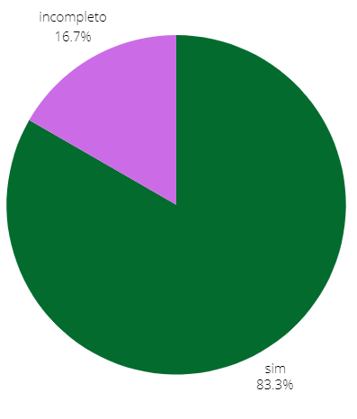

## Introdução
Depois que realizamos o planejamento da avaliação, agora iremos verificar os Relatos dos Storyboards.

## Objetivo
Esse artefato tem como obejtivo avaliar os relatos dos storyboards feitos pelo grupo 04 de Interação Humano Computador(IHC).

## Metodologia
A metodologia ultilizada é a de inspeção, iremos responder os checklist planejados previamente. Cada integrante será responsável por verificar ao menos um relato feito por outro membro do grupo.

## Funcionalidades Tratadas no Stroryboard
A tabela 1 descreve os integrantes responsáveis que fizeram o relato do storyboard, o artefato de cada um com um link levando para a verificação do artefado no docuemnto e o integrante que fez a verificação.

    Tabela 1: verificação e seus resoponsáveis
| Integrante responsável que fez o storyboard | Funcionalidade | Integrante responsável pela verificação |
| :------------------------------------------------------: | ------------------------------------------- | -------------------------- |
| [Giovana Silva](https://github.com/gio221) | [Denuncia Online](#denuncia) |     [Raissa Andrade](https://github.com/RaissaAndradeS) |             
| [Lara Giuliana](https://github.com/gravelylara) | [Pesquisar Procurados](#pesquisar)  | [Renata Quadros](https://github.com/Renatinha28) |            
| [Raissa Andrade](https://github.com/RaissaAndradeS) | [Carteira de identidade](#carteira)  | [Renata Quadros](https://github.com/Renatinha28) |
| [Rayene Almeida](https://github.com/rayenealmeida) | [Registra Ocorrência](#registrar) | [Giovana Silva](https://github.com/gio221) |   
| [Renata Quadros](https://github.com/Renatinha28) |  [Solicitar Antecedentes](#solicitar)| [Rayene Almeida](https://github.com/rayenealmeida) |
| [Renata Quadros](https://github.com/Renatinha28) |  [Retrato Falado](#retrato) |  [Lara Giuliana](https://github.com/gravelylara) |

  Fonte - [Renata Quadros](https://github.com/Renatinha28). 

## 1-Pesquisar Procurados 
### Checklist Relato do Storyboards
A tabela 2 descreve o checklist do relato do storyboard da Lara.

      Tabela 2: verificação relato storyboard - Lara.
| ID | Descrição | Avaliação | Referência | Print |
| :----: | --------- | ---------- | ----------- | ------- |
|1|Possui uma descrição dos objetivos?| Sim, mas apenas no início do documento. |página 279|[Print](../../../assets/verificacao/verificação%20nosso%20grupo/etapa%205/print-relato%20dos%20resultados.png)|
|2|Possui uma descrição do método de avaliação empregado?| Sim, mas apenas no início do documento. |página 279|[Print](../../../assets/verificacao/verificação%20nosso%20grupo/etapa%205/print-relato%20dos%20resultados.png)|
|3|Possui uma explicação do número e o perfil de usuários e avaliadores que participaram da avaliação?| Sim, no início do documento. |página 279|[Print](../../../assets/verificacao/verificação%20nosso%20grupo/etapa%205/print-relato%20dos%20resultados.png)|
|4|Possui um sumário dos dados coletados, incluindo tabelas e gráficos?| Incompleto, tem tabelas mas não tem gráficos, |página 279|[Print](../../../assets/verificacao/verificação%20nosso%20grupo/etapa%205/print-relato%20dos%20resultados.png)|
|5|Possui um relato da interpretação e análise dos dados?| Não. |página 279|[Print](../../../assets/verificacao/verificação%20nosso%20grupo/etapa%205/print-relato%20dos%20resultados.png)|
|6|Possui uma lista dos problemas encontrados?| Não se aplica, pois não teve problemas encontrados. |página 279|[Print](../../../assets/verificacao/verificação%20nosso%20grupo/etapa%205/print-relato%20dos%20resultados.png)|
|7| A coleta de dados ocorreu conforme o planejamento realizado e o método de avaliação selecionado?| Sim. |página 277|[Print](../../../assets/verificacao/verificação%20nosso%20grupo/etapa%205/print-relato%20dos%20resultados2.png)|
|8|Foi explicado ao entrevistado os objetivos do estudo e o procedimento da avaliação| Sim, quando se apresentou o termo de consentimento. |página 277|[Print](../../../assets/verificacao/verificação%20nosso%20grupo/etapa%205/print-relato%20dos%20resultados3.png)|
|9|Possui a informação da quantidade de participantes, e de storyboards por participante| Sim. |página 279|[Print](../../../assets/verificacao/verificação%20nosso%20grupo/etapa%205/print-relato%20dos%20resultados.png)|

  Fonte - [Renata Quadros](https://github.com/Renatinha28). 

### Gravação
A verificação foi feita pela integrante [Renata Quadros](https://github.com/Renatinha28) e a gravação está logo abaixo.

    <iframe width="560" height="315" src="https://www.youtube.com/embed/D1boSBes5YE" title="YouTube video player" frameborder="0" allow="accelerometer; autoplay; clipboard-write; encrypted-media; gyroscope; picture-in-picture; web-share" referrerpolicy="strict-origin-when-cross-origin" allowfullscreen></iframe>

    <a href="https://www.youtube.com/watch?v=D1boSBes5YE" target="_blank">Vídeo da verificação: Relato do Storyboard - Lara </a>

### Problemas encontrados
- ID 4: não apresenta gráficos para análise dos dados.
- ID 5: não possui um relato da interpretação e análise dos dados.

### Soluções
- ID 4: adicionar gráficos para análise dos dados.
- ID 5: incluir um relato da interpretação e análise dos dados.

### Conclusão
O relato está bom, mas pode ser melhorado, como mostra a figura 1.

 Figura 1 - Respostas da verificação

 
  
Fonte: <a href="https://github.com/gio221">Giovana Barbosa</a>

        

### Cronograma do reprojeto
A tabela 3 descreve o artefato a ser corrigido, o integrante responsável pela correção, o que corrigir e a data da correção.

      Tabela 3: cronograma do reprojeto
| Data da correção | Descrição | Responsável(eis) | Status |
| :----------------------: | -------------------- | ---------------- | --------------- |
|21/06| adicionar gráficos para análise dos dados e um relato da interpretação e análise dos dados | [Lara Giuliana](https://github.com/gravelylara) | |

  Fonte - [Renata Quadros](https://github.com/Renatinha28). 

## 2- Solicitar Antecedentes Criminais 
### Checklist Relato do Storyboards

| ID | Descrição | Avaliação | Referência | Print |
| :----: | --------- | ---------- | ----------- | ------- |
|1|Possui uma descrição dos objetivos?|Não|página 279|[Print](../../../assets/verificacao/verificação%20nosso%20grupo/etapa%205/print-relato%20dos%20resultados.png)|
|2|Possui uma descrição do método de avaliação empregado?|Sim|página 279|[Print](../../../assets/verificacao/verificação%20nosso%20grupo/etapa%205/print-relato%20dos%20resultados.png)|
|3|Possui uma explicação do número e o perfil de usuários e avaliadores que participaram da avaliação?|Sim|página 279|[Print](../../../assets/verificacao/verificação%20nosso%20grupo/etapa%205/print-relato%20dos%20resultados.png)|
|4|Possui um sumário dos dados coletados, incluindo tabelas e gráficos?|Incompleto|página 279|[Print](../../../assets/verificacao/verificação%20nosso%20grupo/etapa%205/print-relato%20dos%20resultados.png)|
|5|Possui um relato da interpretação e análise dos dados?|Sim|página 279|[Print](../../../assets/verificacao/verificação%20nosso%20grupo/etapa%205/print-relato%20dos%20resultados.png)|
|6|Possui uma lista dos problemas encontrados?|Sim|página 279|[Print](../../../assets/verificacao/verificação%20nosso%20grupo/etapa%205/print-relato%20dos%20resultados.png)|
|7| A coleta de dados ocorreu conforme o planejamento realizado e o método de avaliação selecionado?|Sim|página 277|[Print](../../../assets/verificacao/verificação%20nosso%20grupo/etapa%205/print-relato%20dos%20resultados2.png)|
|8|Foi explicado ao entrevistado os objetivos do estudo e o procedimento da avaliação|Sim|página 277|[Print](../../../assets/verificacao/verificação%20nosso%20grupo/etapa%205/print-relato%20dos%20resultados3.png)|
|9|Possui a informação da quantidade de participantes, e de storyboards por participante|Sim|página 279|[Print](../../../assets/verificacao/verificação%20nosso%20grupo/etapa%205/print-relato%20dos%20resultados.png)|

### Gravação

    <iframe width="560" height="315" src="https://www.youtube.com/embed/r-M3GrdU01k" title="YouTube video player" frameborder="0" allow="accelerometer; autoplay; clipboard-write; encrypted-media; gyroscope; picture-in-picture; web-share" referrerpolicy="strict-origin-when-cross-origin" allowfullscreen></iframe>

    <a href="https://www.youtube.com/embed/r-M3GrdU01k" target="_blank">Vídeo da verificação:  Relato do Storyboard - Renata </a>

### Problemas encontrados
- ID 1: Não possui uma descrição dos objetivos
- ID 4: Não possui Gráfico 

### Soluções
- ID 1: Adicionar uma descrição dos objetivos
- ID 4: Adicionar gráfico dos resultados ou uma interpretação dos dados.

### Conclusão

A Figura 2 mostra como ficou as respostas obtidas 

 Figura 2 - Respostas da verificação 
 

### Cronograma do reprojeto

| Data da Correção | Descrição | Responsável(eis) | Status |
|:----------------:|:----------|:-----------------|:-------|
| 23/06            | Adicionar objetivos e gráfico | Renata          |    Feito     |

## 3- 197- Denúncia Online 
### Checklist Relato do Storyboards

| ID | Descrição | Avaliação | Referência | Print |
| :----: | --------- | ---------- | ----------- | ------- |
|1|Possui uma descrição dos objetivos?|Sim, no documento|página 279|[Print](../../../assets/verificacao/verificação%20nosso%20grupo/etapa%205/print-relato%20dos%20resultados.png)|
|2|Possui uma descrição do método de avaliação empregado?|Sim, no documento|página 279|[Print](../../../assets/verificacao/verificação%20nosso%20grupo/etapa%205/print-relato%20dos%20resultados.png)|
|3|Possui uma explicação do número e o perfil de usuários e avaliadores que participaram da avaliação?|Sim, no documento|página 279|[Print](../../../assets/verificacao/verificação%20nosso%20grupo/etapa%205/print-relato%20dos%20resultados.png)|
|4|Possui um sumário dos dados coletados, incluindo tabelas e gráficos?|Não|página 279|[Print](../../../assets/verificacao/verificação%20nosso%20grupo/etapa%205/print-relato%20dos%20resultados.png)|
|5|Possui um relato da interpretação e análise dos dados?|Incompleto|página 279|[Print](../../../assets/verificacao/verificação%20nosso%20grupo/etapa%205/print-relato%20dos%20resultados.png)|
|6|Possui uma lista dos problemas encontrados?|Não|página 279|[Print](../../../assets/verificacao/verificação%20nosso%20grupo/etapa%205/print-relato%20dos%20resultados.png)|
|7| A coleta de dados ocorreu conforme o planejamento realizado e o método de avaliação selecionado?|Sim|página 277Sim|[Print](../../../assets/verificacao/verificação%20nosso%20grupo/etapa%205/print-relato%20dos%20resultados2.png)|
|8|Foi explicado ao entrevistado os objetivos do estudo e o procedimento da avaliação|Sim|página 277|[Print](../../../assets/verificacao/verificação%20nosso%20grupo/etapa%205/print-relato%20dos%20resultados3.png)|
|9|Possui a informação da quantidade de participantes, e de storyboards por participante|Sim, no documento|página 279|[Print](../../../assets/verificacao/verificação%20nosso%20grupo/etapa%205/print-relato%20dos%20resultados.png)|

        
Fonte:[Raissa Andrade](https://github.com/RaissaAndradeS)

    

### Gravação

    <iframe width="560" height="315" src="https://www.youtube.com/embed/8plrl5mvUus" title="YouTube video player" frameborder="0" allow="accelerometer; autoplay; clipboard-write; encrypted-media; gyroscope; picture-in-picture; web-share" referrerpolicy="strict-origin-when-cross-origin" allowfullscreen></iframe>

    <a href="https://www.youtube.com/watch?v=8plrl5mvUus" target="_blank">Vídeo da verificação: Raissa  </a>

        
Fonte:[Raissa Andrade](https://github.com/RaissaAndradeS)

  

### Problemas encontrados

- ID 4: Não possui sumário dos dados coletados 
- ID 5: Não possui um relato da interpretação completo 
- ID 6: Não possui uma lista de problemas encontrados 

### Soluções

Arrumar os ID's listados acima, ID 4, ID 5 e ID 6.

### Conclusão

        
Fonte:[Raissa Andrade](https://github.com/RaissaAndradeS)

  

### Cronograma do reprojeto

      Tabela: cronograma do reprojeto
| Data da correção | Descrição | Responsável(eis) | Status |
| :----------------------: | -------------------- | ---------------- | --------------- |
|23/06| adicionar gráficos para análise dos dados e um relato da interpretação e análise dos dados | [Giovana Silva](https://github.com/gio221) |feito |

        
Fonte:[Raissa Andrade](https://github.com/RaissaAndradeS)

  

## 4- Solicitar Carteira de Identidade 
### Checklist Relato do Storyboards
A tabela 10 descreve o checklist do relato do storyboard da Raissa.

      Tabela 10: verificação relato storyboard - Raissa.
| ID | Descrição | Avaliação | Referência | Print |
| :----: | --------- | ---------- | ----------- | ------- |
|1|Possui uma descrição dos objetivos?| Sim, mas apenas no início do documento. |página 279|[Print](../../../assets/verificacao/verificação%20nosso%20grupo/etapa%205/print-relato%20dos%20resultados.png)|
|2|Possui uma descrição do método de avaliação empregado?| Sim, mas apenas no início do documento. |página 279|[Print](../../../assets/verificacao/verificação%20nosso%20grupo/etapa%205/print-relato%20dos%20resultados.png)|
|3|Possui uma explicação do número e o perfil de usuários e avaliadores que participaram da avaliação?| Sim, no início do documento. |página 279|[Print](../../../assets/verificacao/verificação%20nosso%20grupo/etapa%205/print-relato%20dos%20resultados.png)|
|4|Possui um sumário dos dados coletados, incluindo tabelas e gráficos?| Incompleto, tem tabelas mas não tem gráficos. |página 279|[Print](../../../assets/verificacao/verificação%20nosso%20grupo/etapa%205/print-relato%20dos%20resultados.png)|
|5|Possui um relato da interpretação e análise dos dados?| Não. |página 279|[Print](../../../assets/verificacao/verificação%20nosso%20grupo/etapa%205/print-relato%20dos%20resultados.png)|
|6|Possui uma lista dos problemas encontrados?| Não se aplica, pois não teve problemas encontrados. |página 279|[Print](../../../assets/verificacao/verificação%20nosso%20grupo/etapa%205/print-relato%20dos%20resultados.png)|
|7| A coleta de dados ocorreu conforme o planejamento realizado e o método de avaliação selecionado?| Sim. |página 277|[Print](../../../assets/verificacao/verificação%20nosso%20grupo/etapa%205/print-relato%20dos%20resultados2.png)|
|8|Foi explicado ao entrevistado os objetivos do estudo e o procedimento da avaliação| Sim, quando se apresentou o termo de consentimento. |página 277|[Print](../../../assets/verificacao/verificação%20nosso%20grupo/etapa%205/print-relato%20dos%20resultados3.png)|
|9|Possui a informação da quantidade de participantes, e de storyboards por participante| Sim. |página 279|[Print](../../../assets/verificacao/verificação%20nosso%20grupo/etapa%205/print-relato%20dos%20resultados.png)|

  Fonte - [Renata Quadros](https://github.com/Renatinha28). 

### Gravação
A verificação foi feita pela integrante [Renata Quadros](https://github.com/Renatinha28) e a gravação está logo abaixo.

    <iframe width="560" height="315" src="https://www.youtube.com/embed/D1boSBes5YE" title="YouTube video player" frameborder="0" allow="accelerometer; autoplay; clipboard-write; encrypted-media; gyroscope; picture-in-picture; web-share" referrerpolicy="strict-origin-when-cross-origin" allowfullscreen></iframe>

    <a href="https://www.youtube.com/watch?v=D1boSBes5YE" target="_blank">Vídeo da verificação: Relato do Storyboard - Raissa </a>

### Problemas encontrados
- ID 4: não apresenta gráficos para análise dos dados.
- ID 5: não possui um relato da interpretação e análise dos dados.

### Soluções
- ID 4: adicionar gráficos para análise dos dados.
- ID 5: incluir um relato da interpretação e análise dos dados.

### Conclusão
O relato está bom, mas pode ser melhorado, como mostra a figura 5.

 Figura 1 - Respostas da verificação

 
  
Fonte: <a href="https://github.com/gio221">Giovana Barbosa</a>

        

### Cronograma do reprojeto
A tabela 11 descreve o artefato a ser corrigido, o integrante responsável pela correção, o que corrigir e a data da correção.

      Tabela 3: cronograma do reprojeto
| Data da correção | Descrição | Responsável(eis) | Status |
| :----------------------: | -------------------- | ---------------- | --------------- |
|21/06| adicionar gráficos para análise dos dados e um relato da interpretação e análise dos dados | [Raissa Andrade](https://github.com/RaissaAndradeS) | |

  Fonte - [Renata Quadros](https://github.com/Renatinha28). 

## 5- Registrar Ocorrência 
### Checklist Relato do Storyboards

| ID | Descrição | Avaliação | Referência | Print |
| :----: | --------- | ---------- | ----------- | ------- |
|1|Possui uma descrição dos objetivos?|Sim|página 279|[Print](../../../assets/verificacao/verificação%20nosso%20grupo/etapa%205/print-relato%20dos%20resultados.png)|
|2|Possui uma descrição do método de avaliação empregado?|Sim|página 279|[Print](../../../assets/verificacao/verificação%20nosso%20grupo/etapa%205/print-relato%20dos%20resultados.png)|
|3|Possui uma explicação do número e o perfil de usuários e avaliadores que participaram da avaliação?|Sim|página 279|[Print](../../../assets/verificacao/verificação%20nosso%20grupo/etapa%205/print-relato%20dos%20resultados.png)|
|4|Possui um sumário dos dados coletados, incluindo tabelas e gráficos?|Sim|página 279|[Print](../../../assets/verificacao/verificação%20nosso%20grupo/etapa%205/print-relato%20dos%20resultados.png)|
|5|Possui um relato da interpretação e análise dos dados?|Não|página 279|[Print](../../../assets/verificacao/verificação%20nosso%20grupo/etapa%205/print-relato%20dos%20resultados.png)|
|6|Possui uma lista dos problemas encontrados?|Não|página 279|[Print](../../../assets/verificacao/verificação%20nosso%20grupo/etapa%205/print-relato%20dos%20resultados.png)|
|7| A coleta de dados ocorreu conforme o planejamento realizado e o método de avaliação selecionado?|Sim|página 277|[Print](../../../assets/verificacao/verificação%20nosso%20grupo/etapa%205/print-relato%20dos%20resultados2.png)|
|8|Foi explicado ao entrevistado os objetivos do estudo e o procedimento da avaliação|Sim|página 277|[Print](../../../assets/verificacao/verificação%20nosso%20grupo/etapa%205/print-relato%20dos%20resultados3.png)|
|9|Possui a informação da quantidade de participantes, e de storyboards por participante|Sim|página 279|[Print](../../../assets/verificacao/verificação%20nosso%20grupo/etapa%205/print-relato%20dos%20resultados.png)|

### Gravação

    <iframe width="560" height="315" src="https://www.youtube.com/embed/A92Z7kd6fGQ" title="YouTube video player" frameborder="0" allow="accelerometer; autoplay; clipboard-write; encrypted-media; gyroscope; picture-in-picture; web-share" referrerpolicy="strict-origin-when-cross-origin" allowfullscreen></iframe>

    <a href="https://www.youtube.com/watch?v=A92Z7kd6fGQ" target="_blank">Vídeo da verificação: Storyboard - Raissa </a>

### Problemas encontrados
- ID 4: não apresenta gráficos para análise dos dados.
- ID 5: não possui um relato da interpretação e análise dos dados.

### Soluções
- ID 4: adicionar gráficos para análise dos dados.
- ID 5: incluir um relato da interpretação e análise dos dados.

### Conclusão
O relato está bom, mas pode ser melhorado, como mostra a figura 5.

 Figura 1 - Respostas da verificação

 
  
Fonte: <a href="https://github.com/gio221">Giovana Barbosa</a>

        

### Cronograma do reprojeto
      Tabela 3: cronograma do reprojeto
| Data da correção | Descrição | Responsável(eis) | Status |
| :----------------------: | -------------------- | ---------------- | --------------- |
|23/06| [Rayene Almeida](https://github.com/rayenealmeida)|Corrigir problemas encontrados||

## 6- Retrato Falado Online 
### Checklist Relato do Storyboards

| ID | Descrição | Avaliação | Referência | Print |
| :----: | --------- | ---------- | ----------- | ------- |
|1|Possui uma descrição dos objetivos?| Sim |página 279|[Print](../../../assets/verificacao/verificação%20nosso%20grupo/etapa%205/print-relato%20dos%20resultados.png)|
|2|Possui uma descrição do método de avaliação empregado?| Sim |página 279|[Print](../../../assets/verificacao/verificação%20nosso%20grupo/etapa%205/print-relato%20dos%20resultados.png)|
|3|Possui uma explicação do número e o perfil de usuários e avaliadores que participaram da avaliação?| Sim |página 279|[Print](../../../assets/verificacao/verificação%20nosso%20grupo/etapa%205/print-relato%20dos%20resultados.png)|
|4|Possui um sumário dos dados coletados, incluindo tabelas e gráficos?| Incompleto |página 279|[Print](../../../assets/verificacao/verificação%20nosso%20grupo/etapa%205/print-relato%20dos%20resultados.png)|
|5|Possui um relato da interpretação e análise dos dados?| Não |página 279|[Print](../../../assets/verificacao/verificação%20nosso%20grupo/etapa%205/print-relato%20dos%20resultados.png)|
|6|Possui uma lista dos problemas encontrados?| Não |página 279|[Print](../../../assets/verificacao/verificação%20nosso%20grupo/etapa%205/print-relato%20dos%20resultados.png)|
|7| A coleta de dados ocorreu conforme o planejamento realizado e o método de avaliação selecionado?| Sim |página 277|[Print](../../../assets/verificacao/verificação%20nosso%20grupo/etapa%205/print-relato%20dos%20resultados2.png)|
|8|Foi explicado ao entrevistado os objetivos do estudo e o procedimento da avaliação| Sim |página 277|[Print](../../../assets/verificacao/verificação%20nosso%20grupo/etapa%205/print-relato%20dos%20resultados3.png)|
|9|Possui a informação da quantidade de participantes, e de storyboards por participante| Sim |página 279|[Print](../../../assets/verificacao/verificação%20nosso%20grupo/etapa%205/print-relato%20dos%20resultados.png)|

  Fonte - [Lara Giuliana](https://github.com/gravelylara). 

### Gravação
A verificação foi feita pela integrante [Lara Giuliana](https://github.com/gravelylara) e a gravação está logo abaixo.

<iframe width="560" height="315" src="https://www.youtube.com/embed/0V4KXpCJX_w" title="YouTube video player" frameborder="0" allow="accelerometer; autoplay; clipboard-write; encrypted-media; gyroscope; picture-in-picture; web-share" referrerpolicy="strict-origin-when-cross-origin" allowfullscreen></iframe>

<a href="https://youtu.be/0V4KXpCJX_w" target="blanket">Vídeo da Verificação</a>

### Problemas encontrados
- ID 4: não apresenta gráficos para análise dos dados.
- ID 5: não possui um relato da interpretação e análise dos dados.
- ID 6: não possui lista de problemas encontrados.

### Soluções
- ID 4: Adicionar gráfico dos resultados ou uma interpretação dos dados.
- ID 5: incluir um relato da interpretação e análise dos dados.
- ID 6: incluir lista de problemas encontrados.

### Conclusão
O relato está bom, mas pode ser melhorado, como mostra a figura 5.

 Figura 1 - Respostas da verificação

 
  
Fonte: <a href="https://github.com/gio221">Giovana Barbosa</a>

        

### Cronograma do reprojeto
A tabela 11 descreve o artefato a ser corrigido, o integrante responsável pela correção, o que corrigir e a data da correção.

      Tabela 3: cronograma do reprojeto
| Data da correção | Descrição | Responsável(eis) | Status |
| :----------------------: | -------------------- | ---------------- | --------------- |
|23/06| adicionar gráficos para análise dos dados e um relato da interpretação e análise dos dados, além dos problemas encontrados | [Renata Quadros](https://github.com/Renatinha28) | Feito |

  Fonte - [Lara Giuliana](https://github.com/gravelylara). 

## Bibliografia
> 1. Barbosa, S. D. J.; Silva, B. S. da; Silveira, M. S.; Gasparini, I.; Darin, T.; Barbosa, G. D. J. (2021) Interação Humano-Computador e Experiência do usuário. Autopublicação. ISBN: 978-65-00-19677-1.
> 2.  ROGERS, Y.; SHARP, H.; PREECE, J. Design de interação: Além da interação humano-computador. Bookman Editora, 2013.
> 3. O que é Storyboard? Como fazer? Veja modelos e exemplos. Disponível em: [https://miro.com/pt/storyboard/o-que-e-storyboard/](https://miro.com/pt/storyboard/o-que-e-storyboard/)

## Histórico de Versões
      Tabela que descreve o Histórico de Versões

|     Versão       |     Descrição      |      Autor(es)      | Data           |  Revisor(es)          |Data de revisão|
| :----------------------------------------------------------: | :-------------------------------: | :-------------------------------------------------: | :-------------------------------: |  :-------------------------------: | :-------------------------------: |
| 1.0 | Verificando denuncia online |  [Giovana Barbosa](https://github.com/gio221) | 17/06 | [Renata Quadros](https://github.com/Renatinha28) | 19/06|
| 1.1 | Verificação de pesquisar procurados e de solicitar carteira de identidade | [Renata Quadros](https://github.com/Renatinha28) | 19/06 |  [Giovana Barbosa](https://github.com/gio221) |22/06
| 1.2| Verificação Antecedentes Criminais| [Rayene Almeida](https://github.com/rayenealmeida) | 23/06 |  [Giovana Barbosa](https://github.com/gio221) |22/06
