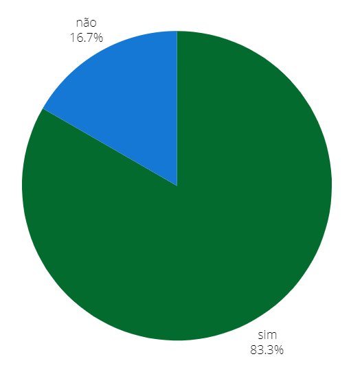

## Introdução
Após o planejamento da avaliação feito, agora iremos verificar os protótipos de papel.

## Objetivo
Esse artefato tem como obejtivo avaliar os protótipos de papel feitos pelo grupo 04 de Interação Humano Computador(IHC) do semestre 2024.1.

## Metodologia
A metodologia ultilizada é a de inspeção, respondendo os checklists. Cada integrate ficará responsável por avaliar o protótipo de papel de outro membro do grupo.

## Funcionalidades Tratadas no protótipo de papel
A tabela 1 descreve os integrantes responsáveis que fizeram o protótipo, a tarefa de cada um com um link levando para a verificação do protótipo no docuemnto e o integrante que fez a verificação.

    Tabela 1: verificação e seus resoponsáveis
| Integrante responsável que fez o protótipo | Funcionalidade | Integrante responsável pela verificação |
| :------------------------------------------------------: | ------------------------------------------- | -------------------------- |
| [Giovana Silva](https://github.com/gio221) | [Denuncia Online](#denuncia) |     [Raissa Andrade](https://github.com/RaissaAndradeS) |             
| [Lara Giuliana](https://github.com/gravelylara) | [Pesquisar Procurados](#pesquisar)  | [Renata Quadros](https://github.com/Renatinha28) |            
| [Raissa Andrade](https://github.com/RaissaAndradeS) | [Carteira de identidade](#carteira)  | [Renata Quadros](https://github.com/Renatinha28) |
| [Rayene Almeida](https://github.com/rayenealmeida) | [Registra Ocorrência](#registrar) | [Giovana Silva](https://github.com/gio221) |   
| [Renata Quadros](https://github.com/Renatinha28) |  [Solicitar Antecedentes](#solicitar)| [Rayene Almeida](https://github.com/rayenealmeida) |
| [Renata Quadros](https://github.com/Renatinha28) |  [Retrato Falado](#retrato) |  [Lara Giuliana](https://github.com/gravelylara) |

  Fonte - [Renata Quadros](https://github.com/Renatinha28). 

## 1-Pesquisar Procurados 
### Checklist Protótipo de Papel
A tabela 2 descreve o checklist do protótipo de papel, da tarefa pesquisar procurados, preenchido. O protótipo de papel foi feito pela integrante [Lara Giuliana](https://github.com/gravelylara) e foi verificado pela integrante [Renata Quadros](https://github.com/Renatinha28).

    Tabela 2: checklist protótipo de papel
| ID | Descrição | Avaliação | Referência | Print |
| :----: | --------- | ---------- | ----------- | ------- |
| 1 | Possui tarefas para serem realizadas pelos participantes? | Sim. | Página 317 | [print](../../../assets/verificacao/verificação%20nosso%20grupo/etapa%207/pagina317.jpeg) |
| 2 | Segue o modelo de interface da PCDF? | Sim. | Página 316 |[print](../../../assets/verificacao/verificação%20nosso%20grupo/etapa%207/pagina316.jpeg) |
| 3 | O protótipo foi feito em papel físico podendo ou não ser feito a mão livre? | Sim. | Página 316 | [print](../../../assets/verificacao/verificação%20nosso%20grupo/etapa%207/pagina316.jpeg) |
| 4 | Está sendo representado todo o fluxo da funcionalidade com início? meio e fim? | Incompleto. | Página 316 | [print](../../../assets/verificacao/verificação%20nosso%20grupo/etapa%207/pagina316.jpeg) |
| 5 | Possui alguma parte não estática? (que se modifica como menus, dicas sobre elementos de interface, itens de alguma lista, resultados de ações ou entre outros)? | Incompleto. | Página 316| [print](../../../assets/verificacao/verificação%20nosso%20grupo/etapa%207/pagina316.jpeg) |
| 6 | Possui teste piloto?| Não.| Página 317 | [print](../../../assets/verificacao/verificação%20nosso%20grupo/etapa%207/pagina317.jpeg) |

 
Fonte: <a href="https://github.com/Renatinha28">Renata Quadros</a>

### Gravação
A verificação foi feita pela integrante [Renata Quadros](https://github.com/Renatinha28) e a gravação está logo abaixo.

    <iframe width="560" height="315" src="https://www.youtube.com/embed/UV2LFv2IWsQ" title="YouTube video player" frameborder="0" allow="accelerometer; autoplay; clipboard-write; encrypted-media; gyroscope; picture-in-picture; web-share" referrerpolicy="strict-origin-when-cross-origin" allowfullscreen></iframe>

    <a href="https://www.youtube.com/watch?v=UV2LFv2IWsQ" target="_blank">Vídeo da verificação: Protótipo de papel - Lara  </a>

### Problemas encontrados
- ID 4: Não apresenta o início do site.
- ID 5: Não foi apresentado os menus, partes preenchidas, etc.
- ID 6: Não possui um teste piloto.

### Soluções
- ID 4: Adicionar o início do site.
- ID 5: Apresentar os menus, partes preenchidas, etc.
- ID 6: Apresentar um teste piloto.

### Conclusão
O protótipo de papel está bom mas pode ser melhorado, como mostra a figura 1.

 Figura 1 - Respostas da verificação 

 
  
Fonte: <a href="https://github.com/gio221">Giovana Barbosa</a>

        

### Cronograma do reprojeto
A tabela 3 descreve o artefato a ser corrigido, o integrante responsável pela correção, o que corrigir e a data da correção.

      Tabela 3: cronograma do reprojeto
| Data da correção | Descrição | Responsável(eis) | Status |
| :----------------------: | -------------------- | ---------------- | --------------- |
| 24/06 |  Adicionar o início do site, o teste piloto e incluir as partes preenchidas também. | [Lara Giuliana](https://github.com/gravelylara) | |

  Fonte - [Renata Quadros](https://github.com/Renatinha28). 

## 2- Solicitar Antecedentes Criminais 
### Checklist Protótipo de Papel

    Tabela 4: checklist protótipo de papel
| ID | Descrição | Avaliação | Referência | Print |
| :----: | --------- | ---------- | ----------- | ------- |
| 1 | Possui tarefas para serem realizadas pelos participantes? | Sim| Página 317 | [print](../../../assets/verificacao/verificação%20nosso%20grupo/etapa%207/pagina317.jpeg) |
| 2 | Segue o modelo de interface da PCDF? | Sim| Página 316 |[print](../../../assets/verificacao/verificação%20nosso%20grupo/etapa%207/pagina316.jpeg) |
| 3 | O protótipo foi feito em papel físico podendo ou não ser feito a mão livre? |Sim | Página 316 | [print](../../../assets/verificacao/verificação%20nosso%20grupo/etapa%207/pagina316.jpeg) |
| 4 | Está sendo representado todo o fluxo da funcionalidade com início? meio e fim? |Sim | Página 316 | [print](../../../assets/verificacao/verificação%20nosso%20grupo/etapa%207/pagina316.jpeg) |
| 5 | Possui alguma parte não estática? (que se modifica como menus, dicas sobre elementos de interface, itens de alguma lista, resultados de ações ou entre outros)? | Sim| Página 316| [print](../../../assets/verificacao/verificação%20nosso%20grupo/etapa%207/pagina316.jpeg) |
| 6 | Possui teste piloto?| Sim| Página 317 | [print](../../../assets/verificacao/verificação%20nosso%20grupo/etapa%207/pagina317.jpeg) |

### Gravação

    <iframe width="560" height="315" src="https://www.youtube.com/embed/r-M3GrdU01k" title="YouTube video player" frameborder="0" allow="accelerometer; autoplay; clipboard-write; encrypted-media; gyroscope; picture-in-picture; web-share" referrerpolicy="strict-origin-when-cross-origin" allowfullscreen></iframe>

    <a href="https://www.youtube.com/embed/r-M3GrdU01k" target="_blank">Vídeo da verificação: Protótipo de Papel - Renata </a>

### Problemas encontrados
- Não foi encontrado problemas 

### Soluções
- Não possui soluções pois não foi encontrado problemas

### Conclusão

A Figura 2 mostra como ficou as respostas obtidas 

 Figura 2 - Respostas da verificação 
 

### Cronograma do reprojeto

| Data da Correção | Descrição | Responsável(eis) | Status |
|:----------------:|:----------|:-----------------|:-------|
| 23/06            | Não precisa de reprojeto | Renata          |    Concluído     |

## 3- Denuncia Online 
### Checklist Protótipo de Papel

    Tabela 6: checklist protótipo de papel
| ID | Descrição | Avaliação | Referência | Print |
| :----: | --------- | ---------- | ----------- | ------- |
| 1 | Possui tarefas para serem realizadas pelos participantes? | Sim | Página 317 | [print](../../../assets/verificacao/verificação%20nosso%20grupo/etapa%207/pagina317.jpeg) |
| 2 | Segue o modelo de interface da PCDF? | Sim  | Página 316 |[print](../../../assets/verificacao/verificação%20nosso%20grupo/etapa%207/pagina316.jpeg) |
| 3 | O protótipo foi feito em papel físico podendo ou não ser feito a mão livre? | Sim | Página 316 | [print](../../../assets/verificacao/verificação%20nosso%20grupo/etapa%207/pagina316.jpeg) |
| 4 | Está sendo representado todo o fluxo da funcionalidade com início? meio e fim? | Sim | Página 316 | [print](../../../assets/verificacao/verificação%20nosso%20grupo/etapa%207/pagina316.jpeg) |
| 5 | Possui alguma parte não estática? (que se modifica como menus, dicas sobre elementos de interface, itens de alguma lista, resultados de ações ou entre outros)? | Sim | Página 316| [print](../../../assets/verificacao/verificação%20nosso%20grupo/etapa%207/pagina316.jpeg) |
| 6 | Possui teste piloto?| Não | Página 317 | [print](../../../assets/verificacao/verificação%20nosso%20grupo/etapa%207/pagina317.jpeg) |

### Gravação

<iframe width="560" height="315" src="https://www.youtube.com/embed/3qTh3rClcbM" frameborder="0" allow="accelerometer; autoplay; clipboard-write; encrypted-media; gyroscope; picture-in-picture" allowfullscreen></iframe>

Fonte: [Raissa Andrade](https://github.com/RaissaAndradeS)

### Problemas encontrados

- ID 6: Não possui o teste piloto 

### Soluções

- Acrescentar o teste piloto.

### Conclusão

Fonte: [Raissa Andrade](https://github.com/RaissaAndradeS)

### Cronograma do reprojeto

      Tabela 7: cronograma do reprojeto
| Data da correção | Descrição | Responsável(eis) | Status |
| :----------------------: | -------------------- | ---------------- | --------------- |
| 24 | Acrescentar o teste piloto | [Giovana Silva](https://github.com/gio221) | |

Fonte: [Raissa Andrade](https://github.com/RaissaAndradeS)

## 4- Solicitar Carteira de Identidade 
### Checklist Protótipo de Papel
A tabela 8 descreve o checklist do protótipo de papel, da tarefa solicitar carteira de identidade, preenchido. O protótipo de papel foi feito pela integrante [Raissa Andrade](https://github.com/RaissaAndradeS) e foi verificado pela integrante [Renata Quadros](https://github.com/Renatinha28).

    Tabela 8: checklist protótipo de papel
| ID | Descrição | Avaliação | Referência | Print |
| :----: | --------- | ---------- | ----------- | ------- |
| 1 | Possui tarefas para serem realizadas pelos participantes? | Sim. | Página 317 | [print](../../../assets/verificacao/verificação%20nosso%20grupo/etapa%207/pagina317.jpeg) |
| 2 | Segue o modelo de interface da PCDF? | Incompleto. | Página 316 |[print](../../../assets/verificacao/verificação%20nosso%20grupo/etapa%207/pagina316.jpeg) |
| 3 | O protótipo foi feito em papel físico podendo ou não ser feito a mão livre? | Sim. | Página 316 | [print](../../../assets/verificacao/verificação%20nosso%20grupo/etapa%207/pagina316.jpeg) |
| 4 | Está sendo representado todo o fluxo da funcionalidade com início? meio e fim? | Sim. | Página 316 | [print](../../../assets/verificacao/verificação%20nosso%20grupo/etapa%207/pagina316.jpeg) |
| 5 | Possui alguma parte não estática? (que se modifica como menus, dicas sobre elementos de interface, itens de alguma lista, resultados de ações ou entre outros)? | Sim. | Página 316| [print](../../../assets/verificacao/verificação%20nosso%20grupo/etapa%207/pagina316.jpeg) |
| 6 | Possui teste piloto?| Não.| Página 317 | [print](../../../assets/verificacao/verificação%20nosso%20grupo/etapa%207/pagina317.jpeg) |

 
Fonte: <a href="https://github.com/Renatinha28">Renata Quadros</a>

### Gravação
A verificação foi feita pela integrante [Renata Quadros](https://github.com/Renatinha28) e a gravação está logo abaixo.

    <iframe width="560" height="315" src="https://www.youtube.com/embed/IfcqVqo3hKo" title="YouTube video player" frameborder="0" allow="accelerometer; autoplay; clipboard-write; encrypted-media; gyroscope; picture-in-picture; web-share" referrerpolicy="strict-origin-when-cross-origin" allowfullscreen></iframe>

    <a href="https://www.youtube.com/watch?v=IfcqVqo3hKo" target="_blank">Vídeo da verificação: Protótipo de papel - Raissa  </a>

### Problemas encontrados
- ID 2: Não apresenta muitos elementos da interface do site.
- ID 6: Não possui um teste piloto.

### Soluções
- ID 2: Adicionar mais dealhes da interface no protótipo.
- ID 6: Apresentar um teste piloto.

### Conclusão
O protótipo de papel está bom mas pode ser melhorado, como mostra a figura 4.

 Figura 1 - Respostas da verificação 

 
  
Fonte: <a href="https://github.com/gio221">Giovana Barbosa</a>

        

### Cronograma do reprojeto
A tabela 9 descreve o artefato a ser corrigido, o integrante responsável pela correção, o que corrigir e a data da correção.

      Tabela 9: cronograma do reprojeto
| Data da correção | Descrição | Responsável(eis) | Status |
| :----------------------: | -------------------- | ---------------- | --------------- |
| 24/06 |  Adicionar mais detalhes na interface e adicionar o teste piloto. |  [Raissa Andrade](https://github.com/RaissaAndradeS) |feito |

  Fonte - [Renata Quadros](https://github.com/Renatinha28). 

## 5- Registrar Ocorrência 
### Checklist Protótipo de Papel

    Tabela 10: checklist protótipo de papel
| ID | Descrição | Avaliação | Referência | Print |
| :----: | --------- | ---------- | ----------- | ------- |
| 1 | Possui tarefas para serem realizadas pelos participantes? |Sim | Página 317 | [print](../../../assets/verificacao/verificação%20nosso%20grupo/etapa%207/pagina317.jpeg) |
| 2 | Segue o modelo de interface da PCDF? |Sim | Página 316 |[print](../../../assets/verificacao/verificação%20nosso%20grupo/etapa%207/pagina316.jpeg) |
| 3 | O protótipo foi feito em papel físico podendo ou não ser feito a mão livre? |Sim | Página 316 | [print](../../../assets/verificacao/verificação%20nosso%20grupo/etapa%207/pagina316.jpeg) |
| 4 | Está sendo representado todo o fluxo da funcionalidade com início? meio e fim? |Não tenho certeza | Página 316 | [print](../../../assets/verificacao/verificação%20nosso%20grupo/etapa%207/pagina316.jpeg) |
| 5 | Possui alguma parte não estática? (que se modifica como menus, dicas sobre elementos de interface, itens de alguma lista, resultados de ações ou entre outros)? |Sim | Página 316| [print](../../../assets/verificacao/verificação%20nosso%20grupo/etapa%207/pagina316.jpeg) |
| 6 | Possui teste piloto?| Não| Página 317 | [print](../../../assets/verificacao/verificação%20nosso%20grupo/etapa%207/pagina317.jpeg) |

### Gravação

    <iframe width="560" height="315" src="https://www.youtube.com/embed/C0SGbCzxPXo" title="YouTube video player" frameborder="0" allow="accelerometer; autoplay; clipboard-write; encrypted-media; gyroscope; picture-in-picture; web-share" referrerpolicy="strict-origin-when-cross-origin" allowfullscreen></iframe>

    <a href="https://www.youtube.com/watch?v=C0SGbCzxPXo" target="_blank">Vídeo da verificação: Protótipo de papel - Raissa  </a>

### Problemas encontrados
- ID 2: Não da para ler
- ID 6: Não possui um teste piloto.

### Soluções
- ID 4:Deixar mais legivel
- ID 6: Apresentar um teste piloto.

### Conclusão
A figura 5 mostra que o artefato tem 80% de sim na verificação

 Figura 5 - Respostas da verificação do aspecto ético.

 
  
Fonte: <a href="https://github.com/gio221">Giovana Barbosa</a>

        

### Cronograma do reprojeto
      Tabela 11: cronograma do reprojeto
| Data da correção | Descrição | Responsável(eis) | Status |
| :----------------------: | -------------------- | ---------------- | --------------- |
|23/06| [Rayene Almeida](https://github.com/rayenealmeida)|Corrigir problemas encontrados||

## 6- Retrato Falado Online 
### Checklist Protótipo de Papel
A tabela 12 descreve o checklist do protótipo de papel, da tarefa Retrato Falado Online, preenchido. O protótipo de papel foi feito pela integrante [Renata Quadros](https://github.com/Renatinha28) e foi verificado pela integrante [Lara Giuliana](https://github.com/gravelylara).

    Tabela 12: checklist protótipo de papel
| ID | Descrição | Avaliação | Referência | Print |
| :----: | --------- | ---------- | ----------- | ------- |
| 1 | Possui tarefas para serem realizadas pelos participantes? | Sim | Página 317 | [print](../../../assets/verificacao/verificação%20nosso%20grupo/etapa%207/pagina317.jpeg) |
| 2 | Segue o modelo de interface da PCDF? | Sim | Página 316 |[print](../../../assets/verificacao/verificação%20nosso%20grupo/etapa%207/pagina316.jpeg) |
| 3 | O protótipo foi feito em papel físico podendo ou não ser feito a mão livre? | Sim | Página 316 | [print](../../../assets/verificacao/verificação%20nosso%20grupo/etapa%207/pagina316.jpeg) |
| 4 | Está sendo representado todo o fluxo da funcionalidade com início? meio e fim? | Sim | Página 316 | [print](../../../assets/verificacao/verificação%20nosso%20grupo/etapa%207/pagina316.jpeg) |
| 5 | Possui alguma parte não estática? (que se modifica como menus, dicas sobre elementos de interface, itens de alguma lista, resultados de ações ou entre outros)? | Sim | Página 316| [print](../../../assets/verificacao/verificação%20nosso%20grupo/etapa%207/pagina316.jpeg) |
| 6 | Possui teste piloto?| Não| Página 317 | [print](../../../assets/verificacao/verificação%20nosso%20grupo/etapa%207/pagina317.jpeg) |

 
Fonte: <a href="https://github.com/gravelylara">Lara Giuliana</a>

### Gravação
A verificação foi feita pela integrante [Lara Giuliana](https://github.com/gravelylara) e a gravação está logo abaixo.

    <iframe width="560" height="315" src="https://www.youtube.com/embed/hDVSEqsyQIA" title="YouTube video player" frameborder="0" allow="accelerometer; autoplay; clipboard-write; encrypted-media; gyroscope; picture-in-picture; web-share" referrerpolicy="strict-origin-when-cross-origin" allowfullscreen></iframe>

    <a href="https://www.youtube.com/watch?v=hDVSEqsyQIA" target="_blank">Vídeo da verificação: Protótipo de papel - Renata  </a>

### Problemas encontrados=
- ID 6: Não possui um teste piloto.

### Soluções
- ID 6: Apresentar um teste piloto.

### Conclusão
No geral protótipo de papel está muito bom, faltando apenas o teste piloto, como mostra a figura 6.

 Figura 6 - Respostas da verificação 

 
  
Fonte: <a href="https://github.com/gravelylara">Lara Giuliana</a>

        

### Cronograma do reprojeto
A tabela 13 descreve o artefato a ser corrigido, o integrante responsável pela correção, o que corrigir e a data da correção.

      Tabela 13: cronograma do reprojeto
| Data da correção | Descrição | Responsável(eis) | Status |
| :----------------------: | -------------------- | ---------------- | --------------- |
| 24/06 |  Adicionar teste piloto. |  [RenataQuadros](https://github.com/Renatinha28) | Concluído |

  Fonte - [Renata Quadros](https://github.com/Renatinha28). 

## Bibliografia
> BARBOSA, S.D.J.; SILVA, B.S. Interação Humano-Computador. Editora Campus-Elsevier, 2010.

> https://interacao-humano-computador.github.io/2024.1-PCDF/
## Histórico de Versões
      Tabela que descreve o Histórico de Versões

|     Versão       |     Descrição      |      Autor(es)      | Data           |  Revisor(es)          |Data de revisão|
| :----------------------------------------------------------: | :-------------------------------: | :-------------------------------------------------: | :-------------------------------: |  :-------------------------------: | :-------------------------------: |
| 1.0 | Verificação protótipo de papel Pesquisar Procurados e Solicitar carteira de identidade |  [Renata Quadros](https://github.com/Renatinha28) | 22/06 | [Rayene Almeida](https://github.com/rayenealmeida) | 24/06 |
| 1.1| Verificação Antecedentes Criminais| [Rayene Almeida](https://github.com/rayenealmeida) | 23/06 |  [Giovana Barbosa](https://github.com/gio221) |24/06
| 1.2| Verificação de Denúncia Online| [Raissa Andrade](https://github.com/RaissaAndradeS) | 24/06 |  [Giovana Barbosa](https://github.com/gio221), [Rayene Almeida](https://github.com/rayenealmeida)|24/06
| 1.3| Verificação de Retrato Falado Online| [Lara Giuliana](https://github.com/gravelylara) | 24/06 |  [Giovana Barbosa](https://github.com/gio221), [Rayene Almeida](https://github.com/rayenealmeida)|24/06
