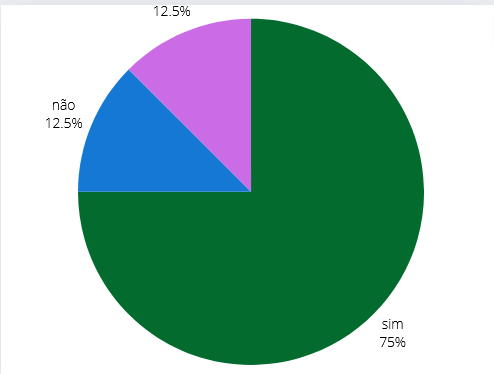

## Introdução
Este é o documento de verificação do artefato Cronograma elaborado pelo Grupo 5 da disciplina de Interação Humano-Computador (IHC), que está focado no projeto relacionado ao site da Prefeitua da Lagoa da Prata. Consequentemente, o Cronograma será avaliado à luz da literatura de Interação Humano-Computador de Barbosa e Silva.

## Objetivo 
Esse artefato tem como objetivo fazer o relato do cronograma 

## Metodologia
Para verificar o artefato, responderemos o checklist feito no planejamento da verificação, a integrante Lara e Giovana vão gravar um video monstrando a verificação, a tabela 1 monstra as perguntas ultilizadas para fazer essa verificação.

## Checklist  

Tabela 1: Tabela das perguntas  
 

| ID  | Descrição                                                                                  | Avaliação | Observações |
| --- | ------------------------------------------------------------------------------------------ | --------- | ----------- |
| 1   | O artefato possui introdução?      |    Sim     |             |
| 2   | O artefato possui uma bibliografia/referência bibliográfica? |     Sim      |             |
| 3 | O artefato possui um histórico de versões com versão, data, autores, revisores e data de | Incompleto      |     Está faltando informações        |
| 4 | As atividades necessárias estão claramente definidas e listadas? | Sim | |
| 5 | As datas de início e término de cada atividade estão claramente especificadas? |Sim | |
| 6 | As atividades estão em uma sequência lógica e cronológica? | Sim | |
| 7 | Cada atividade possui um responsável designado? |Sim | |
| 8 | Os recursos necessários para cada atividade estão definidos? | Sim | |
  

Fonte: [Giovana Barbosa](https://github.com/gio221) , 2024.

## Problemas Encontrados

* ID 8: só monstra a pessoa e os revisores reponsáveis para cada artefato

## Sugestões

* ID 8: monstrar mais detalhado

## Video da Verificação

<iframe width="560" height="315" src="https://www.youtube.com/embed/_5vxUvPSV38 " title="YouTube video player" frameborder="0" allow="accelerometer; autoplay; clipboard-write; encrypted-media; gyroscope; picture-in-picture; web-share" referrerpolicy="strict-origin-when-cross-origin" allowfullscreen></iframe>

<a href="https://youtu.be/_5vxUvPSV38 " target="blanket">Vídeo da Verificação do cronograma da etapa 1</a>

## Conclusão
A imagem 1 monstra como ficou as respostas obtidas

 Figura 1 - Respostas do Cronograma.

 
  
Fonte: <a href="https://github.com/gio221">Giovana Barbosa</a>

        

## Bibliografia
> BARBOSA, S.D.J.; SILVA, B.S. Interação Humano-Computador. Editora Campus-Elsevier, 2010.

>  https://interacao-humano-computador.github.io/2024.1-Prefeitura-Lagoa-da-Prata/

## Histórico de versão
        Tabela que descreve o Histórico de Versões
|     Versão       |     Descrição      |      Autor(es)      | Data           |  Revisor(es)          |Data de revisão|
| :----------------------------------------------------------: | :-------------------------------: | :-------------------------------------------------: | :-------------------------------: |  :-------------------------------: | :-------------------------------: |
|1.0|Criação do documento|[Giovana Barbosa](https://github.com/gio221) e [Lara Giuliana](https://github.com/gravelylara)  | 07/06| [Rayene Almeida](https://github.com/rayenealmeida), [Renata Quadros](https://github.com/Renatinha28)  | 07/06 |