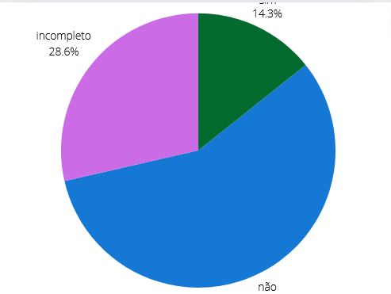

## Introdução
Este é o documento de verificação do artefato Cronograma executado elaborado pelo Grupo 5 da disciplina de Interação Humano-Computador (IHC), que está focado no projeto relacionado ao site da Prefeitua da Lagoa da Prata. Consequentemente, o Cronograma executado será avaliado à luz da literatura de Interação Humano-Computador de Barbosa e Silva.

## Objetivo 
Esse artefato tem como objetivo fazer o relato do cronograma executado

## Metodologia
Para verificar o artefato, responderemos o checklist feito no planejamento da verificação, a integrante Lara e Giovana vão gravar um video monstrando a verificação, a tabela 1 monstra as perguntas ultilizadas para fazer essa verificação.

## Checklist

Tabela 1: Tabela do Cronograma Executado. 
 

| __ID__ | __Descrição__ | __Avaliação__ | __Observações__ |
|:----------|:----------|:----------:| --------------------|
| 1 | O artefato possui introdução? | Não| |
| 2 | O artefato possui uma bibliografia/referência bibliográfica?  | Sim | |
| 3 | O artefato possui um histórico de versões com versão, data, autores, revisores e data de revisão? |Incompleto |Está desatualizado, falta revisores |
| 4 | Todas as atividades realizadas estão atualizadas e refletem o status atual? | Incompleto|na etapa 5 está incompleto |
| 5 | Os desvios em relação ao cronograma original estão registrados e justificados? | Não | |
| 6 | As atividades concluídas estão marcadas como finalizadas? | Não  | |
| 7 | Todas as mudanças e replanejamentos estão documentados? | Não  | |

 
  
Fonte: <a href="https://github.com/gio221">Giovana Barbosa</a>

## Problemas Encontrados
* ID 1: Não possui introdução
* ID 3: Está desatualizado, falta revisores
* ID 4: na etapa 5 está incompleto 
* ID 5: Não existe esse registro
* ID 6: Não existe esse registro
* ID 7: Não existe registro de mudança

## Sugestões

* ID 1: Fazer introdução
* ID 3: Colocar os revisores
* ID 4: Preencher etapa 5
* ID 5: Colocar um registro das mudanças
* ID 6: Colocar as atividades já finalizadas
* ID 7: colocar o replanejamento 

## Video da Verificação

<iframe width="560" height="315" src="https://www.youtube.com/embed/4sil0MmI4wQ " title="YouTube video player" frameborder="0" allow="accelerometer; autoplay; clipboard-write; encrypted-media; gyroscope; picture-in-picture; web-share" referrerpolicy="strict-origin-when-cross-origin" allowfullscreen></iframe>

<a href="https://youtu.be/4sil0MmI4wQ " target="blanket">Vídeo da Verificação do cronograma executado etapa 1</a>

## Conclusão
A imagem 1 monstra como ficou as respostas obtidas

 Figura 1 - Respostas do Cronograma executado

 
  
Fonte: <a href="https://github.com/gio221">Giovana Barbosa</a>

 

## Bibliografia
> BARBOSA, S.D.J.; SILVA, B.S. Interação Humano-Computador. Editora Campus-Elsevier, 2010.

>  https://interacao-humano-computador.github.io/2024.1-Prefeitura-Lagoa-da-Prata/

## Histórico de versão
        Tabela que descreve o Histórico de Versões
|     Versão       |     Descrição      |      Autor(es)      | Data           |  Revisor(es)          |Data de revisão|
| :----------------------------------------------------------: | :-------------------------------: | :-------------------------------------------------: | :-------------------------------: |  :-------------------------------: | :-------------------------------: |
|1.0|Criação do documento|[Giovana Barbosa](https://github.com/gio221) e [Lara Giuliana](https://github.com/gravelylara) | 07/06 | [Rayene Almeida](https://github.com/rayenealmeida), [Renata Quadros](https://github.com/Renatinha28) | 07/06 |