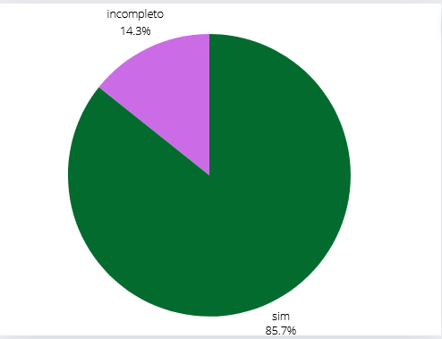

## Introdução
Este é o documento de verificação do artefato Ferramentas executado elaborado pelo Grupo 5 da disciplina de Interação Humano-Computador (IHC), que está focado no projeto relacionado ao site da Prefeitua da Lagoa da Prata. Consequentemente, as ferramentas será avaliado à luz da literatura de Interação Humano-Computador de Barbosa e Silva.

## Objetivo 
Esse artefato tem como objetivo fazer o relato das ferramentas

## Metodologia
Para verificar o artefato, responderemos o checklist feito no planejamento da verificação, a integrante Lara e Giovana vão gravar um video monstrando a verificação, a tabela 1 monstra as perguntas ultilizadas para fazer essa verificação.

## Checklist

Tabela 1: Tabela das Ferramentas. 
 

| __ID__ | __Descrição__ | __Avaliação__ | __Observações__ |
|:----------|:----------|:----------:| --------------------|
| 1 | O artefato possui introdução? | Sim | |
| 2 | O artefato possui uma bibliografia/referência bibliográfica?  | Sim  | Incorreto|
| 3 | O artefato possui um histórico de versões com versão, data, autores, revisores e data de revisão? | Incompleto| |
| 4 | As ferramentas são adequadas para as tarefas previstas? | Sim  | |
| 5 | As ferramentas são compatíveis entre si e com outros sistemas utilizados no projeto? |Sim  | |
| 6 | As ferramentas são fáceis de usar e não apresentam problemas de usabilidade? | Sim | |
| 7 | Existe documentação adequada para o uso das ferramentas? | Sim  | |

 
  
Fonte: <a href="https://github.com/gio221">Giovana Barbosa</a>

## Problemas Encontrados

* ID 2: A bibliografia que está na pages é uma referência bibliografica
* ID3 3: O histório de versões falta revisores

## Sugestões

* ID 2: mudar a bibliografia
* ID3 3: Colocar revisores no histórico de versões

## Video da Verificação

<iframe width="560" height="315" src="https://www.youtube.com/embed/qm5VgYM-4f4 " title="YouTube video player" frameborder="0" allow="accelerometer; autoplay; clipboard-write; encrypted-media; gyroscope; picture-in-picture; web-share" referrerpolicy="strict-origin-when-cross-origin" allowfullscreen></iframe>

<a href="https://youtu.be/qm5VgYM-4f4 " target="blanket">Vídeo da Verificação das ferramentas da etapa 1</a>

## Conclusão
A imagem 1 monstra como ficou as respostas obtidas

 Figura 1 - Respostas das ferramentas 

 
  
Fonte: <a href="https://github.com/gio221">Giovana Barbosa</a>

 

## Bibliografia
> BARBOSA, S.D.J.; SILVA, B.S. Interação Humano-Computador. Editora Campus-Elsevier, 2010.

>  https://interacao-humano-computador.github.io/2024.1-Prefeitura-Lagoa-da-Prata/

## Histórico de versão
        Tabela que descreve o Histórico de Versões
|     Versão       |     Descrição      |      Autor(es)      | Data           |  Revisor(es)          |Data de revisão|
| :----------------------------------------------------------: | :-------------------------------: | :-------------------------------------------------: | :-------------------------------: |  :-------------------------------: | :-------------------------------: |
|1.0|Criação do documento|[Giovana Barbosa](https://github.com/gio221) e [Lara Giuliana](https://github.com/gravelylara)  | 07/06| [Rayene Almeida](https://github.com/rayenealmeida), [Renata Quadros](https://github.com/Renatinha28)  | 07/06 |