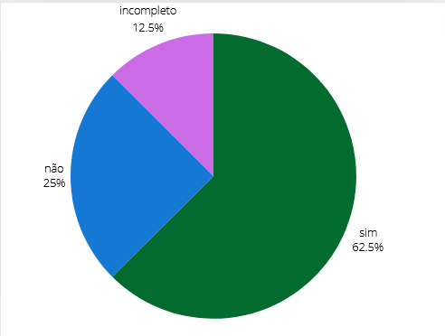

## Introdução
Este é o documento de verificação do artefato Processo de Design executado elaborado pelo Grupo 5 da disciplina de Interação Humano-Computador (IHC), que está focado no projeto relacionado ao site da Prefeitua da Lagoa da Prata. Consequentemente, o Processo de Design será avaliado à luz da literatura de Interação Humano-Computador de Barbosa e Silva.

## Objetivo 
Esse artefato tem como objetivo fazer o relato do processo de design

## Metodologia
Para verificar o artefato, responderemos o checklist feito no planejamento da verificação, a integrante Lara e Giovana vão gravar um video monstrando a verificação, a tabela 1 monstra as perguntas ultilizadas para fazer essa verificação.

## Checklist

Tabela 1: Tabela do Processo de Design. 
 

| __ID__ | __Descrição__ | __Avaliação__ | __Observações__ |
|:----------|:----------|:----------:| --------------------|
| 1 | O artefato possui introdução ?   | Sim  | |
| 2  | O artefato possui metodologia ?  | Não  | |
| 3  | As etapas do processo de design estão nitidas e definidas?  | Sim| |
| 4 |  artefato inclui o diagrama sugerido pelo método selecionado ?  | Sim  | |
| 5  | O modo de execução do ciclo de vida está detalhado?  | Não | |
| 6 | A definição do ciclo de vida foi justificado ?  | Sim | |
| 7  |  O artefato possui histórico de versões ?  | Incompleto | |
| 8  | O artefato possui bibliografia/ referência bibliografica?  | Sim | |

 
  
Fonte: <a href="https://github.com/gio221">Giovana Barbosa</a>

## Problemas Encontrados

* ID 2: não possui metodologia
* ID 5: não está detalhado
* ID 7: falta revisores

## Sugestões
* ID 2: colocar a  metodologia
* ID 5: Detalhar mais o processo de ciclo de vida
* ID 7: colocar os  revisores

## Video da Verificação

<iframe width="560" height="315" src="https://www.youtube.com/embed/KGquW7vsd-0 " title="YouTube video player" frameborder="0" allow="accelerometer; autoplay; clipboard-write; encrypted-media; gyroscope; picture-in-picture; web-share" referrerpolicy="strict-origin-when-cross-origin" allowfullscreen></iframe>

<a href="https://youtu.be/KGquW7vsd-0 " target="blanket">Vídeo da Verificação do processo de design da etapa 1</a>

## Conclusão
A imagem 1 monstra como ficou as respostas obtidas

 Figura 1 - Respostas dos processo de design

 
  
Fonte: <a href="https://github.com/gio221">Giovana Barbosa</a>

 

## Bibliografia
> BARBOSA, S.D.J.; SILVA, B.S. Interação Humano-Computador. Editora Campus-Elsevier, 2010.

>  https://interacao-humano-computador.github.io/2024.1-Prefeitura-Lagoa-da-Prata/

## Histórico de versão
        Tabela que descreve o Histórico de Versões
|     Versão       |     Descrição      |      Autor(es)      | Data           |  Revisor(es)          |Data de revisão|
| :----------------------------------------------------------: | :-------------------------------: | :-------------------------------------------------: | :-------------------------------: |  :-------------------------------: | :-------------------------------: |
|1.0|Criação do documento|[Giovana Barbosa](https://github.com/gio221) e [Lara Giuliana](https://github.com/gravelylara)| 07/06| [Rayene Almeida](https://github.com/rayenealmeida), [Renata Quadros](https://github.com/Renatinha28)  | 07/06 |