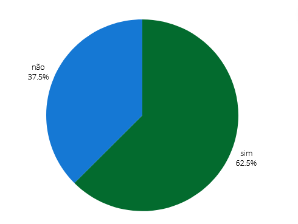

## Introdução
Este é o documento de verificação do artefato Site escolhido executado elaborado pelo Grupo 5 da disciplina de Interação Humano-Computador (IHC), que está focado no projeto relacionado ao site da Prefeitua da Lagoa da Prata. Consequentemente, o Site escolhido será avaliado à luz da literatura de Interação Humano-Computador de Barbosa e Silva.

## Objetivo 
Esse artefato tem como objetivo fazer o relato do site escolhido

## Metodologia
Para verificar o artefato, responderemos o checklist feito no planejamento da verificação, a integrante Lara e Giovana vão gravar um video monstrando a verificação, a tabela 1 monstra as perguntas ultilizadas para fazer essa verificação.

## Checklist

Tabela 6: Tabela do Site Escolhido. 
 

| __ID__ | __Descrição__ | __Avaliação__ | __Observações__ |
|:----------|:----------|:----------:| --------------------|
| 1 | O artefato possui introdução ?   | Sim  | |
| 2  | O artefato possui critérios para escolha ?  | Sim  | |
| 3  | O artefato tem justificativa da escolha do site?  | Sim  | |
| 4 |  O artefato possui uma funcionalidade para cada membro da equipe? | Não |
| 5  | Está detalhado o motivo da escolha do site ?  | Sim | |
| 6  | Imagens e tabelas presentes no artefato são chamados de forma correta ? | Não existem  | |
| 7  |  Cada site avaliado tem uma descrição ?  | Não  | |
| 8  | O artefato possui histórico de versões ?   | Sim  | |

 
  
Fonte: <a href="https://github.com/gravelylara">Lara Giuliana</a>

## Problemas Encontrados
* ID 4: Não possui uma funcionalidade para cada membro da equipe
* ID 6: Não existe imagens nem tabelas
* ID 7: Cada site avaliado não tem uma descrição

## Sugestões
* ID 4: Adicionar funcionalidade para cada membro da equipe
* ID 6: Adicionar imagens nem tabelas
* ID 7: Adicionar descrição de cada site avaliado

## Video da Verificação

<iframe width="560" height="315" src="https://www.youtube.com/embed/8x8F3T6k2Oc  " title="YouTube video player" frameborder="0" allow="accelerometer; autoplay; clipboard-write; encrypted-media; gyroscope; picture-in-picture; web-share" referrerpolicy="strict-origin-when-cross-origin" allowfullscreen></iframe>

<a href="https://youtu.be/8x8F3T6k2Oc     " target="blanket">Vídeo da Verificação do site escolhido da etapa 1</a>

## Conclusão
A imagem 1 monstra como ficou as respostas obtidas

 Figura 1 - Respostas do site  

 
  
Fonte: <a href="https://github.com/gio221">Giovana Barbosa</a>

 
  

## Bibliografia
> BARBOSA, S.D.J.; SILVA, B.S. Interação Humano-Computador. Editora Campus-Elsevier, 2010.

>  https://interacao-humano-computador.github.io/2024.1-Prefeitura-Lagoa-da-Prata/

## Histórico de versão
        Tabela que descreve o Histórico de Versões
|     Versão       |     Descrição      |      Autor(es)      | Data           |  Revisor(es)          |Data de revisão|
| :----------------------------------------------------------: | :-------------------------------: | :-------------------------------------------------: | :-------------------------------: |  :-------------------------------: | :-------------------------------: |
|1.0|Criação do documento|[Giovana Barbosa](https://github.com/gio221) e [Lara Giuliana](https://github.com/gravelylara) | 07/06| [Rayene Almeida](https://github.com/rayenealmeida), [Renata Quadros](https://github.com/Renatinha28) | 07/06 |