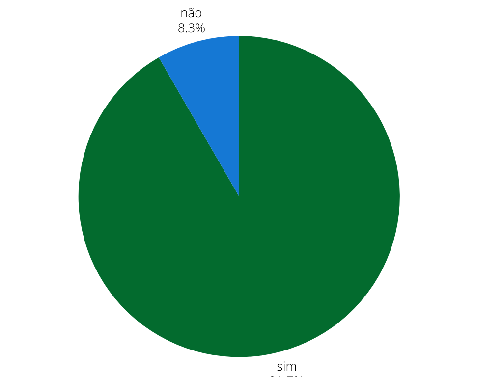

## Introdução
Este é o documento de verificação do artefato Aspectos Éticos da etapa 2 elaborado pelas integrantes [Rayene Almeida](https://github.com/rayenealmeida) e [Raissa Andrade](https://github.com/RaissaAndradeS) do grupo 04 da disciplina de Interação Humano-Computador (IHC). 

## Objetivo
Este documento tem como objetivo o relato da verificação dos Aspectos Éticos da etapa 2 feita pelo grupo 05 do sistema da Prefeitura Municipal de Lagoa da Prata.

## Metodologia
Para a verificação do artefato foi repondido o checklist feito no planejamento da verificação da etapa 2, as integrantes Rayene e Raissa gravaram um video monstrando a verificação, a tabela 1 e 2 mostra as perguntas ultilizadas para fazer essa verificação.

## Checklist 

Tabela 1: Tabela do Checklist Geral. 
 

| ID  | Descrição                                                                                  | Avaliação | Observações |
| --- | ------------------------------------------------------------------------------------------ | --------- | ----------- |
| 1   | O artefato possui introdução?     |        Sim   |             |
| 2   | O artefato possui metodologia e objetivo?  |  Não         |             |
| 3   | O artefato possui uma bibliografia/referência bibliográfica?   |   Sim        |             |
| 4   | As tabelas possuem fontes, títulos e são chamadas no texto?  |     Sim    |             |
| 5   | A estrutura do documento possui uma sequência lógica e padronizada?  |       Sim    |             |
| 6   | Possui histórico de versões?    |     Sim      |             |
| 7   | Os históricos de versões possuem a versão do documento, descrição, autores, datas e revisores? | Sim |             |
| 8  | Possui conclusão? |      Sim     |             |
| 9   | Possui explicação do termo de consentimento? |     Sim      |             |
| 10   | Explica como os aspectos éticos serão utilizados no projeto? |      Sim     |             |
| 11  | O termo de consentimento solicita permissão para gravar voz e vídeo?  |        Sim   |             |
| 12  | São seguidos os 4 princípios: autonomia, beneficência, maleficência, justiça e equidade?    |     Sim      |             |

Fonte: [Rayene Almeida](https://github.com/rayenealmeida), 2024.

## Problemas Encontrados

- ID 2: O artefato não possui metodologia e objetivo

## Sugestões

- ID 2: Colocar a metodologia e o objetivo

## Video da Verificação

    <iframe width="560" height="315" src="https://www.youtube.com/embed/UBg8zq5wVdQ" title="YouTube video player" frameborder="0" allow="accelerometer; autoplay; clipboard-write; encrypted-media; gyroscope; picture-in-picture" allowfullscreen></iframe>

    <a href="https://www.youtube.com/embed/UBg8zq5wVdQ" target="_blank">Vídeo da Verificação dos Aspetos Éticos</a>

## Conclusão
A Figura 1 monstra como ficou as respostas obtidas 

 Figura 1 - Respostas dos Aspectos Éticos 
 
 
  
Fonte: <a href="https://github.com/rayenealmeida">Rayene Almeida</a>

 

## Bibliografia
> BARBOSA, S.D.J.; SILVA, B.S. Interação Humano-Computador. Editora Campus-Elsevier, 2010.

>  https://interacao-humano-computador.github.io/2024.1-Prefeitura-Lagoa-da-Prata/

## Histórico de versão
        Tabela que descreve o Histórico de Versões
|     Versão       |     Descrição      |      Autor(es)      | Data           |  Revisor(es)          |Data de revisão|
| :----------------------------------------------------------: | :-------------------------------: | :-------------------------------------------------: | :-------------------------------: |  :-------------------------------: | :-------------------------------: |
|1.0|Verificação dos Aspectos Éticos|[Rayene Almeida](https://github.com/rayenealmeida) e [Raissa Andrade](https://github.com/RaissaAndradeS)   | 08/06|   [Giovana Barbosa](https://github.com/gio221), [Renata Quadros](https://github.com/Renatinha28)  | 09/06 |