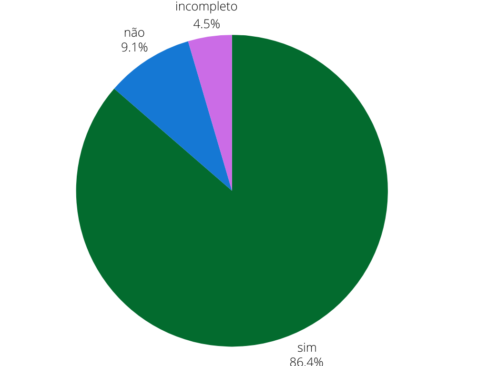

## Introdução
Este é o documento de verificação do artefato Guia de Estilo elaborado pelas integrantes [Rayene Almeida](https://github.com/rayenealmeida) e [Renata Quadros](https://github.com/Renatinha28) do grupo 04 da disciplina de Interação Humano-Computador (IHC). 

## Objetivo
Este documento tem como objetivo o relato da verificação do Guia de estilo da etapa 3 feita pelo grupo 05 do sistema da Prefeitura Municipal de Lagoa da Prata.

## Metodologia
Para a verificação do artefato foi repondido o checklist feito no planejamento da verificação da estapa 3, as integrantes Rayene e Renata gravaram um video monstrando a verificação, a tabela 1 monstra as perguntas ultilizadas para fazer essa verificação.

## Checklist

Tabela 1: Tabela do Checklist. 
 

| ID  | Descrição                                                                                  | Avaliação | Observações |
| --- | ------------------------------------------------------------------------------------------ | --------- | ----------- |
| 1   | O artefato possui introdução?     |     Sim      |             |
| 2   | O artefato possui metodologia e objetivo?  |   Sim        |             |
| 3   | O artefato possui uma bibliografia/referência bibliográfica?   |       Sim    |             |
| 4   | As tabelas possuem fontes, títulos e são chamadas no texto?  |     Incompleto (Não tem a chamada)      |             |
| 5   | A estrutura do documento possui uma sequência lógica e padronizada?  |       Sim    |             |
| 6   | Possui histórico de versões?    |       Sim    |             |
| 7   | Os históricos de versões possuem a versão do documento, descrição, autores, datas e revisores? |Sim |             |
| 8 | Possui uma explicação do público-alvo?  |    Sim   |             |
| 9  | Possui uma explicação de como utilizar o guia?  | Sim          |             |
| 10  | Possui uma explicação de como manter o guia? |       Sim    |             |
| 11 | Possui os resultados utilizando as 6 metas?   |         Sim  |             |
| 12 | Possui uma descrição do ambiente de trabalho do usuário?  | Sim          |             |
| 13 | Existe um tópico de Elementos de interface?  |       Sim    |             |
| 14 | Existe um subtópico de cores e tipografia?  |          Sim |             |
| 15 | Existe um subtópico de formulários, botões, layout e grid?| Sim          |             |
| 16 | Existe um subtópico de janelas? |       Sim    |             |
| 17  | Existe um subtópico de seleção de um estilo, estilos de interação e animações? |       Não    |             |
| 18  | Existe um tópico de Elementos de interação?  |  Sim         |             |
| 19  | Existe um tópico de Elementos de ação? |      Sim     |             |
| 20 | Existe um subtópico de seleção, ativação e preenchimento de campos? |   Não     |         Tem nos objetivos mas não um subtópico    |
| 21  | Existe um tópico de Vocabulário e padrões?   |       Sim    |             |
| 22  | Existe um subtópico de terminologia, de tipos de tela e sequências de diálogos?            |     Sim      |             |

Fonte: [Rayene Almeida](https://github.com/rayenealmeida), 2024.

## Problemas Encontrados

- ID 4: Não possui chamadas das tabelas/figuras no texto
- ID 17: Não existe um subtópico de seleção de um estilo, estilos de interação e animações
- ID 20: Não existe um subtópico de seleção, ativação e preenchimento de campos apenas é mencionado nos objetivos

## Sugestões

- ID 4: Chamar as tabelas/figuras nos textos de descrição
- ID 17: Criar subtópico de seleção de um estilo, estilos de interação e animações
- ID 20: Criar subtópico de seleção, ativação e preenchimento de campos apenas e não apenas mencionar nos objetivos

## Video da Verificação

    <iframe width="560" height="315" src="https://www.youtube.com/embed/bYZ91_3dcpw" title="YouTube video player" frameborder="0" allow="accelerometer; autoplay; clipboard-write; encrypted-media; gyroscope; picture-in-picture" allowfullscreen></iframe>

    <a href="https://www.youtube.com/watch?v=bYZ91_3dcpw" target="blank">Vídeo da Verificação do Guia de Estilo da etapa 3</a>

## Conclusão
A Figura 1 monstra como ficou as respostas obtidas 

 Grafico 1 

 
  
Fonte: <a href="https://github.com/Renatinha28">Renata Quadros. 2024</a>

     

## Bibliografia
> BARBOSA, S.D.J.; SILVA, B.S. Interação Humano-Computador. Editora Campus-Elsevier, 2010.

>  https://interacao-humano-computador.github.io/2024.1-Prefeitura-Lagoa-da-Prata/

## Histórico de versão
        Tabela que descreve o Histórico de Versões
|     Versão       |     Descrição      |      Autor(es)      | Data           |  Revisor(es)          |Data de revisão|
| :----------------------------------------------------------: | :-------------------------------: | :-------------------------------------------------: | :-------------------------------: |  :-------------------------------: | :-------------------------------: |
|1.0|Virificação do Guia de Estilo|[Rayene Almeida](https://github.com/rayenealmeida) e [Renata Quadros](https://github.com/Renatinha28)   | 08/06|   [Giovana Barbosa](https://github.com/gio221)|10/06|