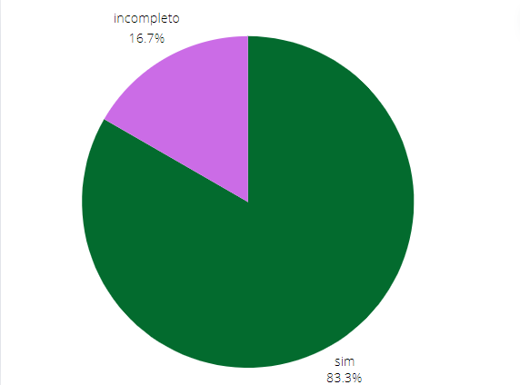

## Introdução

Este documento aborda a verificação do artefato "Metas de Usabilidade" do grupo 05 - Prefeitura Municipal de Lagoa da Prata. A verificação foi conduzida pelo grupo 04 - Polícia Civil do Distrito Federal, pelas integrantes [Renata Quadros]() e [Rayene Almeida](https://github.com/rayenealmeida).

## Objetivo

O objetivo deste documento é relatar a verificação realizada pelo grupo 04 no artefato "Metas de Usabilidade" do grupo 05.

## Metodologia

A verificação foi realizada através de checklists previamente elaborados no Planejamento da Verificação da Etapa 3.

## Checklist 
A tabela 1 apresenta o Checklist Geral junto com o Checklist Específico da verificação do artefato "Metas de Usabilidade" do grupo 05. 

    
<strong>Tabela 1: Checklist</strong>

    <table>
        <tr>
            <th>ID</th>
            <th>Descrição</th>
            <th>Avaliação</th>
            <th>Observações</th>
        </tr>
        <tr>
            <td>1</td>
            <td>O artefato possui introdução ?</td>
            <td>Sim.</td>
            <td></td>
        </tr>
        <tr>
            <td>2</td>
            <td>O artefato possui metodologia e objetivo?</td>
            <td>Sim.</td>
            <td>Não está em tópicos, mas apresenta a metodologia utilizada na própria introdução.</td>
        </tr>
        <tr>
            <td>3</td>
            <td>O artefato possui uma bibliografia/referência bibliográfica?</td>
            <td>Sim.</td>
            <td></td>
        </tr>
        <tr>
            <td>4</td>
            <td>As tabelas possuem fontes, títulos e são chamadas no texto?</td>
            <td>Incompleto.</td>
            <td>A tabela não contém.</td>
        </tr>
        <tr>
            <td>5</td>
            <td>A estrutura do documento possui uma sequência lógica e padronizada?</td>
            <td>Sim.</td>
            <td></td>
        </tr>
        <tr>
            <td>6</td>
            <td>Possui histórico de versões?</td>
            <td>Sim.</td>
            <td></td>
        </tr>
        <tr>
            <td>7</td>
            <td>Os históricos de versões possuem a versão do documento, descrição, autores, datas e revisores?</td>
            <td>Sim.</td>
            <td></td>
        </tr>
        <tr>
            <td>8</td>
            <td>Apresenta quais fatores serão ultilizados no projeto?</td>
            <td>Sim.</td>
            <td></td>
        </tr>
        <tr>
            <td>9</td>
            <td>As metas foram definidas através do perfil de usuário?</td>
            <td>Incompleto.</td>
            <td>Não consta.</td>
        </tr>
        <tr>
            <td>10</td>
            <td>Foram definidas as usabilidades em 6 metas?</td>
            <td>Sim.</td>
            <td></td>
        </tr>
        <tr>
            <td>11</td>
            <td>é monstrado como as metas se aplicam no sistema?</td>
            <td>Sim.</td>
            <td></td>
        </tr>
        <tr>
            <td>12</td>
            <td>Possui conclusão?</td>
            <td>Sim.</td>
            <td></td>
        </tr>
    </table>
   
Fonte: <a "https://github.com/Renatinha28">Renata Quadros</a>

## Problemas Encontrados

- ID 4: Não possui chamada da tabela no texto.
- ID 9: Não existe nenhum texto que descreve que as metas de usabilidade foram definidas através do perfil de usuário.

## Sugestão de melhoria 

- ID 4: Revisar as chamadas de tabelas/imagens nos textos.
- ID 9: Descreve como as metas de usabilidade foram definidas.

## Vídeo da verificação

    <iframe width="560" height="315" src="https://www.youtube.com/embed/RyGi-Lngtrg" title="YouTube video player" frameborder="0" allow="accelerometer; autoplay; clipboard-write; encrypted-media; gyroscope; picture-in-picture" allowfullscreen></iframe>

    <a href="https://www.youtube.com/watch?v=RyGi-Lngtrg" target="_blank">Vídeo da Verificação das Metas de Usabilidade da etapa 3</a>

## Conclusão

Gráfico 1 das metas de usabilidade

 Grafico 1 

 
  
Fonte: <a href="https://github.com/Renatinha28">Renata Quadros. 2024</a>

     

## Bibliografia
> BARBOSA, S. D. J.; SILVA, B. S. Interação Humano-Computador. Rio de Janeiro: Elsevier, 2011.

> https://interacao-humano-computador.github.io/2024.1-Prefeitura-Lagoa-da-Prata/

## Histórico de versão
      Tabela que descreve o Histórico de Versões

|     Versão       |     Descrição      |      Autor(es)      | Data           |  Revisor(es)          |Data de revisão|
| :----------------------------------------------------------: | :-------------------------------: | :-------------------------------------------------: | :-------------------------------: |  :-------------------------------: | :-------------------------------: |
| 1.0 | Verificação |  [Renata Quadros](https://github.com/Renatinha28), [Rayene Almeida](https://github.com/rayenealmeida) | 09/06 |  [Giovana Barbosa](https://github.com/gio221)|10/06|
