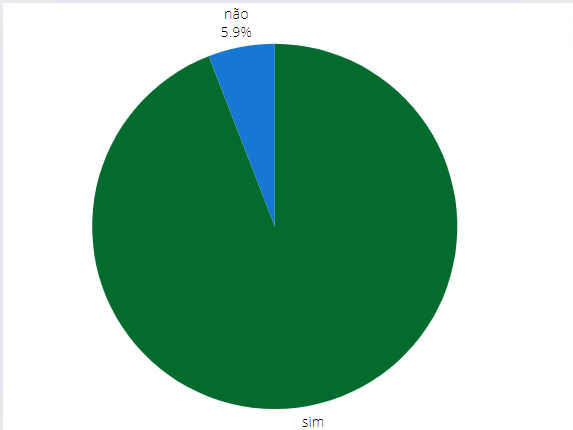

## Introdução
Este documento detalha a verificação do artefato "Princípios Gerais" desenvolvido pelo grupo 05 - Prefeitura Municipal de Lagoa da Prata. A verificação foi conduzida pelo grupo 04 - Polícia Civil do Distrito Federal, pelas integrantes [Renata Quadros]() e [Rayene Almeida](https://github.com/rayenealmeida).

## Objetivo 
O objetivo deste documento é fornecer um relato abrangente da verificação realizada pelo grupo 04 sobre os "Princípios Gerais" do grupo 05. Esta verificação busca identificar eventuais inconsistências, assegurar a aderência às diretrizes estabelecidas e garantir que o artefato atende aos critérios de qualidade e usabilidade definidos.

## Metodologia 
A verificação foi realizada através de um checklist detalhado, previamente elaborado durante o Planejamento da Verificação da Etapa 3. 

## Checklist 
A tabela 1 apresenta o Checklist Geral junto com o Checklisr Específico da verificação do artefato "Princípios Gerais" do grupo 05. 

    
<strong>Tabela 1: Checklist</strong>

    <table>
        <tr>
            <th>ID</th>
            <th>Descrição</th>
            <th>Avaliação</th>
            <th>Observações</th>
        </tr>
        <tr>
            <td>1</td>
            <td>O artefato possui introdução ?</td>
            <td>Sim.</td>
            <td></td>
        </tr>
        <tr>
            <td>2</td>
            <td>O artefato possui metodologia e objetivo?</td>
            <td>Não.</td>
            <td>Não contém.</td>
        </tr>
        <tr>
            <td>3</td>
            <td>O artefato possui uma bibliografia/referência bibliográfica?</td>
            <td>Sim.</td>
            <td></td>
        </tr>
        <tr>
            <td>4</td>
            <td>As tabelas possuem fontes, títulos e são chamadas no texto?</td>
            <td>Sim.</td>
            <td></td>
        </tr>
        <tr>
            <td>5</td>
            <td>A estrutura do documento possui uma sequência lógica e padronizada?</td>
            <td>Sim.</td>
            <td></td>
        </tr>
        <tr>
            <td>6</td>
            <td>Possui histórico de versões?</td>
            <td>Sim.</td>
            <td></td>
        </tr>
        <tr>
            <td>7</td>
            <td>Os históricos de versões possuem a versão do documento, descrição, autores, datas e revisores?</td>
            <td>Sim.</td>
            <td></td>
        </tr>
        <tr>
            <td>8</td>
            <td>é explicado como os principios erais vãos er ultilizados no projeto?</td>
            <td>Sim.</td>
            <td></td>
        </tr>
        <tr>
            <td>9</td>
            <td>Os princípios gerais do projeto apresentam embasamento teórico? Por exemplo: Norman, 1988; Tognazzini, online; Nielsen, 1993; Shneiderman, 1998; Cooper, 1999</td>
            <td>Sim.</td>
            <td></td>
        </tr>
        <tr>
            <td>10</td>
            <td>Foram encontradas violações dos principios gerais?</td>
            <td>Sim.</td>
            <td></td>
        </tr>
        <tr>
            <td>11</td>
            <td>Se foi encontrado violações dos principios gerais, elas foram explicadas?</td>
            <td>Sim.</td>
            <td></td>
        </tr>
        <tr>
            <td>12</td>
            <td>Os princípios gerais do projeto contém correspondência com as expectativas dos usuários ?</td>
            <td>Sim.</td>
            <td></td>
        </tr>
        <tr>
            <td>13</td>
            <td>Os princípios gerais do projeto contém simplicidade nas estruturas das tarefas  ?</td>
            <td>Sim.</td>
            <td></td>
        </tr>
        <tr>
            <td>14</td>
            <td>Descreve cada principio ?</td>
            <td>Sim.</td>
            <td></td>
        </tr>
        <tr>
            <td>15</td>
            <td>Os princípios gerais do projeto contém visibilidade e reconhecimento ??</td>
            <td>Sim.</td>
            <td></td>
        </tr>
        <tr>
            <td>16</td>
            <td>Os princípios gerais do projeto contém conteúdo relevante e expressão adequada?</td>
            <td>Sim.</td>
            <td></td>
        </tr>
        <tr>
            <td>17</td>
            <td>Os princípios gerais do projeto contém projeto para erros ?</td>
            <td>Sim.</td>
            <td></td>
        </tr>
    </table>
   
Fonte: <a "https://github.com/Renatinha28">Renata Quadros</a>

## Problemas Encontrados
- ID 2: Não contém os objetivos do documento e nem a metodologia utilizada. 

## Sugestão de melhoria 
- ID 2: Adicionar os objetivos do documento e a metodologia utilizada. 

## Vídeo da verificação

    <iframe width="560" height="315" src="https://www.youtube.com/embed/mAKP8zBxD7g" title="YouTube video player" frameborder="0" allow="accelerometer; autoplay; clipboard-write; encrypted-media; gyroscope; picture-in-picture" allowfullscreen></iframe>

    <a href="https://www.youtube.com/watch?v=mAKP8zBxD7g" target="_blank">Vídeo da Verificação dos Princípios Gerais da etapa 3</a>

## Conclusão

Gráfico 1 dos principios gerais

 Grafico 1 

 
  
Fonte: <a href="https://github.com/Renatinha28">Renata Quadros. 2024</a>

     

## Bibliografia
> BARBOSA, S. D. J.; SILVA, B. S. Interação Humano-Computador. Rio de Janeiro: Elsevier, 2011.

> https://interacao-humano-computador.github.io/2024.1-Prefeitura-Lagoa-da-Prata/

## Histórico de versão
      Tabela que descreve o Histórico de Versões

|     Versão       |     Descrição      |      Autor(es)      | Data           |  Revisor(es)          |Data de revisão|
| :----------------------------------------------------------: | :-------------------------------: | :-------------------------------------------------: | :-------------------------------: |  :-------------------------------: | :-------------------------------: |
| 1.0 | Verificação |  [Renata Quadros](https://github.com/Renatinha28), [Rayene Almeida](https://github.com/rayenealmeida) | 09/06 |  [Giovana Barbosa](https://github.com/gio221)|10/06|