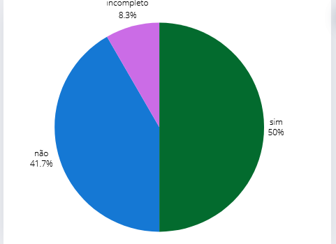

## Introdução
Este documento aborda a verificação do artefato "Planejamento do Relato da Avaliação da Análise de Tarefas" desenvolvido pelo grupo 05 - Prefeitura Municipal de Lagoa da Prata. A verificação foi realizada pelo grupo 04 - Polícia Civil do Distrito Federal, com o propósito de garantir que o planejamento do relato esteja alinhado com os objetivos do projeto, seja claro e abrangente. A verificação foi conduzida pelas interagentes [Renata Quadros](https://github.com/Renatinha28) e [Giovana Barbosa](https://github.com/gio221).

## Objetivo
O objetivo deste documento é fornecer uma visão abrangente da verificação conduzida pelo grupo 04 sobre o "Planejamento do Relato da Avaliação da Análise de Tarefas" do grupo 05. Essa verificação busca identificar possíveis lacunas no planejamento, assegurar a conformidade com as metodologias estabelecidas e garantir que o relato esteja bem estruturado para a análise das tarefas, contemplando todos os aspectos necessários para uma avaliação eficaz.

## Metodologia 
A verificação foi realizada utilizando um checklist detalhado, previamente elaborado durante o Planejamento da Verificação da Etapa 3. Esse checklist inclui uma série de perguntas.

## Checklist 
A tabela 3 descreve o Checklist da verificação.

Tabela 3: Tabela do Checklist Geral. 
 

| ID  | Descrição                                                                 | Avaliação | Observações                              |
|-----|--------------------------------------------------------------------------|-----------|------------------------------------------|
| 1 |  O artefato tem introdução ?  | Sim.  | |
| 2   | Os objetivos do planejamento são claros e definidos ?                      |        Não.   | Não contém.                                         |
| 3   | O documento possui referências bibliográficas/bibliográfia?                  |   Sim.        |                                          |
| 4   | O documento possui uma ordem lógica?                  |      Sim.     |                                          |
| 5   | O documento possui histórico de versão, com versão, descrição, autores e revisores?                  |      Incompleto.     |     Falta os revisores.                                     |
| 6   | O relato segue o framework DECIDE?                                                                       |    Não.       |              |
| 7   | O método de avaliação utilizado está claramente explicado?                                               |      Sim.     |              |
| 8   | A tabela de cronograma das entrevistas está presente e é clara?                                          |          Não |      Não é clara.        |  
| 9   | As tarefas executadas pelos participantes estão descritas de forma detalhada?                            |     Não.      |              |
| 10   | As questões éticas, como o consentimento dos participantes, são mencionadas e tratadas adequadamente?    |       Sim.    |              |
| 11   | O questionário utilizado nas entrevistas está completo e é relevante para os objetivos da avaliação?    |   Sim.        |              |
| 12   | As sugestões de melhoria para cada Análise de tarefas estão detalhadas?                                           |        Não.   |    Não apresenta.          |

Fonte: [Renata Quadros](https://github.com/Renatinha28)

## Problemas Encontrados
- ID 2: Não apresenta os objetivos.
- ID 5: Não apresenta os revisores.
- ID 6: Não segue o framework DECIDE.
- ID 8: Apresenta uma tabela mas ela não é clara. É apresentada como um tamplete.
- ID 9: As tarefas executadas pelos participantes não é detalhada.
- ID 10: Não apresenta sugestões de melhoria.

## Sugestão de melhoria 
- ID 2: Detalhar os objetivos.
- ID 5: Revisar o artefato.
- ID 6: Seguir o framework DECIDE.
- ID 8: Detalhar a tabela.
- ID 9: Detalhar as tarefas executadas pelos participantes.
- ID 10: Apresentar as sugestões de melhoria.

## Vídeo da verificação

    <iframe width="560" height="315" src="https://www.youtube.com/embed/mK4pn5YaIbg" title="YouTube video player" frameborder="0" allow="accelerometer; autoplay; clipboard-write; encrypted-media; gyroscope; picture-in-picture" allowfullscreen></iframe>

    <a href="https://www.youtube.com/watch?v=mK4pn5YaIbg" target="_blank">Vídeo da Verificação do planejamento do relato da análise de tarefas da etapa 4</a>

## Conclusão

 Grafico 1 

 
  
Fonte: <a href="https://github.com/Renatinha28">Renata Quadros. 2024</a>

     

## Bibliografia
> BARBOSA, S. D. J.; SILVA, B. S. Interação Humano-Computador. Rio de Janeiro: Elsevier, 2011.

> https://interacao-humano-computador.github.io/2024.1-Prefeitura-Lagoa-da-Prata/

## Histórico de versão
      Tabela que descreve o Histórico de Versões

|     Versão       |     Descrição      |      Autor(es)      | Data           |  Revisor(es)          |Data de revisão|
| :----------------------------------------------------------: | :-------------------------------: | :-------------------------------------------------: | :-------------------------------: |  :-------------------------------: | :-------------------------------: |
| 1.0 | Verificação |  [Renata Quadros](https://github.com/Renatinha28), [Giovana Barbosa](https://github.com/gio221) | 09/06 | [Rayene Almeida ](https://github.com/rayenealmeida)|10/06|