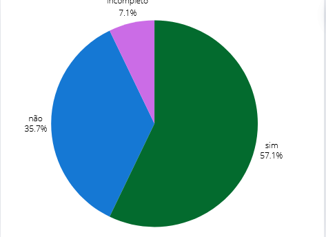

## Introdução
Este documento detalha a verificação do artefato "Planejamento da Avaliação da Análise de Tarefas" desenvolvido pelo grupo 05 - Prefeitura Municipal de Lagoa da Prata. A verificação foi realizada pelo grupo 04 - Polícia Civil do Distrito Federal, com o intuito de garantir que o planejamento esteja alinhado com os objetivos do projeto, além de ser exequível e abrangente. A verificação foi conduzida pelas interagentes [Renata Quadros](https://github.com/Renatinha28) e [Giovana Barbosa](https://github.com/gio221).

## Objetivo
O objetivo deste documento é relatar de forma abrangente a verificação realizada pelo grupo 04 sobre o "Planejamento da Avaliação da Análise de Tarefas" do grupo 05. Esta verificação visa identificar possíveis lacunas, assegurar a aderência às metodologias estabelecidas e garantir que o planejamento esteja bem estruturado para a análise de tarefas, contemplando todos os aspectos necessários para uma avaliação eficaz.

## Metodologia 
A verificação foi conduzida utilizando um checklist detalhado, previamente elaborado durante o Planejamento da Verificação da Etapa 4. Este checklist inclui uma série de perguntas e critérios.

## Checklist 
A tabela 1 descreve o Checklist avaliação. 

Tabela 3: Tabela do Checklist. 
 

| ID  | Descrição                                                                 | Avaliação | Observações                              |
|-----|--------------------------------------------------------------------------|-----------|------------------------------------------|
| 1 |  O artefato tem introdução ?  | Sim.  | |
| 2   | Os objetivos do planejamento são claros e definidos ?                      |   Sim.        |                                          |
| 3   | O documento possui referências bibliográficas/bibliográfia?                  | Sim.          |                                          |
| 4   | O documento possui uma ordem lógica?                  |      Sim.     |                                          |
| 5   | O documento possui histórico de versão, com versão, descrição, autores e revisores?                  |     Incompleto.      |                                       Falta a revisão.   |
| 6   | O planejamento segue o framework DECIDE?                                 |   Sim.        |                                         |
| 7   | O documento possui quais são os objetivos da avaliação?                  |        Sim.   |                                          |
| 8   | O documento possui quais são as perguntas a serem respondidas com a avaliação? |    Sim.  |                                          |
| 9  | O documento possui quais são os métodos a serem utilizados na avaliação? |     Sim.      |                                          |
| 10  | O documento possui os participantes da avaliação?                        |     Sim.      |                                          |
| 11  | O documento apresenta o papel desempenhado por cada participante?        |     Sim.      |                                          |
| 12  | O documento possui um cronograma com data, hora e local da realização da avaliação? | Sim. |                                          |
| 13  | O documento apresenta quais as ferramentas e os equipamentos serão utilizados na avaliação? | Sim. |                                          |
| 14  | O documento apresenta quais são os custos?                               |       Sim.    |                                          |
| 15  | O documento possui uma seção sobre como as questões éticas são lidadas?  |    Sim.       |                                          |
| 16  | O documento possui uma seção sobre os dados (interpretação e apresentação)? |     Sim.    |                                          |
| 17  | O documento apresenta tarefas de como deve ser realizada a avaliação?    |     Sim.      |                                          |
| 18  | O documento possui uma seção de teste piloto com sua definição, participantes, local, data e horário da realização do teste piloto? | Não. |              Não contém teste piloto.                            |
| 19  | Possui uma gravação do teste piloto?                                     |          Não. | Não consta.                                         |
| 20  | O planejamento apresenta como serão documentados e tratados os dados obtidos durante o processo de avaliação? (Grau de confiabilidade das respostas, contexto em que as respostas foram produzidas e se os dados obtidos estão em conformidade com o perfil de usuário traçado.) |    Incompleto.       | Falta algumas informações. |

Fonte: [Renata Quadros](https://github.com/Renatinha28)

## Problemas Encontrados
- ID 5: Não contém a revisão do histórico de versão.
- ID 18 e 19: Não contém o teste piloto.
- ID 20: Falta algumas informações sobre como serão documentados e tratados os dados obtidos.
 
## Sugestão de melhoria 
- ID 5: Revisar o artefato.
- ID 18 e 19: Documentar o teste piloto.
- ID 20: Detalhar sobre como serão documentados e tratados os dados obtidos.
 
## Vídeo da verificação

    <iframe width="560" height="315" src="https://www.youtube.com/embed/lvFw8zR78lc" title="YouTube video player" frameborder="0" allow="accelerometer; autoplay; clipboard-write; encrypted-media; gyroscope; picture-in-picture" allowfullscreen></iframe>

    <a href="https://www.youtube.com/watch?v=lvFw8zR78lc" target="_blank">Vídeo da Verificação do planejamento da avaliação da análise de tarefas da etapa 4</a>

## Conclusão

 Grafico 1 

 
  
Fonte: <a href="https://github.com/Renatinha28">Renata Quadros. 2024</a>

     

## Bibliografia
> BARBOSA, S. D. J.; SILVA, B. S. Interação Humano-Computador. Rio de Janeiro: Elsevier, 2011.

> https://interacao-humano-computador.github.io/2024.1-Prefeitura-Lagoa-da-Prata/

## Histórico de versão
      Tabela que descreve o Histórico de Versões

|     Versão       |     Descrição      |      Autor(es)      | Data           |  Revisor(es)          |Data de revisão|
| :----------------------------------------------------------: | :-------------------------------: | :-------------------------------------------------: | :-------------------------------: |  :-------------------------------: | :-------------------------------: |
| 1.0 | Verificação |  [Renata Quadros](https://github.com/Renatinha28), [Giovana Barbosa](https://github.com/gio221) | 09/06 |  [Rayene Almeida ](https://github.com/rayenealmeida)|10/06|