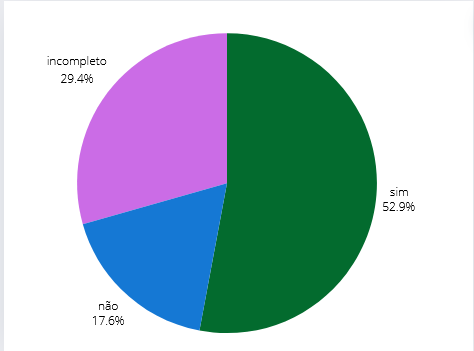

## Introdução
Este é o documento de verificação do artefato Cronograma elaborado pelo Grupo 5 da disciplina de Interação Humano-Computador (IHC), que está focado no projeto relacionado ao site da Prefeitua da Lagoa da Prata. Consequentemente, o Cronograma será avaliado à luz da literatura de Interação Humano-Computador de Barbosa e Silva.

## Objetivo 
Esse artefato tem como objetivo fazer o relato do planejamento para storyboards

## Metodologia
Para verificar o artefato, responderemos o checklist feito no planejamento da verificação, a integrante Lara e Giovana vão gravar um video monstrando a verificação, a tabela 1 monstra as perguntas ultilizadas para fazer essa verificação.

## Checklist

### Geral 

Tabela 1: Perguntas. 
 

| __ID__ | __Descrição__ | __Avaliação__ | __Observações__ |
|:------:|:------------- |:-------------:|:----------------|
| 1 |  O artefato tem introdução ?  |  Sim | |
| 2   | Os objetivos do planejamento são claros e definidos ?                      |     Sim       |                                          |
| 3   | O documento possui referências bibliográficas/bibliográfia?                  |        Sim    |                                          |
| 4   | O documento possui uma ordem lógica?                  |       Incompleto   | A bibliografia está depois do hitórico de versão                                         |
| 5   | O documento possui histórico de versão, com versão, descrição, autores e revisores?                  |     Incompleto      |                                          |
| 06 | O planejamento da avaliação está de acordo com Framework DECIDE?   |  Sim  | |
| 07 | O artefato possui os métodos que serão utilizados na avaliação ?  |  Sim | |
| 08 |  Os métodos que serão utilizados na avaliação estão descritos com detalhes ? | Sim  | |
| 09 | O artefato tem a quantidade e a justificativa dos participantes ?  | Incompleto | |
| 10 |  Os usuários foram definidos de acordo com o perfil de usuário ? | sim | |
| 11 | No artefato está presente um cronograma com data, local e horário para as estrevistas? | Não | |
| 12 | No artefato tem ferramentas que foram utilizadas na avaliação?  | Sim| |
| 13 | No artefato há o custo e mão de obra ?  | Incompleto  | |
| 14 |  No artefato tem o termo de consentimento ? | sim |está em um artefato separado |
| 15 | No artefato está descrito o passo a passo da avaliação ?|Incompleto| |
| 16 | No artefato tem o teste piloto ?  | não  | |
| 17| Os storyboards estão de acordo com o artefato da analise de tarefas ?  | não  | |

 
  
Fonte: <a href="https://github.com/gio221">Giovana Barbosa</a>

## Problemas Encontrados

* ID 4: A bibliografia está depois do hitórico de versão   
* ID 5: Não possui revisores
* ID 9: não tem justificativa da quantidade de participantes
* ID 11: Não tem cronograma com data, local e horário para as estrevistas
* ID 13: Não há custo de mão de obra
* ID 15: Não tem passo a passo da avaliação
* ID 16: Não tem teste piloto
* ID 17 : Não monstra os storyboards

## Sugestões

* ID 4: Colocar em ordem lógica
* ID 5: colocar revisores
* ID 9: colocar a justificativa da quantidade de participantes
* ID 11: colocar o cronograma com data, local e horário para as estrevistas
* ID 13: colocar o custo de mão de obra
* ID 15: colocar o passo a passo da avaliação
* ID 16: colocar o teste piloto
* ID 17 : colocar os storyboards

## Video da Verificação

<iframe width="560" height="315" src="https://www.youtube.com/embed/_AkzjiF-TjA " title="YouTube video player" frameborder="0" allow="accelerometer; autoplay; clipboard-write; encrypted-media; gyroscope; picture-in-picture; web-share" referrerpolicy="strict-origin-when-cross-origin" allowfullscreen></iframe>

<a href="https://youtu.be/_AkzjiF-TjA " target="blanket">Vídeo da Verificação do planejamento do storyboard da etapa 4</a>

## Conclusão
A imagem 1 monstra como ficou as respostas obtidas

 Figura 1 - Respostas do Cronograma.  

 
  
Fonte: <a href="https://github.com/gio221">Giovana Barbosa</a>

     

## Bibliografia
> BARBOSA, S.D.J.; SILVA, B.S. Interação Humano-Computador. Editora Campus-Elsevier, 2010.

>  https://interacao-humano-computador.github.io/2024.1-Prefeitura-Lagoa-da-Prata/

## Histórico de versão
        Tabela que descreve o Histórico de Versões
|     Versão       |     Descrição      |      Autor(es)      | Data           |  Revisor(es)          |Data de revisão|
| :----------------------------------------------------------: | :-------------------------------: | :-------------------------------------------------: | :-------------------------------: |  :-------------------------------: | :-------------------------------: |
|1.0|Criação do documento|[Giovana Barbosa](https://github.com/gio221) e [Renata Quadros](https://github.com/Renatinha28) | 08/06| [Rayene Almeida ](https://github.com/rayenealmeida)|10/06|