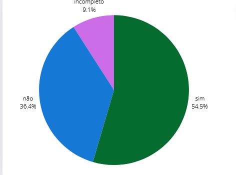

## Introdução
Este é o documento de verificação do artefato Cronograma elaborado pelo Grupo 5 da disciplina de Interação Humano-Computador (IHC), que está focado no projeto relacionado ao site da Prefeitua da Lagoa da Prata. Consequentemente, o Cronograma será avaliado à luz da literatura de Interação Humano-Computador de Barbosa e Silva.

## Objetivo 
Esse artefato tem como objetivo fazer o relato do termo de consentimento

## Metodologia
Para verificar o artefato, responderemos o checklist feito no planejamento da verificação, a integrante Lara e Giovana vão gravar um video monstrando a verificação, a tabela 1 monstra as perguntas ultilizadas para fazer essa verificação.

## Checklist

Tabela 1: Tabela das perguntas gerais. 
 

| ID  | Descrição                                                                 | Avaliação | Observações                              |
|-----|--------------------------------------------------------------------------|-----------|------------------------------------------|
| 1 |  O artefato tem introdução ?  | não  | |
| 2   | Os objetivos do planejamento são claros e definidos ?                      |   não        |                                          |
| 3   | O documento possui referências bibliográficas/bibliográfia?                  |   não        |                                          |
| 4   | O documento possui uma ordem lógica?                  |  sim         |                                          |
| 5   | O documento possui histórico de versão, com versão, descrição, autores e revisores?                  |         incompleto  |                                          |
| 06 | O documento possui os princípios de autonomia, beneficiência, não maleficiência, justiça e equidade?  | não | |
| 07 | O documento possui um cuidado ético para que a pessoa entrevistada, entenda?  | sim | |
| 08 | Há a garantia de confidencialidade e a privacidade dos dados brutos?| sim  | |
| 09 |Garante o anonimato dos participantes, preservação das suas imagens e a utilização cuidadosa das informações coletadas? | sim | |
| 10 | Há esclarecido um consentimento livre de desistência do participante durante a pesquisa? |sim   | |
| 11 | Há local de assinatura do entrevistador e do entrevsitado? |sim  | |

Fonte: [Giovana Barbosa](https://github.com/gio221) ,2024.

## Problemas Encontrados

* ID 1: Não possui introdução
* ID 2: não possui objetivos
* ID 3: Não possui referências bibliográficas/bibliográfia?   
* ID 5: Não possui revisores
* ID 6: Não possui os 4 principios éticos

## Sugestões

* ID 1: colocar introdução
* ID 2: colocar objetivos
* ID 3: colocar referências bibliográficas/bibliográfia?   
* ID 5: colocar revisores
* ID 6: colocar os 4 principios éticos

## Video da Verificação

<iframe width="560" height="315" src="https://www.youtube.com/embed/3OxI1PUyNLk  " title="YouTube video player" frameborder="0" allow="accelerometer; autoplay; clipboard-write; encrypted-media; gyroscope; picture-in-picture; web-share" referrerpolicy="strict-origin-when-cross-origin" allowfullscreen></iframe>

<a href="https://youtu.be/3OxI1PUyNLk " target="blanket">Vídeo da Verificação do termo de consentimento da etapa 4</a>

## Conclusão
A imagem 1 monstra como ficou as respostas obtidas

 Figura 1 - Respostas do Cronograma 

 
  
Fonte: <a href="https://github.com/gio221">Giovana Barbosa</a>

     

## Bibliografia
> BARBOSA, S.D.J.; SILVA, B.S. Interação Humano-Computador. Editora Campus-Elsevier, 2010.

>  https://interacao-humano-computador.github.io/2024.1-Prefeitura-Lagoa-da-Prata/

## Histórico de versão
        Tabela que descreve o Histórico de Versões
|     Versão       |     Descrição      |      Autor(es)      | Data           |  Revisor(es)          |Data de revisão|
| :----------------------------------------------------------: | :-------------------------------: | :-------------------------------------------------: | :-------------------------------: |  :-------------------------------: | :-------------------------------: |
|1.0|Criação do documento|[Giovana Barbosa](https://github.com/gio221) e [Renata Quadros](https://github.com/Renatinha28) | 07/06| [Rayene Almeida](https://github.com/rayenealmeida)| 07/06 |