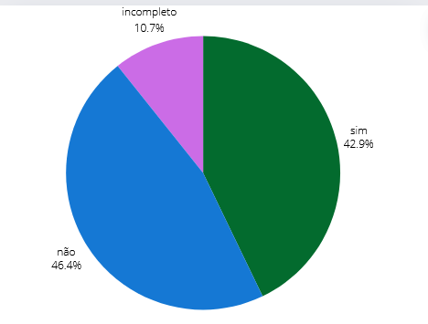

## Introdução 
Esse é o documento de verificação do artefato Planejamento da Avaliação do Protótipo de Papel feito pelo Grupo 5 da disciplina de IHC. O grupo escolheu o site da Prefeitura da Lagoa da Prata. Com base no livro de Barbosa e Silva, será feita a verificação do Planejamento do Relato do Storyboard.

## Metodologia 

Para fazer a verificação desse artefato, utilizaremos o checklist realizado no Planejamento da verificação, Lara e Raissa conduzirão a análise feita por um vídeo. A tabela a seguir apresenta as questões a serem utilizadas para a nossa avaliação.

## Objetivo 

Este documento tem como objetivo relatar a verificação do artefato Planejamento da Avaliação do Protótipo de Papel da etapa 5 feita pelo grupo 05, cujo sistema é o da Prefeitura Municipal de Lagoa da Prata.

## Checklist Geral 

A Tabela 1 descreve o Checklist Geral, enquanto a Tabela 2 se refere às perguntas específicas para a verificação desse artefato.

## Geral 

    
<strong>Tabela 1: Checklist Geral</strong>

    <table>
        <tr>
            <th>ID</th>
            <th>Descrição</th>
            <th>Avaliação</th>
            <th>Observações</th>
        </tr>
        <tr>
            <td>1</td>
            <td>Os artefatos possuem introdução e metodologia?</td>
            <td>Incompleto</td> 
            <td> Não está especificado em um tópico</td> 
        </tr>
        <tr>
            <td>2</td>
            <td>As tabelas possuem fontes, títulos e são chamadas no texto?</td>
            <td>Sim</td> 
            <td></td>
        </tr>
        <tr>
            <td>3</td>
            <td>Os vídeos possuem fontes?</td>
            <td>Não se aplica</td> 
            <td></td>
        </tr>
        <tr>
            <td>4</td>
            <td>A estrutura do documento possui uma sequência lógica e padronizada?</td>
            <td>Sim</td> 
            <td></td>
        </tr>
        <tr>
            <td>5</td>
            <td>Possui histórico de versões?</td>
            <td>Sim</td> 
            <td></td>
        </tr>
        <tr>
            <td>6</td>
            <td>Os históricos de versões possuem a versão do documento, descrição, autores, datas e revisores?</td>
            <td>Incompleto</td> 
            <td>Faltam data de revisão e revisores na última modificação</td> 
        </tr>
        <tr>
            <td>7</td>
            <td>Possuí referências bibliográficas ou bibliografia?</td>
            <td>Sim</td>
            <td>Título deve ser alterado para Bibliografia e/ou Referências Bibliográficas</td>
        </tr>
        <tr>
            <td>8</td>
            <td>Apresenta o objetivo do planejamento?</td>
            <td>Não</td>
            <td></td>
        </tr>
        <tr>
            <td>9</td>
            <td>O planejamento segue o framework DECIDE?</td>
            <td>Sim</td>
            <td></td>
        </tr>
        <tr>
            <td>10</td>
            <td>Apresenta os objetivos da avaliação?</td>
            <td>Não</td>
            <td>Não ficou claro qual o objetivo a ser explorado com essa avaliação</td>
        </tr>
        <tr>
            <td>11</td>
            <td>Apresenta as perguntas a serem respondidas com a avaliação?</td>
            <td>Sim</td>
            <td></td>
        </tr>
        <tr>
            <td>12</td>
            <td>As perguntas a serem respondidas com a avaliação estão de acordo com os objetivos da avaliação?</td>
            <td>Incompleto</td>
            <td></td>
        </tr>
        <tr>
            <td>13</td>
            <td>Define os métodos a serem utilizados na avaliação?</td>
            <td>Sim</td>
            <td></td>
        </tr>
        <tr>
            <td>14</td>
            <td>Justifica os métodos escolhidos para a avaliação?</td>
            <td>Não</td>
            <td></td>
        </tr>
        <tr>
            <td>15</td>
            <td>Identifica e administra as questões práticas da avaliação?</td>
            <td>Sim</td>
            <td></td>
        </tr>
        <tr>
            <td>16</td>
            <td>Descreve como o recrutamento é feito?</td>
            <td>Não</td>
            <td></td>
        </tr>
        <tr>
            <td>17</td>
            <td>Descreve a preparação para a avaliação?</td>
            <td>Não</td>
            <td>A preparação não ficou tão clara no texto</td>
        </tr>
        <tr>
            <td>18</td>
            <td>Descreve como os usuários foram selecionados?</td>
            <td>Sim</td>
            <td></td>
        </tr>
        <tr>
            <td>19</td>
            <td>Descreve as ferramentas que serão utilizadas na avaliação?</td>
            <td>Não</td>
            <td></td>
        </tr>
        <tr>
            <td>20</td>
            <td>Apresenta o teste piloto?</td>
            <td>Não</td>
            <td></td>
        </tr>
        <tr>
            <td>21</td>
            <td>O teste piloto faz sentido?</td>
            <td>Não se aplica</td>
            <td></td>
        </tr>
        <tr>
            <td>22</td>
            <td>O teste piloto é acessível?</td>
            <td>Não</td>
            <td></td>
        </tr>
        <tr>
            <td>23</td>
            <td>Apresenta o cronograma da avaliação?</td>
            <td>Não</td>
            <td></td>
        </tr>
        <tr>
            <td>24</td>
            <td>O cronograma apresenta o integrante responsável, data, horário, local, artefato e nome do entrevistado?</td>
            <td>Não</td>
            <td></td>
        </tr>
        <tr>
            <td>25</td>
            <td>Apresenta o roteiro das perguntas da entrevista?</td>
            <td>Sim</td>
            <td></td>
        </tr>
        <tr>
            <td>26</td>
            <td>As perguntas da entrevista fazem sentido?</td>
            <td>Sim</td>
            <td></td>
        </tr>
        <tr>
            <td>27</td>
            <td>Apresenta o termo de consentimento?</td>
            <td>Sim</td>
            <td></td>
        </tr>
        <tr>
            <td>28</td>
            <td>Apresenta como os dados serão avaliados e interpretados?</td>
            <td>Sim</td>
            <td></td>
        </tr>
    </table>
    
Fonte: <a href="https://github.com/gravelylara">Lara Giuliana</a>

## Problemas Encontrados
Nesse artefato contém algum problemas, sendo eles:

- ID 1: Não tem especificação em um tópico
- ID 2: Não possui video
- ID 6 : Falta revisores
- ID 7: Titulo errado
- ID 8 : Não possui objetivo
- ID 10 : Não tem objetivo claro
- ID 12: Não tem todas as perguntas
- ID 14: Não tem métodos escolhidos
- ID 16: Não descreve o recrutamento
- ID 17 :A preparação não ficou tão clara no texto
- ID 19: Não tem ferramentas
- ID 20: Não tem teste piloto
- ID 23: Não tem cronograma 
- ID 26: Não tem perguntas 

## Sugestões 

- ID 1: Colocar especificação em um tópico
- ID 2: Colocar  video
- ID 6 : Colocar  revisores
- ID 7: Colocar Titulo 
- ID 8 : Colocar objetivo
- ID 12: Colocar  todas as perguntas
- ID 14: Colocar  métodos escolhidos
- ID 16: Colocar  o recrutamento
- ID 17 : Colocar a preparação 
- ID 19: Colocar  ferramentas
- ID 20: Colocar  teste piloto
- ID 23: Colocar  cronograma 
- ID 26: Colocar  perguntas 

## Vídeo da Verificação 

    <iframe width="560" height="315" src="https://www.youtube.com/embed/fmrOJ8AZdC4 " title="YouTube video player" frameborder="0" allow="accelerometer; autoplay; clipboard-write; encrypted-media; gyroscope; picture-in-picture" allowfullscreen></iframe>

    <a href="https://www.youtube.com/watch?v=fmrOJ8AZdC4" target="blank">Vídeo da verificação do artefato </a>

Fonte: <a href="https://github.com/gravelylara">Lara Giuliana. 2024</a>
 

## Conclusão

Gráfico 1

Fonte:  <a href="https://github.com/gravelylara">Lara Giuliana. 2024</a>
 

## Bibliografia 
> BARBOSA, S.D.J.; SILVA, B.S. Interação Humano-Computador. Editora Campus-Elsevier, 2010.

>  https://interacao-humano-computador.github.io/2024.1-Prefeitura-Lagoa-da-Prata/

## Histórico de versão  
        Tabela que descreve o Histórico de Versões
|     Versão       |     Descrição      |      Autor(es)      | Data           |  Revisor(es)          |Data de revisão|
| :----------------------------------------------------------: | :-------------------------------: | :-------------------------------------------------: | :-------------------------------: |  :-------------------------------: | :-------------------------------: |
|1.0|Criação do documento|[Lara Giuliana](https://github.com/gravelylara)     | 10/06|    [Giovana Barbosa](https://github.com/gio221)|11/06|
